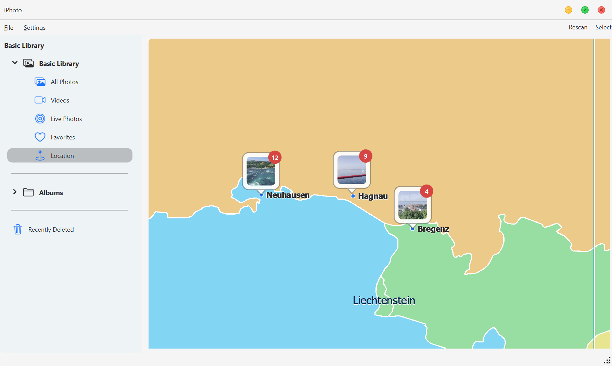
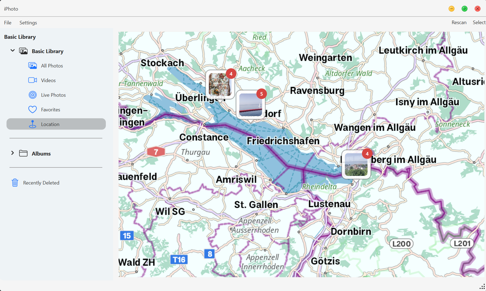

# 📸 iPhotron
> Bring the macOS *Photos* experience to Windows — folder-native, non-destructive photo management with Live Photo, maps, and smart albums.


-orange)

[](https://github.com/OliverZhaohaibin/iPhotos-LocalPhotoAlbumManager)

**Languages / 语言 / Sprachen:**  
[](README.md) | [](docs/readme/README_zh-CN.md) | [](docs/readme/README_de.md)

---

## ☕ Support

[](https://buymeacoffee.com/oliverzhao)
[](https://www.paypal.com/donate/?hosted_button_id=AJKMJMQA8YHPN)


## 📥 Download & Install

[-blue?style=for-the-badge&logo=windows)](https://github.com/OliverZhaohaibin/iPhotron-LocalPhotoAlbumManager/releases/download/v4.5.0/v4.50.exe)
[-orange?style=for-the-badge&logo=linux&logoColor=white)](https://github.com/OliverZhaohaibin/iPhotron-LocalPhotoAlbumManager/releases/download/v4.5.0/iPhotron_4.50_amd64.deb)
[-brightgreen?style=for-the-badge&logo=linux&logoColor=white)](https://github.com/OliverZhaohaibin/iPhotron-LocalPhotoAlbumManager/releases/download/v4.5.0/iPhotron-x86_64.AppImage)

**💡 Quick Install:** Click the buttons above to download the latest installer directly.

- **Windows:** Run the `.exe` installer directly.
- **Linux (.deb):** Install with the following command:

```bash
sudo apt install ./iPhotron_4.30_amd64.deb
```

- **Linux (.AppImage):** Make the file executable and run it:

```bash
chmod +x iPhotron-x86_64.AppImage
./iPhotron-x86_64.AppImage
```

**For developers** — install from source:

```bash
pip install -e .
```

---

## 🚀 Quick Start

```bash
iphoto-gui
```

Or open a specific album directly:

```bash
iphoto-gui /photos/LondonTrip
```

---

## 🌟 Star History

<p align="center">
  <a href="https://www.star-history.com/#OliverZhaohaibin/iPhotron-LocalPhotoAlbumManager&type=date&legend=bottom-right">
    
  </a>
</p>

## 🚀 Product Hunt
<p align="center">
  <a href="https://www.producthunt.com/products/iphotron/launches/iphotron?embed=true&amp;utm_source=badge-featured&amp;utm_medium=badge&amp;utm_campaign=badge-iphotron" target="_blank" rel="noopener noreferrer">
    
  </a>
</p>
<p align="center">
  <span style="color:#FF6154;"><strong>Please Upvote</strong></span> •
  <span style="color:#FF6154;"><strong>Follow</strong></span> •
  <span style="color:#FF6154;"><strong>Discuss on the Forum</strong></span>
</p>

---

## 🌟 Overview

**iPhotron** is a **folder-native photo manager** inspired by macOS *Photos*.  
It organizes your media using lightweight JSON manifests and cache files —  
offering rich album functionality while **keeping all original files intact**.

Key highlights:
- 🗂 Folder-native design — every folder *is* an album, no import needed.
- ⚙️ JSON-based manifests record "human decisions" (cover, featured, order).
- ⚡ **SQLite-powered global database** for lightning-fast queries on massive libraries.
- 🧠 Smart incremental scanning with persistent SQLite index.
- 🎥 Full **Live Photo** pairing and playback support.
- 🗺 Map view that visualizes GPS metadata across all photos & videos.


---

## 🗺 Maps Extension

iPhotron's offline OBF map runtime ships as a self-contained **maps extension**
rooted at `src/maps/tiles/extension/`. That directory is the contract consumed
by local development, packaged builds, and the Windows installer.

The extension currently contains:
- `World_basemap_2.obf` offline map data
- OsmAnd resources under `misc/`, `poi/`, `rendering_styles/`, and `routing/`
- native binaries under `bin/`, including `osmand_render_helper.exe`,
  `osmand_native_widget.dll`, `OsmAndCore_shared.dll`, and the required Qt DLLs

> **Windows only:** The full native maps extension runtime shown below is
> currently available on Windows only. On Linux and macOS, iPhotron continues
> to use the existing Python/legacy map path.

| Without maps extension | With maps extension |
| --- | --- |
|  |  |

The extension is built upstream from the standalone
[PySide6-OsmAnd-SDK](https://github.com/OliverZhaohaibin/PySide6-OsmAnd-SDK)
sub-project. That repository carries the vendored OsmAnd sources, Windows build
scripts, native Qt widget bridge, and preview app used to produce the runtime
consumed here.

See [Development](docs/development.md) for the full "build the maps extension
from the side project" workflow, and
[Executable Build](docs/misc/BUILD_EXE.md) for how the extension is synchronized
into Nuitka and Windows installer builds.

## ✨ Features

### 🗺 Location View
Displays your photo footprints on an interactive map, clustering nearby photos by GPS metadata.


### 🎞 Live Photo Support
Seamlessly pairs HEIC/JPG and MOV files using Apple's `ContentIdentifier`.  
A "LIVE" badge appears on still photos — click to play the motion video inline.

### 🧩 Smart Albums
The sidebar provides an auto-generated **Basic Library**, grouping photos into:
`All Photos`, `Videos`, `Live Photos`, `Favorites`, and `Recently Deleted`.

### 🖼 Immersive Detail View
An elegant viewer with a filmstrip navigator and floating playback bar for videos.

### 🎨 Non-Destructive Photo Editing
A comprehensive editing suite with **Adjust** and **Crop** modes:

#### Adjust Mode
- **Light Adjustments:** Brilliance, Exposure, Highlights, Shadows, Brightness, Contrast, Black Point
- **Color Adjustments:** Saturation, Vibrance, Cast (white balance correction)
- **Black & White:** Intensity, Neutrals, Tone, Grain with artistic film presets
- **Color Curves:** RGB and per-channel (R/G/B) curve editor with draggable control points for precise tonal adjustments
- **Selective Color:** Target six hue ranges (Red/Yellow/Green/Cyan/Blue/Magenta) with independent Hue/Saturation/Luminance controls
- **Levels:** 5-handle input-output tone mapping with histogram backdrop and per-channel control
- **Master Sliders:** Each section features an intelligent master slider that distributes values across multiple fine-tuning controls
- **Live Thumbnails:** Real-time preview strips showing the effect range for each adjustment


#### Crop Mode
- **Perspective Correction:** Vertical and horizontal keystoning adjustments
- **Straighten Tool:** ±45° rotation with sub-degree precision
- **Flip (Horizontal):** Horizontal flip support
- **Interactive Crop Box:** Drag handles, edge snapping, and aspect ratio constraints
- **Black Border Prevention:** Automatic validation ensures no black edges appear after perspective transforms
  

All edits are stored in `.ipo` sidecar files, preserving original photos untouched.

### ℹ️ Floating Info Panel
Toggle a floating metadata panel showing EXIF, camera/lens info, exposure, aperture, focal length, file size, and more.

### 💬 Rich Interactions
- Drag & drop files from Explorer/Finder directly into albums.
- Multi-selection & context menus for Copy, Show in Folder, Move, Delete, Restore.
- Smooth thumbnail transitions and macOS-like album navigation.

---

## 📚 Documentation

For deeper technical details, see the following docs:

[](docs/architecture.md)
[](docs/development.md)
[](docs/misc/BUILD_EXE.md)
[](docs/security.md)
[](docs/CHANGELOG.md)

| Document | Description |
|----------|-------------|
| [Architecture](docs/architecture.md) | Overall architecture, module boundaries, data flow, key design decisions |
| [Development](docs/development.md) | Dev environment, dependencies, debugging, and the full side-project-based maps extension workflow |
| [Executable Build](docs/misc/BUILD_EXE.md) | Nuitka packaging, AOT filters, maps extension sync, and Windows installer/runtime notes |
| [Security](docs/security.md) | Permissions, encryption, data storage locations, threat model |
| [Changelog](docs/CHANGELOG.md) | All version release notes and changes |

---

## 🧩 External Tools

| Tool | Purpose |
|------|----------|
| **ExifTool** | Reads EXIF, GPS, QuickTime, and Live Photo metadata. |
| **FFmpeg / FFprobe** | Generates video thumbnails & parses video info. |

> Ensure both are available in your system `PATH`.

Python dependencies (e.g., `Pillow`, `reverse-geocoder`) are auto-installed via `pyproject.toml`.

---

## 📄 License

**MIT License © 2025**  
Created by **Haibin Zhao (OliverZhaohaibin)**  

> *iPhotron — A folder-native, human-readable, and fully rebuildable photo system.*  
> *No imports. No database. Just your photos, organized elegantly.*
