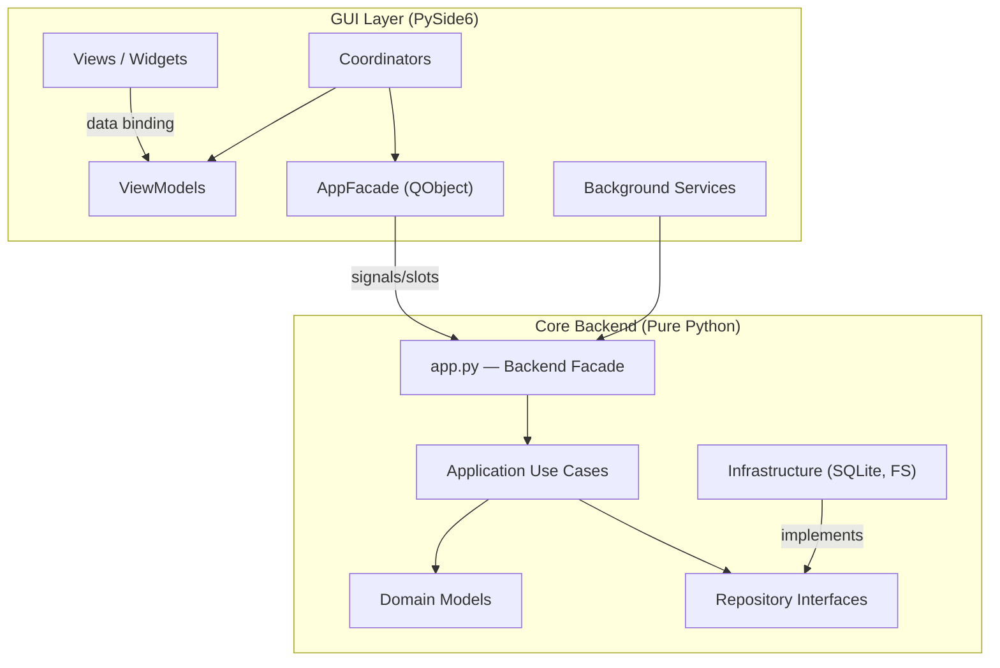
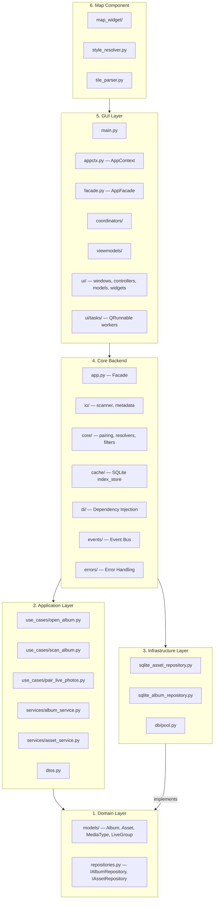
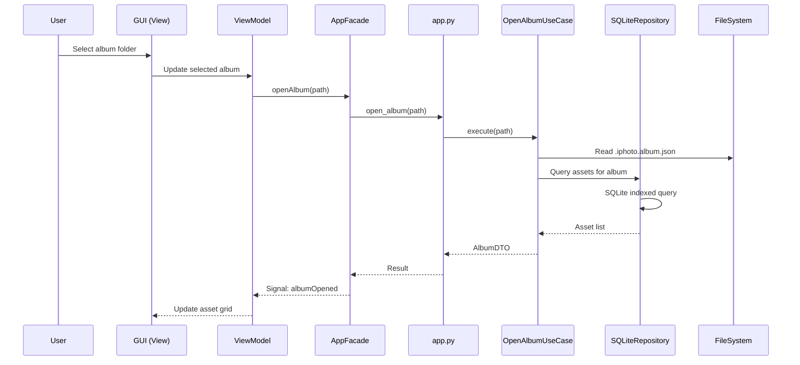
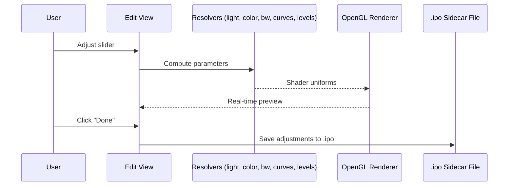
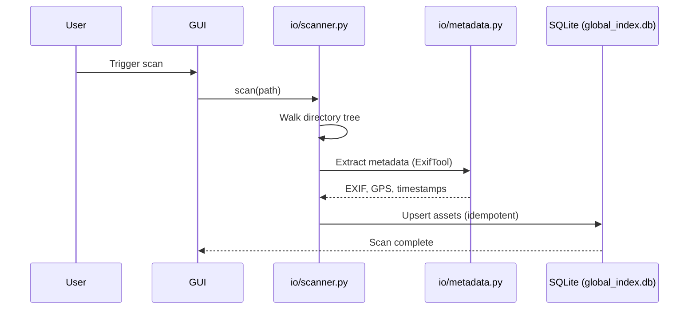

# 🏗️ Architecture

> Overall architecture, module boundaries, data flow, and key design decisions for **iPhotron**.

---

## High-Level Architecture

iPhotron follows a **layered architecture** based on **MVVM + DDD (Domain-Driven Design)** principles. The codebase is split into a **pure-Python backend** (no GUI dependency) and a **PySide6 GUI layer** that communicates through a facade.



---

## Module Boundary Overview



---

## Directory Structure

```
src/
├── iPhoto/
│   ├── domain/              # Pure business models & repository interfaces
│   │   ├── models/          # Album, Asset, MediaType, LiveGroup, query.py
│   │   └── repositories.py  # IAlbumRepository, IAssetRepository
│   ├── application/         # Use Cases & Application Services
│   │   ├── use_cases/       # open_album, scan_album, pair_live_photos
│   │   ├── services/        # album_service, asset_service
│   │   ├── interfaces.py    # IMetadataProvider, IThumbnailGenerator
│   │   └── dtos.py          # Data Transfer Objects
│   ├── infrastructure/      # Concrete implementations
│   │   ├── repositories/    # SQLite implementations
│   │   ├── db/              # Connection pool
│   │   └── services/        # Metadata extraction, thumbnails
│   ├── app.py               # Backend Facade
│   ├── models/              # Legacy data structures (Album, LiveGroup)
│   ├── io/                  # File scanning (scanner.py), metadata reading
│   ├── core/                # Algorithms: pairing, resolvers, filters
│   │   ├── light_resolver.py
│   │   ├── color_resolver.py
│   │   ├── bw_resolver.py
│   │   ├── curve_resolver.py
│   │   ├── selective_color_resolver.py
│   │   ├── levels_resolver.py
│   │   └── filters/         # NumPy → Numba JIT → QColor fallback
│   ├── cache/               # Global SQLite database (index_store/)
│   ├── utils/               # Wrappers: exiftool.py, ffmpeg.py
│   ├── schemas/             # JSON Schema (album.schema.json)
│   ├── di/                  # Dependency Injection container
│   ├── events/              # Event bus (publish-subscribe)
│   ├── errors/              # Unified error handling
│   └── gui/                 # PySide6 desktop application
│       ├── main.py          # GUI entry point (iphoto-gui)
│       ├── appctx.py        # AppContext — shared global state
│       ├── facade.py        # AppFacade (QObject) — GUI ↔ Backend bridge
│       ├── coordinators/    # MVVM Coordinators
│       ├── viewmodels/      # ViewModels for data binding
│       ├── services/        # Background operation services
│       ├── background_task_manager.py
│       └── ui/              # Windows, controllers, models, widgets, tasks
└── maps/                    # Semi-independent map rendering module
    ├── map_widget/          # Core map widget & rendering
    ├── style_resolver.py    # MapLibre style sheet parser
    └── tile_parser.py       # .pbf vector tile parser
```

---

## Data Flow

### Album Opening Flow



### Photo Editing Flow



### Scanning & Indexing Flow



---

## Key Design Decisions

### ADR-1: Folder-Native Album Design

**Decision:** Each filesystem folder is treated as an album. Album metadata is stored in `.iphoto.album.json` manifest files within each folder.

**Rationale:** No import step is required. Users keep their existing folder structure. The system is fully rebuildable from the filesystem.

### ADR-2: Non-Destructive Editing with `.ipo` Sidecar Files

**Decision:** All photo edits are stored in `.ipo` (iPhoto Output) JSON sidecar files alongside originals.

**Rationale:** Original files remain 100% untouched. Edits can be reverted, modified, or removed at any time. The sidecar approach avoids database lock-in.

### ADR-3: Global SQLite Database (v3.00+)

**Decision:** All asset metadata is stored in a single SQLite database (`global_index.db`) at the library root, replacing per-album JSON index files.

**Rationale:** TB-level libraries caused freezing with JSON-based indexing. SQLite provides instant queries via multi-column indexes, WAL mode for crash safety, and automatic recovery.

### ADR-4: MVVM + DDD Layered Architecture (v4.00+)

**Decision:** Adopt MVVM for the GUI layer and DDD for the backend, with a clear Facade boundary.

**Rationale:** Separates pure business logic (testable without GUI) from UI presentation. Coordinators manage navigation flow. ViewModels manage state and reduce unnecessary re-renders.

### ADR-5: GPU-Accelerated Preview Rendering

**Decision:** Use OpenGL 3.3 for real-time edit preview with perspective transforms and color grading in shaders.

**Rationale:** CPU-based rendering was too slow for interactive editing. The GPU pipeline delivers instant visual feedback during adjustments.

### ADR-6: Three Coordinate Systems for Crop & Perspective

The crop tool uses three distinct coordinate systems:

| Space | Description | Purpose |
|-------|-------------|---------|
| **A. Original Texture Space** | Raw pixel space `[0, W_src] × [0, H_src]` | Input source for perspective transform |
| **B. Projected Space** | After perspective matrix; original rect → convex quad `Q_valid` | **Core calculation space** — all black-border prevention logic happens here |
| **C. Viewport/Screen Space** | Final pixel coordinates on the screen widget | User interaction only; inverse-transform to B before calculations |

**Key Rule:** Always operate crop logic in **Projected Space (B)**. Screen coordinates are for input only; texture coordinates are for rendering only.

---

## External Dependencies

| Tool | Purpose |
|------|---------|
| **ExifTool** | Reads EXIF, GPS, QuickTime, and Live Photo metadata |
| **FFmpeg / FFprobe** | Generates video thumbnails & parses video info |

Both must be available in the system `PATH`. Python dependencies (e.g., `Pillow`, `reverse-geocoder`, `numba`) are managed via `pyproject.toml`.
