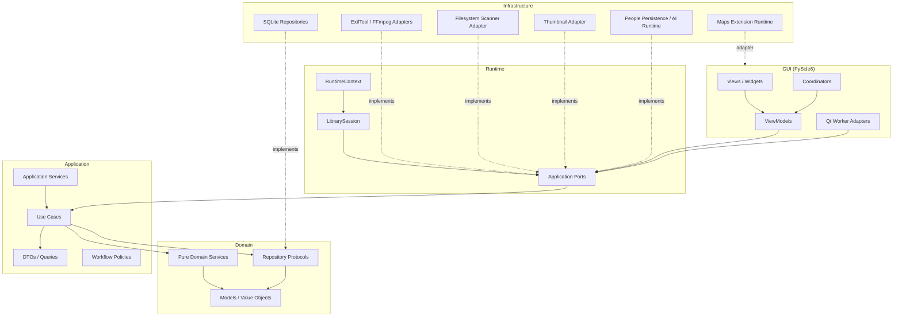
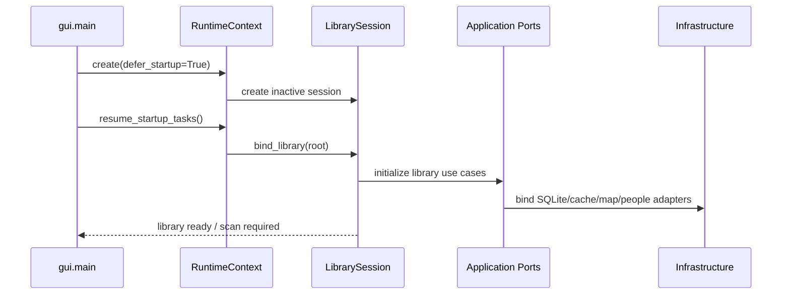
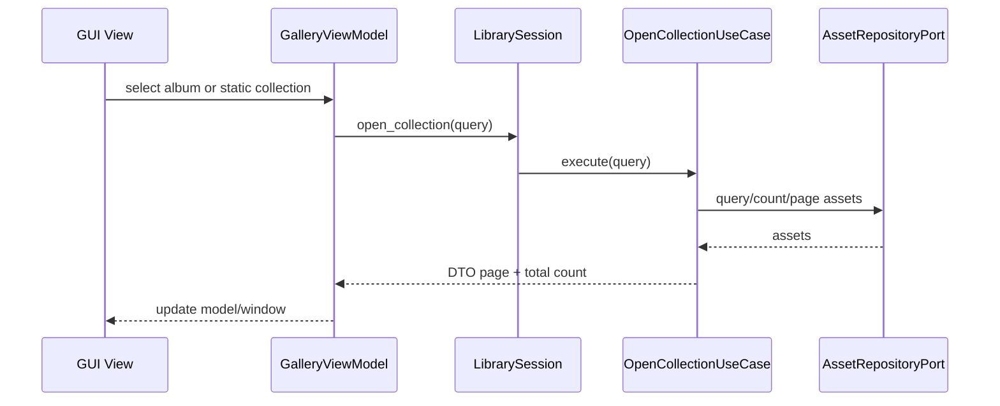
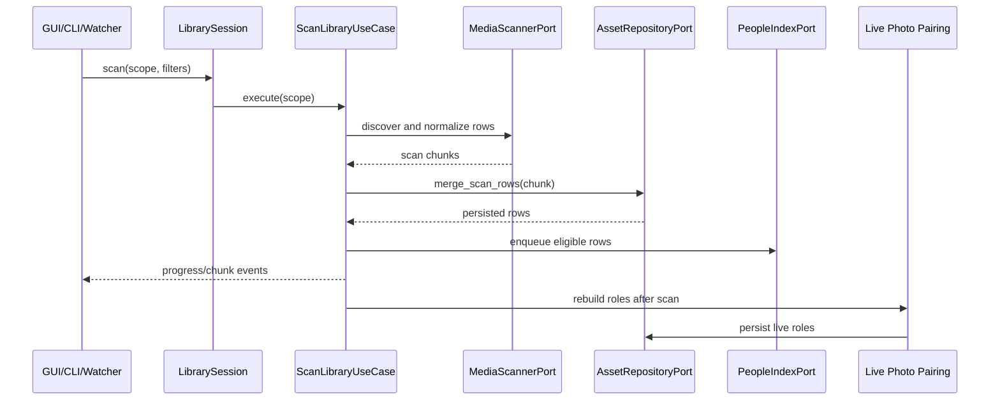
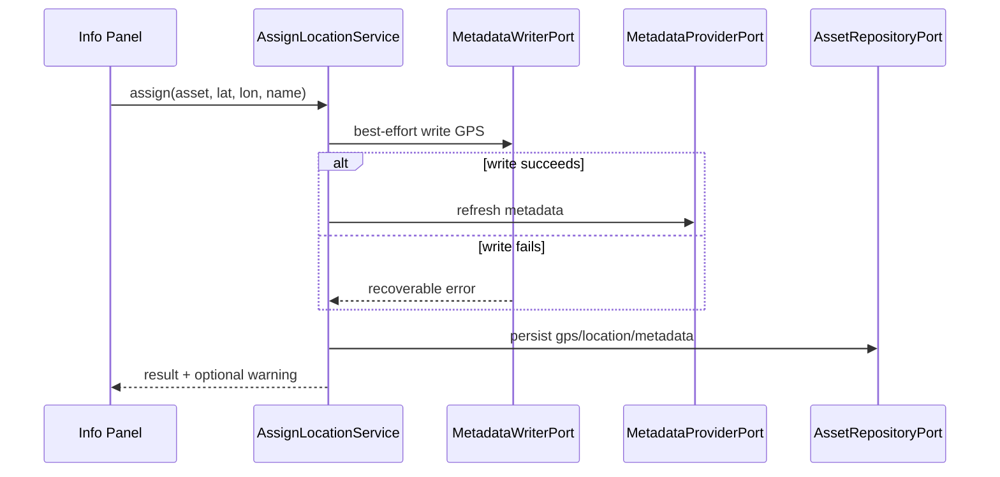
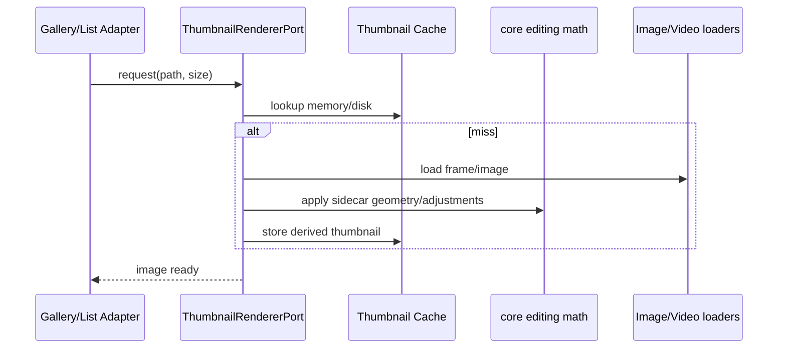

# Architecture vNext

> Target architecture for **iPhotron**. This document is intentionally
> prescriptive: it describes where the codebase should converge, not merely the
> current file tree.

---

## Status

The current architecture is not the final optimal target. It has the right
direction, but it is still a transition state:

- The desktop app already uses PySide6, MVVM-style coordinators/viewmodels,
  `RuntimeContext`, folder-native libraries, global SQLite indexing, People,
  Maps, and GPU-backed editing.
- Several business paths still overlap: two asset repository APIs, more than
  one scan pipeline, legacy model shims, direct cache access from application
  services, and a few cross-layer imports.
- Compatibility modules such as `app.py`, `appctx.py`, and `iPhoto.models.*`
  may remain during migration, but they are not target architecture.

The vNext target is a **library-scoped, modular desktop monolith**:
`RuntimeContext` owns one active `LibrarySession`; GUI, CLI, and background
workers call application-level contracts; SQLite, ExifTool, FFmpeg, thumbnail
rendering, filesystem scanning, and Qt threading are infrastructure adapters.

---

## Product Principles

iPhotron keeps these product-level decisions:

- **Folder-native library.** The filesystem remains the user's source of album
  organization. A folder is an album, and iPhotron must not require an import
  step before browsing.
- **Local library state.** Library runtime state lives under `.iPhoto/`, with
  `.iPhoto/global_index.db` as the authoritative asset index for one library
  root.
- **Non-destructive editing.** Visual edits are stored in `.ipo` sidecars.
  Original media is preserved. Location assignment is the explicit exception:
  it persists locally and best-effort writes GPS metadata to original files
  through ExifTool.
- **Rebuildable scan facts, durable human choices.** Metadata, thumbnails,
  Live Photo roles, and People runtime snapshots can be rebuilt. Names, covers,
  favorites, hidden state, groups, order, and pinned items are human decisions
  and must survive rescans.
- **Offline maps extension.** Maps remain an optional self-contained runtime
  rooted at `src/maps/tiles/extension/`, with graceful fallback when native OBF
  support is unavailable.
- **Cross-platform desktop first.** macOS, Windows, and Linux stay first-class.
  Platform rendering differences are isolated behind adapter/runtime selection
  layers.

---

## Target Shape



The dependency direction is one-way:

```text
gui -> runtime/application -> domain
infrastructure -> application/domain ports
bounded contexts -> application/domain ports
```

No lower layer imports GUI. No application service reaches around ports into
SQLite singletons or concrete infrastructure modules.

---

## Layer Boundaries

### `domain/`

Owns pure business concepts:

- `Album`, `Asset`, `MediaType`, Live Photo grouping, scan state values,
  People identity values, and query value objects.
- Repository and service protocols that describe what the application needs.
- Pure domain services that do not touch Qt, SQLite, the filesystem, ExifTool,
  FFmpeg, or wall-clock side effects except through passed values.

Forbidden:

- PySide6 / Qt imports.
- SQLite or `cache/index_store` imports.
- Filesystem writes, ExifTool, FFmpeg, model download, or thumbnail generation.

### `application/`

Owns workflows:

- Use cases such as opening a library/album, scanning media, pairing Live
  Photos, assigning location, moving/deleting/restoring assets, exporting, and
  People queries.
- DTOs, query objects, progress events, and application-level policies.
- Ports such as repositories, scanners, metadata readers/writers, thumbnail
  renderers, and People index services.

Forbidden:

- Direct imports from `gui/`, `cache/`, or concrete `infrastructure/`
  implementations.
- Direct use of `get_global_repository()` or other process-wide persistence
  singletons.
- Qt signals, `QRunnable`, widgets, or thread-pool ownership.

### `infrastructure/`

Owns concrete adapters:

- SQLite repository implementation for the global asset index.
- ExifTool and FFmpeg metadata readers/writers.
- Filesystem scanner implementation.
- Thumbnail rendering and disk/memory cache adapters.
- Runtime discovery for external binaries and packaged assets.

Forbidden:

- Imports from `gui/`.
- Calling viewmodels, coordinators, widgets, or GUI task helpers.
- Owning product workflow decisions that belong in `application/`.

### `gui/`

Owns presentation:

- Views/widgets, viewmodels, coordinators, menus, controllers, shortcuts,
  Qt workers, and signal adaptation.
- UI state and ergonomic desktop behavior.
- Threading adapters that forward progress/results from application use cases
  back to Qt.

Rules:

- GUI code calls application contracts through `RuntimeContext` /
  `LibrarySession`.
- Coordinators orchestrate views and viewmodels; they do not directly own asset
  persistence.
- Qt workers are transport adapters only. They must not contain unique business
  rules that bypass application use cases.

### Bounded Contexts

`people/`, `maps/`, and `core/` are bounded contexts:

- `people/` owns face detection, clustering, People repositories/state, manual
  faces, groups, and People queries. It exposes application-level ports to the
  rest of the app.
- `maps/` owns offline map runtime discovery, tile parsing, native OsmAnd
  widget/helper integration, and map rendering internals.
- `core/` owns pure editing/rendering math, Live Photo pairing rules, geometry,
  raw loading helpers, export transformations, and filter algorithms.

They may keep specialized internal structure, but they must follow the same
dependency direction and avoid GUI-to-infrastructure shortcuts becoming public
business APIs.

---

## Runtime Contract

`RuntimeContext` is the desktop composition root. In vNext it owns exactly one
active `LibrarySession`.

```text
RuntimeContext
  settings
  theme
  library_session
  recent_albums
  resume_startup_tasks()
  remember_album(root)

LibrarySession
  library_root
  assets
  albums
  scanner
  people
  thumbnails
  maps
  commands/use_cases
```

The session is the single library-scoped surface used by:

- GUI coordinators and viewmodels.
- CLI commands.
- Background workers.
- Future automation or extension entry points.

`app.py` may temporarily forward old calls into this session, but new runtime
code should not treat `app.py` as the backend facade. `appctx.py` remains a
compatibility proxy for old GUI construction paths only.

---

## Target Public Ports

These ports define the application boundary. Names are target names; existing
classes can be migrated incrementally.

| Port | Responsibility |
| --- | --- |
| `AssetRepositoryPort` | Query, count, upsert, merge scan rows, update library-managed state, and expose transaction boundaries for one library database. |
| `AlbumRepositoryPort` | Read/write folder manifests and album tree metadata through application semantics. |
| `MediaScannerPort` | Discover media paths and produce normalized scan rows without deciding persistence lifecycle. |
| `MetadataProviderPort` | Read image/video metadata in batches. |
| `MetadataWriterPort` | Best-effort write GPS/location metadata to original files. |
| `ThumbnailRendererPort` | Generate thumbnails and preview images without GUI ownership. |
| `PeopleIndexPort` | Queue face scan candidates, commit People snapshots, and query People/group assets. |
| `MapRuntimePort` | Report map extension availability and provide map/search runtime adapters. |

Important target corrections:

- `AssignLocationService` receives `AssetRepositoryPort` and
  `MetadataWriterPort`; it must not call `get_global_repository()` directly.
- Thumbnail rendering uses `core.geo_utils` for geometry helpers; infrastructure
  must not import `gui.ui.tasks.geo_utils`.
- Runtime code uses `domain.models` or manifest-specific models. `iPhoto.models.*`
  is a compatibility shim only.

---

## Persistence Model

Each library root owns one `.iPhoto/` workspace:

| Path | Target ownership |
| --- | --- |
| `.iPhoto/global_index.db` | `AssetRepositoryPort` SQLite implementation. Authoritative asset index, scan facts, favorites, Live Photo role state, trash state, and face scan status. |
| `.iPhoto/links.json` | Compatibility materialization of Live Photo pairing payload. Target code should treat DB-backed Live Photo state as authoritative. |
| `.iPhoto/faces/face_index.db` | Rebuildable People runtime snapshot. |
| `.iPhoto/faces/face_state.db` | Durable People user state: names, covers, hidden flags, order, groups, pinned state, and group asset caches. |
| `.iPhoto/faces/thumbnails/` | Derived cropped face thumbnails. |
| `.iPhoto/cache/thumbs/` | Derived UI thumbnail cache. |
| `.ipo` sidecars | Durable non-destructive edit instructions next to source media. |

SQLite access must converge on one repository implementation for assets. The
current split between `cache/index_store.AssetRepository` and
`SQLiteAssetRepository` is transitional and should be resolved by making one
adapter implement `AssetRepositoryPort`.

---

## Core Flows

### Library Startup



### Open Album / Collection



GUI viewmodels may keep paging and selection caches, but the repository remains
the source of truth for persisted asset state.

### Scan And Index



There should be one scan use case. `LibraryManager -> ScannerWorker ->
scanner_adapter`, `app.rescan()`, and `ScanAlbumUseCase` are current entry
points that must converge. In the target architecture:

- Qt workers only adapt threading and progress signals.
- CLI uses the same use case without Qt.
- Scans are additive by default. Deletion/trash lifecycle remains a separate
  explicit flow.
- Live Photo pairing remains post-scan and writes through repository ports.
- People indexing remains asynchronous but consumes persisted scan rows.

### Assign Location



The local database update is authoritative for the app. File write failures are
reported as warnings, not full operation failures.

### Thumbnail Rendering



Thumbnail code belongs behind an infrastructure adapter, but pure adjustment and
geometry calculations live in `core/`.

---

## Migration Targets

### Asset Repository

Target:

- One asset repository port.
- One SQLite adapter for `.iPhoto/global_index.db`.
- One transaction model for scan merges and user-authored state.

Migration:

- Treat `cache/index_store.AssetRepository` as the current authoritative scan
  storage implementation until the port is extracted.
- Move query/count/update behavior needed by GUI into the same port.
- Retire duplicate behavior in `SQLiteAssetRepository` or make it the single
  adapter after parity is proven.

### Scan Pipeline

Target:

- `ScanLibraryUseCase` owns scan orchestration.
- `MediaScannerPort` owns filesystem discovery and metadata normalization.
- Qt workers are thin wrappers over the use case.

Migration:

- Move scan semantics out of `app.py` and `LibraryManager` mixins.
- Keep existing worker signals while delegating implementation to the use case.
- Remove deletion semantics from generic rescan unless an explicit lifecycle
  use case requests pruning/trash cleanup.

### Runtime Entry

Target:

- `RuntimeContext` and `LibrarySession` are the only composition/runtime entry.
- `app.py` and `appctx.py` forward for compatibility only.

Migration:

- Keep the existing runtime-entry architecture tests.
- Convert GUI services and CLI commands to accept session/application ports.
- Stop adding new business methods to `app.py`.

### Legacy Models

Target:

- Runtime code imports `domain.models` or focused manifest models.
- `iPhoto.models.album` and `iPhoto.models.types` become compatibility-only.

Migration:

- Replace runtime imports from `iPhoto.models.*`.
- Keep deprecation warnings until downstream tests and CLI paths are migrated.
- Add an architecture guard that blocks new runtime imports of legacy models.

### Cross-Layer Imports

Target:

- `domain/`, `application/`, `infrastructure/`, `cache/`, `core/`, `io/`,
  `library/`, and `people/` do not import `gui/`.
- `application/` does not import concrete persistence or infrastructure
  modules.

Known examples to eliminate:

- `infrastructure/services/thumbnail_cache_service.py` importing
  `gui.ui.tasks.geo_utils`.
- `application/services/assign_location_service.py` importing
  `cache.index_store.repository.get_global_repository`.

---

## Architecture Guardrails

Existing guardrails should remain:

- Runtime `AppContext` imports stay confined to `appctx.py`.
- Coordinators do not import collection-store implementation types directly.

Add guardrails for vNext:

- No `gui` imports from `domain`, `application`, `infrastructure`, `cache`,
  `core`, `io`, `library`, or `people`.
- No concrete `cache` or `infrastructure` imports from `application`; use
  application ports instead.
- No runtime imports from `iPhoto.models.*` outside compatibility shims and
  tests explicitly covering compatibility.
- Scan entry points must route through the target scan use case/session surface.
- New repository code must target `AssetRepositoryPort`, not a process-wide
  singleton.

Recommended checks:

```bash
python3 tools/check_architecture.py
.venv/bin/pytest tests/architecture \
  tests/application/test_appctx_runtime_context.py \
  tests/gui/coordinators/test_main_coordinator_asset_runtime_boundary.py -q
```

As more guards are added, include them in `tools/check_architecture.py` so CI
can enforce the target boundaries.

---

## Current Compatibility Surface

These modules are allowed during migration but should not be expanded:

| Module | Target role |
| --- | --- |
| `iPhoto.app` | Compatibility facade forwarding to runtime/session use cases. |
| `iPhoto.appctx` | Compatibility proxy around `RuntimeContext`. |
| `iPhoto.models.album` | Manifest compatibility shim until a focused manifest model replaces it. |
| `iPhoto.models.types` | Legacy dataclass shim for old Live Photo callers. |
| `io.scanner_adapter` | Temporary scanner bridge until `MediaScannerPort` owns the scan adapter surface. |
| `library.manager` scan mixins | GUI-era coordination shell until scan orchestration moves to application use cases. |

Adding new features directly to these compatibility surfaces should be avoided
unless the change is required to preserve behavior during a migration step.

---

## Decision Log

### ADR-1: Folder-Native Albums

Folders remain albums. Manifest files store folder-local album metadata, while
global browsing/indexing state lives in the library database.

### ADR-2: Library-Scoped Runtime

One active library root owns one runtime session, one global asset database, one
thumbnail cache root, one People state root, and one maps runtime context.

### ADR-3: Application Ports Over Concrete Singletons

Use cases depend on ports. Concrete SQLite, ExifTool, FFmpeg, thumbnail, People,
and map runtimes are bound at the composition root. This makes GUI, CLI, tests,
and future automation use the same behavior.

### ADR-4: Single Asset Repository Contract

The asset index must converge on one repository port and one SQLite
implementation. Duplicate repository APIs are transitional and increase the
risk of divergent scan, favorite, Live Photo, face status, and paging behavior.

### ADR-5: Single Scan Use Case

Scanning is a product workflow, not a GUI worker detail. GUI workers and CLI
commands adapt the same use case so progress, cache checks, metadata fallback,
People enqueueing, and Live Photo pairing stay consistent.

### ADR-6: People State Split

People runtime scan output is rebuildable. Human-authored People state is
durable and survives rescans, reclustering, app restarts, and model changes.

### ADR-7: Platform Rendering Behind Adapters

OpenGL, QRhi/Metal, native OsmAnd widgets, helper-backed map renderers, and CPU
fallbacks remain runtime-selected adapters. Product workflows must not depend
on a specific rendering backend.

---

## Acceptance Criteria For vNext Migration

The architecture can be considered converged when:

- GUI, CLI, and workers use `RuntimeContext` / `LibrarySession` and application
  use cases for library operations.
- Asset persistence has one public repository port and one SQLite adapter.
- Scanning has one application use case with Qt and non-Qt adapters.
- `application/` has no direct concrete persistence or GUI imports.
- `infrastructure/` has no GUI imports.
- Runtime code no longer imports `iPhoto.models.*`.
- Architecture guard tests enforce the above constraints.
- Existing product behavior remains intact: folder browsing, global indexing,
  Live Photos, People, maps, editing, location assignment, trash, import/move,
  and export.
