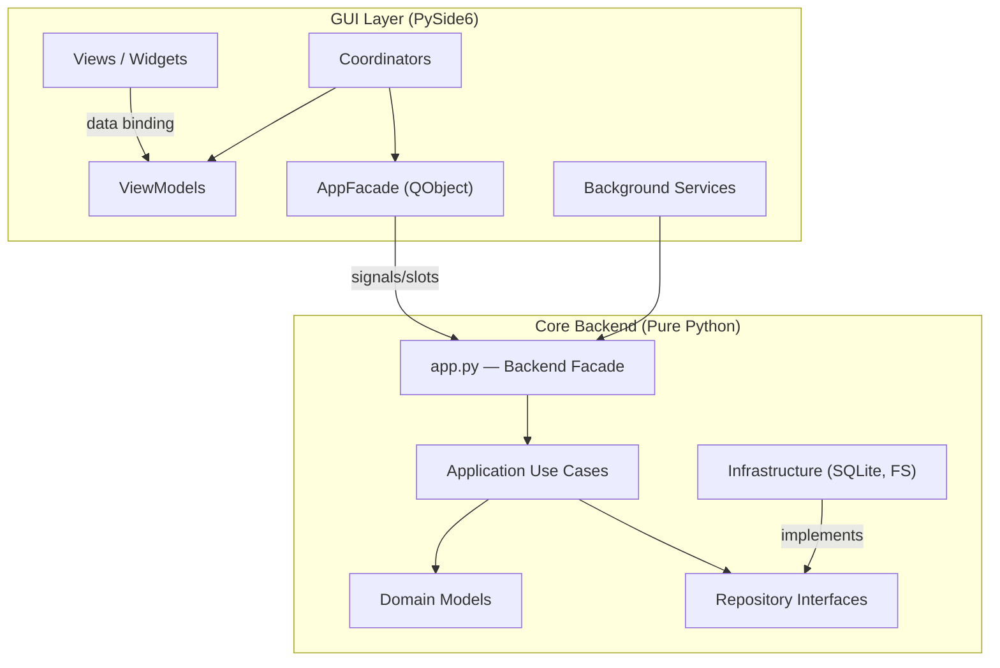
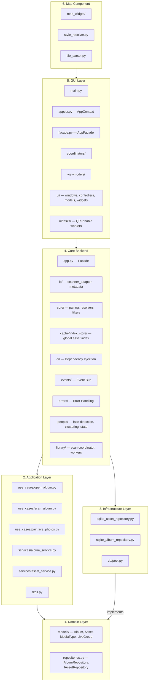
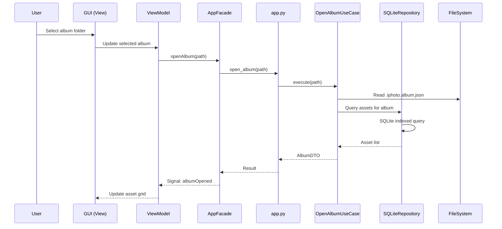
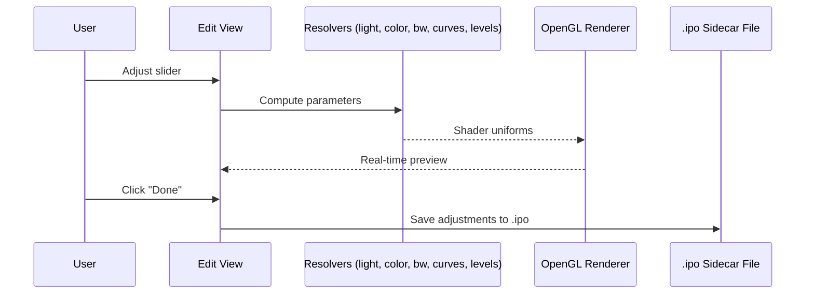
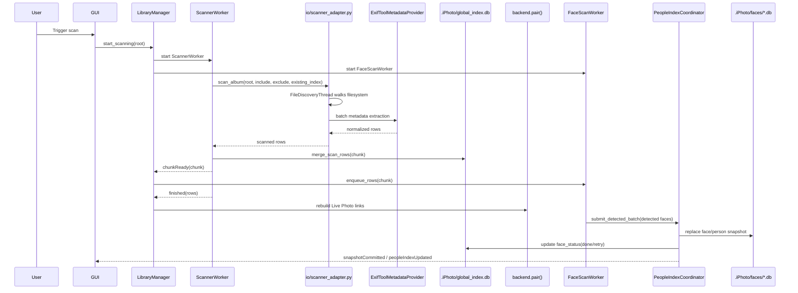

# 🏗️ Architecture

> Overall architecture, module boundaries, data flow, and key design decisions for **iPhotron**.

---

## High-Level Architecture

iPhotron follows a **layered architecture** based on **MVVM + DDD (Domain-Driven Design)** principles. The codebase is split into a **pure-Python backend** (no GUI dependency) and a **PySide6 GUI layer** that communicates through a facade.



---

## Module Boundary Overview



---

## Directory Structure

```
src/
├── iPhoto/
│   ├── domain/              # Pure business models & repository interfaces
│   │   ├── models/          # Album, Asset, MediaType, LiveGroup, query.py
│   │   └── repositories.py  # IAlbumRepository, IAssetRepository
│   ├── application/         # Use Cases & Application Services
│   │   ├── use_cases/       # open_album, scan_album, pair_live_photos
│   │   ├── services/        # album_service, asset_service
│   │   ├── interfaces.py    # IMetadataProvider, IThumbnailGenerator
│   │   └── dtos.py          # Data Transfer Objects
│   ├── infrastructure/      # Concrete implementations
│   │   ├── repositories/    # SQLite implementations
│   │   ├── db/              # Connection pool
│   │   └── services/        # Metadata extraction, thumbnails
│   ├── app.py               # Backend Facade
│   ├── models/              # Legacy data structures (Album, LiveGroup)
│   ├── io/                  # scanner_adapter.py, metadata reading
│   ├── core/                # Algorithms: pairing, resolvers, filters
│   │   ├── light_resolver.py
│   │   ├── color_resolver.py
│   │   ├── bw_resolver.py
│   │   ├── curve_resolver.py
│   │   ├── selective_color_resolver.py
│   │   ├── levels_resolver.py
│   │   └── filters/         # NumPy → Numba JIT → QColor fallback
│   ├── cache/               # Global SQLite index_store/
│   ├── people/              # Face scan pipeline, People repositories/state
│   ├── library/             # LibraryManager, scan coordinator, workers
│   ├── utils/               # Wrappers: exiftool.py, ffmpeg.py
│   ├── schemas/             # JSON Schema (album.schema.json)
│   ├── di/                  # Dependency Injection container
│   ├── events/              # Event bus (publish-subscribe)
│   ├── errors/              # Unified error handling
│   └── gui/                 # PySide6 desktop application
│       ├── main.py          # GUI entry point (iphoto-gui)
│       ├── appctx.py        # AppContext — shared global state
│       ├── facade.py        # AppFacade (QObject) — GUI ↔ Backend bridge
│       ├── coordinators/    # MVVM Coordinators
│       ├── viewmodels/      # ViewModels for data binding
│       ├── services/        # Background operation services
│       ├── background_task_manager.py
│       └── ui/              # Windows, controllers, models, widgets, tasks
└── maps/                    # Semi-independent map rendering module
    ├── map_widget/          # Core map widget & rendering
    ├── style_resolver.py    # MapLibre style sheet parser
    └── tile_parser.py       # .pbf vector tile parser
```

---

## Data Flow

### Album Opening Flow



### Photo Editing Flow



### Scanning & Indexing Flow



### Current Scan Entry Points

The repository currently contains more than one scan implementation, but the active desktop runtime path is the worker-based pipeline:

1. `src/iPhoto/gui/facade.py::rescan_current_async()`
   Uses `LibraryManager.start_scanning()` when the app is bound to a library. This is the main GUI path.
2. `src/iPhoto/library/scan_coordinator.py`
   Starts `ScannerWorker` and `FaceScanWorker` together so file indexing and People updates can progress concurrently.
3. `src/iPhoto/app.py::rescan()`
   Blocking backend API used by CLI/fallback workflows and by some background services.
4. `src/iPhoto/app.py::open_album()`
   Can trigger a lightweight autoscan when the index is empty.

`src/iPhoto/application/use_cases/scan_album.py` and `src/iPhoto/application/services/parallel_scanner.py` still exist and are covered by tests/DI wiring, but they are not the primary GUI scan path today.

### Current Filesystem Scan Pipeline

The current asset scan is split into discovery, metadata extraction, merge, and post-processing stages:

1. Discovery
   `io.scanner_adapter.scan_album()` reuses `FileDiscoveryThread` from `application/use_cases/scan_album.py` to walk the directory tree. It applies album include/exclude filters and prunes internal folders such as `.iPhoto`.
2. Incremental cache check
   Before re-reading metadata, the adapter compares each file against the existing index using relative path, file size, and mtime with a 1-second tolerance. Cache hits are yielded directly.
3. Metadata normalization
   Cache misses are batched through `ExifToolMetadataProvider.get_metadata_batch()` and normalized by `normalize_metadata()`. This stage fills canonical row fields such as `id`, `rel`, `dt`, `ts`, `mime`, `media_type`, dimensions, duration, and `face_status`.
4. Thumbnail enrichment
   Images get a micro-thumbnail through `PillowThumbnailGenerator`. If metadata extraction fails, the adapter falls back to a minimal row so the file is still indexed.
5. Chunked persistence
   `ScannerWorker` persists each chunk with `AssetRepository.merge_scan_rows()`. The repository performs atomic read-merge-write inside one transaction so scan facts and library-managed state are not racing each other.
6. Post-scan Live Photo pairing
   When the scan finishes, `ScanCoordinatorMixin._on_scan_finished()` calls `backend.pair()` to rebuild `links.json` and synchronize Live Photo roles back into the global index.

### Face Scan / People Pipeline

People indexing is a second pipeline layered on top of the asset scan rather than part of metadata extraction itself.

1. Candidate selection
   New or retried rows are forwarded from `ScannerWorker.chunkReady` to `FaceScanWorker.enqueue_rows()`. Only image-like assets are eligible. Videos and hidden Live Photo motion parts are skipped by `people.status.is_face_scan_candidate()`.
2. Global backlog top-up
   `FaceScanWorker` does not rely only on the latest scan chunk. It also refills its queue from `global_index.db` by reading rows whose `face_status` is `pending` or `retry`.
3. Detection and embedding
   `FaceClusterPipeline.detect_faces_for_rows()` loads each asset, runs `insightface.app.FaceAnalysis`, drops small faces, extracts normalized embeddings, and writes cropped face thumbnails to `.iPhoto/faces/thumbnails/`.
4. Session staging
   `PeopleIndexCoordinator.submit_detected_batch()` creates a `FaceScanSession`, separates `done` and `retry` assets, and keeps scan-time mutations serialized under a lock.
5. Snapshot rebuild
   `FaceScanSession.build_runtime_snapshot()` merges staged detections with all previously persisted faces, reclusters all faces with DBSCAN, then canonicalizes identities against persisted People state.
6. Commit and publish
   `FaceRepository.replace_all()` rewrites the runtime People snapshot in `.iPhoto/faces/face_index.db`. `FaceStateRepository.sync_scan_results()` persists stable identity/user state in `.iPhoto/faces/face_state.db`. After commit, the global asset index is updated from `pending/retry` to `done`, and `PeopleSnapshotEvent` is emitted back to the GUI.

### People Repository Responsibilities

The People subsystem deliberately separates rebuildable scan output from
user-authored state:

| Component | Responsibility |
|-----------|----------------|
| `FaceScanWorker` | Background queue owner. It receives scan chunks, tops up pending/retry backlog from `global_index.db`, runs detection, and reports retry/failure status without blocking the asset scan. |
| `PeopleIndexCoordinator` | Serialized mutation boundary for scan commits and UI mutations such as cover changes, manual face edits, merges, groups, and group deletion. |
| `FaceRepository` | Runtime People view over faces/persons plus service methods for cluster queries, merges, covers, and group asset refreshes. |
| `FaceStateRepository` | Stable People state database for names, canonical identities, covers, hidden flags, person/group order, group metadata, and group asset caches. |

`face_index.db` is a runtime snapshot that can be rebuilt from detections and
stable state. `face_state.db` is not disposable cache: it stores human decisions
and must survive rescans, reclustering, and application restarts.

### People Groups And Stable UI State

Groups are user-created containers over existing People cards. A group stores
member person ids, display metadata, order, pinned state, and optional cover
asset in `face_state.db`. The repository also maintains a group asset cache:
the cached asset ids are the photos where all current members appear together.

Group state is refreshed when scan commits, merges, manual face edits, person
deletions, or group mutations change the underlying memberships. Merging people
repairs affected groups and emits group redirects so the UI can update cards
without losing the user's visible organization. Hidden state is also stable
People state; people with different hidden states must not be merged, and group
cards stay synchronized with the dashboard's hidden-person filter.

### Face Status State Machine

`face_status` lives on the main asset row in `global_index.db` and acts as the contract between the asset scan and the People scan.

| Status | Meaning | Typical producer |
|-------|---------|------------------|
| `pending` | Asset is eligible for face scan and has not been processed yet | Initial asset scan |
| `skipped` | Asset should not be face scanned | Initial asset scan for videos / hidden motion items |
| `retry` | Detection or commit should be retried later | `FaceScanWorker` / `PeopleIndexCoordinator` |
| `done` | Face processing completed successfully | `PeopleIndexCoordinator` |
| `failed` | Fatal runtime failure stopped scanning | `FaceScanWorker` fatal path |

Two rules matter here:

- Asset scan owns initialization of `face_status`, not People scan.
- `cache/index_store/scan_merge.py` preserves the previous `face_status` when asset identity is unchanged, but recomputes it when the asset id changes.

### Persistence Layout For Scanning

The scan subsystem writes to multiple persistence artifacts under the library root:

| Path | Purpose |
|------|---------|
| `.iPhoto/global_index.db` | Main asset index, scan facts, favorites, live-role state, `face_status` |
| `.iPhoto/links.json` | Materialized Live Photo pairing payload for the current album |
| `.iPhoto/faces/face_index.db` | Runtime People snapshot: detected/manual faces, clustered persons, and group membership inputs |
| `.iPhoto/faces/face_state.db` | Stable People state: canonical identities, names, covers, hidden flags, person/group order, group metadata, pinned state, and group asset caches |
| `.iPhoto/faces/thumbnails/` | Cropped face thumbnails used by the People UI |

### Important Scan Semantics

- Asset scan is additive-only. `index_sync_service.update_index_snapshot()` merges or upserts facts but does not treat "not seen in this scan" as deletion.
- Deletion is handled by separate lifecycle flows, not by rescans.
- Live Photo pairing is a post-scan step, not part of metadata extraction.
- People clustering is a full snapshot rebuild on each committed batch, while user-facing identity state is preserved separately in `face_state.db`.
- Names, chosen covers, hidden people, person order, groups, group order, pinned
  groups, and selected group covers are human decisions. Do not discard them
  when repairing or rebuilding the runtime face snapshot.
- InsightFace model files are cached under the shared extension model directory (`src/extension/models`) rather than inside each library.

---

## Key Design Decisions

### ADR-1: Folder-Native Album Design

**Decision:** Each filesystem folder is treated as an album. Album metadata is stored in `.iphoto.album.json` manifest files within each folder.

**Rationale:** No import step is required. Users keep their existing folder structure. The system is fully rebuildable from the filesystem.

### ADR-2: Non-Destructive Editing with `.ipo` Sidecar Files

**Decision:** All photo edits are stored in `.ipo` (iPhoto Output) JSON sidecar files alongside originals.

**Rationale:** Original files remain 100% untouched. Edits can be reverted, modified, or removed at any time. The sidecar approach avoids database lock-in.

### ADR-3: Global SQLite Database (v3.00+)

**Decision:** All asset metadata is stored in a single SQLite database (`global_index.db`) at the library root, replacing per-album JSON index files.

**Rationale:** TB-level libraries caused freezing with JSON-based indexing. SQLite provides instant queries via multi-column indexes, WAL mode for crash safety, and automatic recovery.

### ADR-4: MVVM + DDD Layered Architecture (v4.00+)

**Decision:** Adopt MVVM for the GUI layer and DDD for the backend, with a clear Facade boundary.

**Rationale:** Separates pure business logic (testable without GUI) from UI presentation. Coordinators manage navigation flow. ViewModels manage state and reduce unnecessary re-renders.

### ADR-5: GPU-Accelerated Preview Rendering

**Decision:** Use OpenGL 3.3 for real-time edit preview with perspective transforms and color grading in shaders.

**Rationale:** CPU-based rendering was too slow for interactive editing. The GPU pipeline delivers instant visual feedback during adjustments.

### ADR-6: Three Coordinate Systems for Crop & Perspective

The crop tool uses three distinct coordinate systems:

| Space | Description | Purpose |
|-------|-------------|---------|
| **A. Original Texture Space** | Raw pixel space `[0, W_src] × [0, H_src]` | Input source for perspective transform |
| **B. Projected Space** | After perspective matrix; original rect → convex quad `Q_valid` | **Core calculation space** — all black-border prevention logic happens here |
| **C. Viewport/Screen Space** | Final pixel coordinates on the screen widget | User interaction only; inverse-transform to B before calculations |

**Key Rule:** Always operate crop logic in **Projected Space (B)**. Screen coordinates are for input only; texture coordinates are for rendering only.

---

## External Dependencies

| Tool | Purpose |
|------|---------|
| **ExifTool** | Reads EXIF, GPS, QuickTime, and Live Photo metadata |
| **FFmpeg / FFprobe** | Generates video thumbnails & parses video info |

Both must be available in the system `PATH`. Python dependencies (e.g., `Pillow`, `reverse-geocoder`, `numba`) are managed via `pyproject.toml`.
