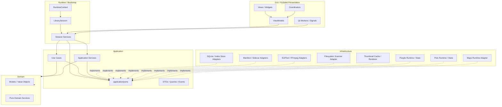
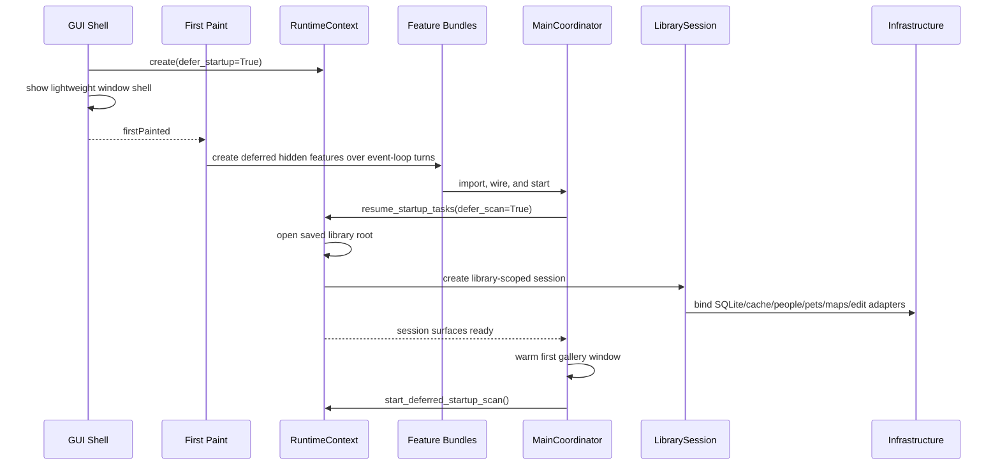
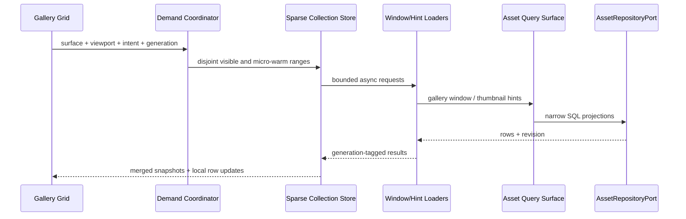
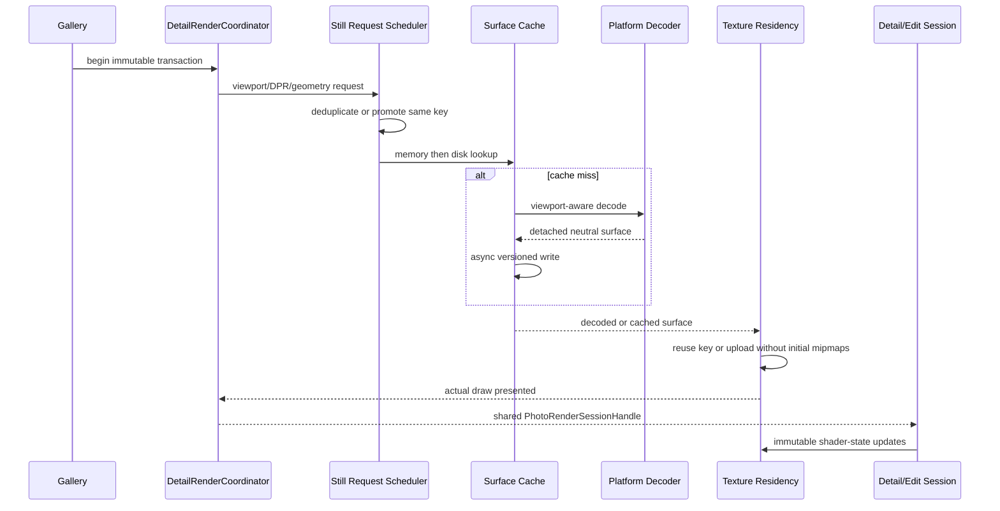
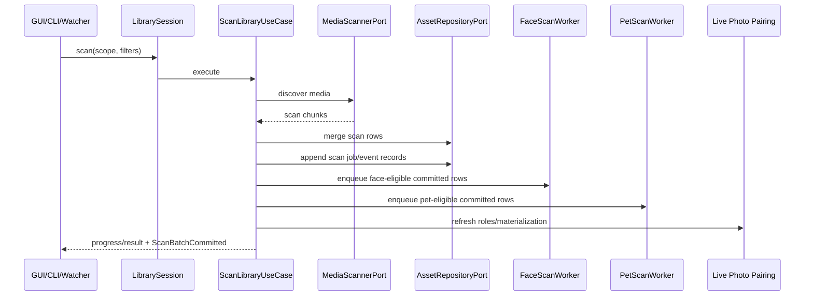
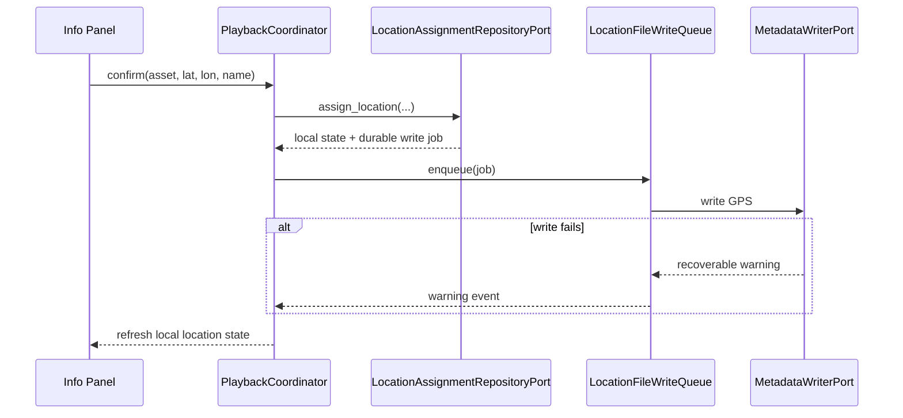
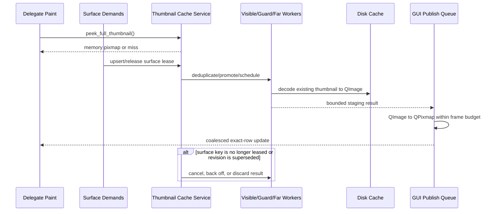

# Architecture vNext

This document describes the current production architecture of iPhotron after
the vNext cleanup. The codebase is a library-scoped modular desktop monolith:
one process-level `RuntimeContext` owns one active `LibrarySession`, and GUI,
CLI, watchers, and workers enter behavior through application surfaces rather
than legacy facades.

For completed migration records and verification history, see
`docs/finished/refactor/vnext-2026-06/`.

## Status

The vNext architecture cleanup is complete for production source code.

- Production runtime code no longer imports `iPhoto.legacy` or `iPhoto.models.*`.
- The compatibility application tree and old domain-repository implementation
  under `src/iPhoto/legacy/` have been removed.
- `RuntimeContext -> LibrarySession` is the active library entry path.
- Application ports and services define the boundary used by GUI, CLI, workers,
  People, Maps, Edit, thumbnails, and lifecycle operations.
- Gallery-to-Detail rendering has converged on one GPU-first production path.
  Still and video opens share a generation-safe render transaction; static
  Detail/Edit share source surfaces, GPU residency, and immutable edit state.
- Architecture guardrails are enforced by `tools/check_architecture.py` and
  `tests/architecture`.

The remaining pre-release checks are product validation tasks, such as manual Qt
GUI smoke testing and opening an existing library. They do not change the
architecture convergence status.

## Product Principles

- **Folder-native library.** The filesystem remains the user's album structure.
  A folder is an album, and browsing must not require import.
- **Local-first runtime.** Library state lives under `<LibraryRoot>/.iPhoto/`.
  Core workflows do not depend on cloud services.
- **Non-destructive editing.** Visual edits are persisted as `.ipo` sidecars.
  Original media is preserved.
- **Explicit metadata write-back.** Assign Location persists local state first,
  then best-effort writes GPS metadata to original media through ExifTool and
  reports warnings on failure.
- **Rebuildable facts vs durable choices.** Scan rows, thumbnails, Live Photo
  materialization, and People/Pets runtime snapshots can be rebuilt. Favorites,
  hidden/trash state, pinned items, covers, ordering, manual metadata, People
  names/groups/manual faces, and Pets names/covers/hidden/rejected decisions are
  durable user state.
- **Optional bounded contexts.** People AI, Pets AI, and Maps native/runtime
  extensions are optional and must degrade gracefully when missing.
- **Cross-platform desktop first.** macOS, Windows, and Linux are supported
  through runtime adapters and platform-specific rendering choices.

## Architecture Shape


```mermaid
graph TB
    subgraph Runtime["Runtime / Bootstrap"]
        RuntimeContext["RuntimeContext"]
        LibrarySession["LibrarySession"]
        SessionSurfaces["Session Services"]
    end

    subgraph GUI["GUI / PySide6 Presentation"]
        Views["Views / Widgets"]
        ViewModels["ViewModels"]
        Coordinators["Coordinators"]
        QtAdapters["Qt Workers / Signals"]
    end

    subgraph Application["Application"]
        Ports["application/ports"]
        UseCases["Use Cases"]
        AppServices["Application Services"]
        DTOs["DTOs / Queries / Events"]
    end

    subgraph Domain["Domain"]
        Models["Models / Value Objects"]
        PureServices["Pure Domain Services"]
    end

    subgraph Infrastructure["Infrastructure"]
        SQLite["SQLite / Index Store Adapters"]
        Manifest["Manifest / Sidecar Adapters"]
        Metadata["ExifTool / FFmpeg Adapters"]
        Scanner["Filesystem Scanner Adapter"]
        Thumbnails["Thumbnail Cache / Renderer"]
        PeopleInfra["People Runtime / State"]
        PetsInfra["Pets Runtime / State"]
        MapsInfra["Maps Runtime Adapter"]
    end

    RuntimeContext --> LibrarySession
    LibrarySession --> SessionSurfaces
    SessionSurfaces --> Ports
    SessionSurfaces --> UseCases
    SessionSurfaces --> AppServices

    Views --> ViewModels
    Coordinators --> ViewModels
    ViewModels --> SessionSurfaces
    QtAdapters --> SessionSurfaces

    UseCases --> Ports
    AppServices --> Ports
    UseCases --> Domain
    AppServices --> Domain
    Domain --> Models
    Domain --> PureServices

    SQLite -.implements.-> Ports
    Manifest -.implements.-> Ports
    Metadata -.implements.-> Ports
    Scanner -.implements.-> Ports
    Thumbnails -.implements.-> Ports
    PeopleInfra -.implements.-> Ports
    PetsInfra -.implements.-> Ports
    MapsInfra -.implements.-> Ports
```

Allowed dependency direction:

```text
gui -> bootstrap/runtime -> application -> domain
infrastructure -> application ports / domain values
bounded contexts -> application ports / domain values
```

Forbidden dependency direction:

```text
domain -> application/gui/infrastructure
application -> gui/concrete cache/concrete infrastructure
infrastructure/cache/core/io/library/people/pets -> gui
production runtime -> iPhoto.legacy
production runtime -> iPhoto.models.*
```

## Runtime Contract

`RuntimeContext` is the process composition root.

```text
RuntimeContext
  settings
  translation
  theme
  library
  facade
  event_bus
  asset_runtime
  recent_albums
  defer_startup_tasks
  container
  library_session: LibrarySession | None
  open_library(root)
  close_library()
  resume_startup_tasks(defer_scan=False)
  start_deferred_startup_scan()
  remember_album(root)
```

`LibrarySession` owns library-scoped adapters and exposes application-facing
surfaces.

```text
LibrarySession
  library_root
  state_repository
  assets
  state
  asset_queries
  asset_state
  album_metadata
  scans
  asset_lifecycle
  asset_operations
  thumbnails
  people
  pets
  recognition_mutations
  recognition_queries
  recognition_merges
  recognition_edits
  maps
  map_interactions
  edit
  locations
  shutdown()
```

CLI and other non-GUI callers create the same session boundary through
`create_headless_library_session(root)`.

Production GUI and CLI do not create independently bound fallback services.
Widgets may receive an unbound `PeopleService()` or `PetService()` as a
presentation-safe empty object before a library session exists, but it must not
open repositories or become a second source of library truth. Session-bound
services fail explicitly or no-op safely according to their responsibility.

`TranslationManager` is created after settings and before theme initialization.
It reads `ui.language`, installs the active Qt translator, exposes
`languageChanged`, and falls back to English when the requested or system
language has no bundled resource. The active stored language values are
`system`, `de`, and `zh-CN`; the language menu presents `system` as `English`.

Desktop construction deliberately has two boundaries. The process first loads
settings, configures graphics caches, creates `QApplication`, `RuntimeContext`,
and the lightweight main-window shell. Before any widget that can force native
handle creation (notably `QMenuBar`) is constructed, the hidden Detail surface
shell and all three QRhi widgets are attached with their final parents. The
window then calls `show()`. Only after the shell emits `firstPainted` may startup
complete the Detail chrome/playback runtime, import and start `MainCoordinator`,
resume library startup tasks, or select the initial collection. This is an
architecture constraint rather than a timer-based optimization.

`Ui_MainWindow.ensure_feature()` owns the on-demand lifetime of the detail,
preview, Map, People, and Albums bundles. It caches each bundle and emits
`featureCreated` so the window manager and coordinator can attach behavior to
late-created widgets. Navigation may also call `ensure_feature()` if Map or the
Albums dashboard was not constructed during the post-paint warm-up. Windows,
macOS, and Linux share one QRhi lifecycle: the final native surface hierarchy is
prepared pre-show, while `ensure_feature("detail")` completes its non-native UI
and QtMultimedia runtime post-paint. Platform allowlists, post-show surface
creation, parentless surface warm-up, and hide/show workarounds are forbidden.
The pre-show hierarchy is part of shell construction: failure is terminal and
non-recoverable for that process. Startup-generation retry applies only after a
valid visible shell exists; it must not claim to reconstruct the native
hierarchy after `QMenuBar` has already created the top-level handle.

## Layer Boundaries

### Domain

`domain/` owns dataclasses, value objects, query models, and pure domain
services. It must not import Qt, SQLite, filesystem-writing adapters, ExifTool,
FFmpeg, GUI helpers, or runtime singletons.

### Application

`application/` owns workflow use cases, application services, DTOs, queries,
events, and port protocols. Application code depends on ports and domain values.
It must not import GUI modules, concrete persistence modules, Qt workers,
widgets, or process-wide repository singletons.

`LibrarySession.recognition_edits` owns explicit single-detection reassignment,
pending-candidate identity merge, and identity rename requests from Detail.
Requests capture the asset, native detection reference, and expected identity
state. Rename requests also carry the normalized name observed when the editor
opened. The service re-reads annotations under the shared recognition mutation
lease and uses that name as a compare-and-set guard before dispatching through
the existing People/Pets services and journal. Inline naming and Info Panel
share the same reassignment operation.

The inline selection policy lives in `domain/recognition_edits.py`. Only an
independent, non-manual `candidate` identity is merged as a whole. Manual,
unassigned, `eligible`, confirmed, redirected, and legacy annotations are edited
one detection at a time. Typed text remains an explicit identity rename, and
selecting the current identity is a no-op. Single-detection assignments override
identity redirects when reading both automatic and manual annotations; moving
back to the native kind clears that override as part of recoverable state sync.
Source display names may fill a missing canonical name only when source and
effective identity are the same. Move and delete runtime commits retain any
cleared assignment target so recovery can refresh only groups containing the
native identities or the previous target; legacy commits without this metadata
retain the full-refresh fallback.

Current public boundary names include:

| Port | Responsibility |
| --- | --- |
| `AlbumRepositoryPort` | Folder-local album manifest read/write without exposing legacy shims upstream. |
| `AssetRepositoryPort` | Asset query, count, scan merge, state update, and transaction semantics for the current library store. |
| `AssetFavoriteQueryPort` | Favorite-state reads through a session-owned query surface. |
| `AssetStateServicePort` | Durable asset-state commands such as favorite toggles. |
| `EditServicePort` | Session-scoped edit sidecar and render-state surface. |
| `EditSidecarPort` | `.ipo` read/write and edit state persistence. |
| `LibraryStateRepositoryPort` | Durable library user-state boundary for favorites, hidden/trash, pinned/order, and related state. |
| `LocationAssetServicePort` | Session-bound geotagged asset queries. |
| `LocationMetadataPort` | Explicit location assignment metadata write/read-back boundary. |
| `MediaScannerPort` | Media discovery and normalized scan candidates without persistence ownership. |
| `MetadataReaderPort` | Image/video metadata reads. |
| `MetadataWriterPort` | Explicit best-effort metadata writes such as Assign Location GPS write-back. |
| `MapInteractionServicePort` | Marker-click and map interaction semantics. |
| `MapRuntimePort` | Maps extension availability and runtime adapter selection. |
| `PeopleAssetRepositoryPort` | Asset-index reads and face-status updates used by the People bounded context. |
| `PeopleIndexPort` | People scan candidate enqueue, snapshot commit, and People/group queries. |
| `PetAssetRepositoryPort` | Asset-index reads plus `pet_status` updates/counts used by the Pets bounded context. |
| `PetIndexPort` | Pets candidate enqueue and rebuildable snapshot commit boundary. |
| `PinnedStateRepositoryPort` | Pinned sidebar state persistence across libraries. |
| `TaskSchedulerPort` | Background task submission and cancellation boundary. |
| `ThumbnailRendererPort` | Thumbnail/preview generation without GUI ownership. |

### Large Library Query And Scan Contracts

Large-library browsing is part of the current production architecture, not a
future side design. The active query path is SQL-first and windowed:

- `CollectionQuery`, `PageCursor`, `PageResult`, and `WindowResult` describe
  collection intent, keyset pages, and bounded viewport windows.
- `LibraryAssetQueryService` converts supported `AssetQuery` reads to
  repository-backed collection SQL for All Photos, albums, favorites, videos,
  maps/GPS, media type, and date filters.
- `GalleryCollectionStore` treats `asset_at()` as cache-only and loads bounded
  windows asynchronously through `GalleryWindowLoader` and
  `read_gallery_asset_window()`; direct row lookup uses `find_row_by_path()`
  rather than scanning the model. Loaded chunks are merged into a bounded
  sparse cache, and stale generation/revision results are discarded.
- Gallery SQL has two narrow projections in addition to the general collection
  window: `read_gallery_collection_window()` returns tile-rendering fields, and
  `read_thumbnail_hint_window()` returns only paths and existing full-thumbnail
  keys without repeating the collection count.
- `AssetViewportDemand` is the per-surface contract between scrolling, sparse row
  loading, and thumbnail scheduling. Gallery and Filmstrip keep independent
  generations, visible rows, full-thumbnail guards, speculative work, display
  buckets, and micro-thumbnail warm ranges.
- Active surface demands are leases. Sparse row windows may be disjoint, while
  the global micro cache remains bounded. Gallery and Filmstrip both resolve to
  one canonical 512px full-thumbnail key, so their independent leases share the
  same L1 QPixmap and L2 artifact. Hiding a surface suspends its viewport publishers
  and releases only its exclusive pins and queued work. Late viewport query results
  for a released surface are discarded.
- Filmstrip keeps visible and two-screen full-thumbnail guard demand at 512px,
  but does not add far-speculative full work. Gallery retains its wider
  full-prefetch policy, and Filmstrip micro warm-up remains unchanged.
- Delegates consume one `GalleryTileSnapshot` through `TILE_SNAPSHOT`. A paint
  miss must remain memory-only; it schedules bounded background work and paints
  an available micro thumbnail or placeholder instead of reading SQLite or L2.
- Normal gallery collections default to `thumbnail_state='ready'` and require a
  non-empty `thumb_cache_key`; stale, pending, failed, or old no-key rows are
  repair/backfill candidates, not visible media grid rows.
- Scan publishing uses `ScanBatchCommitted`, split into small ready-row batches
  after DB commit. Production code must not restore the old `scanChunkReady`
  transport for real-time UI updates.
- `scan_jobs` and `scan_events` persist job state, stage changes, batch commit
  metadata, and stage timing for scan observability.

### Infrastructure

`infrastructure/` owns concrete adapters: SQLite-backed state, manifest and
sidecar persistence, ExifTool/FFmpeg wrappers, filesystem scanners, thumbnail
caches/renderers, maps runtime discovery, and supporting runtime services. It
implements application ports and may depend on domain values. It must not import
GUI modules or own product workflow decisions.

### GUI

`gui/` owns PySide6 presentation: views, widgets, controllers, viewmodels,
coordinators, menus, shortcuts, Qt workers, and signal adapters. GUI code calls
session/application surfaces and does not directly write durable state or call
concrete repository singletons.

The static media pipeline is a GUI/rendering boundary rather than an application
workflow service. `DetailRenderCoordinator` owns the active still/video
transaction and its single terminal state. `DetailStillRequestScheduler`
deduplicates one source revision and decode level, while platform decoders
produce detached neutral RGBA8888/sRGB surfaces. `PhotoRenderSessionHandle`
shares the current source texture, available LODs, `ColorStats`, and immutable
`EditRenderState` between Detail and Edit. Sidecar persistence still enters
through the session edit surface; it does not become part of the neutral source
cache key.

User-visible GUI text goes through the Qt translation boundary. New strings
should use `iPhoto.gui.i18n.tr(context, source_text)` or
`QCoreApplication.translate(...)` with a stable context. Long-lived widgets
refresh translated labels through `retranslate_ui()`; the main window wires
`TranslationManager.languageChanged` to `retranslate_ui_tree()` so runtime
language switches update menus, tooltips, pages, and status text without
rebuilding the active library session. Business logic must use stable command
ids, node types, callbacks, or `QAction.data()` rather than translated labels.

Bundled i18n resources live in `src/iPhoto/resources/i18n/`:

| Resource | Responsibility |
| --- | --- |
| `languages.json` | Advertises supported UI language choices and Qt locales. |
| `iPhoto_de.ts` / `iPhoto_zh_CN.ts` | Qt Linguist source translations. |
| `iPhoto_de.qm` / `iPhoto_zh_CN.qm` | Compiled translators loaded at runtime. |

Package data includes `.ts` and `.qm` files so editable installs and packaged
builds can load the same resources.

### Library Runtime

`library/` contains the production runtime controller, album tree/watch shells,
scan coordination, and trash/filesystem orchestration bound to session services.
It is not a legacy manager facade.

### Bounded Contexts

- `people/`: optional face detection/clustering runtime, People repositories,
  stable People state, manual faces, groups, covers, and People service API.
- `pets/`: optional YOLOX/DINOv2 detection and identity clustering runtime,
  rebuildable pet repository, durable pet state, and session-bound Pet service.
  The People & Pets dashboard composes both services without merging their
  runtime tables. See [`docs/misc/PETS_RECOGNITION_RUNTIME.md`](misc/PETS_RECOGNITION_RUNTIME.md).
- `src/maps`: optional offline map runtime, tile parsing, OBF/native
  widget/helper integration, search, and map rendering internals. GUI map
  views construct concrete map widgets through `map_widget_factory`.
- `core/`: editing math, filters, geometry, export transforms, raw loading, and
  Live Photo pairing rules.
- `cache/index_store/`: current global SQLite index implementation used behind
  repository/session surfaces, not a public GUI/application shortcut.

## Persistence Model

Each library root owns a `.iPhoto/` workspace.

| Path | Ownership |
| --- | --- |
| `.iPhoto/global_index.db` | Current SQLite asset index and repository-backed state store for scan rows, pagination, Live Photo roles, trash/favorite/hidden state, independent `face_status`/`pet_status`, and related library state. |
| `.iPhoto/links.json` | Derived Live Photo compatibility materialization; repository/session Live Photo role state remains authoritative for runtime behavior. |
| `.iPhoto/cache/thumbs/` | Rebuildable thumbnail cache. |
| `.iPhoto/cache/detail-surfaces/v3/` | SQLite-indexed, rebuildable neutral RGBA8/sRGB Detail surfaces keyed by source identity, decoder contract, orientation, and LOD; trusted hits validate indexed header/stat metadata without scanning the full payload, and sidecar revision is excluded. |
| `.iPhoto/faces/face_index.db` | Rebuildable People runtime snapshot. |
| `.iPhoto/faces/face_state.db` | Durable People user state: names, covers, hidden flags, order, groups, pinned state, group covers, and manual faces. |
| `.iPhoto/faces/thumbnails/` | Rebuildable cropped face thumbnails. |
| `.iPhoto/pets/pet_index.db` | Rebuildable Pets detections and clustered pet records. |
| `.iPhoto/pets/pet_state.db` | Durable Pets profiles, names, covers, hidden flags, rejected keys, and merge redirects. |
| `.iPhoto/pets/thumbnails/` | Rebuildable cropped pet thumbnails; replaced detections are reference-pruned after a successful snapshot commit. |
| `.ipo` sidecars | Durable non-destructive edit instructions next to source media. |
| `.iphoto.album.json` / `.iPhoto/manifest.json` | Folder-local album metadata formats. |
| `.iphoto.album` | Legacy album marker compatibility file. |

Implementation stages may continue storing scan facts and some user state in the
same SQLite file, but repository APIs and merge behavior must maintain the
logical boundary: scans may rebuild facts and must not implicitly delete durable
choices.

## Core Flows

### Library Startup


```mermaid
sequenceDiagram
    participant UI as GUI Shell
    participant Paint as First Paint
    participant Runtime as RuntimeContext
    participant Feature as Feature Bundles
    participant Coordinator as MainCoordinator
    participant Session as LibrarySession
    participant Infra as Infrastructure

    UI->>Runtime: create(defer_startup=True)
    UI->>UI: show lightweight window shell
    UI-->>Paint: firstPainted
    Paint->>Feature: create deferred hidden features over event-loop turns
    Feature->>Coordinator: import, wire, and start
    Coordinator->>Runtime: resume_startup_tasks(defer_scan=True)
    Runtime->>Runtime: open saved library root
    Runtime->>Session: create library-scoped session
    Session->>Infra: bind SQLite/cache/people/pets/maps/edit adapters
    Runtime-->>Coordinator: session surfaces ready
    Coordinator->>Coordinator: warm first gallery window
    Coordinator->>Runtime: start_deferred_startup_scan()
```

Headless callers do not use the paint boundary; they create the same
library-scoped session directly. Scan workers, geocoding, People/Pets AI, Qt
Multimedia, and Maps rendering remain demand-loaded by their owning workflow.
The GUI delays the saved-library metadata scan until the first gallery warm-up
signals readiness, with a bounded timer fallback so an empty or failed gallery
cannot suppress scanning indefinitely.

### Open Collection


```mermaid
sequenceDiagram
    participant Grid as Gallery Grid
    participant Demand as Demand Coordinator
    participant Store as Sparse Collection Store
    participant Loader as Window/Hint Loaders
    participant Query as Asset Query Surface
    participant Repo as AssetRepositoryPort

    Grid->>Demand: surface + viewport + intent + generation
    Demand->>Store: disjoint visible and micro-warm ranges
    Store->>Loader: bounded async requests
    Loader->>Query: gallery window / thumbnail hints
    Query->>Repo: narrow SQL projections
    Repo-->>Loader: rows + revision
    Loader-->>Store: generation-tagged results
    Store-->>Grid: merged snapshots + local row updates
```

GUI viewmodels may cache window/selection state, but repository/session surfaces
remain the source of truth for persisted asset state. Explicit detail-view row
loads are retained independently from newer viewport generations so navigation
does not lose an in-flight target.

### Gallery To Detail/Edit Rendering


```mermaid
sequenceDiagram
    participant Gallery as Gallery
    participant Tx as DetailRenderCoordinator
    participant Scheduler as Still Request Scheduler
    participant Cache as Surface Cache
    participant Decoder as Platform Decoder
    participant GPU as Texture Residency
    participant Edit as Detail/Edit Session

    Gallery->>Tx: begin immutable transaction
    Tx->>Scheduler: viewport/DPR/geometry request
    Scheduler->>Scheduler: deduplicate or promote same key
    Scheduler->>Cache: memory then disk lookup
    alt cache miss
        Cache->>Decoder: viewport-aware decode
        Decoder-->>Cache: detached neutral surface
        Cache->>Cache: async versioned write
    end
    Cache-->>GPU: decoded or cached surface
    GPU->>GPU: reuse key or upload without initial mipmaps
    GPU-->>Tx: actual draw presented
    Tx-->>Edit: shared PhotoRenderSessionHandle
    Edit->>GPU: immutable shader-state updates
```

`DetailDecodeKey` contains asset/source revision, orientation, and decode level;
it intentionally excludes `.ipo` revision. Initial quality is selected from
physical viewport demand rather than full sensor dimensions. Zoom, crop,
rotation, or perspective may request a higher LOD, but the prior texture stays
visible until the replacement is drawn. Current/previous/next GPU residency is
bounded by both three textures and 192MB. Source changes invalidate neutral
surfaces and textures; sidecar changes replace render state only.

Non-RAW platform selection is ImageIO on macOS, WIC on Windows, and Qt on Linux,
with Qt fallback inside the same worker lane. RAW uses rawpy and its embedded,
half-size, then full fallback sequence. All stale generations are rejected at
thread/render boundaries. Static Edit no longer creates a second full-image
loader or CPU preview session; Done/Cancel and fullscreen retain the same render
session. Export remains an independent full-resolution path.

### Scan And Index


```mermaid
sequenceDiagram
    participant Trigger as GUI/CLI/Watcher
    participant Session as LibrarySession
    participant Scan as ScanLibraryUseCase
    participant Scanner as MediaScannerPort
    participant Repo as AssetRepositoryPort
    participant Faces as FaceScanWorker
    participant Pets as PetScanWorker
    participant Pairing as Live Photo Pairing

    Trigger->>Session: scan(scope, filters)
    Session->>Scan: execute
    Scan->>Scanner: discover media
    Scanner-->>Scan: scan chunks
    Scan->>Repo: merge scan rows
    Scan->>Repo: append scan job/event records
    Scan->>Faces: enqueue face-eligible committed rows
    Scan->>Pets: enqueue pet-eligible committed rows
    Scan->>Pairing: refresh roles/materialization
    Scan-->>Trigger: progress/result + ScanBatchCommitted
```

Scanning has one application use case. Qt workers adapt threading/progress, and
CLI uses the same session surface without Qt. UI scan batches are ready-only and
carry full thumbnail cache keys so visible media rows are immediately drawable.
For an interactive rescan, Face and Pet workers run alongside metadata scanning
and receive committed rows. When saved-library startup requires a metadata
scan, AI workers are deferred until it finishes, then drain `pending`/`retry`
rows from the global index. A scan-complete startup does not create AI workers.
The workers and their databases remain independent; failure or a missing
optional runtime in one must not block the other.

### Assign Location


```mermaid
sequenceDiagram
    participant UI as Info Panel
    participant Coordinator as PlaybackCoordinator
    participant Repository as LocationAssignmentRepositoryPort
    participant Queue as LocationFileWriteQueue
    participant Writer as MetadataWriterPort

    UI->>Coordinator: confirm(asset, lat, lon, name)
    Coordinator->>Repository: assign_location(...)
    Repository-->>Coordinator: local state + durable write job
    Coordinator->>Queue: enqueue(job)
    Queue->>Writer: write GPS
    alt write fails
        Writer-->>Queue: recoverable warning
        Queue-->>Coordinator: warning event
    end
    Coordinator-->>UI: refresh local location state
```

The local assignment is authoritative. ExifTool failures are warnings and do not
roll back local state; pending durable write-back jobs are recovered on the next
session.

### Thumbnail Rendering


```mermaid
sequenceDiagram
    participant Paint as Delegate Paint
    participant Demand as Surface Demands
    participant Thumb as Thumbnail Cache Service
    participant Worker as Visible/Guard/Far Workers
    participant L2 as Disk Cache
    participant GUI as GUI Publish Queue

    Paint->>Thumb: peek_full_thumbnail()
    Thumb-->>Paint: memory pixmap or miss
    Demand->>Thumb: upsert/release surface lease
    Thumb->>Worker: deduplicate/promote/schedule
    Worker->>L2: decode existing thumbnail to QImage
    Worker-->>GUI: bounded staging result
    GUI->>GUI: QImage to QPixmap within frame budget
    GUI-->>Paint: coalesced exact-row update
    alt surface key is no longer leased or revision is superseded
        Thumb->>Worker: cancel, back off, or discard result
    end
```

Visible recovery, near guard, and far speculation use separate scheduling lanes;
far work must not consume workers reserved for urgent visible/guard requests.
`ThumbnailRuntimePolicy` derives worker, staging, publish, and byte-budget limits
from platform and physical memory. L1 eviction accounts for actual image bytes,
pins the union of active visible surface demand, and prefers old/far speculative
entries. Gallery and Filmstrip naturally deduplicate at the same 512px key; the
size-qualified key remains available to other future surfaces. Disk access
and image decoding stay off the GUI thread; only bounded `QPixmap` publication
runs there. Thumbnail infrastructure may apply edit state, but edit persistence
remains behind session/edit sidecar services.

## Removed Legacy Application Tree

The former `src/iPhoto/legacy/` compatibility tree, including app/appctx
wrappers, bootstrap shims, domain-repository use cases, repository adapters,
and model shims, has been removed.

Rules:

- Production runtime must not import `iPhoto.legacy`.
- Production runtime must not import `iPhoto.models.*`.
- Do not restore compatibility modules or tests that target removed interfaces.
- Historical behavior that remains a product requirement must be covered
  through current application, session, domain, or infrastructure surfaces.

## Architecture Guardrails

Run:

```bash
python3 tools/check_architecture.py
python tools/check_i18n_strings.py src/iPhoto/gui src/maps
.venv/bin/python -m pytest tests/architecture -q
```

The guardrails enforce:

- runtime `AppContext` imports are not reintroduced;
- coordinators do not import collection-store implementation types directly;
- vNext layer boundaries are respected;
- `application/` does not import GUI or concrete persistence;
- `infrastructure/` does not import GUI;
- production runtime does not import quarantined legacy paths or old model
  shims.
- high-risk GUI APIs do not receive direct English literals that bypass the
  translation boundary.

The GitHub Actions workflow also runs `python tools/check_architecture.py`
before the broader test suite.

## Decision Log

### ADR-1: Folder-Native Albums

Folders remain albums. Manifests store folder-local metadata, while global
browsing/indexing state lives in the library database and session surfaces.

### ADR-2: Library-Scoped Runtime

One active library root owns one runtime session, one asset index, one thumbnail
cache root, separate People and Pets state roots, and one Maps runtime context.

### ADR-3: Application Ports Over Concrete Singletons

Use cases and application services depend on ports. Concrete SQLite, ExifTool,
FFmpeg, thumbnail, People, Pets, edit, and Maps implementations are bound through
runtime/session composition.

### ADR-4: Single Asset Repository Boundary

Asset persistence is exposed through one public application port. The current
SQLite global index implementation is used behind that boundary; GUI and
application code must not bypass it.

### ADR-5: Single Scan Use Case

Scanning is an application workflow. GUI workers, CLI commands, watchers, and
runtime refreshes adapt the same scan/session surface so progress, cache checks,
metadata fallback, People/Pets enqueueing, and Live Photo pairing stay consistent.

### ADR-6: Durable Recognition State Split

People runtime scan output is rebuildable. Human-authored People state is
durable and survives rescans, reclustering, app restarts, and model changes.
Pets follows the same split through separate `pet_index.db` and `pet_state.db`;
the contexts share orchestration patterns but never share detection tables or
identity record types.

### ADR-7: Platform Rendering Behind Adapters

OpenGL, QRhi/Metal, native OsmAnd widgets, helper-backed map renderers, and CPU
fallbacks are runtime-selected adapters. Product workflows must not depend on a
specific rendering backend. Detail still decode follows the same rule through
ImageIO, WIC, Qt, and rawpy adapters; native failure may fall back to Qt without
creating a second scheduler or presentation path.

### ADR-8: GPU-First Detail With Shared Edit Sessions

The current viewport, not full sensor dimensions, defines initial still-image
quality. Neutral source surfaces, edit state, and GPU residency have separate
identities and invalidation rules. Detail and static Edit share one GUI-owned
render session; shader updates do not reload source pixels. The legacy Detail
v2 full-frame cache and still Edit CPU-preview chain must not be restored.

### ADR-9: Composed People And Pets Identities

The dashboard, pinned sidebar, annotations, and identity groups may compose
person and pet summaries. Canonical records remain owned by their bounded
contexts, while cross-kind redirects and mixed identity-group membership are
durable coordination state in the People state repository.

## Acceptance Criteria

The current production source satisfies the vNext architecture criteria when:

- GUI, CLI, watchers, and workers enter through `RuntimeContext`,
  `LibrarySession`, and application/session surfaces.
- Asset persistence is exposed through `AssetRepositoryPort` and state-specific
  application ports.
- Scanning is owned by `ScanLibraryUseCase`, with Qt and non-Qt adapters around
  it.
- `application/` has no direct concrete persistence or GUI imports.
- `infrastructure/` has no GUI imports.
- production runtime has no `iPhoto.legacy` or `iPhoto.models.*` imports.
- architecture checks are in CI.
- Detail still opens use the generation-safe scheduler/cache/session path;
  static Edit does not re-decode or re-upload the current source.
- key product behavior remains covered: folder browsing, global indexing, Live
  Photos, People, Pets, Maps fallback, editing, location assignment, trash,
  import/move/delete/restore, and export.

Recommended verification after architecture-sensitive changes:

```bash
python3 tools/check_architecture.py
.venv/bin/python -m pytest tests/architecture -q
.venv/bin/python -m pytest tests/application/test_runtime_context.py tests/application/test_library_session.py tests/application/test_scan_library_use_case.py -q
.venv/bin/python -m pytest tests/application/test_temp_library_end_to_end.py tests/application/test_library_asset_lifecycle_service.py tests/services/test_asset_move_service.py tests/services/test_restoration_service.py -q
.venv/bin/python -m pytest tests/performance -q
```
