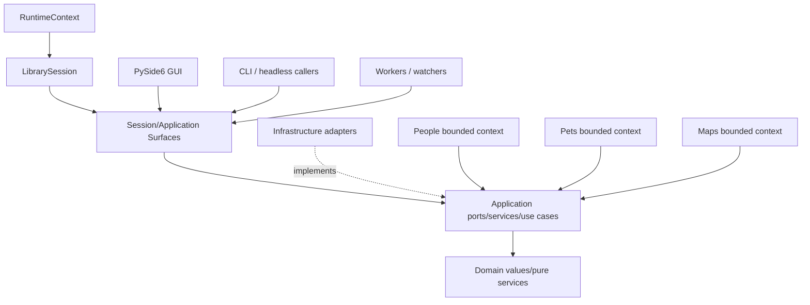

# Architecture vNext

This document describes the current production architecture of iPhotron. The
application is a library-scoped modular desktop monolith: one process-level
`RuntimeContext` owns at most one active `LibrarySession`, and GUI, CLI,
watchers, and workers enter behavior through application/session surfaces rather
than legacy facades.

Completed migration records and verification history live under
`docs/finished/refactor/vnext-2026-06/`.

## Status

- Production runtime code does not import `iPhoto.legacy` or
  `iPhoto.models.*`.
- The removed compatibility application tree is not a production extension
  point.
- `RuntimeContext -> LibrarySession` is the active library entry path.
- Application ports/services define the boundary used by GUI, CLI, workers,
  People, Pets, Maps, Edit, thumbnails, scanning, and lifecycle operations.
- Desktop presentation composition is owned by `DesktopCoordinatorRuntime`.
  `gui/coordinators/main_coordinator.py` is a compatibility import only.
- Gallery-to-Detail rendering uses one GPU-first production path. Static
  Detail/Edit share source surfaces, GPU residency, and immutable edit state.
- People/Pets inference is feature-driven, not an application-startup task.
- Architecture guardrails are enforced by `tools/check_architecture.py` and
  `tests/architecture`.

## Product Principles

- **Folder-native library.** The filesystem remains the album structure; no
  import step is required.
- **Local-first runtime.** Library state lives under `<LibraryRoot>/.iPhoto/`.
- **Non-destructive editing.** Visual edits persist as `.ipo` sidecars.
- **Explicit metadata write-back.** Assign Location saves local state first,
  then best-effort writes GPS metadata through ExifTool.
- **Rebuildable facts vs durable choices.** Scan rows, caches, thumbnails,
  People runtime snapshots, Pets runtime snapshots, and Live Photo
  materialization can be rebuilt. Favorites, hidden/trash state, pinned state,
  album order, manual metadata, People names/groups/manual faces/covers, and
  Pets names/covers/hidden/rejected decisions are durable.
- **Optional bounded contexts.** People AI, Pets AI, and Maps native/runtime
  extensions degrade gracefully when absent.
- **Cross-platform desktop first.** macOS, Windows, and Linux are supported via
  runtime adapters and platform-specific rendering choices.

## Architecture Shape


```mermaid
graph TB
    RuntimeContext[RuntimeContext] --> LibrarySession[LibrarySession]
    LibrarySession --> SessionSurfaces[Session/Application Surfaces]

    GUI[PySide6 GUI] --> SessionSurfaces
    CLI[CLI / headless callers] --> SessionSurfaces
    Workers[Workers / watchers] --> SessionSurfaces

    SessionSurfaces --> Application[Application ports/services/use cases]
    Application --> Domain[Domain values/pure services]

    Infrastructure[Infrastructure adapters] -.implements.-> Application
    People[People bounded context] --> Application
    Pets[Pets bounded context] --> Application
    Maps[Maps bounded context] --> Application
```

Allowed dependency direction:

```text
gui -> bootstrap/runtime -> application -> domain
infrastructure -> application ports / domain values
bounded contexts -> application ports / domain values
```

Forbidden dependency direction:

```text
domain -> application/gui/infrastructure
application -> gui/concrete cache/concrete infrastructure
infrastructure/cache/core/io/library/people/pets -> gui
production runtime -> iPhoto.legacy
production runtime -> iPhoto.models.*
```

## Runtime Contract

`RuntimeContext` is the process composition root. It owns process-level
settings, translation/theme, recent-library state, the current library runtime,
and the active `LibrarySession` lifecycle.

`LibrarySession` owns library-scoped adapters and exposes application-facing
surfaces, including:

```text
assets / asset_queries / asset_state
album_metadata / scans / asset_lifecycle / asset_operations
thumbnails
people / pets
maps / map_interactions
edit
locations
shutdown()
```

Headless callers create the same library boundary rather than a parallel data
model. GUI widgets may receive presentation-safe empty People/Pets services
before a library exists, but those objects must not open repositories or become
second sources of truth.

## Desktop Composition And Startup

The installed GUI entry is `iPhoto.entrypoint:main`. `iPhoto.entrypoint` stays
lightweight so helper dispatch can occur before importing the full Qt desktop
runtime.

The desktop has distinct startup boundaries:

1. configure startup/runtime environment;
2. create `QApplication`, `RuntimeContext`, and the lightweight main-window
   shell;
3. construct any platform-required pre-show GPU surface;
4. call `show()` and reach first paint;
5. promote/bind deferred feature bundles and create the desktop coordinator
   graph without moving optional heavy work back onto the first-frame path.

`DesktopCoordinatorRuntime` in
`iPhoto.gui.coordinators.desktop_coordinator_runtime` is the production desktop
composition root. It owns the coordinator graph, feature promotion/binding, and
presentation coordination. A separate production `MainCoordinator` is not part
of the architecture; `main_coordinator.py` only preserves compatibility imports.

`Ui_MainWindow.ensure_feature()` owns on-demand feature bundle lifetime. A
feature can be created before or after first paint depending on platform/Qt
surface constraints, but optional feature construction must not silently
reintroduce model initialization or unrelated blocking work into first paint.

### Recognition startup contract

`RecognitionCoordinator` is deliberately lazy.

- It can bind People/Pets services and warm an existing dashboard snapshot
  without initializing inference models.
- Opening a library or completing metadata scan does **not** by itself start
  People/Pets model inference.
- Recognition scans are requested only after both conditions are true:
  1. the People surface has actually been shown;
  2. that surface reports its first viewport ready.
- The coordinator then schedules scan activation after a short quiet window so
  cover/first-content delivery is not immediately competing with AI work.

This feature-driven rule supersedes older documentation that described People
and Pets workers as automatic post-startup or post-metadata-scan tasks.

## Layer Boundaries

### Domain

`domain/` owns dataclasses, value objects, query models, and pure services. It
must not own Qt, SQLite, filesystem writes, ExifTool, FFmpeg, or process runtime
singletons.

### Application

`application/` owns workflow use cases, services, DTOs, queries, events, and
port protocols. It depends on ports/domain values, not GUI widgets or concrete
persistence implementations.

Representative ports include:

| Port | Responsibility |
| --- | --- |
| `AssetRepositoryPort` | asset query/count/scan merge/state persistence semantics |
| `LibraryStateRepositoryPort` | durable library user-state boundary |
| `MediaScannerPort` | media discovery and normalized scan candidates |
| `PeopleIndexPort` | People candidate/snapshot/query boundary |
| `PetIndexPort` | Pets candidate/snapshot boundary |
| `MapRuntimePort` | optional Maps runtime availability/adapter selection |
| `MapInteractionServicePort` | marker/map interaction semantics |
| `EditSidecarPort` | `.ipo` read/write boundary |
| `ThumbnailRendererPort` | thumbnail generation without GUI ownership |

### Infrastructure

`infrastructure/` owns concrete SQLite, manifest, sidecar, ExifTool/FFmpeg,
scanner, thumbnail, and Maps runtime adapters. It implements application ports
and must not import GUI modules or own product workflow decisions.

### Library runtime

`library/` contains the production runtime controller and tree/watch/scan/trash
shell code bound to the active session. It does not recreate old manager/facade
architectures.

### GUI

`gui/` owns PySide6 presentation: views, widgets, viewmodels, controllers,
coordinators, menus, Qt task/signal adapters, and rendering presentation state.
Durable workflow decisions remain behind session/application surfaces.

The desktop coordinator graph is decomposed by responsibility. In particular,
recognition coordination is kept separate from Gallery, navigation, Detail,
Edit, and other feature coordinators. Compatibility filenames must not be used
to infer ownership when the exported production type has moved.

## Large-Library Query And Scan Contracts

Large-library browsing is SQL-first and windowed.

- Collection/query models describe collection intent and bounded pages/windows.
- Gallery models use bounded sparse asynchronous windows rather than
  materializing an entire library.
- Direct row lookup uses repository/query surfaces rather than scanning the
  in-memory model.
- Gallery tile/delegate access remains memory-only on paint paths.
- Viewport demand separates visible, guard, speculative, and micro-thumbnail
  work; stale generations are discarded.
- Normal Gallery-visible rows must be thumbnail-ready and carry a non-empty
  `thumb_cache_key`; stale/pending/failed/no-key rows belong to repair/backfill
  paths.
- Scan publishing occurs after database commit through `ScanBatchCommitted`.
  Do not restore historical `scanChunkReady` transport as the production UI
  update path.
- Scan merge remains idempotent and preserves durable user state.

Historical scan-performance call graphs are not architecture references. New
performance work must profile the current scanner/application/index-store path.

## Rendering And Edit Boundary

`DetailRenderCoordinator` owns the active still/video render transaction and its
terminal state. Still scheduling deduplicates source revision/decode level and
platform decoders return detached neutral RGBA8888/sRGB surfaces.

`PhotoRenderSessionHandle` shares the current source texture/LOD state,
`ColorStats`, and immutable `EditRenderState` between Detail and Edit. Sidecar
persistence enters through the session edit surface and is not part of the
neutral source cache key.

Platform rendering choices remain adapter/presentation concerns:

- macOS: QRhi/Metal preferred for media preview; ImageIO may decode non-RAW
  stills; OpenGL/Qt are compatibility paths.
- Windows: QRhi/OpenGL with WIC preference for non-RAW still decode.
- Linux: QRhi/OpenGL with Qt still decode.
- RAW: rawpy path.

## Bounded Contexts

### People

`people/` owns optional face detection/clustering, People repositories,
rebuildable runtime snapshot, durable People state, manual faces, groups,
covers, hidden state, and service API.

### Pets

`pets/` owns optional YOLOX/DINOv2 detection and pet identity clustering,
rebuildable Pets runtime state, durable Pets user state, and the Pet service.
People and Pets can be composed in the dashboard/groups while their runtime
records and durable stores remain independently owned.

The current clustering pipeline is `species-bounded-single-link-v3`:

- clustering is species-separated;
- cannot-link constraints prevent known-incompatible detections from joining;
- single-link candidate growth is bounded by cluster-diameter constraints to
  prevent uncontrolled chaining;
- stable identity/canonicalization logic preserves durable user choices across
  rebuilds where contracts are compatible.

People/Pets overlap arbitration is geometry-based but not an unconditional
“People always wins” rule. Strong face overlap normally suppresses a pet
candidate. A substantially larger plausible pet-body box that contains a
smaller face may be preserved under the runtime size/image-coverage exception.
See `misc/PETS_RECOGNITION_RUNTIME.md` for the detailed thresholds and lifecycle.

Production Pets inference does not execute arbitrary Torch Hub Python. Release
conversion/provenance tooling may use a pinned source revision to produce a
TorchScript artifact. Runtime trust is the prebuilt artifact plus manifest
hash/size validation. If the manifest has `torchscript_url: null`, runtime
documentation must treat DINOv2 as package/prestage-provided rather than promise
a download that cannot occur.

### Maps

`src/maps` owns optional offline map runtime, OBF/native helper/widget
integration, search, and map rendering internals. Maps availability is a runtime
capability and must not decide whether the rest of the desktop can start.

## Persistence Model

Each library root owns `.iPhoto/` state:

| Path | Ownership |
| --- | --- |
| `.iPhoto/global_index.db` | asset index/state including independent `face_status` and `pet_status` |
| `.iPhoto/links.json` | derived Live Photo compatibility materialization |
| `.iPhoto/cache/thumbs/` | rebuildable thumbnail cache |
| `.iPhoto/cache/detail-surfaces/v3/` | rebuildable neutral Detail surfaces |
| `.iPhoto/faces/face_index.db` | rebuildable People runtime snapshot |
| `.iPhoto/faces/face_state.db` | durable People user decisions |
| `.iPhoto/faces/thumbnails/` | rebuildable face crops |
| `.iPhoto/pets/pet_index.db` | rebuildable Pets detection/identity snapshot |
| `.iPhoto/pets/pet_state.db` | durable Pets names/covers/hidden/rejected/redirect state |
| `.iPhoto/pets/thumbnails/` | rebuildable pet crops subject to cover references |
| `.ipo` sidecars beside media | durable non-destructive edit parameters |

Runtime snapshot replacement must not erase the durable state stores.

## Model And Packaging Boundary

Optional model assets are packaging inputs, not architecture-owned source data.
`src/extension/models/...` is a staging convention used by build scripts and is
not guaranteed tracked content in a fresh clone.

- People-capable packages explicitly include the People runtime/models they
  claim to support.
- Pets-capable packages explicitly include `pets-ai` dependencies and the
  required model artifacts for offline behavior.
- The YOLOX detector has a fixed artifact download/integrity contract.
- DINOv2 uses the manifest-declared TorchScript artifact. With the current null
  runtime URL, offline/package staging is the canonical delivery path.
- AppImage and Debian reproducible build contracts are documented under
  `docs/misc/BUILD_APPIMAGE.md` and `docs/misc/BUILD_DEB.md`.
- A published Flatpak artifact does not imply an in-repository reproducible
  Flatpak build; see `docs/misc/BUILD_FLATPAK.md`.

## Internationalization

User-visible GUI text goes through Qt translation helpers with stable contexts.
Long-lived widgets provide `retranslate_ui()` behavior, and runtime language
changes refresh the UI without rebuilding the active library session. Business
logic uses stable ids/callbacks/data rather than translated labels.

Bundled language resources live under `src/iPhoto/resources/i18n/`. The current
long-term guardrail is `misc/I18N_UI_TEXT_GUARDRAILS.md`.

## Documentation Authority

For current production behavior, prefer sources in this order:

1. runtime code and tests;
2. this architecture document and `AGENT.md`;
3. active guardrails under `docs/misc/`;
4. active requirements/runbooks under `docs/requirements/`;
5. historical/superseded requirement documents;
6. archived material under `docs/finished/`.

`docs/requirements/README.md` defines lifecycle/status rules. Historical design
text must be explicitly labelled and must not silently override current runtime
contracts.
