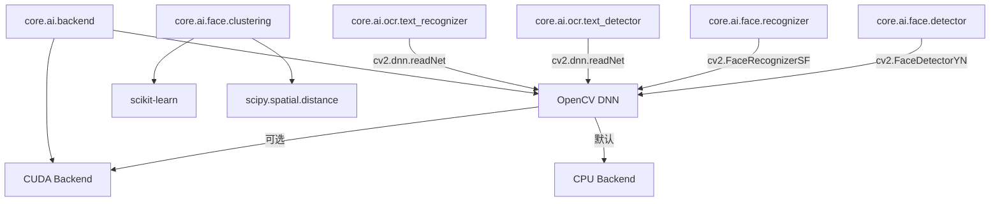
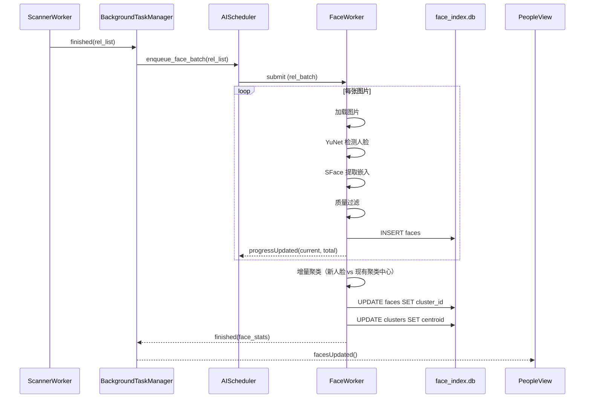
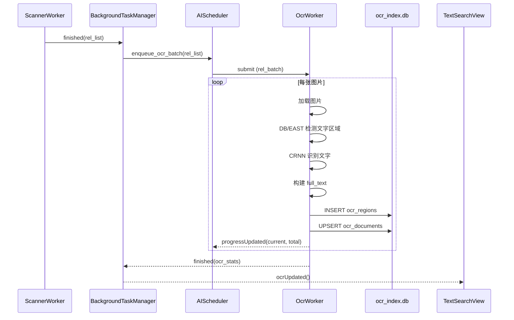
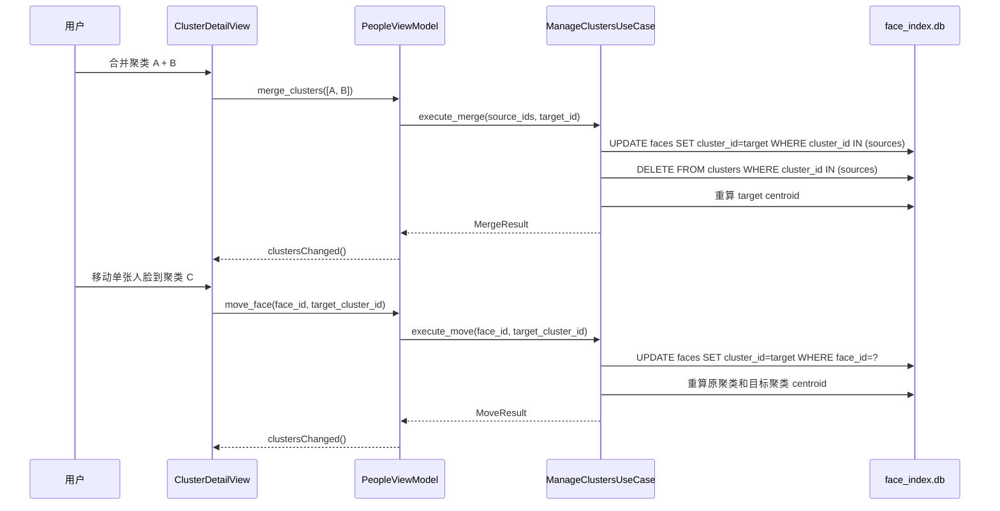
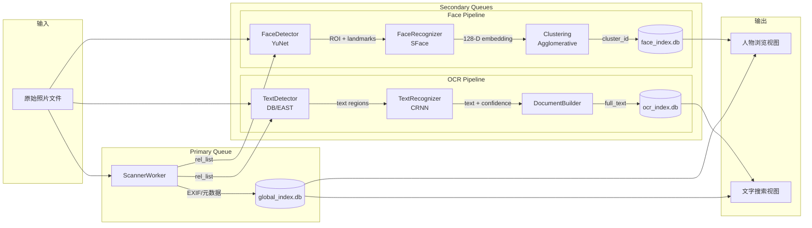
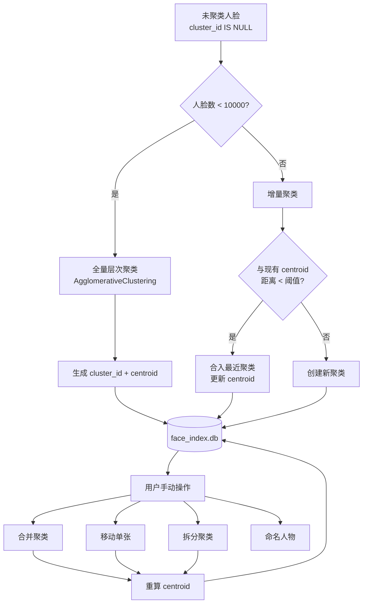

# 🛠 iPhotron — 人脸识别 & OCR 文字识别 开发文档

> **版本**: 1.0.0
> **日期**: 2026-02-13
> **状态**: Draft
> **模块**: Face Recognition & OCR Indexing

---

## 目录 / Table of Contents

1. [文件结构 / File Structure](#1-文件结构--file-structure)
2. [模块依赖 / Dependencies](#2-模块依赖--dependencies)
3. [信号流 / Signal Flow](#3-信号流--signal-flow)
4. [数据流 / Data Flow](#4-数据流--data-flow)
5. [人脸识别开发指南 / Face Recognition Dev Guide](#5-人脸识别开发指南--face-recognition-dev-guide)
   - 5.1 [检测与嵌入 / Detection & Embedding](#51-检测与嵌入--detection--embedding)
   - 5.2 [聚类 / Clustering](#52-聚类--clustering)
   - 5.3 [聚类管理操作 / Cluster Management](#53-聚类管理操作--cluster-management)
6. [OCR 开发指南 / OCR Dev Guide](#6-ocr-开发指南--ocr-dev-guide)
   - 6.1 [文字检测与识别 / Text Detection & Recognition](#61-文字检测与识别--text-detection--recognition)
   - 6.2 [文字搜图 / Text-based Image Search](#62-文字搜图--text-based-image-search)
7. [Worker 与队列实现 / Worker & Queue Implementation](#7-worker-与队列实现--worker--queue-implementation)
8. [CUDA 后端集成 / CUDA Backend Integration](#8-cuda-后端集成--cuda-backend-integration)
9. [测试计划 / Test Plan](#9-测试计划--test-plan)
10. [测试集 / Test Dataset](#10-测试集--test-dataset)

---

## 1. 文件结构 / File Structure

以下为新增和修改的文件，遵循项目现有 DDD + MVVM 分层架构：

```
src/iPhoto/
├── core/
│   └── ai/                                  # 新增：AI 核心算法层
│       ├── __init__.py
│       ├── backend.py                       # CUDA/CPU 后端探测与切换
│       ├── model_manager.py                 # DNN 模型加载/缓存（单例）
│       ├── face/
│       │   ├── __init__.py
│       │   ├── detector.py                  # YuNet 人脸检测器
│       │   ├── recognizer.py                # SFace 嵌入提取器
│       │   ├── aligner.py                   # 5 点仿射对齐
│       │   ├── quality.py                   # 质量过滤（模糊/侧脸/低分辨率）
│       │   └── clustering.py                # 层次聚类 + 增量聚类
│       └── ocr/
│           ├── __init__.py
│           ├── text_detector.py             # DB/EAST 文字检测
│           ├── text_recognizer.py           # CRNN 文字识别
│           └── document_builder.py          # 区域合并 → full_text
│
├── cache/
│   └── index_store/
│       ├── face_repository.py               # 新增：face_index.db CRUD
│       ├── face_engine.py                   # 新增：face DB 连接管理
│       ├── ocr_repository.py                # 新增：ocr_index.db CRUD
│       └── ocr_engine.py                    # 新增：ocr DB 连接管理
│
├── domain/
│   └── models/
│       └── ai.py                            # 新增：Face, Cluster, Person, OcrRegion 领域模型
│
├── application/
│   ├── use_cases/
│   │   ├── process_faces.py                 # 新增：人脸处理用例
│   │   ├── manage_clusters.py               # 新增：聚类管理用例（合并/拆分/移动）
│   │   ├── process_ocr.py                   # 新增：OCR 处理用例
│   │   └── search_by_text.py                # 新增：文字搜图用例
│   └── services/
│       ├── face_service.py                  # 新增：人脸业务服务
│       └── ocr_service.py                   # 新增：OCR 业务服务
│
├── library/
│   └── workers/
│       ├── face_worker.py                   # 新增：人脸处理 QRunnable Worker
│       ├── ocr_worker.py                    # 新增：OCR 处理 QRunnable Worker
│       └── ai_scheduler.py                  # 新增：次队列公平调度器
│
├── gui/
│   ├── viewmodels/
│   │   ├── people_viewmodel.py              # 新增：人物/聚类视图模型
│   │   └── text_search_viewmodel.py         # 新增：文字搜图视图模型
│   └── ui/
│       ├── people_view.py                   # 新增：人物浏览视图
│       ├── cluster_detail_view.py           # 新增：聚类详情视图
│       └── text_search_view.py              # 新增：文字搜索视图
│
├── di/
│   └── container.py                         # 修改：注册 AI 相关服务
│
└── config.py                                # 修改：新增 AI 相关配置常量

tests/
├── core/
│   └── ai/
│       ├── test_face_detector.py
│       ├── test_face_recognizer.py
│       ├── test_clustering.py
│       ├── test_text_detector.py
│       ├── test_text_recognizer.py
│       └── test_backend.py
├── cache/
│   ├── test_face_repository.py
│   └── test_ocr_repository.py
├── application/
│   ├── test_process_faces.py
│   ├── test_manage_clusters.py
│   ├── test_process_ocr.py
│   └── test_search_by_text.py
└── fixtures/
    └── ai/
        ├── faces/                           # 测试用人脸图片
        ├── text_images/                     # 测试用含文字图片
        └── models/                          # 测试用小型模型
```

---

## 2. 模块依赖 / Dependencies

### 2.1 新增依赖

| 包名 | 版本 | 用途 | 必需 |
|------|------|------|------|
| `opencv-python-headless` | ≥ 4.10 | 人脸检测/OCR（已存在于项目） | ✅ |
| `opencv-contrib-python` | ≥ 4.10 | 扩展模块（FaceRecognizerSF 等） | 可选 |
| `scikit-learn` | ≥ 1.4 | AgglomerativeClustering 层次聚类 | ✅ |
| `scipy` | ≥ 1.12 | 余弦距离矩阵计算 | ✅ |

### 2.2 可选依赖（CUDA 加速）

| 包名 | 说明 |
|------|------|
| `opencv-python-headless` 编译带 CUDA | 或使用 `opencv-contrib-python` 的 CUDA 构建 |
| NVIDIA CUDA Toolkit ≥ 11.8 | GPU 驱动支持 |
| cuDNN ≥ 8.6 | DNN 加速库 |

### 2.3 依赖关系图



---

## 3. 信号流 / Signal Flow

### 3.1 人脸处理信号流



### 3.2 OCR 处理信号流



### 3.3 聚类管理信号流



---

## 4. 数据流 / Data Flow

### 4.1 端到端数据流全景



### 4.2 人脸嵌入数据格式

```python
# 嵌入向量存储格式
import numpy as np

embedding: np.ndarray  # shape=(128,), dtype=np.float32

# 序列化到 SQLite BLOB
blob: bytes = embedding.tobytes()           # 512 bytes

# 从 BLOB 反序列化
embedding = np.frombuffer(blob, dtype=np.float32)  # shape=(128,)

# 余弦相似度计算
from scipy.spatial.distance import cosine
similarity = 1 - cosine(emb_a, emb_b)       # 1.0 = 完全相同
```

### 4.3 聚类数据流



---

## 5. 人脸识别开发指南 / Face Recognition Dev Guide

### 5.1 检测与嵌入 / Detection & Embedding

#### 5.1.1 FaceDetector 类

```python
# src/iPhoto/core/ai/face/detector.py

class FaceDetector:
    """基于 OpenCV YuNet 的人脸检测器"""

    def __init__(self, model_path: Path, backend: DnnBackend):
        self._detector = cv2.FaceDetectorYN.create(
            str(model_path),
            "",
            (320, 320),
            score_threshold=0.7,
            nms_threshold=0.3,
            top_k=5000,
            backend_id=backend.backend_id,
            target_id=backend.target_id,
        )

    def detect(self, image: np.ndarray) -> list[FaceROI]:
        """
        检测图像中的人脸。

        Args:
            image: BGR 格式的 numpy 数组

        Returns:
            FaceROI 列表，每个包含归一化 bbox、confidence、landmarks
        """
        h, w = image.shape[:2]
        self._detector.setInputSize((w, h))
        _, faces = self._detector.detect(image)

        if faces is None:
            return []

        results = []
        for face in faces:
            x, y, fw, fh = face[0:4]
            conf = face[-1]
            landmarks = face[4:14].reshape(5, 2)

            results.append(FaceROI(
                bbox_x=x / w, bbox_y=y / h,
                bbox_w=fw / w, bbox_h=fh / h,
                confidence=float(conf),
                landmarks=[(lx / w, ly / h) for lx, ly in landmarks],
            ))
        return results
```

#### 5.1.2 FaceRecognizer 类

```python
# src/iPhoto/core/ai/face/recognizer.py

class FaceRecognizer:
    """基于 OpenCV SFace 的人脸嵌入提取器"""

    def __init__(self, model_path: Path, backend: DnnBackend):
        self._recognizer = cv2.FaceRecognizerSF.create(
            str(model_path), "",
            backend_id=backend.backend_id,
            target_id=backend.target_id,
        )

    def extract_embedding(
        self, image: np.ndarray, face_roi: FaceROI
    ) -> np.ndarray:
        """
        提取 128-D 人脸嵌入向量。

        Args:
            image: 原始 BGR 图像
            face_roi: 检测到的人脸区域

        Returns:
            L2 归一化的 128-D float32 向量
        """
        h, w = image.shape[:2]
        face_array = np.array([
            face_roi.bbox_x * w, face_roi.bbox_y * h,
            face_roi.bbox_w * w, face_roi.bbox_h * h,
            *[c * s for lm in face_roi.landmarks for c, s in zip(lm, (w, h))],
        ], dtype=np.float32)

        aligned = self._recognizer.alignCrop(image, face_array)
        embedding = self._recognizer.feature(aligned)
        return embedding.flatten()
```

#### 5.1.3 质量过滤

```python
# src/iPhoto/core/ai/face/quality.py

class QualityFilter:
    """人脸质量评估"""

    MIN_SIZE = 48        # 最小人脸尺寸（像素）
    BLUR_THRESHOLD = 100  # 拉普拉斯方差阈值
    YAW_THRESHOLD = 45    # 偏转角阈值（度）

    def evaluate(
        self, image: np.ndarray, roi: FaceROI
    ) -> list[str]:
        """
        返回质量标记列表。

        Returns:
            如 ['low_quality', 'blurry'] 或空列表（质量合格）
        """
        flags = []
        h, w = image.shape[:2]
        face_w = roi.bbox_w * w
        face_h = roi.bbox_h * h

        if face_w < self.MIN_SIZE or face_h < self.MIN_SIZE:
            flags.append("low_quality")

        # 模糊检测
        x1, y1 = int(roi.bbox_x * w), int(roi.bbox_y * h)
        x2, y2 = int(x1 + face_w), int(y1 + face_h)
        face_crop = image[y1:y2, x1:x2]
        if face_crop.size > 0:
            gray = cv2.cvtColor(face_crop, cv2.COLOR_BGR2GRAY)
            variance = cv2.Laplacian(gray, cv2.CV_64F).var()
            if variance < self.BLUR_THRESHOLD:
                flags.append("blurry")

        # 侧脸检测（基于关键点）
        if roi.landmarks and len(roi.landmarks) >= 3:
            left_eye, right_eye, nose = roi.landmarks[:3]
            eye_center_x = (left_eye[0] + right_eye[0]) / 2
            nose_x = nose[0]
            eye_dist = abs(right_eye[0] - left_eye[0])
            if eye_dist > 0:
                yaw_ratio = abs(nose_x - eye_center_x) / eye_dist
                if yaw_ratio > 0.5:  # 近似 >45 度
                    flags.append("side_face")

        return flags
```

---

### 5.2 聚类 / Clustering

#### 5.2.1 全量聚类

```python
# src/iPhoto/core/ai/face/clustering.py

from sklearn.cluster import AgglomerativeClustering
from scipy.spatial.distance import cosine
import numpy as np
import uuid

class FaceClusterer:
    """人脸聚类引擎"""

    FULL_CLUSTER_THRESHOLD = 10_000
    DEFAULT_DISTANCE_THRESHOLD = 0.40

    def cluster_full(
        self,
        embeddings: np.ndarray,
        distance_threshold: float = DEFAULT_DISTANCE_THRESHOLD,
    ) -> np.ndarray:
        """
        全量层次聚类。

        Args:
            embeddings: shape (N, 128) 的嵌入矩阵
            distance_threshold: 聚类距离阈值

        Returns:
            shape (N,) 的聚类标签数组
        """
        if len(embeddings) < 2:
            return np.zeros(len(embeddings), dtype=int)

        clustering = AgglomerativeClustering(
            n_clusters=None,
            metric="cosine",
            linkage="average",
            distance_threshold=distance_threshold,
        )
        return clustering.fit_predict(embeddings)

    def cluster_incremental(
        self,
        new_embeddings: np.ndarray,
        existing_centroids: dict[str, np.ndarray],
        distance_threshold: float = DEFAULT_DISTANCE_THRESHOLD,
    ) -> dict[int, str]:
        """
        增量聚类：新嵌入与现有中心比较。

        Args:
            new_embeddings: shape (M, 128)
            existing_centroids: {cluster_id: centroid_vector}
            distance_threshold: 距离阈值

        Returns:
            {新嵌入索引: cluster_id} 映射，未匹配的值为新生成的 UUID
        """
        assignments: dict[int, str] = {}
        centroid_ids = list(existing_centroids.keys())
        centroid_matrix = np.array(list(existing_centroids.values()))

        for i, emb in enumerate(new_embeddings):
            if len(centroid_matrix) == 0:
                new_id = str(uuid.uuid4())
                assignments[i] = new_id
                centroid_ids.append(new_id)
                centroid_matrix = (
                    np.vstack([centroid_matrix, emb.reshape(1, -1)])
                    if centroid_matrix.size else emb.reshape(1, -1)
                )
                continue

            distances = [cosine(emb, c) for c in centroid_matrix]
            min_idx = int(np.argmin(distances))
            min_dist = distances[min_idx]

            if min_dist < distance_threshold:
                assignments[i] = centroid_ids[min_idx]
            else:
                new_id = str(uuid.uuid4())
                assignments[i] = new_id
                centroid_ids.append(new_id)
                centroid_matrix = np.vstack(
                    [centroid_matrix, emb.reshape(1, -1)]
                )

        return assignments

    @staticmethod
    def compute_centroid(embeddings: np.ndarray) -> np.ndarray:
        """计算聚类中心向量（L2 归一化的均值）"""
        centroid = embeddings.mean(axis=0)
        norm = np.linalg.norm(centroid)
        if norm > 0:
            centroid /= norm
        return centroid
```

---

### 5.3 聚类管理操作 / Cluster Management

#### 5.3.1 合并聚类

```python
# src/iPhoto/application/use_cases/manage_clusters.py（部分）

class MergeClustersUseCase:
    """合并两个或多个聚类"""

    def __init__(self, face_repo: FaceRepository):
        self._repo = face_repo

    def execute(
        self, source_cluster_ids: list[str], target_cluster_id: str
    ) -> MergeResult:
        """
        将 source 聚类中的所有人脸合并到 target 聚类。

        步骤:
        1. 更新所有 source 人脸的 cluster_id → target
        2. 删除 source clusters 记录
        3. 重算 target 聚类中心向量
        4. 更新 target face_count
        """
        with self._repo.transaction():
            # 移动人脸
            for src_id in source_cluster_ids:
                if src_id == target_cluster_id:
                    continue
                self._repo.reassign_faces(src_id, target_cluster_id)
                self._repo.delete_cluster(src_id)

            # 重算中心向量
            embeddings = self._repo.get_cluster_embeddings(target_cluster_id)
            new_centroid = FaceClusterer.compute_centroid(embeddings)
            face_count = len(embeddings)
            self._repo.update_cluster_centroid(
                target_cluster_id, new_centroid, face_count
            )

        return MergeResult(
            target_cluster_id=target_cluster_id,
            merged_count=len(source_cluster_ids) - 1,
            total_faces=face_count,
        )
```

#### 5.3.2 移动单张人脸

```python
class MoveFaceUseCase:
    """移动单张人脸到目标聚类"""

    def __init__(self, face_repo: FaceRepository):
        self._repo = face_repo

    def execute(
        self, face_id: str, target_cluster_id: str
    ) -> MoveResult:
        """
        步骤:
        1. 获取人脸当前 cluster_id
        2. 更新人脸 cluster_id → target
        3. 重算原聚类中心向量和 face_count
        4. 重算目标聚类中心向量和 face_count
        5. 如果原聚类变空，标记为 deleted
        """
        face = self._repo.get_face(face_id)
        old_cluster_id = face.cluster_id

        with self._repo.transaction():
            self._repo.update_face_cluster(face_id, target_cluster_id)

            # 重算目标聚类
            target_embs = self._repo.get_cluster_embeddings(target_cluster_id)
            self._repo.update_cluster_centroid(
                target_cluster_id,
                FaceClusterer.compute_centroid(target_embs),
                len(target_embs),
            )

            # 重算原聚类
            if old_cluster_id:
                old_embs = self._repo.get_cluster_embeddings(old_cluster_id)
                if len(old_embs) == 0:
                    self._repo.mark_cluster_deleted(old_cluster_id)
                else:
                    self._repo.update_cluster_centroid(
                        old_cluster_id,
                        FaceClusterer.compute_centroid(old_embs),
                        len(old_embs),
                    )

        return MoveResult(
            face_id=face_id,
            from_cluster=old_cluster_id,
            to_cluster=target_cluster_id,
        )
```

#### 5.3.3 拆分聚类

```python
class SplitClusterUseCase:
    """对选中聚类使用更严格阈值重新聚类"""

    def execute(
        self, cluster_id: str, stricter_threshold: float = 0.25
    ) -> SplitResult:
        """
        步骤:
        1. 获取聚类内所有人脸嵌入
        2. 使用更严格阈值重新运行层次聚类
        3. 为新子聚类创建记录
        4. 更新人脸 cluster_id
        5. 标记原聚类为 deleted
        """
        embeddings = self._repo.get_cluster_embeddings(cluster_id)
        face_ids = self._repo.get_cluster_face_ids(cluster_id)

        labels = self._clusterer.cluster_full(
            embeddings, distance_threshold=stricter_threshold
        )

        new_clusters = {}
        with self._repo.transaction():
            for label in set(labels):
                new_id = str(uuid.uuid4())
                mask = labels == label
                cluster_embs = embeddings[mask]
                centroid = FaceClusterer.compute_centroid(cluster_embs)
                self._repo.create_cluster(new_id, centroid, int(mask.sum()))
                new_clusters[label] = new_id

                for face_id in np.array(face_ids)[mask]:
                    self._repo.update_face_cluster(face_id, new_id)

            self._repo.mark_cluster_deleted(cluster_id)

        return SplitResult(
            original_cluster_id=cluster_id,
            new_cluster_ids=list(new_clusters.values()),
        )
```

---

## 6. OCR 开发指南 / OCR Dev Guide

### 6.1 文字检测与识别 / Text Detection & Recognition

#### 6.1.1 TextDetector 类

```python
# src/iPhoto/core/ai/ocr/text_detector.py

class TextDetector:
    """基于 OpenCV DNN 的文字检测器（DB 模型）"""

    def __init__(self, model_path: Path, backend: DnnBackend):
        self._net = cv2.dnn.readNet(str(model_path))
        self._net.setPreferableBackend(backend.backend_id)
        self._net.setPreferableTarget(backend.target_id)
        self._confidence_threshold = 0.5

    def detect(self, image: np.ndarray) -> list[TextRegion]:
        """
        检测图像中的文字区域。

        Returns:
            TextRegion 列表，包含归一化 bbox 和旋转角度
        """
        h, w = image.shape[:2]
        blob = cv2.dnn.blobFromImage(
            image, 1.0 / 255.0, (736, 736),
            mean=(122.67891434, 116.66876762, 104.00698793),
        )
        self._net.setInput(blob)
        output = self._net.forward()

        # 后处理：二值化 → 轮廓检测 → 最小外接旋转矩形
        regions = self._postprocess(output, w, h)
        return [r for r in regions if r.confidence >= self._confidence_threshold]
```

#### 6.1.2 TextRecognizer 类

```python
# src/iPhoto/core/ai/ocr/text_recognizer.py

class TextRecognizer:
    """基于 CRNN 的文字识别器"""

    def __init__(self, model_path: Path, backend: DnnBackend):
        self._net = cv2.dnn.readNet(str(model_path))
        self._net.setPreferableBackend(backend.backend_id)
        self._net.setPreferableTarget(backend.target_id)

    def recognize(
        self, image: np.ndarray, region: TextRegion
    ) -> RecognitionResult:
        """
        识别文字区域中的内容。

        Returns:
            RecognitionResult(text, confidence, lang)
        """
        # 裁剪并透视变换文字区域
        cropped = self._crop_region(image, region)
        # 预处理: 灰度 → 缩放到固定高度 32px
        processed = self._preprocess(cropped)

        blob = cv2.dnn.blobFromImage(processed)
        self._net.setInput(blob)
        output = self._net.forward()

        # CTC 解码
        text, confidence = self._ctc_decode(output)
        lang = self._detect_language(text)

        return RecognitionResult(
            text=text,
            confidence=confidence,
            lang=lang,
        )
```

#### 6.1.3 DocumentBuilder

```python
# src/iPhoto/core/ai/ocr/document_builder.py

class DocumentBuilder:
    """将多个文字区域合并为完整文档"""

    def build(self, regions: list[RecognizedRegion]) -> Document:
        """
        按阅读顺序（从上到下，从左到右）合并文字区域。

        排序规则:
        1. 按 y 坐标分组（y 差值 < 阈值视为同行）
        2. 同行内按 x 坐标排序
        3. 行间用换行符分隔，同行用空格分隔
        """
        if not regions:
            return Document(full_text="", region_count=0)

        # 按 y 坐标排序并分行
        sorted_regions = sorted(regions, key=lambda r: (r.bbox_y, r.bbox_x))
        lines: list[list[RecognizedRegion]] = []
        current_line: list[RecognizedRegion] = [sorted_regions[0]]

        for region in sorted_regions[1:]:
            if abs(region.bbox_y - current_line[0].bbox_y) < 0.02:
                current_line.append(region)
            else:
                lines.append(sorted(current_line, key=lambda r: r.bbox_x))
                current_line = [region]
        lines.append(sorted(current_line, key=lambda r: r.bbox_x))

        full_text = "\n".join(
            " ".join(r.text for r in line) for line in lines
        )
        confidences = [r.confidence for r in regions]
        primary_lang = self._majority_lang(regions)

        return Document(
            full_text=full_text,
            region_count=len(regions),
            avg_confidence=sum(confidences) / len(confidences),
            primary_lang=primary_lang,
        )
```

### 6.2 文字搜图 / Text-based Image Search

#### 6.2.1 搜索用例

```python
# src/iPhoto/application/use_cases/search_by_text.py

class SearchByTextUseCase:
    """根据文字内容搜索图片"""

    def __init__(self, ocr_repo: OcrRepository, asset_repo: AssetRepository):
        self._ocr_repo = ocr_repo
        self._asset_repo = asset_repo

    def execute(self, query: str, limit: int = 50) -> list[SearchResult]:
        """
        执行文字搜索。

        策略:
        1. 优先使用 FTS5 全文搜索（精确匹配 + 分词）
        2. FTS5 无结果时回退到 LIKE 模糊匹配
        3. 结果通过 rel 关联主库获取资产信息
        """
        # FTS5 搜索
        fts_results = self._ocr_repo.search_fts(query, limit)

        if not fts_results:
            # 回退到 LIKE
            fts_results = self._ocr_repo.search_like(query, limit)

        if not fts_results:
            return []

        # 关联主库获取资产元数据
        rels = [r.rel for r in fts_results]
        assets = self._asset_repo.get_assets_by_rels(rels)
        asset_map = {a["rel"]: a for a in assets}

        return [
            SearchResult(
                rel=r.rel,
                matched_text=r.snippet,
                confidence=r.avg_confidence,
                asset=asset_map.get(r.rel),
            )
            for r in fts_results
            if r.rel in asset_map
        ]
```

#### 6.2.2 OcrRepository 搜索方法

```python
# src/iPhoto/cache/index_store/ocr_repository.py（部分）

class OcrRepository:
    def search_fts(self, query: str, limit: int = 50) -> list[FtsMatch]:
        """FTS5 全文搜索"""
        sql = """
            SELECT d.rel,
                   snippet(ocr_fts, 0, '<<', '>>', '...', 32) AS snippet,
                   d.avg_confidence,
                   rank
            FROM ocr_fts fts
            JOIN ocr_documents d ON fts.rowid = d.rowid
            WHERE ocr_fts MATCH ?
            ORDER BY rank
            LIMIT ?
        """
        rows = self._execute(sql, (query, limit))
        return [FtsMatch(**r) for r in rows]

    def search_like(self, query: str, limit: int = 50) -> list[FtsMatch]:
        """LIKE 模糊搜索（FTS5 回退方案）"""
        sql = """
            SELECT rel, full_text AS snippet, avg_confidence, 0 AS rank
            FROM ocr_documents
            WHERE full_text LIKE ?
            ORDER BY avg_confidence DESC
            LIMIT ?
        """
        rows = self._execute(sql, (f"%{query}%", limit))
        return [FtsMatch(**r) for r in rows]
```

---

## 7. Worker 与队列实现 / Worker & Queue Implementation

### 7.1 FaceWorker

```python
# src/iPhoto/library/workers/face_worker.py

class FaceWorkerSignals(QObject):
    progressUpdated = Signal(int, int)        # (current, total)
    chunkReady = Signal(list)                 # [face_dict, ...]
    finished = Signal(dict)                   # {face_count, cluster_count, errors}
    error = Signal(str)

class FaceWorker(QRunnable):
    """人脸检测+嵌入+入库 Worker"""

    BATCH_SIZE = 10

    def __init__(
        self,
        rel_list: list[str],
        library_root: Path,
        signals: FaceWorkerSignals,
    ):
        super().__init__()
        self.setAutoDelete(True)
        self._rels = rel_list
        self._library_root = library_root
        self._signals = signals
        self._is_cancelled = False

    def run(self) -> None:
        try:
            detector = ModelManager.instance().get_face_detector()
            recognizer = ModelManager.instance().get_face_recognizer()
            quality = QualityFilter()
            repo = FaceRepository(self._library_root)
            total = len(self._rels)

            new_faces = []
            for i, rel in enumerate(self._rels):
                if self._is_cancelled:
                    break

                image_path = self._library_root / rel
                if not image_path.exists():
                    repo.log_process(rel, "skipped")
                    continue

                try:
                    image = cv2.imread(str(image_path))
                    if image is None:
                        repo.log_process(rel, "error", error_msg="无法读取图片")
                        continue

                    rois = detector.detect(image)
                    for roi in rois:
                        flags = quality.evaluate(image, roi)
                        embedding = None
                        if "low_quality" not in flags:
                            embedding = recognizer.extract_embedding(image, roi)

                        face = repo.insert_face(rel, roi, embedding, flags)
                        if embedding is not None:
                            new_faces.append(face)

                    repo.log_process(rel, "done", face_count=len(rois))

                except Exception as e:
                    repo.log_process(rel, "error", error_msg=str(e))

                self._signals.progressUpdated.emit(i + 1, total)

            # 增量聚类
            if new_faces:
                clusterer = FaceClusterer()
                existing = repo.get_all_centroids()
                embeddings = np.array([f.embedding for f in new_faces])
                assignments = clusterer.cluster_incremental(
                    embeddings, existing
                )
                repo.apply_cluster_assignments(new_faces, assignments)

            self._signals.finished.emit({
                "face_count": len(new_faces),
                "processed": total,
            })

        except Exception as e:
            self._signals.error.emit(str(e))

    def cancel(self) -> None:
        self._is_cancelled = True
```

### 7.2 OcrWorker

```python
# src/iPhoto/library/workers/ocr_worker.py

class OcrWorkerSignals(QObject):
    progressUpdated = Signal(int, int)
    finished = Signal(dict)
    error = Signal(str)

class OcrWorker(QRunnable):
    """OCR 文字识别+入库 Worker"""

    def __init__(
        self,
        rel_list: list[str],
        library_root: Path,
        signals: OcrWorkerSignals,
    ):
        super().__init__()
        self.setAutoDelete(True)
        self._rels = rel_list
        self._library_root = library_root
        self._signals = signals
        self._is_cancelled = False

    def run(self) -> None:
        try:
            text_detector = ModelManager.instance().get_text_detector()
            text_recognizer = ModelManager.instance().get_text_recognizer()
            doc_builder = DocumentBuilder()
            repo = OcrRepository(self._library_root)
            total = len(self._rels)

            for i, rel in enumerate(self._rels):
                if self._is_cancelled:
                    break

                image_path = self._library_root / rel
                if not image_path.exists():
                    repo.log_process(rel, "skipped")
                    continue

                try:
                    image = cv2.imread(str(image_path))
                    if image is None:
                        repo.log_process(rel, "error", error_msg="无法读取图片")
                        continue

                    regions = text_detector.detect(image)
                    recognized = []
                    for region in regions:
                        result = text_recognizer.recognize(image, region)
                        recognized.append(RecognizedRegion(
                            region=region, text=result.text,
                            confidence=result.confidence, lang=result.lang,
                        ))

                    repo.insert_regions(rel, recognized)

                    if recognized:
                        doc = doc_builder.build(recognized)
                        repo.upsert_document(rel, doc)

                    repo.log_process(
                        rel, "done", region_count=len(recognized)
                    )

                except Exception as e:
                    repo.log_process(rel, "error", error_msg=str(e))

                self._signals.progressUpdated.emit(i + 1, total)

            self._signals.finished.emit({"processed": total})

        except Exception as e:
            self._signals.error.emit(str(e))

    def cancel(self) -> None:
        self._is_cancelled = True
```

### 7.3 AIScheduler — 公平调度器

```python
# src/iPhoto/library/workers/ai_scheduler.py

import threading
from collections import deque
from PySide6.QtCore import QThreadPool, QObject, Signal

class AIScheduler(QObject):
    """
    次队列公平调度器。

    职责:
    - 维护 Face 和 OCR 两个 FIFO 队列
    - 加权轮询 (WRR) 分配共享线程
    - 背压控制（队列长度上限）
    - 资源监控（内存使用率）
    """

    MAX_QUEUE_LENGTH = 1000
    MEMORY_PAUSE_THRESHOLD = 0.80
    MEMORY_RESUME_THRESHOLD = 0.70

    queueStatus = Signal(str, int)  # (queue_name, pending_count)

    def __init__(self, thread_pool: QThreadPool, max_workers: int = 2):
        super().__init__()
        self._pool = thread_pool
        self._max_workers = max_workers
        self._active_workers = 0
        self._lock = threading.Lock()

        self._face_queue: deque[list[str]] = deque()
        self._ocr_queue: deque[list[str]] = deque()
        self._face_weight = 1
        self._ocr_weight = 1
        self._rr_counter = 0

    def enqueue_face_batch(self, rels: list[str]) -> None:
        """将一批 rel 加入人脸处理队列"""
        with self._lock:
            if len(self._face_queue) >= self.MAX_QUEUE_LENGTH:
                return  # 背压: 丢弃
            self._face_queue.append(rels)
            self.queueStatus.emit("face", len(self._face_queue))
        self._try_dispatch()

    def enqueue_ocr_batch(self, rels: list[str]) -> None:
        """将一批 rel 加入 OCR 处理队列"""
        with self._lock:
            if len(self._ocr_queue) >= self.MAX_QUEUE_LENGTH:
                return
            self._ocr_queue.append(rels)
            self.queueStatus.emit("ocr", len(self._ocr_queue))
        self._try_dispatch()

    def _try_dispatch(self) -> None:
        """尝试从队列中取出任务并提交到线程池"""
        with self._lock:
            while self._active_workers < self._max_workers:
                batch, queue_type = self._pick_next()
                if batch is None:
                    break
                self._active_workers += 1
                self._submit_worker(batch, queue_type)

    def _pick_next(self) -> tuple[list[str] | None, str]:
        """加权轮询选择下一个队列"""
        self._adjust_weights()

        for _ in range(self._face_weight + self._ocr_weight):
            self._rr_counter += 1
            if self._rr_counter <= self._face_weight:
                if self._face_queue:
                    return self._face_queue.popleft(), "face"
            else:
                if self._ocr_queue:
                    return self._ocr_queue.popleft(), "ocr"

            if self._rr_counter >= self._face_weight + self._ocr_weight:
                self._rr_counter = 0

        return None, ""

    def _adjust_weights(self) -> None:
        """根据积压量动态调整权重"""
        fl, ol = len(self._face_queue), len(self._ocr_queue)
        if fl > ol * 2:
            self._face_weight, self._ocr_weight = 2, 1
        elif ol > fl * 2:
            self._face_weight, self._ocr_weight = 1, 2
        else:
            self._face_weight, self._ocr_weight = 1, 1

    def _on_worker_finished(self, queue_type: str) -> None:
        """Worker 完成后回调"""
        with self._lock:
            self._active_workers -= 1
        self._try_dispatch()
```

---

## 8. CUDA 后端集成 / CUDA Backend Integration

```python
# src/iPhoto/core/ai/backend.py

import cv2
import logging

logger = logging.getLogger(__name__)

class DnnBackend:
    """DNN 推理后端配置"""

    def __init__(self, backend_id: int, target_id: int, name: str):
        self.backend_id = backend_id
        self.target_id = target_id
        self.name = name

    def __repr__(self) -> str:
        return f"DnnBackend({self.name})"


_cached_backend: DnnBackend | None = None


def detect_backend() -> DnnBackend:
    """
    探测最优 DNN 后端。

    优先级: CUDA > CPU
    结果缓存为单例。
    """
    global _cached_backend
    if _cached_backend is not None:
        return _cached_backend

    try:
        if cv2.cuda.getCudaEnabledDeviceCount() > 0:
            _cached_backend = DnnBackend(
                cv2.dnn.DNN_BACKEND_CUDA,
                cv2.dnn.DNN_TARGET_CUDA,
                "CUDA",
            )
            logger.info("CUDA backend detected, using GPU acceleration")
        else:
            raise RuntimeError("No CUDA device")
    except Exception:
        _cached_backend = DnnBackend(
            cv2.dnn.DNN_BACKEND_OPENCV,
            cv2.dnn.DNN_TARGET_CPU,
            "CPU",
        )
        logger.info("CUDA not available, falling back to CPU backend")

    return _cached_backend


def get_cpu_fallback() -> DnnBackend:
    """获取 CPU 回退后端（用于 GPU OOM 等异常情况）"""
    return DnnBackend(
        cv2.dnn.DNN_BACKEND_OPENCV,
        cv2.dnn.DNN_TARGET_CPU,
        "CPU (fallback)",
    )
```

### 8.1 GPU 互斥锁

```python
# src/iPhoto/core/ai/backend.py（续）

import threading

_gpu_lock = threading.Lock()
_GPU_TIMEOUT = 30  # 秒


def acquire_gpu(timeout: float = _GPU_TIMEOUT) -> bool:
    """
    尝试获取 GPU 互斥锁。

    Returns:
        True 获取成功，False 超时
    """
    return _gpu_lock.acquire(timeout=timeout)


def release_gpu() -> None:
    """释放 GPU 互斥锁"""
    try:
        _gpu_lock.release()
    except RuntimeError:
        pass  # 未持有锁时忽略
```

---

## 9. 测试计划 / Test Plan

### 9.1 单元测试

| 测试文件 | 测试对象 | 关键用例 |
|---------|---------|---------|
| `test_face_detector.py` | `FaceDetector` | 无人脸图片返回空列表；多人脸图片返回正确数量；bbox 归一化值域 [0,1] |
| `test_face_recognizer.py` | `FaceRecognizer` | 嵌入向量 shape=(128,)；同一人两张照片余弦距离 < 0.3；不同人 > 0.5 |
| `test_clustering.py` | `FaceClusterer` | 全量聚类：2 人 10 张正确分为 2 组；增量聚类：新人脸匹配已有聚类；阈值调整影响聚类数 |
| `test_quality.py` | `QualityFilter` | 小人脸标记 `low_quality`；模糊人脸标记 `blurry`；侧脸标记 `side_face` |
| `test_text_detector.py` | `TextDetector` | 有文字图片检测到区域；无文字图片返回空列表；中英文均可检测 |
| `test_text_recognizer.py` | `TextRecognizer` | 英文识别准确率 > 80%；中文识别准确率 > 70%；置信度范围 [0,1] |
| `test_document_builder.py` | `DocumentBuilder` | 阅读顺序正确（从上到下，从左到右）；空区域返回空文档 |
| `test_backend.py` | `detect_backend` | 无 CUDA 返回 CPU 后端；结果缓存（第二次调用不重新探测） |

### 9.2 集成测试

| 测试文件 | 测试对象 | 关键用例 |
|---------|---------|---------|
| `test_face_repository.py` | `FaceRepository` | 插入/查询/更新人脸记录；聚类分配持久化；process_log 记录 |
| `test_ocr_repository.py` | `OcrRepository` | 插入/查询文字区域；FTS5 全文搜索；LIKE 回退搜索 |
| `test_process_faces.py` | `FaceWorker` 端到端 | 一批图片 → 人脸检测 → 嵌入 → 入库 → 增量聚类 |
| `test_process_ocr.py` | `OcrWorker` 端到端 | 一批图片 → 文字检测 → 识别 → full_text 入库 |
| `test_manage_clusters.py` | 聚类管理用例 | 合并两个聚类 → 验证 centroid 更新；移动单张 → 验证双向 centroid 重算 |
| `test_search_by_text.py` | `SearchByTextUseCase` | FTS5 命中 → 返回关联资产；无 FTS5 命中 → LIKE 回退；空查询返回空 |

### 9.3 性能测试

| 场景 | 数据量 | 目标指标 |
|------|--------|---------|
| 人脸检测吞吐 (CPU) | 100 张 2000px 图片 | ≥ 2 张/秒 |
| 人脸检测吞吐 (GPU) | 100 张 2000px 图片 | ≥ 5 张/秒 |
| 全量聚类 | 10,000 个 128-D 向量 | ≤ 30 秒 |
| FTS5 搜索延迟 | 100,000 文档库 | ≤ 50ms |
| 增量聚类 | 100 新向量 vs 10,000 现有 | ≤ 2 秒 |

---

## 10. 测试集 / Test Dataset

### 10.1 人脸测试集

| 数据集 | 说明 | 用途 |
|--------|------|------|
| `fixtures/ai/faces/single/` | 5 张仅含 1 个人脸的图片 | 基础检测测试 |
| `fixtures/ai/faces/multi/` | 5 张含 2-5 个人脸的图片 | 多人脸检测 |
| `fixtures/ai/faces/no_face/` | 5 张无人脸的图片（风景/物品） | 空结果测试 |
| `fixtures/ai/faces/person_A/` | 同一人 10 张不同角度/光照的照片 | 聚类正确性 |
| `fixtures/ai/faces/person_B/` | 另一人 10 张照片 | 聚类区分度 |
| `fixtures/ai/faces/edge_cases/` | 模糊、侧脸、低分辨率、遮挡 | 质量过滤测试 |

### 10.2 OCR 测试集

| 数据集 | 说明 | 用途 |
|--------|------|------|
| `fixtures/ai/text_images/english/` | 5 张含英文文字的图片 | 英文识别 |
| `fixtures/ai/text_images/chinese/` | 5 张含中文文字的图片 | 中文识别 |
| `fixtures/ai/text_images/mixed/` | 5 张中英混合文字图片 | 混合语言 |
| `fixtures/ai/text_images/no_text/` | 5 张无文字图片 | 空结果测试 |
| `fixtures/ai/text_images/dense/` | 含大量文字的截图/文档照片 | 阅读顺序测试 |
| `fixtures/ai/text_images/rotated/` | 旋转/倾斜文字 | 旋转矩形检测 |

### 10.3 测试数据要求

- 所有测试图片须为**免版权**或项目自行拍摄
- 人脸测试图片须确保**无隐私风险**（建议使用 AI 生成的人脸或公开数据集如 LFW 的子集）
- 图片尺寸覆盖：`640×480`（低分辨率）、`1920×1080`（标准）、`4000×3000`（高分辨率）
- 格式覆盖：JPEG、PNG、HEIC（通过 pillow-heif 支持）
