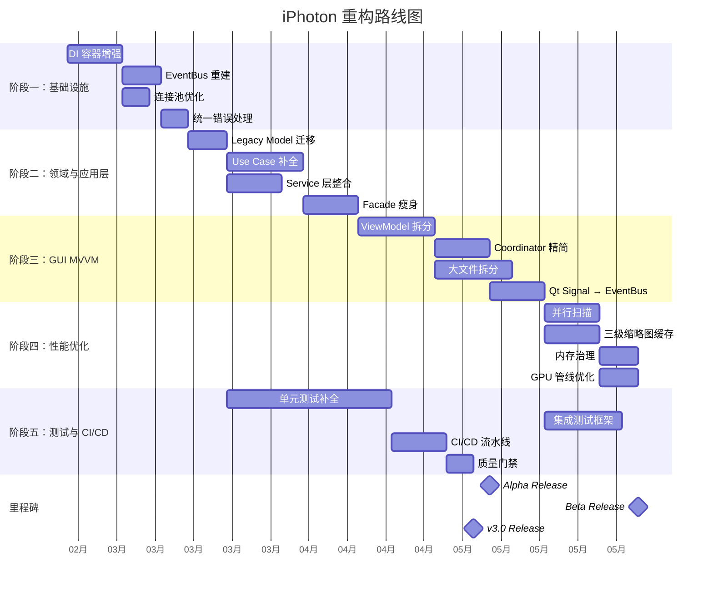
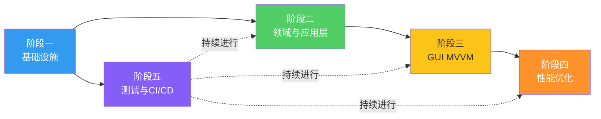
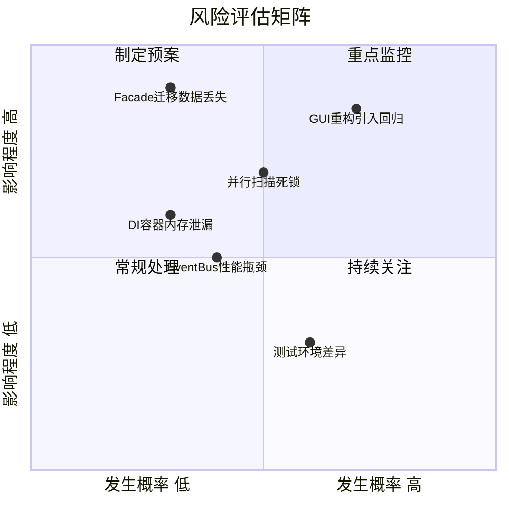
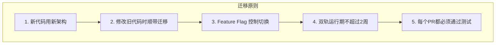
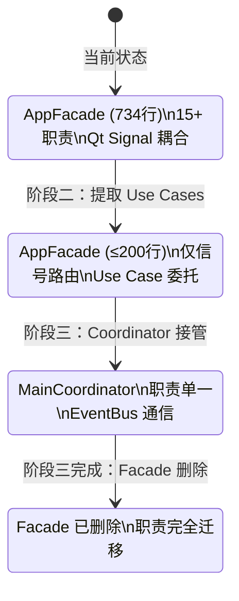

# 04 — 重构路线图

> 5 阶段分步实施计划，从基础设施到质量体系逐步演进。

---

## 1. 总体路线图



---

## 2. 阶段概览

### 2.1 五阶段摘要

| 阶段 | 名称 | 时间 | 核心目标 | 风险等级 |
|------|------|------|---------|---------|
| **一** | [基础设施](./05-phase1-infrastructure.md) | 3-4周 | DI + EventBus + 连接池 + 错误处理 | 🟢 低 |
| **二** | [领域与应用层](./06-phase2-domain-application.md) | 4-5周 | 消除双重模型 + Use Case 补全 + Facade 瘦身 | 🟠 中 |
| **三** | [GUI MVVM](./07-phase3-gui-mvvm.md) | 4-5周 | ViewModel 拆分 + 大文件治理 + Qt 解耦 | 🔴 高 |
| **四** | [性能优化](./08-phase4-performance.md) | 3-4周 | 并行扫描 + 三级缓存 + 内存治理 | 🟠 中 |
| **五** | [测试与 CI/CD](./09-phase5-testing-ci.md) | 持续 | 测试覆盖 ≥80% + CI 流水线 + 质量门禁 | 🟢 低 |

### 2.2 依赖关系



---

## 3. 各阶段关键里程碑

### 3.1 阶段一完成标准

- [ ] DI 容器支持 Singleton/Transient/Scoped 生命周期
- [ ] DI 容器支持循环依赖检测
- [ ] EventBus 支持同步/异步事件发布
- [ ] EventBus 支持事件订阅与取消
- [ ] 连接池线程安全且通过压力测试
- [ ] 统一错误处理框架就绪
- [ ] 所有新增代码测试覆盖 ≥90%

### 3.2 阶段二完成标准

- [ ] `models/album.py` 已废弃，所有代码使用 `domain/models/`
- [ ] 至少 11 个 Use Case 已实现
- [ ] `AppFacade` 行数 ≤200行（从734行削减）
- [ ] GUI Services 中的业务逻辑已迁移到 Application Services
- [ ] CLI 和 GUI 通过同一组 Use Case 工作

### 3.3 阶段三完成标准

- [ ] 所有 ViewModel 为纯 Python 类（无 QObject 继承）
- [ ] Coordinator 数量 ≤15个，每个 ≤200行
- [ ] 所有超过 300行的文件已拆分
- [ ] Qt Signal 仅用于 View ↔ ViewModel 的 UI 更新
- [ ] 跨层通信 100% 通过 EventBus

### 3.4 阶段四完成标准

- [ ] 10K 文件扫描时间 ≤30秒
- [ ] UI 阻塞时间 ≤200ms
- [ ] 缩略图 L1 缓存命中率 ≥70%
- [ ] 内存峰值 ≤2GB (100K 文件相册)

### 3.5 阶段五完成标准

- [ ] 单元测试覆盖率 ≥80%
- [ ] 集成测试覆盖所有 Use Case
- [ ] CI 流水线自动运行 lint + test + type check
- [ ] 质量门禁阻止覆盖率下降的 PR

---

## 4. 风险管理

### 4.1 风险矩阵



### 4.2 缓解策略

| 风险 | 缓解策略 |
|------|---------|
| GUI 重构引入回归 | Feature Flag 逐步切换；双轨运行期保留 Legacy 路径 |
| Facade 迁移数据丢失 | 数据库备份策略；Use Case 事务性保证 |
| EventBus 性能瓶颈 | 压力测试（10K events/s）；批量事件合并 |
| 并行扫描死锁 | 连接池 + 超时机制；WAL 模式 SQLite |

### 4.3 回滚策略

每个阶段设置 **Feature Flag**，支持快速回滚：

```python
# settings/feature_flags.py
class FeatureFlags:
    USE_NEW_DI_CONTAINER = True      # 阶段一
    USE_EVENT_BUS = True             # 阶段一
    USE_UNIFIED_MODELS = False       # 阶段二
    USE_NEW_FACADE = False           # 阶段二
    USE_MVVM_VIEWMODELS = False      # 阶段三
    USE_PARALLEL_SCAN = False        # 阶段四
    USE_THREE_TIER_CACHE = False     # 阶段四
```

---

## 5. 迁移策略

### 5.1 增量迁移原则



### 5.2 Facade 迁移路径



---

## 6. 验收标准总览

| 维度 | 指标 | 目标 |
|------|------|------|
| **架构** | God Object 数量 | 0 |
| **架构** | 最大文件行数 | ≤300行 |
| **架构** | Qt 渗透层数 | 1层（仅 View） |
| **覆盖** | Use Case 覆盖率 | 100% |
| **覆盖** | DI 覆盖率 | ≥95% |
| **覆盖** | EventBus 使用率 | 100% |
| **质量** | 单元测试覆盖率 | ≥80% |
| **质量** | 集成测试覆盖 | 所有 Use Case |
| **性能** | 扫描速度 (10K) | ≤30秒 |
| **性能** | UI 阻塞 | ≤200ms |
| **性能** | 内存峰值 (100K) | ≤2GB |
