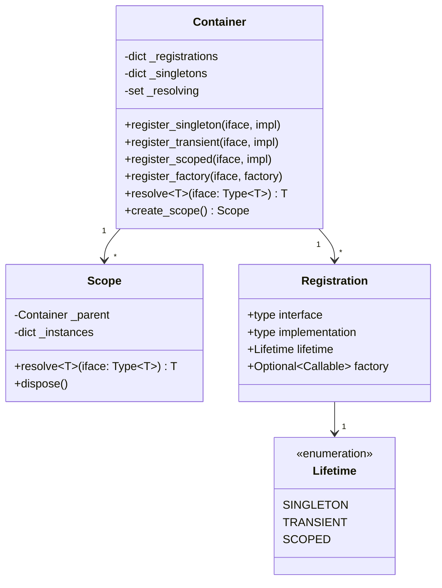
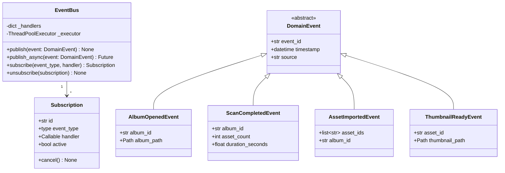
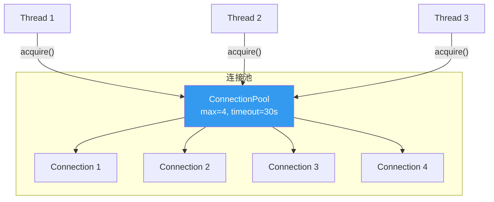
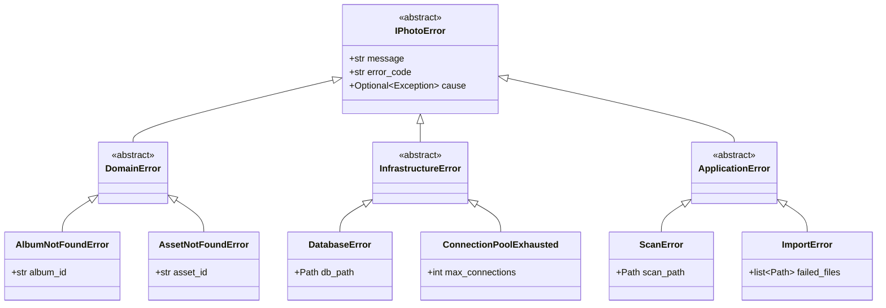

# 05 — 阶段一：基础设施层重构

> 目标：增强 DI 容器、重建 EventBus、优化连接池、建立统一错误处理。  
> 时间：3-4 周  
> 风险：🟢 低（不影响现有功能）

---

## 1. DI 容器增强

### 1.1 当前问题

**文件**: `src/iPhoto/di/container.py` (~44行)

```
问题清单:
1. 无生命周期管理 — 所有依赖每次 resolve 都创建新实例
2. 无循环依赖检测 — A→B→A 导致无限递归 / 栈溢出
3. Lambda 闭包陷阱 — factory 在注册时捕获参数，非解析时
4. 无惰性初始化 — 无法延迟创建开销大的对象
5. 无类型检查 — resolve 返回 Any，无 IDE 提示
```

### 1.2 目标设计



### 1.3 实施步骤

#### Step 1: 增加生命周期枚举

```python
# src/iPhoto/di/lifetime.py
from enum import Enum

class Lifetime(Enum):
    SINGLETON = "singleton"   # 全局唯一实例
    TRANSIENT = "transient"   # 每次创建新实例
    SCOPED = "scoped"         # 每个作用域内唯一
```

#### Step 2: 增强 Container 类

```python
# src/iPhoto/di/container.py (目标实现)
class Container:
    def __init__(self):
        self._registrations: dict[type, Registration] = {}
        self._singletons: dict[type, Any] = {}
        self._resolving: set[type] = set()  # 循环依赖检测

    def register_singleton(self, interface: type, implementation: type, **kwargs):
        self._registrations[interface] = Registration(
            interface=interface,
            implementation=implementation,
            lifetime=Lifetime.SINGLETON,
            kwargs=kwargs
        )

    def register_transient(self, interface: type, implementation: type, **kwargs):
        self._registrations[interface] = Registration(
            interface=interface,
            implementation=implementation,
            lifetime=Lifetime.TRANSIENT,
            kwargs=kwargs
        )

    def resolve(self, interface: type[T]) -> T:
        # 循环依赖检测
        if interface in self._resolving:
            chain = " → ".join(t.__name__ for t in self._resolving)
            raise CircularDependencyError(
                f"循环依赖: {chain} → {interface.__name__}"
            )

        self._resolving.add(interface)
        try:
            reg = self._registrations.get(interface)
            if reg is None:
                raise ResolutionError(f"未注册: {interface.__name__}")

            if reg.lifetime == Lifetime.SINGLETON:
                if interface not in self._singletons:
                    self._singletons[interface] = self._create(reg)
                return self._singletons[interface]

            return self._create(reg)
        finally:
            self._resolving.discard(interface)
```

#### Step 3: 迁移现有注册

```python
# 渐进式迁移：保持旧 API 兼容
class Container:
    # 保留旧方法 (deprecated)
    def register(self, interface, factory, *args, **kwargs):
        warnings.warn("Use register_singleton/register_transient", DeprecationWarning)
        self.register_singleton(interface, factory, **kwargs)
```

### 1.4 测试要求

```python
# tests/di/test_container.py
def test_singleton_returns_same_instance(): ...
def test_transient_returns_new_instance(): ...
def test_circular_dependency_raises_error(): ...
def test_unregistered_raises_resolution_error(): ...
def test_factory_registration(): ...
def test_scoped_lifetime(): ...
```

---

## 2. EventBus 重建

### 2.1 当前问题

```
文件: src/iPhoto/events/bus.py (~50行)
问题:
1. ThreadPoolExecutor 硬编码 max_workers=4
2. 无事件排序保证
3. 异常仅打日志，无重试
4. 无订阅取消机制
5. 已创建但从未在业务中使用
```

### 2.2 目标设计



### 2.3 实施步骤

#### Step 1: 定义事件基类

```python
# src/iPhoto/events/domain_events.py
from dataclasses import dataclass, field
from datetime import datetime
from uuid import uuid4

@dataclass(frozen=True)
class DomainEvent:
    event_id: str = field(default_factory=lambda: str(uuid4()))
    timestamp: datetime = field(default_factory=datetime.now)
    source: str = ""
```

#### Step 2: 定义具体事件

```python
# src/iPhoto/events/album_events.py
@dataclass(frozen=True)
class AlbumOpenedEvent(DomainEvent):
    album_id: str = ""
    album_path: str = ""

@dataclass(frozen=True)
class ScanProgressEvent(DomainEvent):
    album_id: str = ""
    processed: int = 0
    total: int = 0

@dataclass(frozen=True)
class ScanCompletedEvent(DomainEvent):
    album_id: str = ""
    asset_count: int = 0
    duration_seconds: float = 0.0
```

#### Step 3: 增强 EventBus

```python
# src/iPhoto/events/bus.py (目标实现)
class EventBus:
    def __init__(self, max_workers: int = 4):
        self._handlers: dict[type, list[Subscription]] = defaultdict(list)
        self._executor = ThreadPoolExecutor(max_workers=max_workers)
        self._lock = threading.Lock()

    def subscribe(self, event_type: type, handler: Callable) -> Subscription:
        sub = Subscription(event_type=event_type, handler=handler)
        with self._lock:
            self._handlers[event_type].append(sub)
        return sub

    def unsubscribe(self, subscription: Subscription) -> None:
        subscription.active = False
        with self._lock:
            handlers = self._handlers.get(subscription.event_type, [])
            self._handlers[subscription.event_type] = [
                h for h in handlers if h.active
            ]

    def publish(self, event: DomainEvent) -> None:
        handlers = self._handlers.get(type(event), [])
        for sub in handlers:
            if sub.active:
                try:
                    sub.handler(event)
                except Exception as e:
                    logger.error(f"EventBus handler error: {e}", exc_info=True)

    def publish_async(self, event: DomainEvent) -> list[Future]:
        futures = []
        handlers = self._handlers.get(type(event), [])
        for sub in handlers:
            if sub.active:
                future = self._executor.submit(sub.handler, event)
                futures.append(future)
        return futures
```

#### Step 4: 在 DI 中注册 EventBus

```python
# src/iPhoto/di/bootstrap.py
def bootstrap(container: Container):
    container.register_singleton(EventBus, EventBus, max_workers=4)
```

### 2.4 Qt 桥接适配器

为保持向后兼容，提供 Qt Signal 桥接：

```python
# src/iPhoto/gui/adapters/qt_event_bridge.py
class QtEventBridge(QObject):
    """将 EventBus 事件转发为 Qt Signal，确保 UI 线程安全"""

    album_opened = Signal(str)  # album_id
    scan_completed = Signal(str, int)  # album_id, asset_count

    def __init__(self, event_bus: EventBus):
        super().__init__()
        event_bus.subscribe(AlbumOpenedEvent, self._on_album_opened)
        event_bus.subscribe(ScanCompletedEvent, self._on_scan_completed)

    def _on_album_opened(self, event: AlbumOpenedEvent):
        # 确保在主线程触发 Signal
        QMetaObject.invokeMethod(
            self, "_emit_album_opened",
            Qt.QueuedConnection,
            Q_ARG(str, event.album_id)
        )
```

---

## 3. 连接池优化

### 3.1 目标设计



### 3.2 实施步骤

```python
# src/iPhoto/infrastructure/db/connection_pool.py (增强版)
class ConnectionPool:
    def __init__(self, db_path: Path, max_connections: int = 4, timeout: float = 30.0):
        self._db_path = db_path
        self._max = max_connections
        self._timeout = timeout
        self._pool: queue.Queue[sqlite3.Connection] = queue.Queue(maxsize=max_connections)
        self._lock = threading.Lock()
        self._created = 0

    @contextmanager
    def connection(self) -> Generator[sqlite3.Connection, None, None]:
        conn = self._acquire()
        try:
            yield conn
        except Exception:
            conn.rollback()
            raise
        else:
            conn.commit()
        finally:
            self._release(conn)

    def _acquire(self) -> sqlite3.Connection:
        try:
            return self._pool.get(timeout=self._timeout)
        except queue.Empty:
            with self._lock:
                if self._created < self._max:
                    conn = self._create_connection()
                    self._created += 1
                    return conn
            raise ConnectionPoolExhausted(
                f"连接池已满 ({self._max}), 等待超时 ({self._timeout}s)"
            )
```

---

## 4. 统一错误处理

### 4.1 错误层次设计



### 4.2 实施步骤

```python
# src/iPhoto/errors/base.py
class IPhotoError(Exception):
    """所有 iPhoton 错误的基类"""
    def __init__(self, message: str, error_code: str = "", cause: Exception | None = None):
        super().__init__(message)
        self.error_code = error_code
        self.cause = cause

# src/iPhoto/errors/domain.py
class DomainError(IPhotoError): ...
class AlbumNotFoundError(DomainError): ...
class AssetNotFoundError(DomainError): ...

# src/iPhoto/errors/infrastructure.py
class InfrastructureError(IPhotoError): ...
class DatabaseError(InfrastructureError): ...
class ConnectionPoolExhausted(InfrastructureError): ...
```

---

## 5. 阶段一检查清单

- [ ] **DI 容器**
  - [ ] 实现 `Lifetime` 枚举（Singleton / Transient / Scoped）
  - [ ] 实现循环依赖检测
  - [ ] 实现 `create_scope()` 作用域
  - [ ] 保留旧 API 兼容性（deprecated warning）
  - [ ] 编写 ≥6 个单元测试
- [ ] **EventBus**
  - [ ] 定义 `DomainEvent` 基类
  - [ ] 定义 ≥5 个具体事件类型
  - [ ] 实现 `subscribe()` / `unsubscribe()` / `publish()` / `publish_async()`
  - [ ] 实现 `QtEventBridge` 适配器
  - [ ] 编写 ≥8 个单元测试
- [ ] **连接池**
  - [ ] 实现上下文管理器 `connection()`
  - [ ] 实现超时 + 池满异常
  - [ ] 实现自动 commit/rollback
  - [ ] 编写 ≥4 个单元测试（含并发测试）
- [ ] **错误处理**
  - [ ] 定义 3 层错误层次（Domain / Infrastructure / Application）
  - [ ] 定义 ≥6 个具体错误类型
  - [ ] 在现有代码中替换 bare `except` 为具体类型
  - [ ] 编写 ≥4 个单元测试
