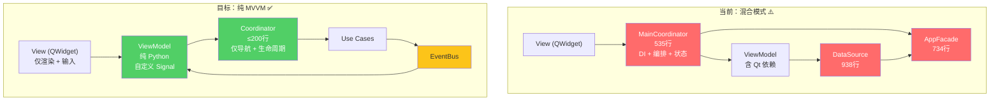
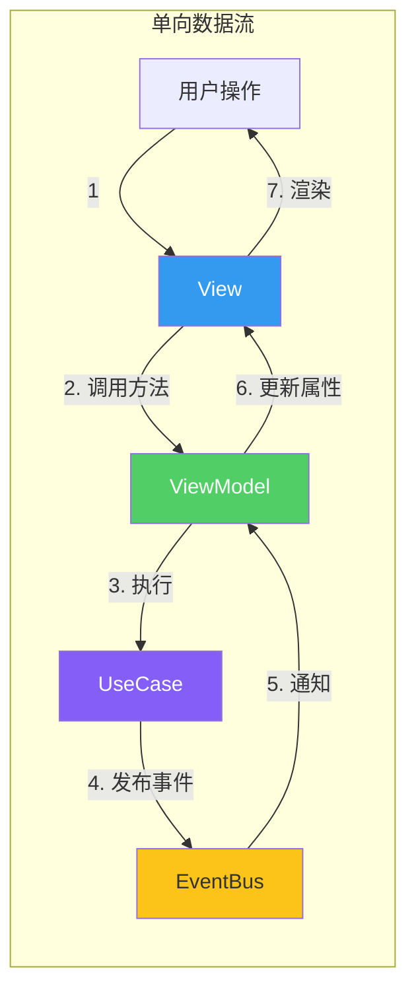
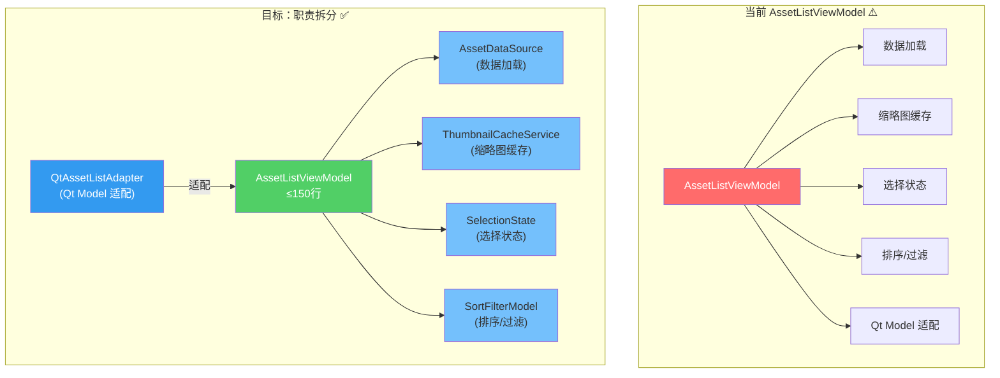
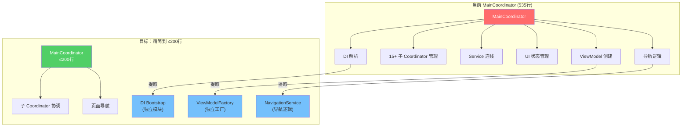
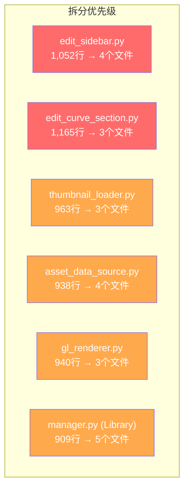
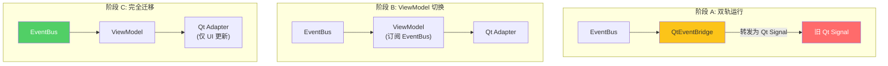

# 07 — 阶段三：GUI 层 MVVM 重构

> 目标：ViewModel 纯化、Coordinator 精简、大文件拆分、Qt Signal 解耦。  
> 时间：4-5 周  
> 风险：🔴 高（GUI 层变更最容易引入可见回归）  
> 前置：阶段一、阶段二完成

---

## 1. MVVM 模式落地

### 1.1 当前 vs 目标



### 1.2 数据流规范



**规则**:
1. View **不能** 直接调用 Use Case 或 Service
2. ViewModel **不能** 持有 Qt Widget 引用
3. Coordinator **不能** 包含业务逻辑
4. EventBus **不能** 传递 Qt 对象

---

## 2. ViewModel 纯化

### 2.1 自定义信号系统

为了让 ViewModel 脱离 Qt 依赖，引入纯 Python 信号机制：

```python
# src/iPhoto/gui/viewmodels/signal.py
class Signal:
    """纯 Python 信号 — 不依赖 Qt"""

    def __init__(self):
        self._handlers: list[Callable] = []

    def connect(self, handler: Callable) -> None:
        self._handlers.append(handler)

    def disconnect(self, handler: Callable) -> None:
        self._handlers.remove(handler)

    def emit(self, *args, **kwargs) -> None:
        for handler in self._handlers:
            handler(*args, **kwargs)


class ObservableProperty:
    """可观察属性 — ViewModel 数据绑定基础"""

    def __init__(self, initial_value=None):
        self._value = initial_value
        self.changed = Signal()

    @property
    def value(self):
        return self._value

    @value.setter
    def value(self, new_value):
        if self._value != new_value:
            old_value = self._value
            self._value = new_value
            self.changed.emit(new_value, old_value)
```

### 2.2 ViewModel 基类

```python
# src/iPhoto/gui/viewmodels/base.py
class BaseViewModel:
    """ViewModel 基类 — 纯 Python，无 Qt 依赖"""

    def __init__(self):
        self._subscriptions: list[Subscription] = []

    def subscribe_event(self, event_bus: EventBus, event_type: type, handler: Callable):
        sub = event_bus.subscribe(event_type, handler)
        self._subscriptions.append(sub)

    def dispose(self):
        """清理所有事件订阅"""
        for sub in self._subscriptions:
            sub.cancel()
        self._subscriptions.clear()
```

### 2.3 AssetListViewModel 重构



示例实现：

```python
# src/iPhoto/gui/viewmodels/asset_list_viewmodel.py (目标: ≤150行)
class AssetListViewModel(BaseViewModel):
    """资产列表 ViewModel — 纯 Python"""

    def __init__(
        self,
        data_source: AssetDataSource,
        thumbnail_cache: ThumbnailCacheService,
        event_bus: EventBus,
    ):
        super().__init__()
        self._data_source = data_source
        self._thumbnail_cache = thumbnail_cache

        # 可观察属性
        self.assets = ObservableProperty([])
        self.selected_indices = ObservableProperty([])
        self.loading = ObservableProperty(False)
        self.total_count = ObservableProperty(0)

        # 事件订阅
        self.subscribe_event(event_bus, ScanCompletedEvent, self._on_scan_completed)
        self.subscribe_event(event_bus, AssetImportedEvent, self._on_assets_imported)

    def load_album(self, album_id: str) -> None:
        self.loading.value = True
        assets = self._data_source.load_assets(album_id)
        self.assets.value = assets
        self.total_count.value = len(assets)
        self.loading.value = False

    def select(self, index: int) -> None:
        current = list(self.selected_indices.value)
        if index not in current:
            current.append(index)
        self.selected_indices.value = current

    def get_thumbnail(self, asset_id: str) -> bytes | None:
        return self._thumbnail_cache.get(asset_id)

    def _on_scan_completed(self, event: ScanCompletedEvent):
        self.load_album(event.album_id)

    def _on_assets_imported(self, event: AssetImportedEvent):
        self.load_album(event.album_id)
```

---

## 3. Coordinator 精简

### 3.1 Coordinator 拆分计划



### 3.2 ViewModelFactory

```python
# src/iPhoto/gui/factories/viewmodel_factory.py
class ViewModelFactory:
    """集中创建 ViewModel — 替代 Coordinator 中的手动创建"""

    def __init__(self, container: Container):
        self._container = container

    def create_asset_list_vm(self) -> AssetListViewModel:
        return AssetListViewModel(
            data_source=self._container.resolve(AssetDataSource),
            thumbnail_cache=self._container.resolve(ThumbnailCacheService),
            event_bus=self._container.resolve(EventBus),
        )

    def create_album_tree_vm(self) -> AlbumTreeViewModel:
        return AlbumTreeViewModel(
            album_service=self._container.resolve(AlbumService),
            event_bus=self._container.resolve(EventBus),
        )

    def create_detail_vm(self) -> DetailViewModel:
        return DetailViewModel(
            asset_service=self._container.resolve(AssetService),
            edit_service=self._container.resolve(EditService),
            event_bus=self._container.resolve(EventBus),
        )
```

### 3.3 NavigationService

```python
# src/iPhoto/gui/services/navigation_service.py
class NavigationService:
    """页面导航管理 — 替代 Coordinator 中的导航逻辑"""

    def __init__(self):
        self.page_changed = Signal()  # (page_name, params)
        self._history: list[tuple[str, dict]] = []

    def navigate_to(self, page: str, **params):
        self._history.append((page, params))
        self.page_changed.emit(page, params)

    def go_back(self):
        if len(self._history) > 1:
            self._history.pop()
            page, params = self._history[-1]
            self.page_changed.emit(page, params)
```

---

## 4. 大文件拆分

### 4.1 拆分计划



### 4.2 edit_sidebar.py 拆分方案

```
当前: edit_sidebar.py (1,052行)

目标:
├── edit_sidebar.py           (≤200行, 容器 + 布局)
├── edit_section_manager.py   (≤150行, Section 切换管理)
├── edit_signal_router.py     (≤150行, 信号连接)
└── edit_state_manager.py     (≤150行, 编辑状态管理)
```

### 4.3 edit_curve_section.py 拆分方案

```
当前: edit_curve_section.py (1,165行)

目标:
├── edit_curve_section.py     (≤200行, UI 部分)
├── curve_algorithm.py        (≤300行, 贝塞尔曲线数学) → 移到 core/
└── curve_interaction.py      (≤200行, 鼠标交互逻辑)
```

### 4.4 asset_data_source.py 拆分方案

```
当前: asset_data_source.py (938行)

目标:
├── asset_data_source.py      (≤200行, 接口 + 协调)
├── asset_data_loader.py      (≤200行, 数据加载)
├── asset_cache_manager.py    (≤150行, 本地缓存)
└── asset_async_mover.py      (≤150行, 异步移动)  → 移到 Use Case
```

### 4.5 LibraryManager 拆分方案 (已部分完成)

```
当前: manager.py (909行) — 已有 scan_coordinator, filesystem_watcher, trash_manager

进一步拆分:
├── manager.py                (≤200行, 协调者)
├── scan_coordinator.py       (已存在 ✅)
├── filesystem_watcher.py     (已存在 ✅)
├── trash_manager.py          (已存在 ✅)
├── geo_aggregator.py         (≤150行, 地理编码聚合) 🆕
└── album_operations.py       (≤200行, 相册 CRUD) 🆕
```

---

## 5. Qt Signal → EventBus 迁移

### 5.1 迁移策略



### 5.2 迁移步骤

1. **阶段 A** (与阶段二重叠): 启用 `QtEventBridge`，将 EventBus 事件转发为 Qt Signal
2. **阶段 B**: 新的 ViewModel 直接订阅 EventBus，不通过 Qt Signal
3. **阶段 C**: 删除 `QtEventBridge`，所有 Qt Signal 仅用于 View ↔ ViewModel 的 UI 更新

---

## 6. 阶段三检查清单

- [ ] **ViewModel 纯化**
  - [ ] 实现纯 Python `Signal` 类
  - [ ] 实现 `ObservableProperty` 数据绑定
  - [ ] 实现 `BaseViewModel` 基类
  - [ ] 重构 `AssetListViewModel` (≤150行)
  - [ ] 重构 `AlbumTreeViewModel`
  - [ ] 重构 `DetailViewModel`
  - [ ] 每个 ViewModel ≥3 个单元测试（无需 QApplication）
- [ ] **Coordinator 精简**
  - [ ] 提取 `ViewModelFactory`
  - [ ] 提取 `NavigationService`
  - [ ] 提取 DI Bootstrap 到独立模块
  - [ ] `MainCoordinator` ≤200行
- [ ] **大文件拆分**
  - [ ] `edit_sidebar.py` → 4 个文件
  - [ ] `edit_curve_section.py` → 3 个文件
  - [ ] `asset_data_source.py` → 4 个文件
  - [ ] `thumbnail_loader.py` → 3 个文件
  - [ ] `gl_renderer.py` → 3 个文件
  - [ ] `manager.py` → 增加 `geo_aggregator.py` + `album_operations.py`
- [ ] **Qt Signal 迁移**
  - [ ] 阶段 A: 启用 QtEventBridge
  - [ ] 阶段 B: 新 ViewModel 订阅 EventBus
  - [ ] 阶段 C: 删除 QtEventBridge，完成迁移
