# iPhotron 架构可视化图表
# Architecture Visualization Diagrams

本文档包含iPhotron项目的关键架构图表，帮助理解系统设计和数据流。

---

## 1. 当前架构 vs 目标架构对比

### 当前架构 (Current Architecture)

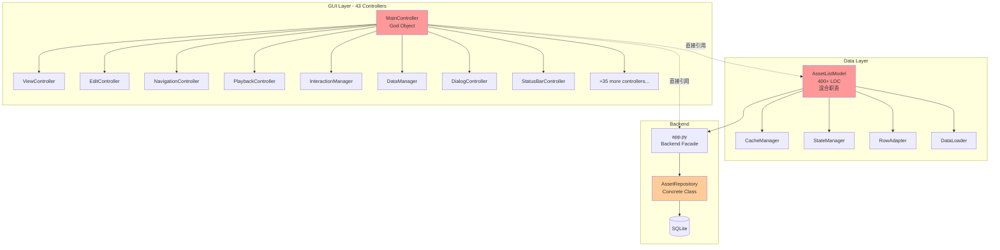

### 目标架构 (Target Architecture - MVVM + DDD)

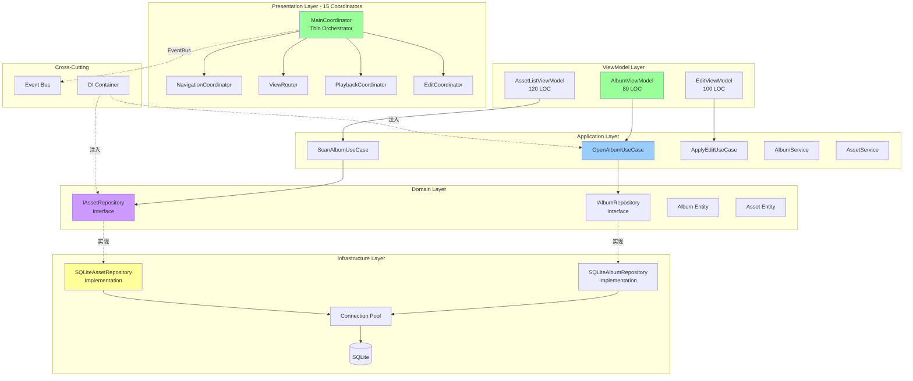

---

## 2. 数据流程对比

### 当前扫描流程 (Current Scanning - Serial)

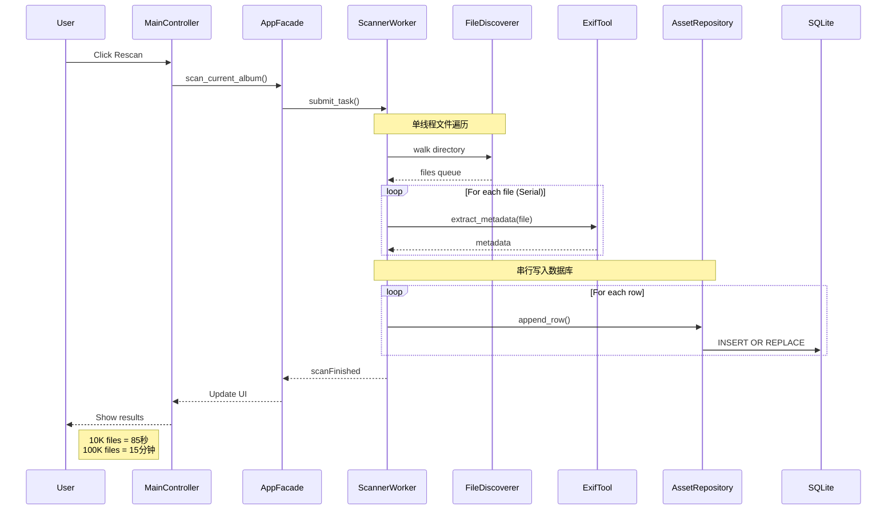

### 目标扫描流程 (Target Scanning - Parallel)

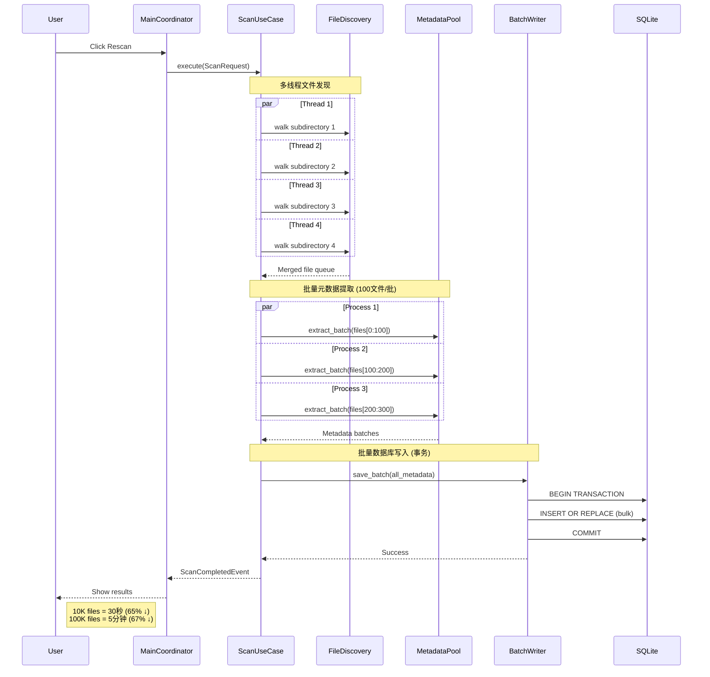

---

## 3. 组件交互模式

### 当前模式 (Direct Coupling)

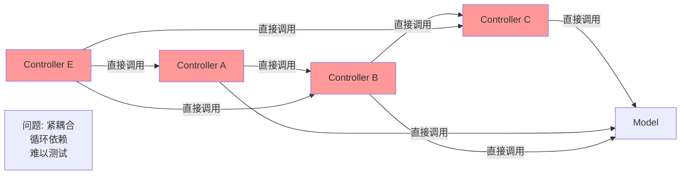

### 目标模式 (Event-Driven)

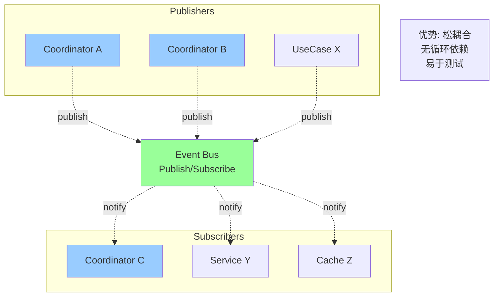

---

## 4. 依赖注入流程

### 目标架构依赖注入

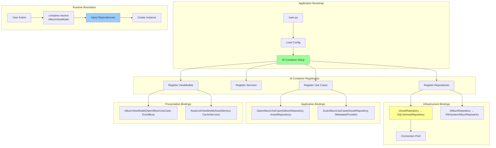

---

## 5. 重构迁移路径

### 渐进式迁移策略

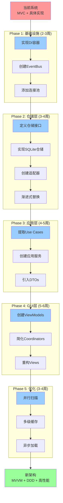

---

## 6. 控制器简化对比

### 当前控制器网络 (43个)

```mermaid
graph TB
    MC[MainController]
    
    MC --> VCM[ViewControllerManager]
    MC --> NC[NavigationController]
    MC --> IM[InteractionManager]
    MC --> DM[DataManager]
    MC --> DC[DialogController]
    MC --> SBC[StatusBarController]
    
    VCM --> VC[ViewController]
    VCM --> EC[EditController]
    VCM --> DVC[DetailViewController]
    
    IM --> PC[PlaybackController]
    IM --> SC[SelectionController]
    IM --> ASM[AssetStateManager]
    IM --> DDC[DragDropController]
    
    EC --> EPM[EditPreviewManager]
    EC --> EHM[EditHistoryManager]
    EC --> EVT[EditViewTransition]
    EC --> ELS[EditLightSection]
    EC --> ECS[EditColorSection]
    EC --> EBS[EditBWSection]
    
    DVC --> FVC[FilmstripViewController]
    DVC --> PBC[PlayerBarController]
    DVC --> IPC[InfoPanelController]
    
    NC --> ABC[AlbumBrowserController]
    NC --> LNC[LibraryNavigationController]
    
    MC --> Others["+18 more controllers..."]
    
    style MC fill:#ff0000
    style VCM fill:#ff6666
    style NC fill:#ff6666
    style IM fill:#ff6666
```

### 目标协调器结构 (15个)

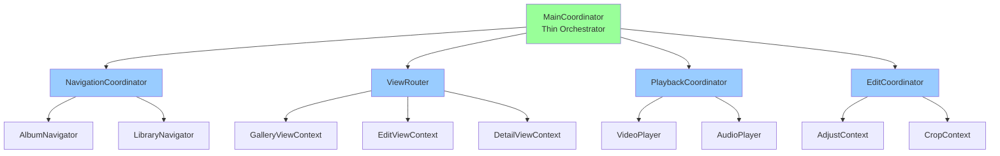

---

## 7. 性能优化对比

### 缩略图缓存策略

#### 当前策略 (无限制缓存)

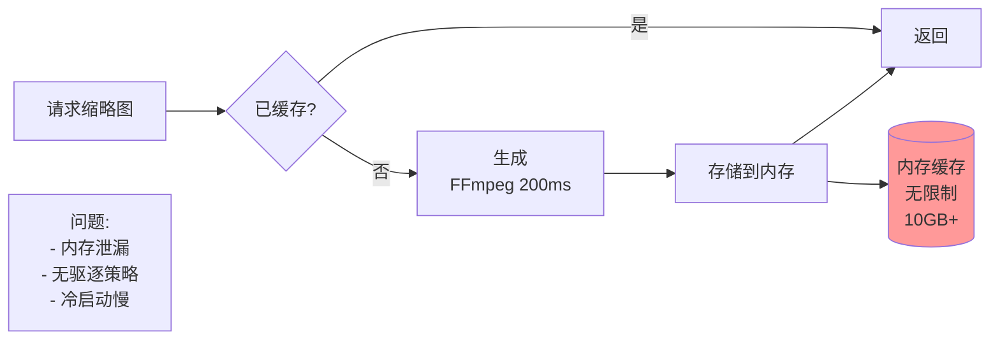

#### 目标策略 (多级缓存)

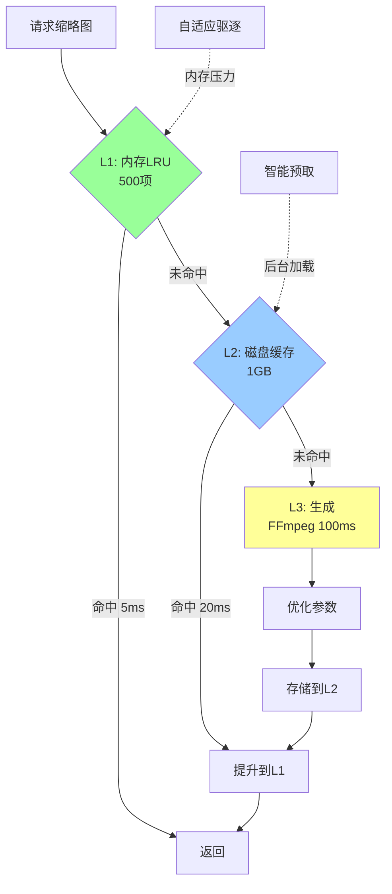

---

## 8. AssetListModel 重构

### 当前结构 (400+ LOC)

```mermaid
classDiagram
    class AssetListModel {
        -_facade: AppFacade
        -_cache_manager: AssetCacheManager
        -_state_manager: AssetListStateManager
        -_row_adapter: AssetRowAdapter
        -_controller: AssetListController
        -_thumb_size: QSize
        -_album_root: Path
        +__init__(facade)  // 80+ lines
        +bind(album)
        +rowCount()
        +data(index, role)
        +load_index()
        +_on_thumb_ready()
        +_apply_incremental_results()
        +handle_links_updated()
        +handle_asset_updated()
        // ... 30+ more methods
    }
    
    AssetListModel --|> QAbstractListModel
    AssetListModel --> AssetCacheManager
    AssetListModel --> AssetListStateManager
    AssetListModel --> AssetRowAdapter
    AssetListModel --> AssetListController
    
    Note for AssetListModel: "问题:\n- 混合5种职责\n- 400+ LOC\n- 难以测试\n- 高耦合"
```

### 目标结构 (分离职责)

```mermaid
classDiagram
    class AssetListViewModel {
        -_data_source: AssetDataSource
        -_cache: ThumbnailCacheService
        -_items: List~AssetDTO~
        +bind_query(query)
        +rowCount()
        +data(index, role)
    }
    
    class AssetDataSource {
        -_repo: IAssetRepository
        +load_page(query, page, size)
    }
    
    class ThumbnailCacheService {
        -_memory: LRUCache
        -_disk: DiskCache
        +get_or_generate(path, size)
        +prefetch(paths)
    }
    
    class AssetDTO {
        +id: int
        +path: Path
        +media_type: str
        +timestamp: datetime
    }
    
    AssetListViewModel --|> QAbstractListModel
    AssetListViewModel --> AssetDataSource
    AssetListViewModel --> ThumbnailCacheService
    AssetDataSource --> IAssetRepository
    AssetDataSource ..> AssetDTO
    
    Note for AssetListViewModel: "优势:\n- 单一职责\n- 150 LOC (减少62%)\n- 易于测试\n- 低耦合"
```

---

## 9. 时间线甘特图

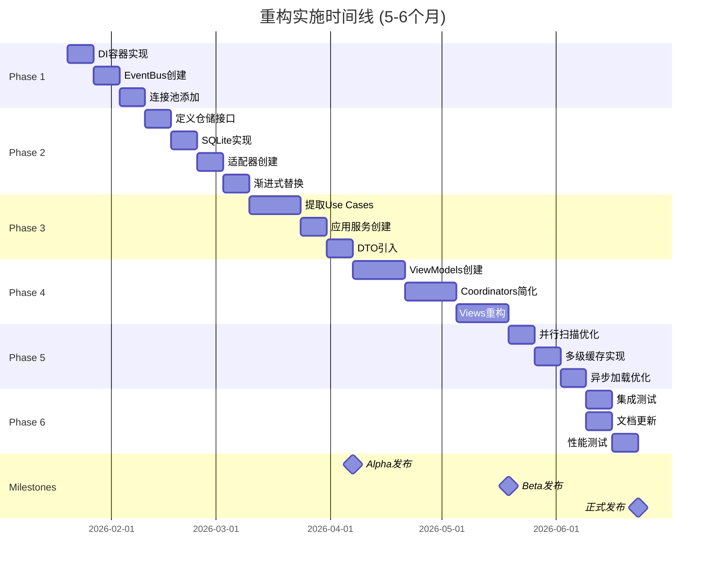

---

**文档说明:**
- 所有图表使用Mermaid语法，可在支持Mermaid的Markdown查看器中渲染
- 推荐工具: GitHub, GitLab, VS Code (Mermaid插件), Obsidian
- 完整架构分析请参阅: [ARCHITECTURE_ANALYSIS_AND_REFACTORING.md](./ARCHITECTURE_ANALYSIS_AND_REFACTORING.md)

---

**最后更新:** 2026-01-19  
**维护者:** Architecture Team
