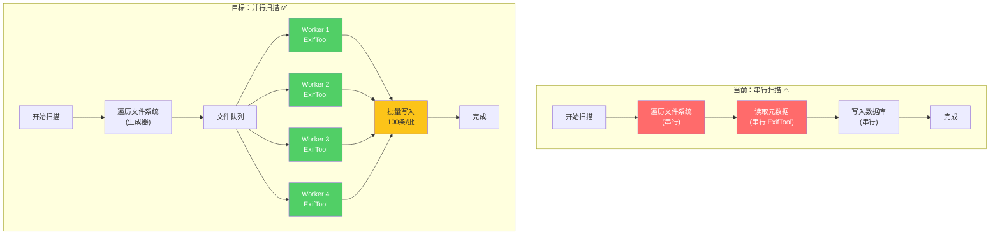
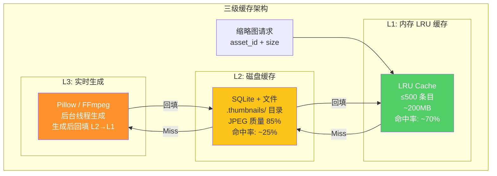
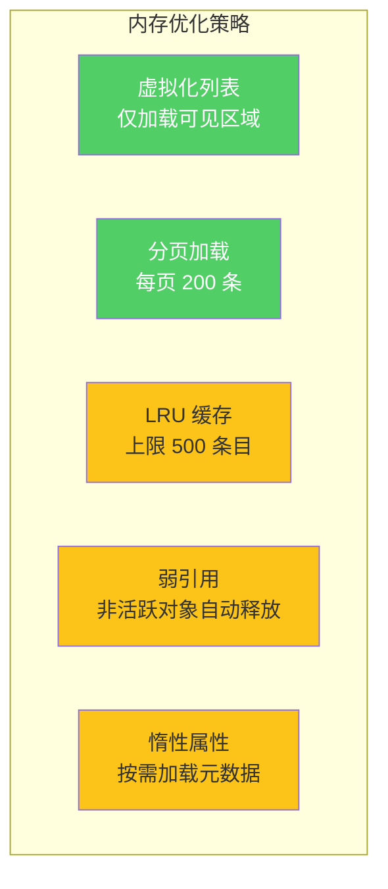
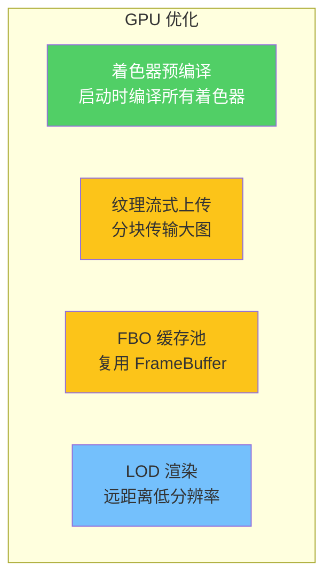

# 08 — 阶段四：性能优化

> 目标：并行扫描、三级缩略图缓存、内存治理、GPU 管线优化。  
> 时间：3-4 周  
> 风险：🟠 中（性能变更需充分压测）  
> 前置：阶段三基本完成

---

## 1. 并行扫描优化

### 1.1 当前问题

```
当前扫描流程: 串行处理
- 10,000 文件: ~85秒
- 100,000 文件: ~15分钟
- 瓶颈: ExifTool 子进程调用为串行
- UI 阻塞: 扫描期间 UI 冻结 ~8秒
```

### 1.2 目标架构



### 1.3 实施方案

```python
# src/iPhoto/application/services/parallel_scanner.py
class ParallelScanner:
    """并行文件扫描器"""

    def __init__(
        self,
        max_workers: int = 4,
        batch_size: int = 100,
        event_bus: EventBus | None = None,
    ):
        self._max_workers = max_workers
        self._batch_size = batch_size
        self._event_bus = event_bus

    def scan(self, album_path: Path) -> ScanResult:
        files = list(self._discover_files(album_path))
        total = len(files)

        results: list[Asset] = []
        errors: list[tuple[Path, str]] = []

        with ThreadPoolExecutor(max_workers=self._max_workers) as executor:
            futures = {
                executor.submit(self._scan_file, f): f
                for f in files
            }

            for i, future in enumerate(as_completed(futures)):
                path = futures[future]
                try:
                    asset = future.result()
                    results.append(asset)
                except Exception as e:
                    errors.append((path, str(e)))

                # 进度通知
                if self._event_bus and (i + 1) % self._batch_size == 0:
                    self._event_bus.publish(ScanProgressEvent(
                        processed=i + 1,
                        total=total,
                    ))

        return ScanResult(assets=results, errors=errors)

    def _discover_files(self, path: Path) -> Generator[Path, None, None]:
        """使用生成器遍历，减少内存占用"""
        for entry in os.scandir(path):
            if entry.is_file() and self._is_supported(entry.name):
                yield Path(entry.path)
            elif entry.is_dir() and not entry.name.startswith('.'):
                yield from self._discover_files(Path(entry.path))
```

### 1.4 SQLite 批量写入

```python
# src/iPhoto/infrastructure/repositories/sqlite_asset_repository.py
class SQLiteAssetRepository:
    def batch_insert(self, assets: list[Asset]) -> int:
        """批量插入 — WAL 模式 + 事务"""
        with self._pool.connection() as conn:
            conn.execute("PRAGMA journal_mode=WAL")
            conn.executemany(
                "INSERT OR REPLACE INTO assets (id, filename, ...) VALUES (?, ?, ...)",
                [(a.id, a.filename, ...) for a in assets]
            )
            return len(assets)
```

### 1.5 性能目标

| 文件数 | 当前 | 目标 | 提升 |
|--------|------|------|------|
| 1,000 | ~8秒 | ≤3秒 | 62% |
| 10,000 | ~85秒 | ≤30秒 | 65% |
| 100,000 | ~15分钟 | ≤5分钟 | 67% |

---

## 2. 三级缩略图缓存

### 2.1 缓存架构



### 2.2 L1 内存缓存

```python
# src/iPhoto/infrastructure/services/thumbnail_cache.py
from functools import lru_cache
from collections import OrderedDict

class MemoryThumbnailCache:
    """L1: LRU 内存缓存"""

    def __init__(self, max_size: int = 500):
        self._cache: OrderedDict[str, bytes] = OrderedDict()
        self._max_size = max_size

    def get(self, key: str) -> bytes | None:
        if key in self._cache:
            self._cache.move_to_end(key)
            return self._cache[key]
        return None

    def put(self, key: str, data: bytes) -> None:
        if key in self._cache:
            self._cache.move_to_end(key)
        else:
            if len(self._cache) >= self._max_size:
                self._cache.popitem(last=False)  # 淘汰最久未用
        self._cache[key] = data

    def invalidate(self, key: str) -> None:
        self._cache.pop(key, None)

    @property
    def size(self) -> int:
        return len(self._cache)

    @property
    def memory_usage_bytes(self) -> int:
        return sum(len(v) for v in self._cache.values())
```

### 2.3 L2 磁盘缓存

```python
# src/iPhoto/infrastructure/services/disk_thumbnail_cache.py
class DiskThumbnailCache:
    """L2: 磁盘缓存"""

    def __init__(self, cache_dir: Path):
        self._cache_dir = cache_dir
        self._cache_dir.mkdir(parents=True, exist_ok=True)

    def get(self, key: str) -> bytes | None:
        path = self._key_to_path(key)
        if path.exists():
            return path.read_bytes()
        return None

    def put(self, key: str, data: bytes) -> None:
        path = self._key_to_path(key)
        path.parent.mkdir(parents=True, exist_ok=True)
        path.write_bytes(data)

    def _key_to_path(self, key: str) -> Path:
        # 使用 hash 分桶，避免单目录文件过多
        hash_hex = hashlib.md5(key.encode()).hexdigest()
        return self._cache_dir / hash_hex[:2] / f"{hash_hex}.jpg"
```

### 2.4 统一缩略图服务

```python
# src/iPhoto/infrastructure/services/thumbnail_service.py
class ThumbnailService:
    """三级缓存统一入口"""

    def __init__(
        self,
        memory_cache: MemoryThumbnailCache,
        disk_cache: DiskThumbnailCache,
        generator: ThumbnailGenerator,
        executor: ThreadPoolExecutor,
    ):
        self._l1 = memory_cache
        self._l2 = disk_cache
        self._generator = generator
        self._executor = executor

    def get_thumbnail(self, asset_id: str, size: tuple[int, int] = (256, 256)) -> bytes | None:
        key = f"{asset_id}_{size[0]}x{size[1]}"

        # L1: 内存
        data = self._l1.get(key)
        if data:
            return data

        # L2: 磁盘
        data = self._l2.get(key)
        if data:
            self._l1.put(key, data)  # 回填 L1
            return data

        return None  # L3 需异步生成

    def request_thumbnail(self, asset_id: str, size: tuple[int, int], callback: Callable):
        """异步请求（L3 生成）"""
        self._executor.submit(self._generate_and_cache, asset_id, size, callback)

    def _generate_and_cache(self, asset_id: str, size: tuple[int, int], callback: Callable):
        key = f"{asset_id}_{size[0]}x{size[1]}"
        data = self._generator.generate(asset_id, size)
        if data:
            self._l2.put(key, data)  # 回填 L2
            self._l1.put(key, data)  # 回填 L1
            callback(asset_id, data)
```

---

## 3. 内存治理

### 3.1 内存问题诊断

```
当前内存使用 (100K 文件相册):
- 资产列表加载: ~2GB (全部加载到内存)
- 缩略图缓存: ~3GB (无上限)
- 元数据缓存: ~500MB
- 总计峰值: 5-10GB
```

### 3.2 优化策略



### 3.3 虚拟化列表

```python
# src/iPhoto/gui/ui/widgets/virtual_grid.py
class VirtualAssetGrid(QAbstractScrollArea):
    """虚拟化网格 — 仅渲染可见区域"""

    def __init__(self, parent=None):
        super().__init__(parent)
        self._total_count = 0
        self._item_size = QSize(200, 200)
        self._visible_range: tuple[int, int] = (0, 0)

    def set_total_count(self, count: int):
        self._total_count = count
        self._update_scrollbar()

    def paintEvent(self, event):
        painter = QPainter(self.viewport())
        first, last = self._calculate_visible_range()

        for i in range(first, min(last + 1, self._total_count)):
            rect = self._item_rect(i)
            self._paint_item(painter, i, rect)

    def _calculate_visible_range(self) -> tuple[int, int]:
        """计算当前可见的 item 索引范围"""
        scroll_y = self.verticalScrollBar().value()
        viewport_height = self.viewport().height()
        cols = max(1, self.viewport().width() // self._item_size.width())

        first_row = scroll_y // self._item_size.height()
        last_row = (scroll_y + viewport_height) // self._item_size.height() + 1

        return first_row * cols, (last_row + 1) * cols
```

### 3.4 内存目标

| 场景 | 当前内存 | 目标内存 | 减少 |
|------|---------|---------|------|
| 10K 文件相册 | ~1.5GB | ≤500MB | 67% |
| 100K 文件相册 | ~5-10GB | ≤2GB | 60-80% |
| 缩略图缓存 | 无上限 | ≤200MB | 有界 |

---

## 4. GPU 管线优化

### 4.1 当前问题

```
gl_renderer.py (940行):
- 着色器编译在主线程
- 纹理上传未分批
- 无 FBO 缓存
- 视口变化重建整个管线
```

### 4.2 优化方向



---

## 5. 阶段四检查清单

- [ ] **并行扫描**
  - [ ] 实现 `ParallelScanner` (4 Worker)
  - [ ] 实现 `batch_insert` 批量写入 (100条/批)
  - [ ] SQLite WAL 模式启用
  - [ ] 进度事件发布 (ScanProgressEvent)
  - [ ] 压测: 10K 文件 ≤30秒
- [ ] **三级缩略图缓存**
  - [ ] 实现 `MemoryThumbnailCache` (L1, LRU 500)
  - [ ] 实现 `DiskThumbnailCache` (L2, hash 分桶)
  - [ ] 实现 `ThumbnailService` (统一入口)
  - [ ] 异步 L3 生成 + 回填
  - [ ] 缓存命中率监控
- [ ] **内存治理**
  - [ ] 虚拟化列表 `VirtualAssetGrid`
  - [ ] 分页加载 (200条/页)
  - [ ] 缩略图缓存上限 (200MB)
  - [ ] 弱引用非活跃对象
  - [ ] 内存使用监控 (≤2GB @100K)
- [ ] **GPU 优化**
  - [ ] 着色器预编译
  - [ ] 纹理流式上传
  - [ ] FBO 缓存池
