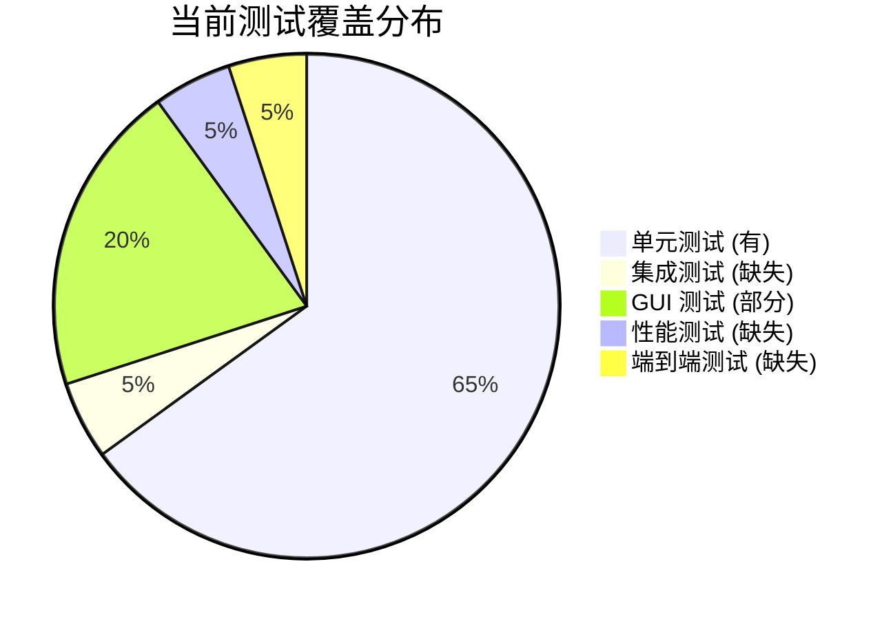
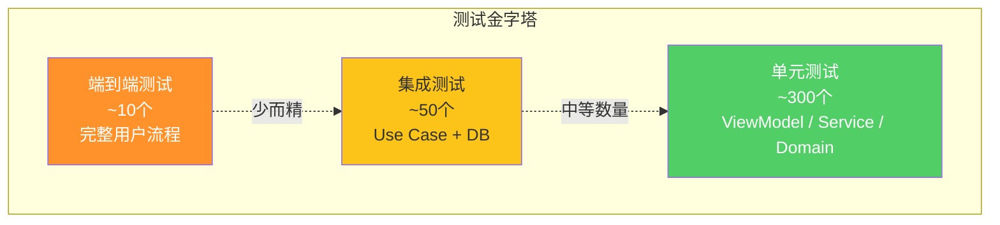
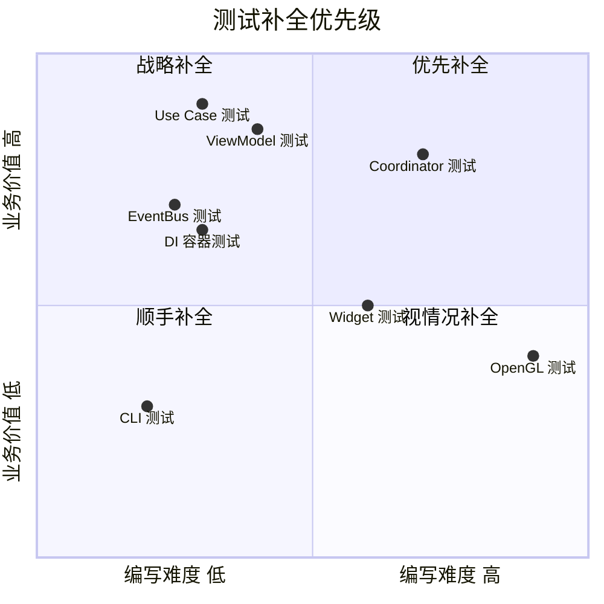
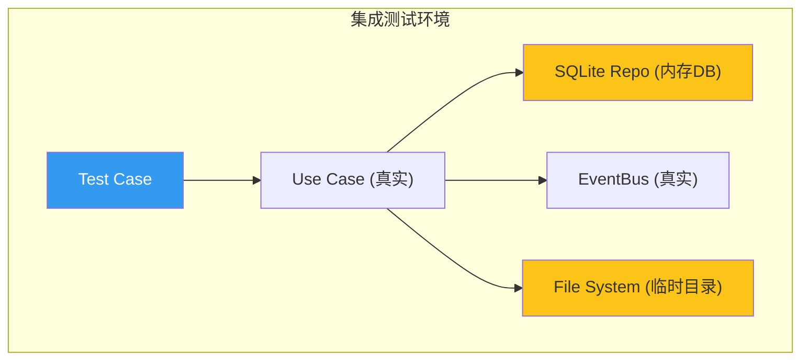
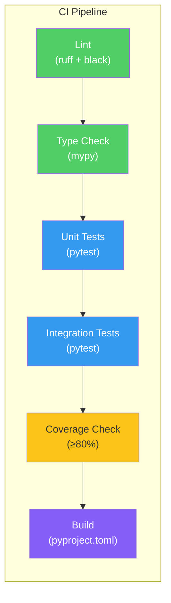

# 09 — 阶段五：测试与 CI/CD 体系建设

> 目标：测试覆盖率 ≥80%、集成测试覆盖所有 Use Case、CI/CD 自动化、质量门禁。  
> 时间：持续进行（与阶段一~四并行）  
> 风险：🟢 低

---

## 1. 测试体系现状

### 1.1 现状分析



**现有测试资产**:
- 123 个测试文件，分布在 `tests/` 下的多个子目录
- 使用 pytest + pytest-mock + pytest-qt
- 核心算法（pairing, adjustments）覆盖较好
- 基础设施（SQLite repo, cache）覆盖中等

**关键缺失**:
| 维度 | 缺失内容 |
|------|---------|
| 集成测试 | Use Case 端到端测试 |
| MainCoordinator | 无测试（应用核心的单点故障） |
| DI 容器 | 仅基础测试 |
| EventBus | 无实际接入测试 |
| 性能回归 | 无基准测试 |
| UI 回归 | 无截图对比测试 |

### 1.2 目标测试金字塔



---

## 2. 单元测试补全

### 2.1 优先级矩阵



### 2.2 Use Case 测试模板

```python
# tests/application/use_cases/test_import_assets.py
import pytest
from unittest.mock import Mock, patch
from pathlib import Path

from iPhoto.application.use_cases.import_assets import (
    ImportAssetsUseCase,
    ImportAssetsRequest,
    ImportAssetsResponse,
)

class TestImportAssetsUseCase:
    @pytest.fixture
    def mock_asset_repo(self):
        repo = Mock()
        repo.exists_by_path.return_value = False
        return repo

    @pytest.fixture
    def mock_album_repo(self):
        repo = Mock()
        repo.find_by_id.return_value = Mock(root_path=Path("/albums/test"))
        return repo

    @pytest.fixture
    def mock_scanner(self):
        scanner = Mock()
        scanner.scan_file.return_value = Mock(id="asset1", filename="photo.jpg")
        return scanner

    @pytest.fixture
    def mock_event_bus(self):
        return Mock()

    @pytest.fixture
    def use_case(self, mock_asset_repo, mock_album_repo, mock_scanner, mock_event_bus):
        return ImportAssetsUseCase(
            asset_repo=mock_asset_repo,
            album_repo=mock_album_repo,
            scanner=mock_scanner,
            event_bus=mock_event_bus,
        )

    def test_import_single_file(self, use_case, mock_asset_repo):
        request = ImportAssetsRequest(
            source_paths=[Path("/photos/test.jpg")],
            target_album_id="album1",
        )
        response = use_case.execute(request)

        assert response.success
        assert response.imported_count == 1
        mock_asset_repo.save.assert_called_once()

    def test_skip_existing_file(self, use_case, mock_asset_repo):
        mock_asset_repo.exists_by_path.return_value = True

        request = ImportAssetsRequest(
            source_paths=[Path("/photos/test.jpg")],
            target_album_id="album1",
        )
        response = use_case.execute(request)

        assert response.skipped_count == 1
        assert response.imported_count == 0

    def test_album_not_found(self, use_case, mock_album_repo):
        mock_album_repo.find_by_id.return_value = None

        request = ImportAssetsRequest(
            source_paths=[Path("/photos/test.jpg")],
            target_album_id="nonexistent",
        )
        response = use_case.execute(request)

        assert not response.success
        assert "not found" in response.error

    def test_publishes_event_on_success(self, use_case, mock_event_bus):
        request = ImportAssetsRequest(
            source_paths=[Path("/photos/test.jpg")],
            target_album_id="album1",
        )
        use_case.execute(request)

        mock_event_bus.publish.assert_called_once()
```

### 2.3 ViewModel 测试模板

```python
# tests/gui/viewmodels/test_asset_list_viewmodel.py
import pytest
from unittest.mock import Mock

from iPhoto.gui.viewmodels.asset_list_viewmodel import AssetListViewModel

class TestAssetListViewModel:
    """ViewModel 测试 — 无需 QApplication"""

    @pytest.fixture
    def vm(self):
        return AssetListViewModel(
            data_source=Mock(),
            thumbnail_cache=Mock(),
            event_bus=Mock(),
        )

    def test_initial_state(self, vm):
        assert vm.assets.value == []
        assert vm.loading.value is False
        assert vm.total_count.value == 0

    def test_load_album_updates_assets(self, vm):
        vm._data_source.load_assets.return_value = [Mock(), Mock()]

        vm.load_album("album1")

        assert len(vm.assets.value) == 2
        assert vm.total_count.value == 2
        assert vm.loading.value is False

    def test_select_updates_selected_indices(self, vm):
        vm.select(0)
        vm.select(2)

        assert vm.selected_indices.value == [0, 2]

    def test_observable_property_notifies(self, vm):
        changes = []
        vm.assets.changed.connect(lambda new, old: changes.append(new))

        vm.assets.value = [Mock()]

        assert len(changes) == 1
```

### 2.4 EventBus 测试

```python
# tests/events/test_event_bus.py
import pytest
from iPhoto.events.bus import EventBus
from iPhoto.events.domain_events import DomainEvent

class TestEventBus:
    def test_subscribe_and_publish(self):
        bus = EventBus()
        received = []

        bus.subscribe(DomainEvent, lambda e: received.append(e))
        bus.publish(DomainEvent())

        assert len(received) == 1

    def test_unsubscribe(self):
        bus = EventBus()
        received = []
        sub = bus.subscribe(DomainEvent, lambda e: received.append(e))

        bus.unsubscribe(sub)
        bus.publish(DomainEvent())

        assert len(received) == 0

    def test_handler_error_does_not_break_other_handlers(self):
        bus = EventBus()
        received = []

        bus.subscribe(DomainEvent, lambda e: 1/0)  # 会抛异常
        bus.subscribe(DomainEvent, lambda e: received.append(e))

        bus.publish(DomainEvent())

        assert len(received) == 1  # 第二个handler仍然执行
```

---

## 3. 集成测试框架

### 3.1 集成测试架构



### 3.2 集成测试 Fixtures

```python
# tests/integration/conftest.py
import pytest
import tempfile
from pathlib import Path

from iPhoto.di.container import Container
from iPhoto.events.bus import EventBus

@pytest.fixture
def container():
    """完整 DI 容器 — 使用内存 SQLite"""
    c = Container()
    c.register_singleton(EventBus, EventBus)
    # 注册所有 Repository (内存 DB)
    # 注册所有 Service
    return c

@pytest.fixture
def temp_album(tmp_path):
    """临时相册目录"""
    album_dir = tmp_path / "test_album"
    album_dir.mkdir()

    # 创建测试文件
    for i in range(10):
        (album_dir / f"photo_{i}.jpg").write_bytes(b"fake_jpeg_data")

    return album_dir

@pytest.fixture
def event_collector(container):
    """收集所有发布的事件"""
    bus = container.resolve(EventBus)
    events = []

    from iPhoto.events.domain_events import DomainEvent
    bus.subscribe(DomainEvent, lambda e: events.append(e))

    return events
```

### 3.3 集成测试示例

```python
# tests/integration/test_scan_workflow.py
class TestScanWorkflow:
    """扫描工作流集成测试"""

    def test_full_scan_workflow(self, container, temp_album, event_collector):
        """测试: 打开相册 → 扫描 → 验证资产"""
        album_svc = container.resolve(AlbumService)
        asset_repo = container.resolve(IAssetRepository)

        # 1. 打开相册
        album = album_svc.open_album(str(temp_album))
        assert album is not None

        # 2. 扫描
        scan_uc = container.resolve(ScanAlbumUseCase)
        result = scan_uc.execute(ScanAlbumRequest(album_path=str(temp_album)))
        assert result.success

        # 3. 验证资产已入库
        assets = asset_repo.find_by_album(album.id)
        assert len(assets) == 10

        # 4. 验证事件已发布
        scan_events = [e for e in event_collector if isinstance(e, ScanCompletedEvent)]
        assert len(scan_events) == 1
```

---

## 4. CI/CD 流水线

### 4.1 目标流水线



### 4.2 GitHub Actions 配置

```yaml
# .github/workflows/ci.yml
name: CI

on:
  push:
    branches: [main, develop]
  pull_request:
    branches: [main]

jobs:
  lint:
    runs-on: ubuntu-latest
    steps:
      - uses: actions/checkout@v4
      - uses: actions/setup-python@v5
        with:
          python-version: "3.12"
      - run: pip install ruff black
      - run: ruff check src/ tests/
      - run: black --check src/ tests/

  type-check:
    runs-on: ubuntu-latest
    steps:
      - uses: actions/checkout@v4
      - uses: actions/setup-python@v5
        with:
          python-version: "3.12"
      - run: pip install -e ".[dev]"
      - run: mypy src/iPhoto/

  test:
    runs-on: ubuntu-latest
    strategy:
      matrix:
        python-version: ["3.12", "3.13"]
    steps:
      - uses: actions/checkout@v4
      - uses: actions/setup-python@v5
        with:
          python-version: ${{ matrix.python-version }}
      - run: pip install -e ".[dev]"
      - name: Run Tests with Coverage
        run: |
          pytest tests/ \
            --cov=src/iPhoto \
            --cov-report=xml \
            --cov-report=term-missing \
            --cov-fail-under=80
      - uses: codecov/codecov-action@v4
        with:
          file: ./coverage.xml

  build:
    needs: [lint, type-check, test]
    runs-on: ubuntu-latest
    steps:
      - uses: actions/checkout@v4
      - uses: actions/setup-python@v5
        with:
          python-version: "3.12"
      - run: pip install build
      - run: python -m build
```

### 4.3 质量门禁

| 门禁 | 阈值 | 阻断 PR |
|------|------|---------|
| ruff lint | 0 errors | ✅ |
| black format | 100% compliant | ✅ |
| mypy type check | 0 errors | ✅ |
| 单元测试 | 100% pass | ✅ |
| 覆盖率 | ≥80% | ✅ |
| 覆盖率下降 | ≤-2% | ✅ |
| 集成测试 | 100% pass | ✅ |

---

## 5. 性能基准测试

### 5.1 基准测试框架

```python
# tests/benchmarks/conftest.py
import pytest

def pytest_addoption(parser):
    parser.addoption("--benchmark", action="store_true", help="Run benchmarks")

def pytest_collection_modifyitems(config, items):
    if not config.getoption("--benchmark"):
        skip = pytest.mark.skip(reason="需要 --benchmark 参数")
        for item in items:
            if "benchmark" in item.keywords:
                item.add_marker(skip)
```

```python
# tests/benchmarks/test_scan_performance.py
import pytest
import time

@pytest.mark.benchmark
class TestScanPerformance:
    def test_scan_1k_files(self, container, create_test_album):
        album_path = create_test_album(file_count=1000)
        scanner = container.resolve(ParallelScanner)

        start = time.perf_counter()
        result = scanner.scan(album_path)
        elapsed = time.perf_counter() - start

        assert elapsed < 3.0  # ≤3秒
        assert len(result.assets) == 1000

    def test_scan_10k_files(self, container, create_test_album):
        album_path = create_test_album(file_count=10000)
        scanner = container.resolve(ParallelScanner)

        start = time.perf_counter()
        result = scanner.scan(album_path)
        elapsed = time.perf_counter() - start

        assert elapsed < 30.0  # ≤30秒
```

---

## 6. 阶段五检查清单

- [ ] **单元测试补全**
  - [ ] Use Case 测试 (≥2个/Use Case)
  - [ ] ViewModel 测试 (≥3个/ViewModel)
  - [ ] EventBus 测试 (≥5个)
  - [ ] DI 容器测试 (≥6个)
  - [ ] Service 测试补全
- [ ] **集成测试框架**
  - [ ] 集成测试 conftest.py (DI + 内存DB + 临时目录)
  - [ ] 扫描工作流测试
  - [ ] 导入工作流测试
  - [ ] 编辑工作流测试
  - [ ] 相册 CRUD 工作流测试
- [ ] **CI/CD 流水线**
  - [ ] `.github/workflows/ci.yml`
  - [ ] Lint (ruff + black)
  - [ ] Type check (mypy)
  - [ ] Test + Coverage
  - [ ] Build
- [ ] **质量门禁**
  - [ ] 覆盖率 ≥80% 门禁
  - [ ] 覆盖率不下降门禁
  - [ ] PR 模板包含测试说明
- [ ] **性能基准**
  - [ ] 基准测试框架
  - [ ] 扫描性能基准 (1K, 10K)
  - [ ] 缩略图性能基准
  - [ ] 内存使用基准
