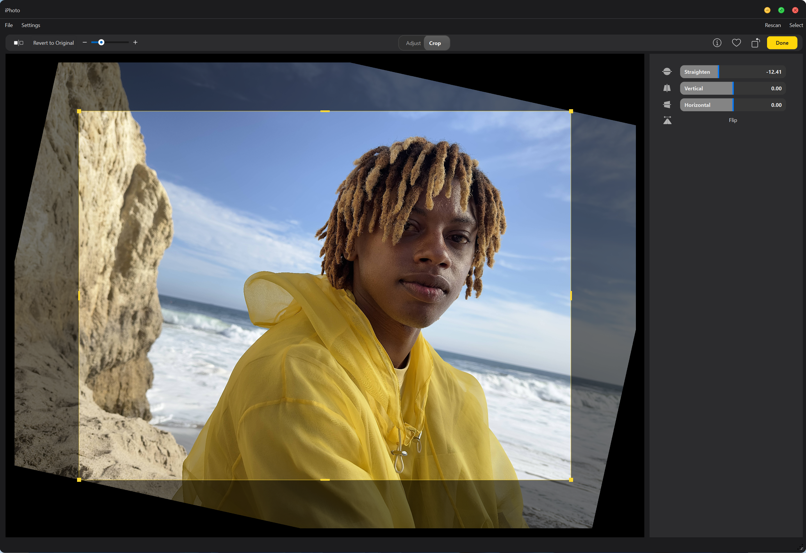

# 📸 iPhotron
> Bringen Sie die *Fotos*-Erfahrung von macOS auf Windows — ordnerbasierte, nicht-destruktive Fotoverwaltung mit Live Photo, Karten und intelligenten Alben.


-orange)

[](https://github.com/OliverZhaohaibin/iPhotos-LocalPhotoAlbumManager)

**Sprachen / Languages:**  
[](../../README.md) | [](README_zh-CN.md) | [](README_de.md)

---

## ☕ Unterstützung

[](https://buymeacoffee.com/oliverzhao)

## 📥 Download

[](https://github.com/OliverZhaohaibin/iPhotron-LocalPhotoAlbumManager/releases/download/v4.0.1/v4.01.exe)

**💡 Schnellinstallation:** Klicken Sie auf die Schaltfläche oben, um das neueste Windows-Installationsprogramm (.exe) direkt herunterzuladen.

---

## 🌟 Star-Verlauf

[](https://www.star-history.com/#OliverZhaohaibin/iPhotron-LocalPhotoAlbumManager&type=date&legend=bottom-right)

---

## 🌟 Überblick

**iPhoto** ist ein **ordnerbasierter Foto-Manager**, inspiriert von macOS *Fotos*.  
Es organisiert Ihre Medien mit leichtgewichtigen JSON-Manifesten und Cache-Dateien —  
bietet umfangreiche Album-Funktionalität und **hält alle Originaldateien intakt**.

Wichtige Highlights:
- 🗂 Ordnerbasiertes Design — jeder Ordner *ist* ein Album, kein Import erforderlich.
- ⚙️ JSON-basierte Manifeste zeichnen "menschliche Entscheidungen" auf (Cover, Favoriten, Reihenfolge).
- ⚡ **SQLite-gestützte globale Datenbank** für blitzschnelle Abfragen auf massiven Bibliotheken.
- 🧠 Intelligentes inkrementelles Scannen mit persistentem SQLite-Index.
- 🎥 Vollständige **Live Photo**-Paarungs- und Wiedergabeunterstützung.
- 🗺 Kartenansicht, die GPS-Metadaten über alle Fotos und Videos visualisiert.


---

## ✨ Funktionen

### 🗺 Standortansicht
Zeigt Ihre Foto-Fußabdrücke auf einer interaktiven Karte und gruppiert nahe gelegene Fotos nach GPS-Metadaten.


### 🎞 Live Photo-Unterstützung
Paart nahtlos HEIC/JPG- und MOV-Dateien mithilfe von Apples `ContentIdentifier`.  
Ein "LIVE"-Badge erscheint auf Standbildern — klicken Sie, um das Bewegungsvideo inline abzuspielen.


### 🧩 Intelligente Alben
Die Seitenleiste bietet eine automatisch generierte **Grundbibliothek**, die Fotos in Gruppen einteilt:
`Alle Fotos`, `Videos`, `Live Photos`, `Favoriten` und `Kürzlich gelöscht`.

### 🖼 Immersive Detailansicht
Ein eleganter Foto-/Videobetrachter mit Filmstreifen-Navigator und schwebendem Wiedergabebalken.

### 🎨 Nicht-destruktive Fotobearbeitung
Eine umfassende Bearbeitungssuite mit **Anpassen**- und **Zuschneiden**-Modi:

#### Anpassen-Modus
- **Lichtanpassungen:** Brillanz, Belichtung, Lichter, Schatten, Helligkeit, Kontrast, Schwarzpunkt
- **Farbanpassungen:** Sättigung, Lebendigkeit, Farbstich (Weißabgleichkorrektur)
- **Schwarzweiß:** Intensität, Neutraltöne, Ton, Körnung mit künstlerischen Film-Voreinstellungen
- **Farbkurven:** RGB- und kanalbasierter (R/G/B) Kurven-Editor mit ziehbaren Kontrollpunkten für präzise Tonanpassungen
- **Selektive Farbe:** Zielt auf sechs Farbbereiche (Rot/Gelb/Grün/Cyan/Blau/Magenta) mit unabhängigen Farbton-/Sättigungs-/Helligkeitskontrollen
- **Tonwerte:** 5-Punkt-Eingangs-Ausgangs-Tonzuordnung mit Histogramm-Hintergrund und kanalbasierter Steuerung
- **Master-Schieberegler:** Jeder Abschnitt verfügt über einen intelligenten Master-Schieberegler, der Werte auf mehrere Feinabstimmungssteuerungen verteilt
- **Live-Miniaturansichten:** Echtzeit-Vorschaustreifen, die den Effektbereich für jede Anpassung zeigen


- 
#### Zuschneiden-Modus
- **Perspektivkorrektur:** Vertikale und horizontale Trapezverzerrungsanpassungen
- **Ausrichten-Werkzeug:** ±45° Drehung mit Sub-Grad-Präzision
- **Spiegeln (Horizontal):** Horizontale Spiegelungsunterstützung
- **Interaktives Zuschneiderechteck:** Ziehbare Griffe, Kantenfang und Seitenverhältnisbeschränkungen
- **Schwarzrand-Prävention:** Automatische Validierung stellt sicher, dass nach Perspektivtransformationen keine schwarzen Kanten erscheinen
  

Alle Bearbeitungen werden in `.ipo`-Sidecar-Dateien gespeichert und bewahren die Originalfotos unberührt.

### ℹ️ Schwebendes Info-Panel
Schalten Sie ein schwebendes Metadaten-Panel um, das EXIF, Kamera-/Objektivinformationen, Belichtung, Blende, Brennweite, Dateigröße und mehr anzeigt.


### 💬 Umfangreiche Interaktionen
- Ziehen und Ablegen von Dateien direkt aus dem Explorer/Finder in Alben.
- Mehrfachauswahl und Kontextmenüs für Kopieren, In Ordner anzeigen, Verschieben, Löschen, Wiederherstellen.
- Sanfte Miniaturansichts-Übergänge und macOS-ähnliche Album-Navigation.

---

## ⚙️ Kern-Engine

| Konzept | Beschreibung |
|----------|--------------|
| **Ordner = Album** | Verwaltet über `.iphoto.album.json`-Manifest-Dateien. |
| **Globale SQLite-Datenbank** | Alle Asset-Metadaten werden in einer einzigen Hochleistungsdatenbank im Bibliotheksstamm gespeichert (`global_index.db`). |
| **Inkrementelles Scannen** | Scannt neue/geänderte Dateien mit idempotenten Upsert-Operationen in die globale Datenbank. |
| **Intelligente Indizierung** | Mehrspaltige Indizes auf `parent_album_path`, `ts`, `media_type` und `is_favorite` für sofortige Abfragen. |
| **Live-Paarung** | Automatische Zuordnung von Live Photos mithilfe von `ContentIdentifier` oder zeitlicher Nähe. |
| **Reverse Geocoding** | Konvertiert GPS-Koordinaten in menschenlesbare Standorte (z. B. "London"). |
| **Nicht-destruktive Bearbeitung** | Speichert Licht-/Farb-/Schwarzweiß-/Zuschnitt-Anpassungen in `.ipo`-Sidecar-Dateien. |
| **GPU-Rendering** | Echtzeit-OpenGL 3.3-Vorschau mit Perspektivtransformation und Farbkorrektur. |
| **Befehlszeilen-Tool** | Bietet eine `iphoto`-CLI für Album-Initialisierung, Scannen, Paarung und Berichtserstellung. |

---

## 🧰 Befehlszeilen-Verwendung

```bash
# 1️⃣ Abhängigkeiten installieren
pip install -e .

# 2️⃣ Album initialisieren (erstellt .iphoto.album.json)
iphoto init /pfad/zum/album

# 3️⃣ Dateien scannen und Index erstellen
iphoto scan /pfad/zum/album

# 4️⃣ Live Photos paaren (HEIC/JPG + MOV)
iphoto pair /pfad/zum/album

# 5️⃣ Album-Eigenschaften verwalten
iphoto cover set /pfad/zum/album IMG_1234.HEIC
iphoto feature add /pfad/zum/album museum/IMG_9999.HEIC#live
iphoto report /pfad/zum/album
```

## 🖥 GUI-Oberfläche (PySide6 / Qt6)

Nach der Installation können Sie die vollständige Desktop-Oberfläche starten:

```bash
iphoto-gui
```
Oder direkt ein bestimmtes Album öffnen:

```bash
iphoto-gui /fotos/LondonReise
```

### GUI-Highlights

- **Album-Seitenleiste:** Hierarchische Ordneransicht mit Favoriten und intelligenten Alben.  
- **Asset-Raster:** Adaptive Miniaturansicht-Layout, Auswahl und verzögert geladene Vorschauen.  
- **Kartenansicht:** Interaktive GPS-Gruppierung mit Kachel-Caching.  
- **Detail-Betrachter:** Filmstreifen-Navigation und Wiedergabesteuerungen.  
- **Bearbeitungsmodus:** Nicht-destruktive Anpassen (Licht/Farbe/Schwarzweiß) und Zuschneiden (Perspektive/Ausrichten)-Werkzeuge.  
- **Metadaten-Panel:** Zusammenklappbares EXIF + QuickTime-Info-Panel.  
- **Kontextmenü:** Kopieren, Verschieben, Löschen, Wiederherstellen.

## 🧱 Projektstruktur

Der Quellcode befindet sich im Verzeichnis `src/iPhoto/` und folgt einer **geschichteten Architektur** basierend auf **MVVM + DDD (Domain-Driven Design)**-Prinzipien.

---

### 1️⃣ Domain-Schicht (`src/iPhoto/domain/`)

Reine Geschäftsmodelle und Repository-Schnittstellen, unabhängig von jedem Framework.

| Datei / Modul | Beschreibung |
|----------------|-------------|
| **`models/`** | Domain-Entitäten: `Album`, `Asset`, `MediaType`, `LiveGroup`. |
| **`models/query.py`** | Query-Objektmuster für Asset-Filterung, Sortierung und Paginierung. |
| **`repositories.py`** | Repository-Schnittstellen: `IAlbumRepository`, `IAssetRepository`. |

---

### 2️⃣ Anwendungsschicht (`src/iPhoto/application/`)

Geschäftslogik in Use Cases und Anwendungsdiensten gekapselt.

| Datei / Modul | Beschreibung |
|----------------|-------------|
| **`use_cases/open_album.py`** | Use Case zum Öffnen eines Albums mit Event-Publishing. |
| **`use_cases/scan_album.py`** | Use Case zum Scannen von Albumdateien und Aktualisieren des Index. |
| **`use_cases/pair_live_photos.py`** | Use Case für Live Photo-Paarungslogik. |
| **`services/album_service.py`** | Anwendungsdienst für Album-Operationen. |
| **`services/asset_service.py`** | Anwendungsdienst für Asset-Operationen (Favoriten, Abfragen). |
| **`interfaces.py`** | Abstraktionen: `IMetadataProvider`, `IThumbnailGenerator`. |
| **`dtos.py`** | Datentransferobjekte für Use Case-Anfragen/-Antworten. |

---

### 3️⃣ Infrastruktur-Schicht (`src/iPhoto/infrastructure/`)

Konkrete Implementierungen von Domain-Schnittstellen.

| Datei / Modul | Beschreibung |
|----------------|-------------|
| **`repositories/sqlite_asset_repository.py`** | SQLite-Implementierung von `IAssetRepository`. |
| **`repositories/sqlite_album_repository.py`** | SQLite-Implementierung von `IAlbumRepository`. |
| **`db/pool.py`** | Thread-sicherer Datenbankverbindungspool. |
| **`services/`** | Infrastrukturdienste (Metadaten-Extraktion, Miniaturansichten). |

---

### 4️⃣ Kern-Backend (`src/iPhoto/`)

Reine Python-Logik, die nicht von einem GUI-Framework (wie PySide6) abhängt.

| Datei / Modul | Beschreibung |
|----------------|-------------|
| **`app.py`** | Hochrangige Backend-**Fassade**, die alle Kernmodule koordiniert, von CLI und GUI verwendet. |
| **`cli.py`** | Typer-basierter Befehlszeilen-Einstiegspunkt, der Benutzerbefehle analysiert und Methoden aus `app.py` aufruft. |
| **`models/`** | Legacy-Datenstrukturen wie `Album` (Manifest-Lese-/Schreibzugriff) und `LiveGroup`. |
| **`io/`** | Behandelt Dateisystem-Interaktion, hauptsächlich `scanner.py` (Datei-Scanning) und `metadata.py` (Metadaten-Lesen). |
| **`core/`** | Kern-Algorithmuslogik einschließlich `pairing.py` (Live Photo-Paarung) und Bildanpassungsresolvern. |
| ├─ **`light_resolver.py`** | Löst den Licht-Master-Schieberegler in 7 Feinabstimmungsparameter auf (Brillanz, Belichtung usw.). |
| ├─ **`color_resolver.py`** | Löst den Farb-Master-Schieberegler in Sättigung/Lebendigkeit/Farbstich mit Bildstatistiken auf. |
| ├─ **`bw_resolver.py`** | Löst den Schwarzweiß-Master-Schieberegler mithilfe von 3-Punkt-Gauß-Interpolation auf. |
| ├─ **`curve_resolver.py`** | Verwaltet Farbkurvenanpassungen mit Bezier-Interpolation und LUT-Generierung. |
| ├─ **`selective_color_resolver.py`** | Implementiert selektive Farbanpassungen, die auf sechs Farbbereiche mit HSL-Verarbeitung abzielen. |
| ├─ **`levels_resolver.py`** | Behandelt Tonwertanpassungen mit 5-Punkt-Eingangs-Ausgangs-Tonzuordnung. |
| └─ **`filters/`** | Hochleistungsbildverarbeitung (NumPy-Vektorisierung → Numba JIT → QColor-Fallback). |
| **`cache/`** | Verwaltet die globale SQLite-Datenbank (`index_store/`) mit modularen Komponenten: Engine, Migrationen, Wiederherstellung, Abfragen und Repository. Enthält `lock.py` für Datei-Level-Sperrung. |
| **`utils/`** | Allgemeine Hilfsprogramme, insbesondere Wrapper für externe Tools (`exiftool.py`, `ffmpeg.py`). |
| **`schemas/`** | JSON-Schema-Definitionen, z. B. `album.schema.json`. |
| **`di/`** | Dependency Injection-Container für Dienstregistrierung und -auflösung. |
| **`events/`** | Event Bus für Domain-Events (Publish-Subscribe-Muster). |
| **`errors/`** | Einheitliche Fehlerbehandlung mit Schweregradebenen und Event-Publishing. |

---

### 5️⃣ GUI-Schicht (`src/iPhoto/gui/`)

PySide6-basierte Desktop-Anwendung, die dem **MVVM (Model-View-ViewModel)**-Muster folgt.

| Datei / Modul | Beschreibung |
|----------------|-------------|
| **`main.py`** | Einstiegspunkt für die GUI-Anwendung (`iphoto-gui`-Befehl). |
| **`appctx.py`** | Definiert `AppContext`, einen gemeinsamen globalen Zustandsmanager für Einstellungen, Bibliotheksmanager und die Backend-Fassaden-Instanz. |
| **`facade.py`** | Definiert `AppFacade` (ein `QObject`) — die **Brücke** zwischen GUI und Backend. Verwendet Qt-**Signale/Slots**, um Backend-Operationen von der GUI-Ereignisschleife zu entkoppeln. |
| **`coordinators/`** | **MVVM-Koordinatoren**, die Ansichtsnavigation und Geschäftsablauf orchestrieren. |
| ├─ **`main_coordinator.py`** | Hauptfenster-Koordinator, der untergeordnete Koordinatoren verwaltet. |
| ├─ **`navigation_coordinator.py`** | Behandelt Album-/Bibliotheksnavigation. |
| ├─ **`playback_coordinator.py`** | Medien-Wiedergabe-Koordination. |
| ├─ **`edit_coordinator.py`** | Bearbeitungs-Workflow-Koordination. |
| └─ **`view_router.py`** | Zentralisierte Ansichtsrouting-Logik. |
| **`viewmodels/`** | **ViewModels** für MVVM-Datenbindung. |
| ├─ **`asset_list_viewmodel.py`** | ViewModel für Asset-Listendarstellung. |
| ├─ **`album_viewmodel.py`** | ViewModel für Album-Darstellung. |
| └─ **`asset_data_source.py`** | Datenquellenabstraktion für Asset-Abfragen. |
| **`services/`** | Hintergrundoperationsdienste (Import, Verschieben, Aktualisieren). |
| **`background_task_manager.py`** | Verwaltet `QThreadPool` und Task-Lebenszyklus. |
| **`ui/`** | UI-Komponenten: Fenster, Controller, Modelle und Widgets. |
| ├─ **`main_window.py`** | Haupt-`QMainWindow`-Implementierung. |
| ├─ **`controllers/`** | Spezialisierte UI-Controller (Kontextmenü, Dialog, Export, Player usw.). |
| ├─ **`models/`** | Qt Model-View-Datenmodelle (z. B. `AlbumTreeModel`, `EditSession`). |
| ├─ **`widgets/`** | Wiederverwendbare QWidget-Komponenten (Seitenleiste, Karte, Player-Leiste, Bearbeitungs-Widgets). |
| └─ **`tasks/`** | `QRunnable`-Implementierungen für Hintergrundaufgaben. |

#### Bearbeitungs-Widgets & Module (`src/iPhoto/gui/ui/widgets/`)

Das Bearbeitungssystem besteht aus modularen Widgets und Submodulen für nicht-destruktive Fotoanpassungen:

| Datei / Modul | Beschreibung |
|----------------|-------------|
| **`edit_sidebar.py`** | Container-Widget, das Anpassen-/Zuschneiden-Modusseiten mit gestapeltem Layout hostet. |
| **`edit_light_section.py`** | Lichtanpassungspanel (Brillanz, Belichtung, Lichter, Schatten, Helligkeit, Kontrast, Schwarzpunkt). |
| **`edit_color_section.py`** | Farbanpassungspanel (Sättigung, Lebendigkeit, Farbstich) mit Bildstatistikanalyse. |
| **`edit_bw_section.py`** | Schwarzweiß-Panel (Intensität, Neutraltöne, Ton, Körnung) mit künstlerischen Voreinstellungen. |
| **`edit_curve_section.py`** | Farbkurven-Panel mit RGB- und kanalbasierter Kurvenbearbeitung mit ziehbaren Kontrollpunkten. |
| **`edit_selective_color_section.py`** | Selektives Farbpanel, das auf sechs Farbbereiche (Rot/Gelb/Grün/Cyan/Blau/Magenta) mit Farbton-/Sättigungs-/Helligkeitskontrollen abzielt. |
| **`edit_levels_section.py`** | Tonwert-Panel mit 5-Punkt-Tonzuordnung, Histogrammanzeige und kanalbasierter Steuerung. |
| **`edit_perspective_controls.py`** | Perspektivkorrektur-Schieberegler (Vertikal, Horizontal, Ausrichten). |
| **`edit_topbar.py`** | Bearbeitungsmodus-Symbolleiste mit Anpassen-/Zuschneiden-Umschaltung und Aktionsschaltflächen. |
| **`edit_strip.py`** | Benutzerdefinierte Schieberegler-Widgets (`BWSlider`), die in den Bearbeitungspanels verwendet werden. |
| **`thumbnail_strip_slider.py`** | Schieberegler mit Echtzeit-Miniaturansichts-Vorschaustreifen. |
| **`gl_image_viewer/`** | OpenGL-basiertes Bildbetrachter-Submodul für Echtzeit-Vorschau-Rendering. |
| **`gl_crop/`** | Zuschnitt-Interaktions-Submodul (Model, Controller, Hit-Tester, Animator, Strategies). |
| **`gl_renderer.py`** | Kern-OpenGL-Renderer, der Textur-Upload und Shader-Uniforms handhabt. |
| **`perspective_math.py`** | Geometrie-Utilities für Perspektivmatrix-Berechnung und Schwarzrand-Validierung. |

---

### 6️⃣ Kartenkomponente (`src/maps/`)

Dieses Verzeichnis enthält ein halb-unabhängiges **Karten-Rendering-Modul**, das vom `PhotoMapView`-Widget verwendet wird.

| Datei / Modul | Beschreibung |
|----------------|-------------|
| **`map_widget/`** | Enthält die Kern-Karten-Widget-Klassen und Rendering-Logik. |
| ├─ **`map_widget.py`** | Haupt-Karten-Widget-Klasse, die Benutzerinteraktion und Viewport-Zustand verwaltet. |
| ├─ **`map_gl_widget.py`** | OpenGL-basiertes Rendering-Widget für effizientes Kachel- und Vektor-Zeichnen. |
| ├─ **`map_renderer.py`** | Verantwortlich für das Rendern von Kartenkacheln und Vektorebenen. |
| └─ **`tile_manager.py`** | Behandelt Kachel-Abruf, Caching und Lebenszyklus-Management. |
| **`style_resolver.py`** | Analysiert MapLibre-Stil-Sheets (`style.json`) und wendet Stilregeln auf den Renderer an. |
| **`tile_parser.py`** | Analysiert `.pbf`-Vektorkachel-Dateien und konvertiert sie in zeichenbare Karten-Primitive. |

---

Diese modulare Trennung stellt sicher:
- ✅ **Domain-Logik** bleibt rein und unabhängig von Frameworks.
- ✅ **Anwendungsschicht** kapselt Geschäftsregeln in testbaren Use Cases.
- ✅ **GUI-Architektur** folgt MVVM-Prinzipien (Koordinatoren verwalten ViewModels und Views).
- ✅ **Dependency Injection** ermöglicht lose Kopplung und einfaches Testen.
- ✅ **Hintergrundaufgaben** werden asynchron für reibungslose Benutzerinteraktion behandelt.

---

## 🧩 Externe Tools

| Tool | Zweck |
|------|----------|
| **ExifTool** | Liest EXIF, GPS, QuickTime und Live Photo-Metadaten. |
| **FFmpeg / FFprobe** | Generiert Video-Miniaturansichten und analysiert Video-Informationen. |

> Stellen Sie sicher, dass beide in Ihrem System-`PATH` verfügbar sind.

Python-Abhängigkeiten (z. B. `Pillow`, `reverse-geocoder`) werden automatisch über `pyproject.toml` installiert.

---

## 🧪 Entwicklung

### Tests ausführen

```bash
pytest
```

### Code-Stil

- **Linters & Formatters:** `ruff`, `black` und `mypy`  
- **Zeilenlänge:** ≤ 100 Zeichen  
- **Typ-Hinweise:** Verwenden Sie vollständige Anmerkungen (z. B. `Optional[str]`, `list[Path]`, `dict[str, Any]`)

## 📄 Lizenz

**MIT-Lizenz © 2025**  
Erstellt von **Haibin Zhao (OliverZhaohaibin)**  

> *iPhoto — Ein ordnerbasiertes, menschenlesbares und vollständig wiederaufbaubares Fotosystem.*  
> *Keine Importe. Keine Datenbank. Nur Ihre Fotos, elegant organisiert.*
