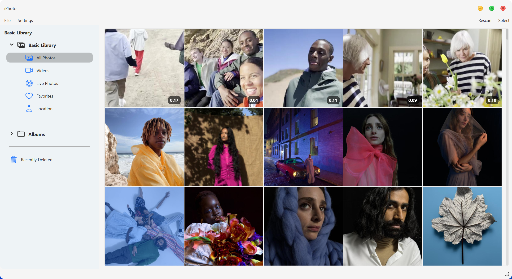
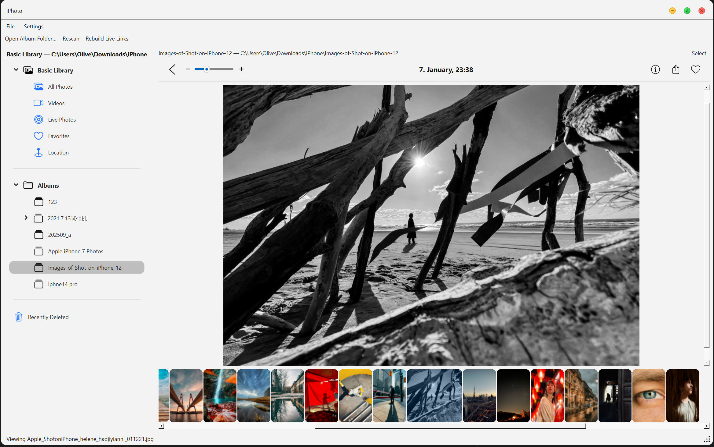
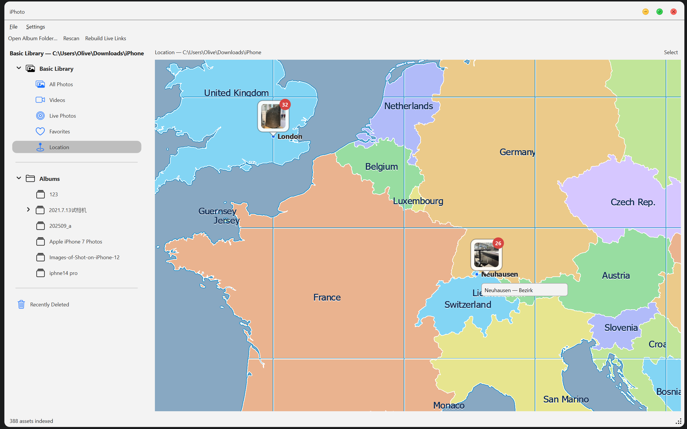
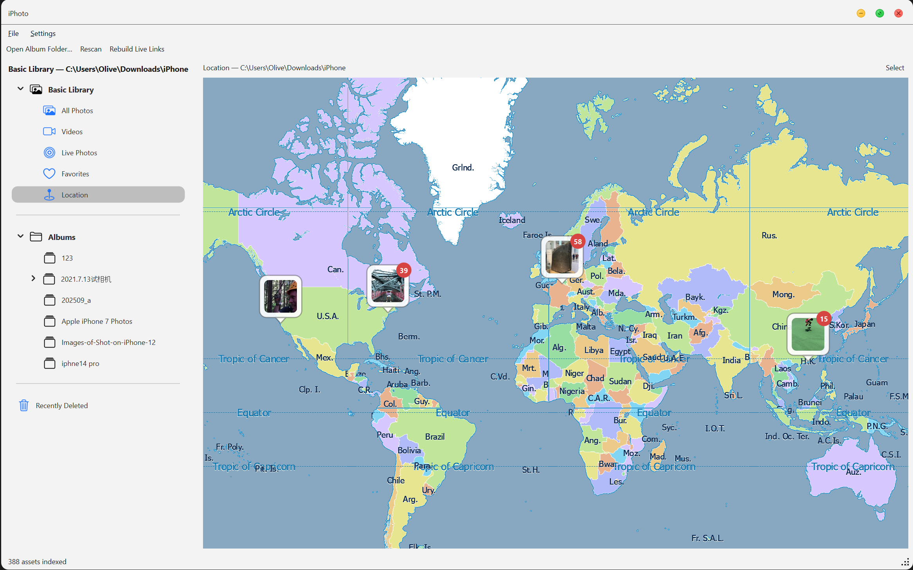
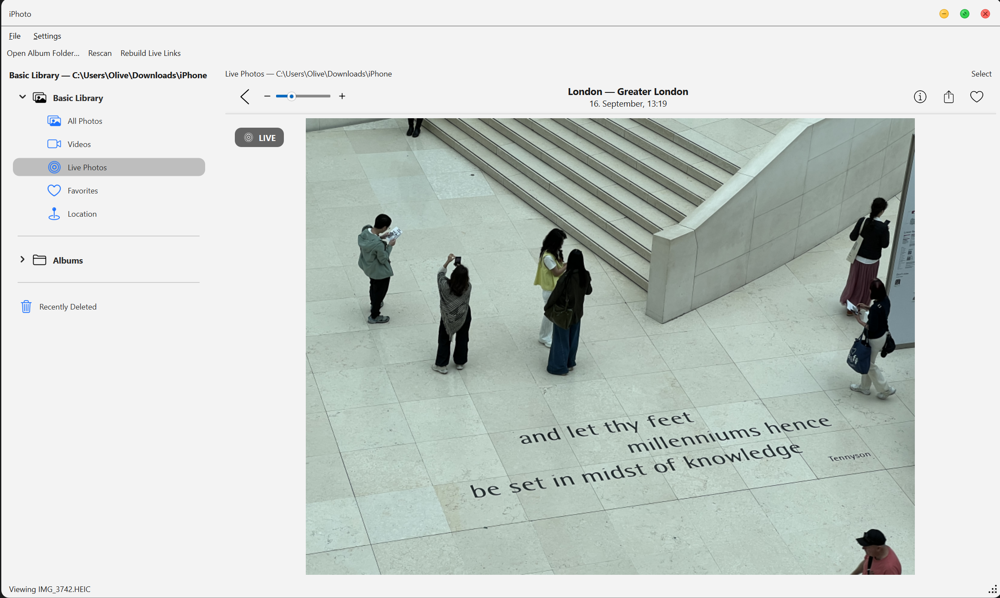
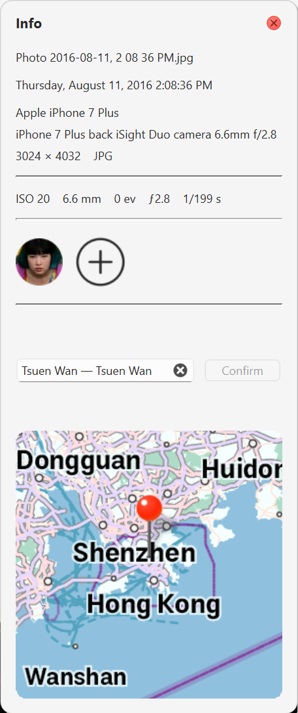

# 📸 iPhotron
> Bringen Sie die *Fotos*-Erfahrung von macOS auf Windows — ordnerbasierte, nicht-destruktive Fotoverwaltung mit Live Photo, Karten und intelligenten Alben.


-orange)

[](https://github.com/OliverZhaohaibin/iPhotos-LocalPhotoAlbumManager)

**Sprachen / Languages:**  
[](../../README.md) | [](README_zh-CN.md) | [](README_de.md)

---

## ☕ Unterstützung

[](https://buymeacoffee.com/oliverzhao)

## 📥 Download & Installation

[](https://github.com/OliverZhaohaibin/iPhotron-LocalPhotoAlbumManager/releases/download/v4.0.1/v4.01.exe)

**💡 Schnellinstallation:** Klicken Sie auf die Schaltfläche oben, um das neueste Windows-Installationsprogramm (.exe) direkt herunterzuladen.

**Für Entwickler:**

```bash
pip install -e .
```

---

## 🚀 Schnellstart

### GUI

```bash
iphoto-gui
```

Oder direkt ein bestimmtes Album öffnen:

```bash
iphoto-gui /fotos/LondonReise
```

### CLI

```bash
# Album initialisieren (erstellt .iphoto.album.json)
iphoto init /pfad/zum/album

# Dateien scannen und Index erstellen
iphoto scan /pfad/zum/album

# Live Photos paaren (HEIC/JPG + MOV)
iphoto pair /pfad/zum/album

# Album-Bericht generieren
iphoto report /pfad/zum/album
```

---

## 🌟 Star-Verlauf

[](https://www.star-history.com/#OliverZhaohaibin/iPhotron-LocalPhotoAlbumManager&type=date&legend=bottom-right)

---

## 🌟 Überblick

**iPhotron** ist ein **ordnerbasierter Foto-Manager**, inspiriert von macOS *Fotos*.  
Es organisiert Ihre Medien mit leichtgewichtigen JSON-Manifesten und Cache-Dateien —  
bietet umfangreiche Album-Funktionalität und **hält alle Originaldateien intakt**.

Wichtige Highlights:
- 🗂 Ordnerbasiertes Design — jeder Ordner *ist* ein Album, kein Import erforderlich.
- ⚙️ JSON-basierte Manifeste zeichnen "menschliche Entscheidungen" auf (Cover, Favoriten, Reihenfolge).
- ⚡ **SQLite-gestützte globale Datenbank** für blitzschnelle Abfragen auf massiven Bibliotheken.
- 🧠 Intelligentes inkrementelles Scannen mit persistentem SQLite-Index.
- 🎥 Vollständige **Live Photo**-Paarungs- und Wiedergabeunterstützung.
- 🗺 Kartenansicht, die GPS-Metadaten über alle Fotos und Videos visualisiert.


---

## ✨ Funktionen

### 🗺 Standortansicht
Zeigt Ihre Foto-Fußabdrücke auf einer interaktiven Karte und gruppiert nahe gelegene Fotos nach GPS-Metadaten.



### 🎞 Live Photo-Unterstützung
Paart nahtlos HEIC/JPG- und MOV-Dateien mithilfe von Apples `ContentIdentifier`.  
Ein "LIVE"-Badge erscheint auf Standbildern — klicken Sie, um das Bewegungsvideo inline abzuspielen.


### 🧩 Intelligente Alben
Die Seitenleiste bietet eine automatisch generierte **Grundbibliothek**, die Fotos in Gruppen einteilt:
`Alle Fotos`, `Videos`, `Live Photos`, `Favoriten` und `Kürzlich gelöscht`.

### 🖼 Immersive Detailansicht
Ein eleganter Foto-/Videobetrachter mit Filmstreifen-Navigator und schwebendem Wiedergabebalken.

### 🎨 Nicht-destruktive Fotobearbeitung
Eine umfassende Bearbeitungssuite mit **Anpassen**- und **Zuschneiden**-Modi:

#### Anpassen-Modus
- **Lichtanpassungen:** Brillanz, Belichtung, Lichter, Schatten, Helligkeit, Kontrast, Schwarzpunkt
- **Farbanpassungen:** Sättigung, Lebendigkeit, Farbstich (Weißabgleichkorrektur)
- **Schwarzweiß:** Intensität, Neutraltöne, Ton, Körnung mit künstlerischen Film-Voreinstellungen
- **Farbkurven:** RGB- und kanalbasierter (R/G/B) Kurven-Editor mit ziehbaren Kontrollpunkten für präzise Tonanpassungen
- **Selektive Farbe:** Zielt auf sechs Farbbereiche (Rot/Gelb/Grün/Cyan/Blau/Magenta) mit unabhängigen Farbton-/Sättigungs-/Helligkeitskontrollen
- **Tonwerte:** 5-Punkt-Eingangs-Ausgangs-Tonzuordnung mit Histogramm-Hintergrund und kanalbasierter Steuerung
- **Master-Schieberegler:** Jeder Abschnitt verfügt über einen intelligenten Master-Schieberegler, der Werte auf mehrere Feinabstimmungssteuerungen verteilt
- **Live-Miniaturansichten:** Echtzeit-Vorschaustreifen, die den Effektbereich für jede Anpassung zeigen


#### Zuschneiden-Modus
- **Perspektivkorrektur:** Vertikale und horizontale Trapezverzerrungsanpassungen
- **Ausrichten-Werkzeug:** ±45° Drehung mit Sub-Grad-Präzision
- **Spiegeln (Horizontal):** Horizontale Spiegelungsunterstützung
- **Interaktives Zuschneiderechteck:** Ziehbare Griffe, Kantenfang und Seitenverhältnisbeschränkungen
- **Schwarzrand-Prävention:** Automatische Validierung stellt sicher, dass nach Perspektivtransformationen keine schwarzen Kanten erscheinen
  

Alle Bearbeitungen werden in `.ipo`-Sidecar-Dateien gespeichert und bewahren die Originalfotos unberührt.

### ℹ️ Schwebendes Info-Panel
Schalten Sie ein schwebendes Metadaten-Panel um, das EXIF, Kamera-/Objektivinformationen, Belichtung, Blende, Brennweite, Dateigröße und mehr anzeigt.


### 💬 Umfangreiche Interaktionen
- Ziehen und Ablegen von Dateien direkt aus dem Explorer/Finder in Alben.
- Mehrfachauswahl und Kontextmenüs für Kopieren, In Ordner anzeigen, Verschieben, Löschen, Wiederherstellen.
- Sanfte Miniaturansichts-Übergänge und macOS-ähnliche Album-Navigation.

---

## 📚 Dokumentation

Detaillierte technische Dokumentation (auf Englisch):

[](../architecture.md)
[](../development.md)
[](../security.md)
[](../CHANGELOG.md)

| Dokument | Beschreibung |
|----------|-------------|
| [Architecture](../architecture.md) | Gesamtarchitektur, Modulgrenzen, Datenfluss, wichtige Designentscheidungen |
| [Development](../development.md) | Entwicklungsumgebung, Abhängigkeiten, Build/Paket, Debugging, Code-Stil, Commit-Konventionen |
| [Security](../security.md) | Berechtigungen, Verschlüsselung, Datenspeicherorte, Bedrohungsmodell |
| [Changelog](../CHANGELOG.md) | Alle Versionshinweise und Änderungen |

---

## 📄 Lizenz

**MIT-Lizenz © 2025**  
Erstellt von **Haibin Zhao (OliverZhaohaibin)**  

> *iPhotron — Ein ordnerbasiertes, menschenlesbares und vollständig wiederaufbaubares Fotosystem.*  
> *Keine Importe. Keine Datenbank. Nur Ihre Fotos, elegant organisiert.*
