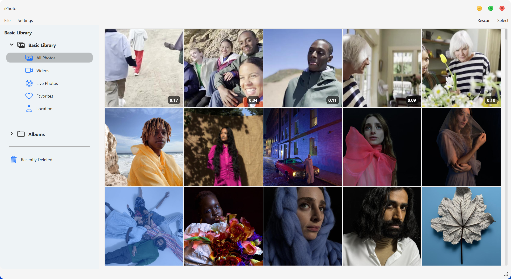

# 📸 iPhotron

> 一款受 macOS「照片」启发、以文件夹为原生相册结构的 Windows / macOS / Linux 本地照片管理器。

**语言：** [English](../../README.md) · [简体中文](README_zh-CN.md) · [Deutsch](README_de.md)

## 发布版与开发分支说明

**下面的下载链接对应已经发布的 v6.6.8 二进制文件。** 本 README 的功能概览同时描述当前
`edit-base` 开发分支，因此可能包含尚未发布（Unreleased）的功能。开发分支中已经实现的功能，
并不代表一定存在于 v6.6.8 二进制文件中。当前分支变更见
[`docs/CHANGELOG.md`](../CHANGELOG.md)。

## v6.6.8 下载

| 平台 | 发布文件 |
| --- | --- |
| Windows | [`v6.68-x86-setup.exe`](https://github.com/OliverZhaohaibin/iPhotron-LocalPhotoAlbumManager/releases/download/v6.6.8/v6.68-x86-setup.exe) |
| Debian | [`iphotron_6.6.8_amd64.deb`](https://github.com/OliverZhaohaibin/iPhotron-LocalPhotoAlbumManager/releases/download/v6.6.8/iphotron_6.6.8_amd64.deb) |
| AppImage | [`iPhotron-6.6.8-x86_64.AppImage`](https://github.com/OliverZhaohaibin/iPhotron-LocalPhotoAlbumManager/releases/download/v6.6.8/iPhotron-6.6.8-x86_64.AppImage) |
| Flatpak | [`com.github.OliverZhaohaibin.iPhotron-6.6.8-x86_64.flatpak`](https://github.com/OliverZhaohaibin/iPhotron-LocalPhotoAlbumManager/releases/download/v6.6.8/com.github.OliverZhaohaibin.iPhotron-6.6.8-x86_64.flatpak) |

`v6.68-x86-setup.exe` 就是 v6.6.8 Release 中实际发布的 Windows 文件名，并非 README 笔误。

v6.6.8 已经存在 Flatpak 发布文件，但当前开发分支**没有**维护中的仓库内 Flatpak manifest / 构建流程。
“已有可下载的 Release artifact”和“当前源码可以复现构建”是两件不同的事。详见
[`BUILD_FLATPAK.md`](../misc/BUILD_FLATPAK.md)。当前仓库中可复现的 Linux 打包说明包括
[Debian](../misc/BUILD_DEB.md) 和 [AppImage](../misc/BUILD_APPIMAGE.md)。

## 从源码运行

```bash
python -m venv .venv
source .venv/bin/activate
pip install -e .
iphoto-gui
```

安装后的 GUI 入口为 `iPhoto.entrypoint:main`。

## 当前开发分支主要能力

- 文件夹即相册，无需额外导入。
- 基于 SQLite 的大型图库查询与稀疏异步 Gallery 窗口。
- 按视口需求调度缩略图，并通过 generation 防止快速滚动时旧结果回写。
- Live Photo 配对与播放。
- 可选的离线 OsmAnd 地图运行时。
- 可选 People 人脸识别：姓名、封面、群组、隐藏状态、手工人脸等。
- 可选 Pets 猫/狗识别：身份聚类以及持久化姓名、封面、隐藏等用户状态。
- GPU-first Detail 渲染，以及 Detail/Edit 共享渲染会话。
- 基于 `.ipo` sidecar 的非破坏性编辑。
- Assign Location：先保存本地状态，再尽力写回原文件 GPS 元数据。



## People & Pets

People 与 Pets 是两个独立的可选 bounded context。它们各自拥有独立的运行时索引和持久化状态，
UI 可以在卡片、群组、Gallery 查询和 Detail 标注层进行组合。

当前 Pets 身份聚类版本为 `species-bounded-single-link-v3`：猫狗分开聚类，遵守 cannot-link
约束，并限制 cluster diameter，避免单链式聚类无限扩张。

People/Pets 冲突规则**不是**无条件的“People 永远优先”。当宠物框与人脸框强烈重叠时，通常会
抑制宠物候选；但如果检测框明显更大、仍像完整宠物身体、只是包含了较小的人脸框，则满足当前
尺寸/图像覆盖率例外时可以保留该宠物检测。

识别推理也是按功能首次使用激活：只有用户真正打开 People 页面，并且第一个 viewport 已准备好后，
才会启动 People/Pets 扫描；普通应用启动本身不会自动触发识别推理。

DINOv2 在生产运行时加载预先生成的 TorchScript artifact，并通过 model manifest 校验。
当前 manifest 的 `torchscript_url: null`，因此 DINOv2 目前必须由打包流程包含或显式 staging；
`src/extension/models` 只是打包/staging 约定，并不保证 fresh clone 中存在全部模型。

详细运行时规则见 [`PETS_RECOGNITION_RUNTIME.md`](../misc/PETS_RECOGNITION_RUNTIME.md)。

## 架构与打包状态

`DesktopCoordinatorRuntime` 是当前桌面端 coordinator graph 的 production composition root；
`main_coordinator.py` 仅保留 compatibility import。

当前维护文档：

- [`AGENT.md`](../../AGENT.md)
- [`docs/architecture.md`](../architecture.md)
- [`docs/development.md`](../development.md)
- [`docs/security.md`](../security.md)
- [`docs/requirements/README.md`](../requirements/README.md)

| 打包目标 | 当前分支状态 |
| --- | --- |
| Windows / Nuitka | 有维护中的构建说明 |
| Debian | 有仓库内可复现说明 |
| AppImage | 有仓库内可复现说明 |
| Flatpak | v6.6.8 有下载文件；当前仓库内构建流程缺失 |

## License

MIT，见 [`LICENSE`](../../LICENSE)。
