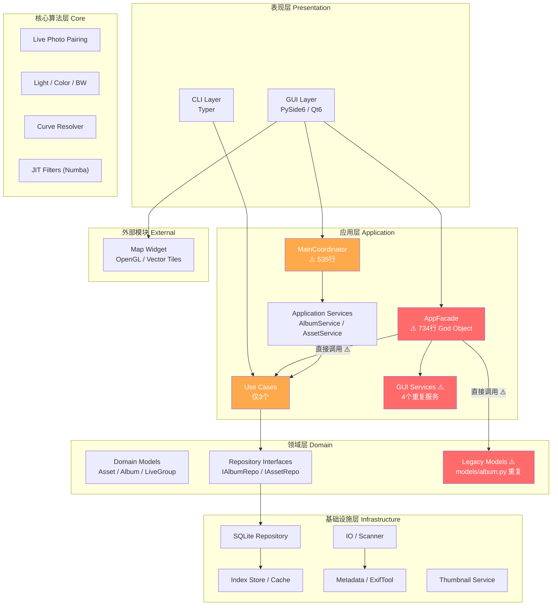
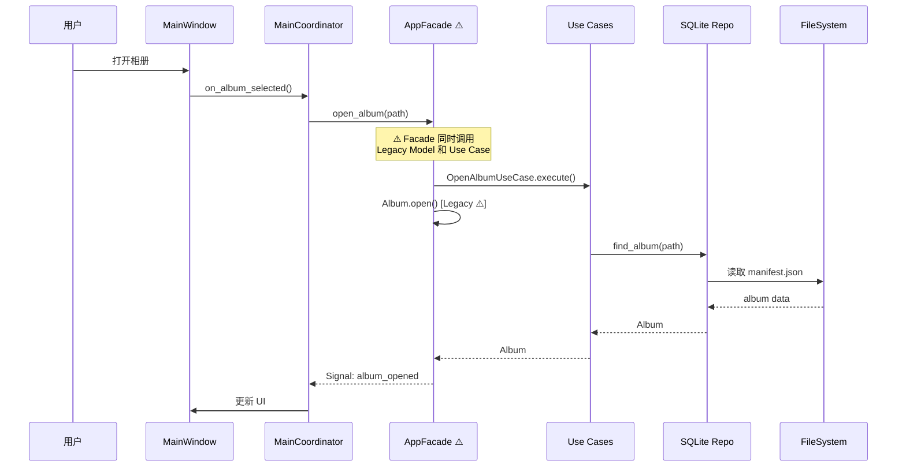
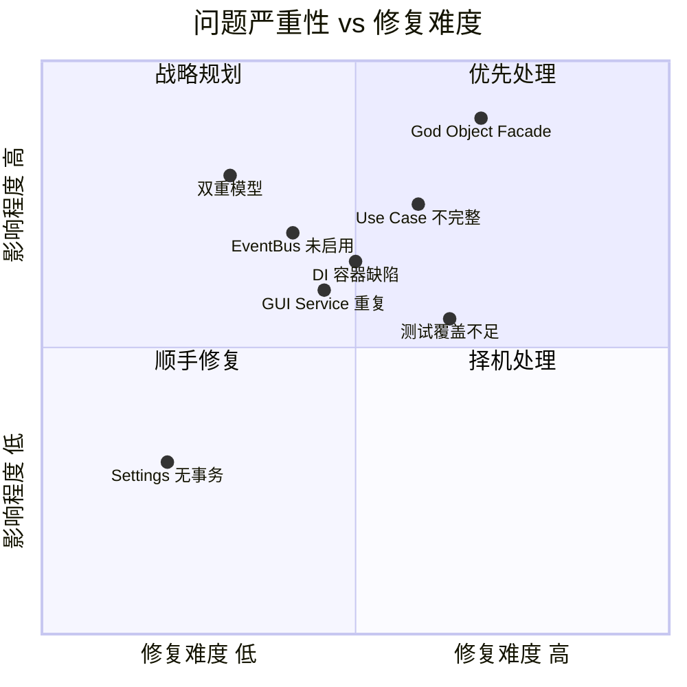
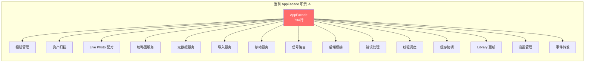
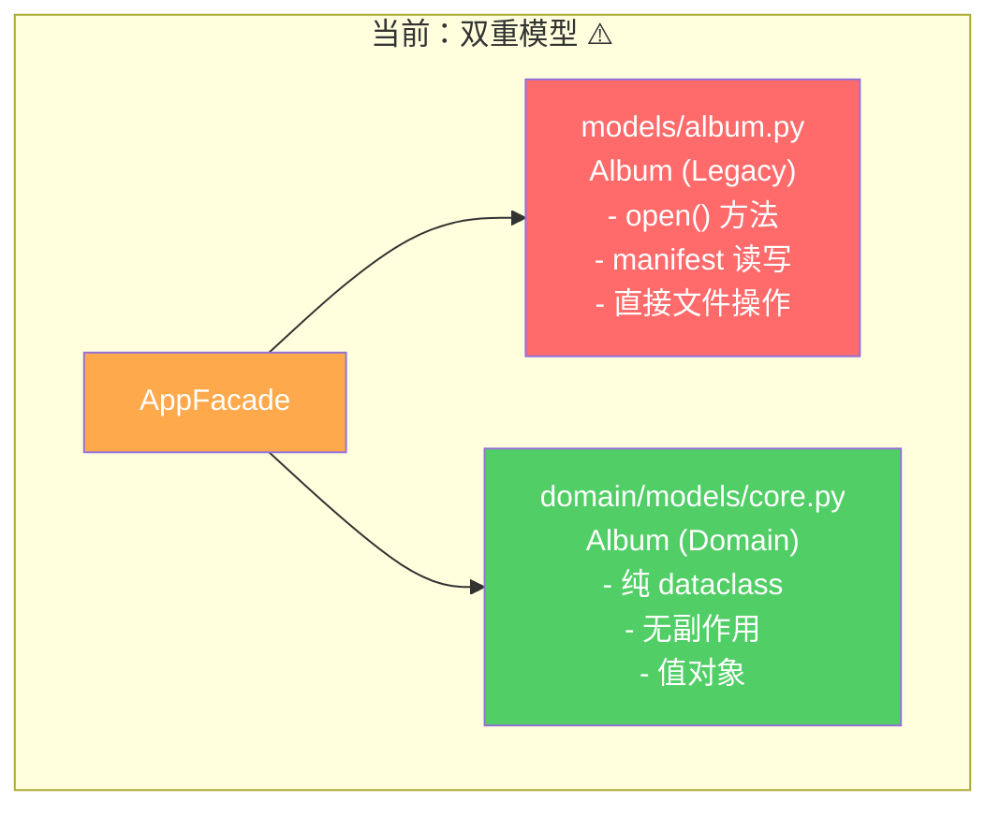
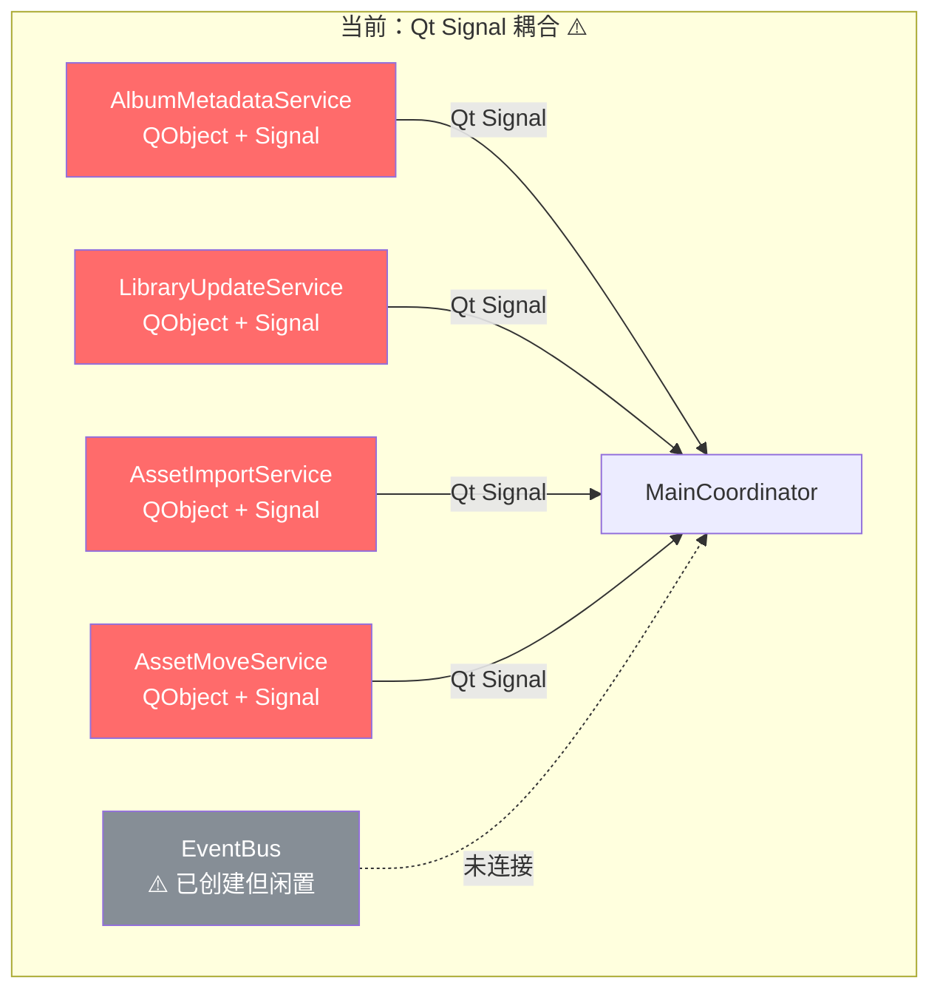
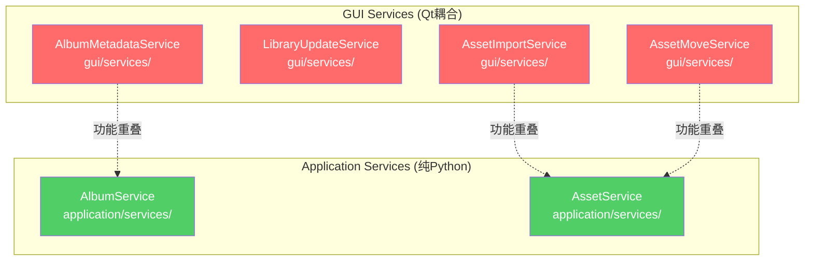
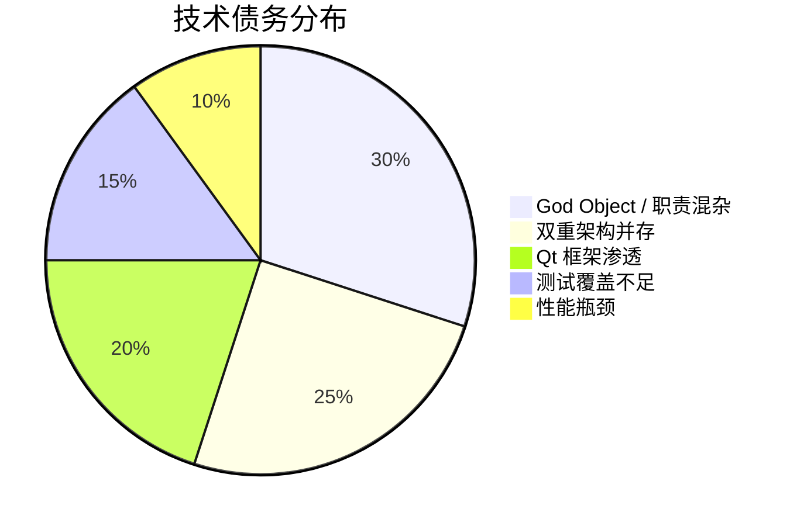

# 01 — 现有架构分析

> 基于代码审计（2026-02）对 iPhoton 项目的架构现状进行全面诊断。

---

## 1. 项目总体架构全景

### 1.1 现有层次结构

### 1.2 数据流概览

---

## 2. 核心问题诊断

### 2.1 问题全景 — 严重性矩阵

### 2.2 问题一：God Object — AppFacade (734行)

**文件**: `src/iPhoto/gui/facade.py`

**症状**:
- 一个类承担了 15+ 个职责
- 继承 `QObject`，导致业务逻辑与 Qt 框架深度耦合
- 暴露 15+ 个 `Signal()` 实例，所有 GUI 组件都依赖它
- 直接调用 `backend.open_album()`，同时又使用 Use Case

**影响**:
- 任何业务逻辑变更都需要修改此文件
- 无法在非 Qt 环境下测试业务逻辑
- 信号连接形成隐式依赖图，难以追踪数据流

### 2.3 问题二：双重模型并存

**冲突来源**:

| 文件路径 | 类型 | 状态 |
|---------|------|------|
| `src/iPhoto/domain/models/core.py` | 新 Domain Model (dataclass) | ✅ 纯净，无框架依赖 |
| `src/iPhoto/models/album.py` (117行) | Legacy Model (带 manifest 读写) | ⚠️ 仍在使用 |
| `src/iPhoto/models/types.py` | Legacy 类型定义 | ⚠️ 与 domain 重复 |

**问题**:
- `facade.py` 中同时引用两套模型
- `Album.open()` (legacy) 与 `OpenAlbumUseCase.execute()` (new) 并行调用
- 数据在两套模型之间转换时存在不一致风险

### 2.4 问题三：EventBus 创建但未使用

**文件**: `src/iPhoto/events/bus.py` (~50行)

**现状**:
- EventBus 已实现（`ThreadPoolExecutor` + 发布/订阅）
- `MainCoordinator` 中已解析 EventBus（line 77）
- **但从未实际发布或订阅任何事件**
- 所有跨层通信仍依赖 Qt Signal

**问题**:
- Qt Signal 将 GUI 框架渗透到 Service 层
- 非 GUI 环境（CLI、测试）无法使用信号机制
- 事件追踪困难，没有统一的事件日志

### 2.5 问题四：DI 容器缺陷

**文件**: `src/iPhoto/di/container.py` (~44行)

**已知缺陷**:
1. **无循环依赖检测** — A→B→A 将导致无限递归
2. **Lambda 闭包陷阱** — `args`/`kwargs` 在注册时捕获，非解析时
3. **无惰性初始化** — 所有依赖在解析时立即创建
4. **无生命周期管理** — 没有 Singleton / Transient / Scoped 区分
5. **无构造函数签名保留** — 工厂模式丢失类型信息

**影响**:
- `MainCoordinator` 手动解析服务而非注入（lines 76-82）
- 部分服务仍使用 `@property` getter 而非构造函数注入
- Legacy Facade 完全绕过 DI

### 2.6 问题五：Use Case 覆盖不足

**已实现** (3个):

| Use Case | 文件 | 状态 |
|----------|------|------|
| `OpenAlbumUseCase` | `application/use_cases/open_album.py` | ✅ |
| `ScanAlbumUseCase` | `application/use_cases/scan_album.py` | ✅ |
| `PairLivePhotosUseCase` | `application/use_cases/pair_live_photos.py` | ✅ |

**缺失** (至少需要):

| 业务场景 | 当前处理方式 |
|---------|-------------|
| 资产导入 | Facade 直接调用 |
| 资产移动 | GUI Service (AssetMoveService) |
| 缩略图生成 | GUI Service + Coordinator 直连 |
| 元数据更新 | Facade 直接调用 |
| 相册创建/删除 | Legacy Model 方法 |
| 回收站管理 | LibraryManager 直接处理 |
| 地理编码聚合 | LibraryManager 直接处理 |
| 文件系统监控 | LibraryManager 直接处理 |

### 2.7 问题六：GUI 层大文件

**超过 500 行的文件**:

| 文件 | 行数 | 职责混杂 |
|------|------|---------|
| `gui/facade.py` | 734 | 15+ 职责 |
| `gui/coordinators/main_coordinator.py` | 535 | UI编排 + DI + Service连线 |
| `gui/ui/widgets/gl_image_viewer/widget.py` | 686 | 缩放/平移/裁剪/调整 |
| `gui/ui/widgets/edit_sidebar.py` | 1052 | 300行 `__init__` + 40+ 信号 |
| `gui/ui/widgets/edit_curve_section.py` | 1165 | 数学算法 + UI |
| `infrastructure/services/thumbnail_loader.py` | 963 | 缓存/渲染/调度 |

### 2.8 问题七：GUI Service 与 Application Service 重复

---

## 3. 架构债务总结

### 3.1 量化评估

| 指标 | 当前值 | 行业基准 | 差距 |
|------|--------|---------|------|
| 最大文件行数 | 1,165行 | ≤300行 | 🔴 3.9x |
| God Object 数量 | 2 (Facade+Coordinator) | 0 | 🔴 |
| 重复模型 | 2套 (models/ + domain/) | 1套 | 🟠 |
| Use Case 覆盖率 | 3/11 (27%) | ≥90% | 🔴 |
| EventBus 使用率 | 0% (已创建未使用) | 100% | 🔴 |
| DI 覆盖率 | ~40% (部分手动) | ≥95% | 🟠 |
| Qt 渗透层数 | 3 (GUI+Service+Facade) | 1 (仅GUI) | 🔴 |
| 测试覆盖率 (集成) | ~0% | ≥60% | 🔴 |

### 3.2 技术债务风险评级

---

## 4. 积极方面

尽管存在上述问题，项目已具备良好的重构基础：

1. ✅ **Domain 层已建立** — `domain/models/core.py` 是纯净的值对象
2. ✅ **Repository 接口已定义** — `IAlbumRepository`, `IAssetRepository`
3. ✅ **3个 Use Case 已实现** — 可作为后续 Use Case 的模板
4. ✅ **DI 容器已存在** — 虽不完善但框架已搭好
5. ✅ **EventBus 已实现** — 只需接入使用
6. ✅ **测试基础设施完善** — pytest + pytest-qt + 123个测试文件
7. ✅ **代码质量工具已配置** — ruff + black + mypy
8. ✅ **文档基础良好** — README、CONTRIBUTING 已建立

> **结论**：项目处于架构转型的中间阶段。旧架构和新架构并存是过渡期的正常现象，但需要有明确的迁移计划来避免长期维持双轨制的成本。
