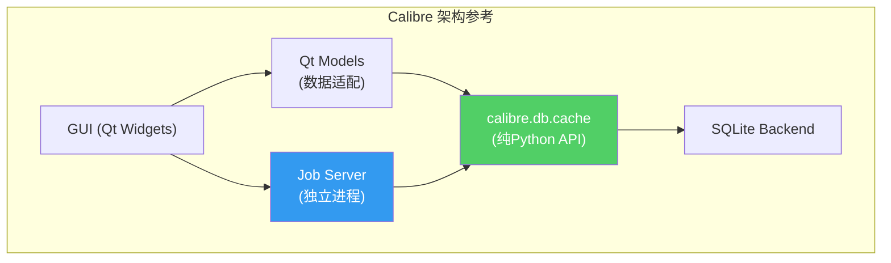
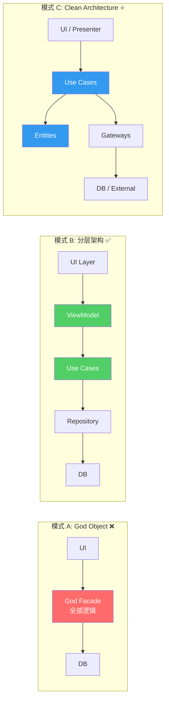
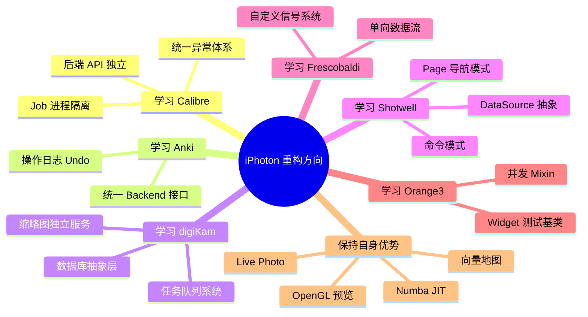

# 02 — 行业对标分析：开源相册与大型 Python GUI 工程

> 参考业界优秀实践，为 iPhoton 重构提供方向性指导。

---

## 1. 开源相册项目对标

### 1.1 digiKam — KDE 专业照片管理

| 维度 | digiKam | iPhoton 现状 | 差距与启示 |
|------|---------|-------------|-----------|
| **架构模式** | 严格 MVC + Plugin 体系 | MVC→MVVM 过渡中 | 需完成架构迁移 |
| **数据库** | SQLite / MySQL 可选，DB抽象层 | SQLite 硬编码 | 应提供 DB 抽象 |
| **插件系统** | KPart 插件架构，核心可扩展 | 无插件机制 | 未来可考虑 |
| **图像处理** | 独立 Digikam::DImg 管线 | Core + Numba JIT | ✅ 已有良好基础 |
| **元数据** | Exiv2 库直接绑定 | ExifTool 子进程调用 | 可考虑 pyexiv2 |
| **缩略图** | 独立 ThumbnailCreator + 磁盘缓存 | GUI Service 中混合处理 | 应拆分为独立服务 |
| **线程模型** | Qt Concurrent + Job 队列 | QThreadPool + QRunnable | ✅ 方向一致 |
| **测试** | KDE CI + 单元测试 | pytest 123文件，缺集成测试 | 需补充集成测试 |

**关键学习点**:
- **DB 抽象层**: digiKam 的 `CoreDB` / `ThumbsDB` / `FaceDB` 分库设计，各库职责单一
- **管线模式**: 图像处理管线 `DImg → Filter → DImg` 链式调用，与 UI 完全解耦
- **Job 系统**: 统一的后台任务队列，支持优先级、取消、进度回报

### 1.2 Shotwell — GNOME 照片管理器

| 维度 | Shotwell | iPhoton 现状 | 差距与启示 |
|------|----------|-------------|-----------|
| **架构** | MVC + 命令模式 (Undo/Redo) | 无 Undo/Redo | 应引入命令模式 |
| **非破坏编辑** | Sidecar + Pipeline | `.ipo` JSON sidecar | ✅ 方向一致 |
| **数据源** | 统一 DataSource 接口 | AssetDataSource 930行 God Object | 应拆分 |
| **视图切换** | Page 模式 (LibraryPage, PhotoPage) | 混合在 MainWindow 中 | 应引入 Page 模式 |
| **导入** | 独立 ImportJob 线程安全 | Facade 直接调用 | 应提取为 Use Case |
| **批处理** | BatchImport + Progress | 无批处理框架 | 应建立统一框架 |

**关键学习点**:
- **命令模式**: 所有编辑操作封装为 `Command` 对象，支持 Undo/Redo
- **DataSource 抽象**: 统一的数据源接口，Grid/Detail/Filmstrip 共享
- **Page 导航**: 清晰的页面切换模型，每个页面独立管理自己的状态

### 1.3 Lychee — Web 端相册 (PHP/Vue)

| 维度 | Lychee | iPhoton 现状 | 启示 |
|------|--------|-------------|------|
| **前后端分离** | REST API + Vue SPA | 直接函数调用 | CLI/GUI 可通过 Service 层统一 |
| **相册模型** | Album → Photo 简洁关系 | 多层嵌套 | ✅ Domain 模型已足够简洁 |
| **上传处理** | Job 队列 (Laravel Queue) | 同步处理 | 应引入任务队列 |

---

## 2. 大型 Python GUI 工程对标

### 2.1 Calibre — 电子书管理 (Python + Qt)

> **规模**: ~60万行代码，Python 2→3 成功迁移，全球最大的桌面 Python/Qt 应用之一

| 维度 | Calibre | iPhoton 现状 | 差距与启示 |
|------|---------|-------------|-----------|
| **架构** | 严格后端/前端分离 | Facade 混合 | 应学习其分离模式 |
| **后端 API** | `calibre.db.cache` 纯 Python API | `app.py` Backend Facade | ✅ 方向一致 |
| **GUI 架构** | Qt Model/View + Delegate | MVVM Coordinator | 各有优劣 |
| **Job 系统** | `calibre.utils.ipc.job` 独立进程 | QThreadPool | 考虑进程隔离 |
| **插件** | 完善的 Plugin API | 无 | 长期目标 |
| **国际化** | gettext 全面国际化 | 无 | 可后续添加 |
| **错误处理** | 统一异常层次 | 不一致 | 需建立错误体系 |

**关键学习点**:
- **后端完全独立**: `calibre.db` 可独立于 GUI 使用（命令行、Web服务器）
- **Job 隔离**: 长时间任务在独立进程运行，通过 IPC 通信，不会崩溃 GUI
- **Model/View 分层**: Qt Model 只做数据适配，业务逻辑在后端

### 2.2 Anki — 间隔重复学习 (Python + Qt + Rust)

> **规模**: Python + Rust 混合，Qt 前端，全球最流行的闪卡应用

| 维度 | Anki | iPhoton 现状 | 差距与启示 |
|------|------|-------------|-----------|
| **核心层** | Rust `anki-core` (性能关键路径) | Numba JIT + NumPy | ✅ 类似思路 |
| **协议层** | Protobuf 前后端通信 | Qt Signal 直连 | 应引入消息协议 |
| **后端 API** | `AnkiBackend` 统一接口 | `App` + `AppFacade` 双重 | 应统一为单一接口 |
| **Undo 系统** | 操作日志 + 快照 | 无 | 应引入 |
| **同步** | 增量同步协议 | 无（本地应用） | N/A |

**关键学习点**:
- **后端统一接口**: 一个 `Backend` 类暴露所有操作，GUI 通过它通信
- **操作日志**: 每个修改操作记录为可逆操作，支持任意层级 Undo
- **Rust 性能层**: 性能关键代码用 Rust 实现，Python 层保持简洁

### 2.3 Frescobaldi — 乐谱编辑器 (Python + Qt)

> **规模**: ~3万行，PySide/PyQt，MVVM 风格

| 维度 | Frescobaldi | iPhoton 现状 | 差距与启示 |
|------|-------------|-------------|-----------|
| **信号系统** | 自定义 Signal 库 (不依赖Qt) | Qt Signal 全量使用 | 应抽象信号层 |
| **文档模型** | 纯 Python Document 模型 | Domain Model ✅ | 方向一致 |
| **视图** | Qt View 只订阅模型变化 | View 直接操作数据 | 应改为单向数据流 |
| **Session** | Session 管理工作区状态 | AppContext 全局状态 | 应引入 Session |

**关键学习点**:
- **自定义信号系统**: 不依赖 Qt 的信号/槽机制，纯 Python 实现，可跨平台复用
- **单向数据流**: Model → ViewModel → View，View 通过 Command 修改 Model

### 2.4 Orange3 — 数据科学可视化 (Python + Qt)

> **规模**: ~20万行，PySide6/PyQt5，Widget-based 数据分析

| 维度 | Orange3 | iPhoton 现状 | 启示 |
|------|---------|-------------|------|
| **Widget 系统** | 独立 OWWidget 基类 + 信号/数据端口 | 零散 Widget | 可参考 Widget 基类 |
| **Settings** | 声明式 Settings (类属性 + 自动持久化) | SettingsManager | 可借鉴声明式设计 |
| **并发模型** | `ConcurrentWidgetMixin` + Task | QRunnable | 可参考 Mixin 模式 |
| **测试** | `WidgetTest` 基类标准化测试 | pytest-qt 零散 | 应建立 Widget 测试基类 |

---

## 3. 行业最佳实践提炼

### 3.1 架构模式对比

### 3.2 最佳实践总结

| 实践 | 来源项目 | iPhoton 适用性 |
|------|---------|---------------|
| **后端 API 完全独立于 GUI** | Calibre, Anki | ⭐⭐⭐ 最高优先级 |
| **统一后端接口** | Anki Backend | ⭐⭐⭐ |
| **Job/Task 队列** | Calibre, digiKam | ⭐⭐⭐ |
| **命令模式 (Undo/Redo)** | Shotwell | ⭐⭐ 中期目标 |
| **自定义信号系统** | Frescobaldi | ⭐⭐⭐ 解耦 Qt |
| **Widget 测试基类** | Orange3 | ⭐⭐ |
| **DB 抽象层** | digiKam | ⭐ 长期目标 |
| **插件系统** | Calibre, digiKam | ⭐ 远期目标 |
| **图像处理管线** | digiKam DImg | ⭐⭐ 已有基础 |
| **声明式 Settings** | Orange3 | ⭐ 可借鉴 |

### 3.3 iPhoton 的独特优势

在对标分析中，iPhoton 也有一些领先于参考项目的地方：

1. ✅ **非破坏编辑**: `.ipo` sidecar 方案比 Shotwell 更灵活
2. ✅ **Live Photo 支持**: 在桌面端属于领先功能
3. ✅ **OpenGL 实时预览**: 比 digiKam 的 QGraphicsView 方案更高效
4. ✅ **Numba JIT 加速**: 比纯 Python 图像处理快 10-100x
5. ✅ **向量地图集成**: 独特的照片地理可视化方案
6. ✅ **DDD 领域建模**: 已建立的 Domain 层比多数开源相册更规范

---

## 4. 对标结论与重构方向

> **核心结论**: iPhoton 应以 **Calibre 的后端独立模式** 为主要参考，结合 **Anki 的统一后端接口** 和 **digiKam 的任务队列系统**，在保持自身 Live Photo、OpenGL、Numba 等技术优势的同时，完成从 God Object 到 Clean Architecture 的转型。
