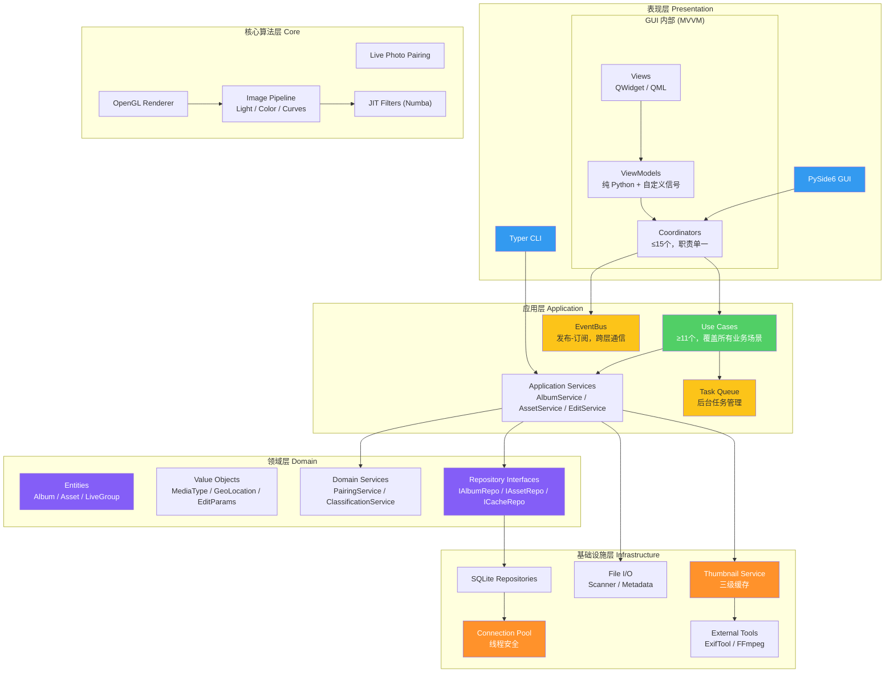
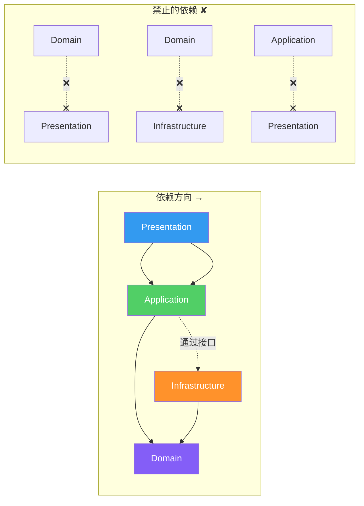
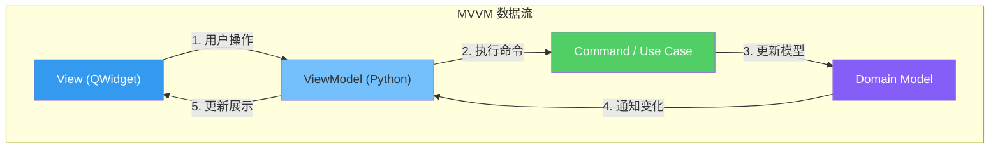
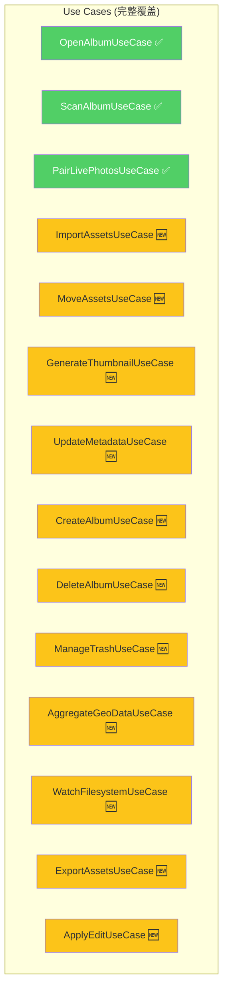
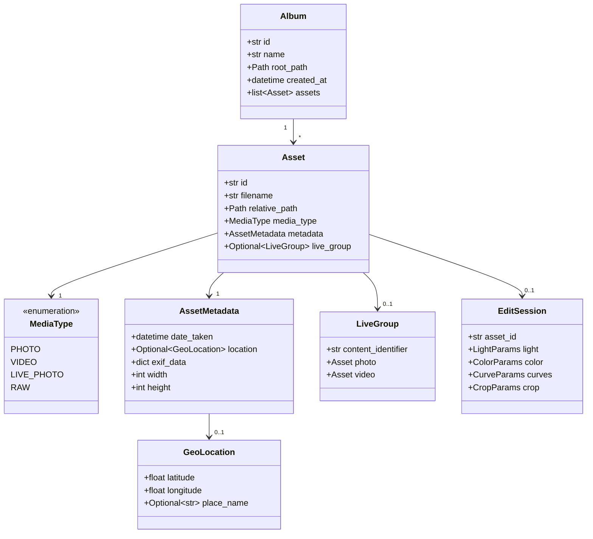
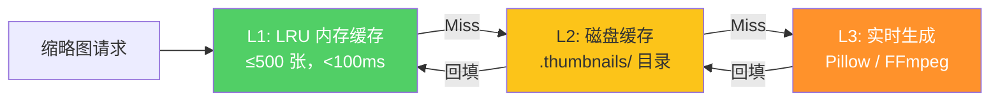
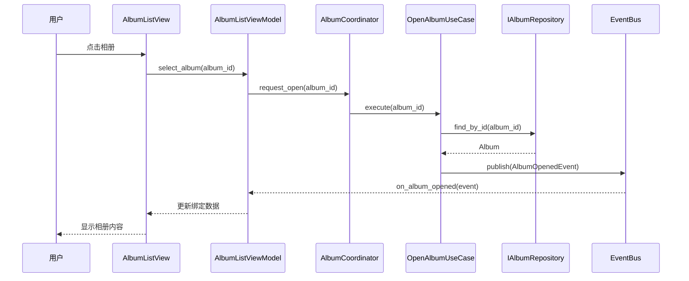
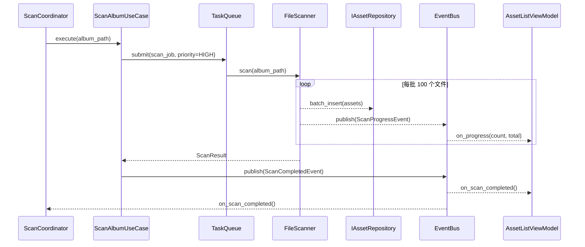
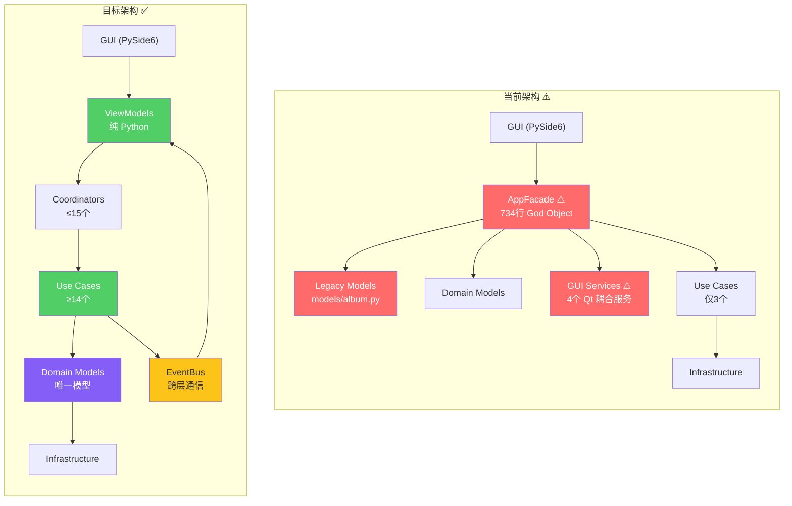
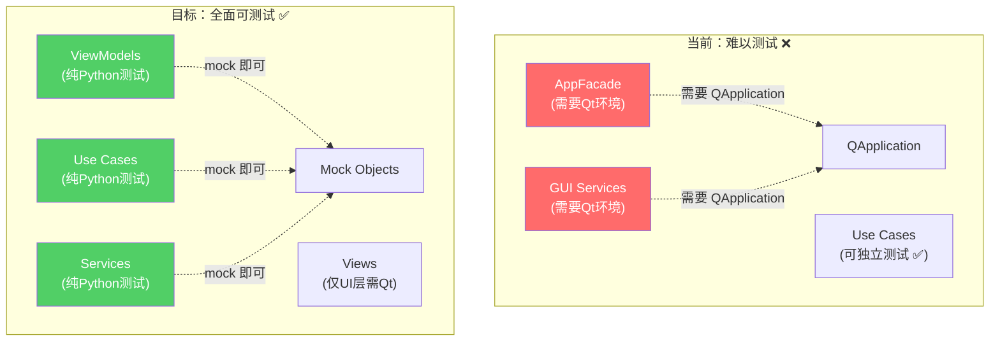

# 03 — 目标架构设计

> iPhoton 目标架构：MVVM + Clean Architecture，完全解耦 GUI 与业务逻辑。

---

## 1. 目标架构全景

### 1.1 层次结构



### 1.2 依赖规则（内层不依赖外层）



---

## 2. 各层详细设计

### 2.1 表现层 — MVVM 模式



**设计要点**:
- **View** 只负责渲染和用户输入捕获，不包含任何业务逻辑
- **ViewModel** 使用自定义信号（非 Qt Signal），可在非 GUI 环境测试
- **Coordinator** 负责页面导航和 ViewModel 生命周期管理
- 单向数据流：View → ViewModel → UseCase → Model → ViewModel → View

### 2.2 应用层 — Use Case 驱动

**目标 Use Case 清单**:



**EventBus 设计**:

```python
# 目标 EventBus 接口
class EventBus:
    def publish(self, event: DomainEvent) -> None: ...
    def subscribe(self, event_type: type, handler: Callable) -> Subscription: ...
    def unsubscribe(self, subscription: Subscription) -> None: ...

# 事件类型
class AlbumOpenedEvent(DomainEvent): ...
class ScanCompletedEvent(DomainEvent): ...
class AssetImportedEvent(DomainEvent): ...
class ThumbnailReadyEvent(DomainEvent): ...
class MetadataUpdatedEvent(DomainEvent): ...
```

### 2.3 领域层 — 统一模型



### 2.4 基础设施层 — 服务实现

**三级缩略图缓存**:



**连接池设计**:

```python
# 目标连接池接口
class ConnectionPool:
    def __init__(self, db_path: Path, max_connections: int = 4): ...
    def acquire(self) -> Connection: ...
    def release(self, conn: Connection) -> None: ...

    # 上下文管理器
    @contextmanager
    def connection(self) -> Generator[Connection, None, None]: ...
```

---

## 3. 目标数据流

### 3.1 打开相册流程（目标）



### 3.2 文件扫描流程（目标）



---

## 4. 当前架构 vs 目标架构对比

### 4.1 对比总览



### 4.2 量化目标

| 指标 | 当前值 | 目标值 | 改善 |
|------|--------|--------|------|
| 最大文件行数 | 1,165行 | ≤300行 | 🟢 -74% |
| God Object | 2个 | 0个 | 🟢 消除 |
| 重复模型 | 2套 | 1套 | 🟢 统一 |
| Use Case 覆盖 | 27% (3/11) | 100% (14/14) | 🟢 +73% |
| EventBus 使用率 | 0% | 100% | 🟢 全面启用 |
| DI 覆盖率 | ~40% | ≥95% | 🟢 +55% |
| Qt 渗透层数 | 3层 | 1层 (仅View) | 🟢 -67% |
| 测试覆盖率 | ~20% | ≥80% | 🟢 +60% |
| 扫描性能 (10K文件) | 85秒 | ≤30秒 | 🟢 -65% |
| UI 阻塞时间 | 8秒 | ≤200ms | 🟢 -97.5% |

---

## 5. 目标架构核心优势

### 5.1 可测试性



### 5.2 可维护性

- **单一职责**: 每个类 ≤300 行，职责明确
- **低耦合**: 通过接口和 EventBus 通信，修改一处不影响其他模块
- **高内聚**: 相关功能聚集在同一模块，减少跨模块修改

### 5.3 可扩展性

- **新功能添加**: 只需新增 Use Case + ViewModel，无需修改现有代码
- **新 UI 适配**: 换用 QML 或 Web 前端只需替换 View 层
- **新存储后端**: 实现 Repository 接口即可切换数据库

### 5.4 性能

- **并行扫描**: TaskQueue + Worker Pool，10K 文件 ≤30秒
- **三级缓存**: 缩略图命中率 >95%，首屏加载 <200ms
- **异步加载**: UI 线程零阻塞，所有 I/O 在后台完成
