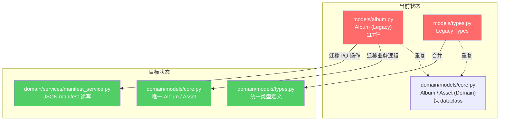
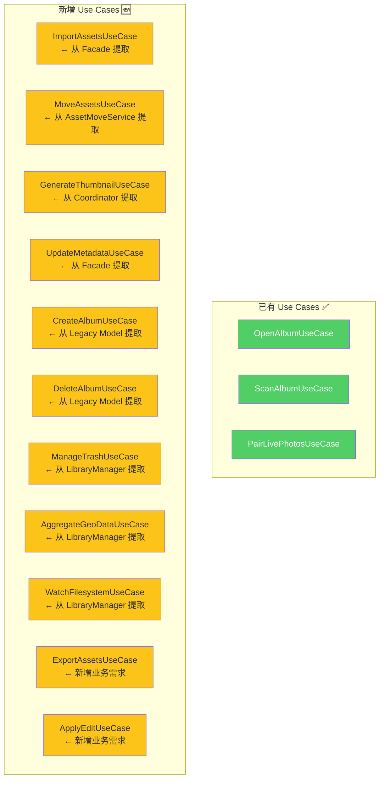
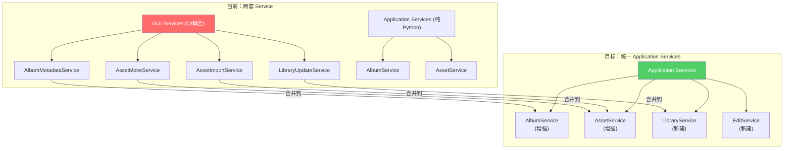
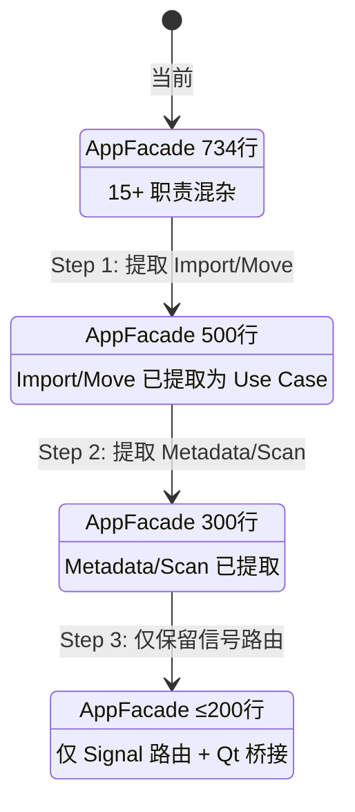

# 06 — 阶段二：领域与应用层整合

> 目标：消除双重模型、补全 Use Cases、整合 Service 层、瘦身 Facade。  
> 时间：4-5 周  
> 风险：🟠 中（涉及模型迁移，需要数据兼容）  
> 前置：阶段一完成

---

## 1. Legacy Model 迁移

### 1.1 迁移全景



### 1.2 迁移步骤

#### Step 1: 盘点 Legacy Model 使用点

```bash
# 需要先找到所有引用 models/album.py 的文件
grep -rn "from.*models.album" src/
grep -rn "from.*models.types" src/
```

#### Step 2: 提取 manifest I/O 到 Service

```python
# 目标: src/iPhoto/domain/services/manifest_service.py
class ManifestService:
    """JSON manifest 文件读写 — 从 Legacy Album.open() 提取"""

    def read_manifest(self, album_path: Path) -> dict:
        manifest_path = album_path / "manifest.json"
        if not manifest_path.exists():
            raise AlbumNotFoundError(f"Manifest not found: {manifest_path}")
        with open(manifest_path, "r", encoding="utf-8") as f:
            return json.load(f)

    def write_manifest(self, album_path: Path, data: dict) -> None:
        manifest_path = album_path / "manifest.json"
        # 原子写入，防止数据损坏
        tmp_path = manifest_path.with_suffix(".tmp")
        with open(tmp_path, "w", encoding="utf-8") as f:
            json.dump(data, f, indent=2, ensure_ascii=False)
        tmp_path.replace(manifest_path)
```

#### Step 3: 更新所有引用

```python
# 逐个文件替换
# Before:
from iPhoto.models.album import Album
album = Album.open(path)

# After:
from iPhoto.domain.models.core import Album
from iPhoto.domain.services.manifest_service import ManifestService
manifest_svc = container.resolve(ManifestService)
data = manifest_svc.read_manifest(path)
album = Album(**data)
```

#### Step 4: 废弃 Legacy 文件

```python
# src/iPhoto/models/album.py — 添加废弃警告
import warnings

warnings.warn(
    "iPhoto.models.album is deprecated. Use iPhoto.domain.models.core instead.",
    DeprecationWarning,
    stacklevel=2
)
```

### 1.3 兼容性保证

- 保留 `models/album.py` 文件 2 个版本周期，标记为 deprecated
- 新代码禁止引用 `models/` 包（通过 ruff 自定义规则检查）
- manifest.json 格式不变，确保旧数据可读

---

## 2. Use Case 补全

### 2.1 Use Case 清单与来源



### 2.2 Use Case 标准模板

```python
# src/iPhoto/application/use_cases/base.py
from abc import ABC, abstractmethod
from dataclasses import dataclass

@dataclass(frozen=True)
class UseCaseRequest:
    """Use Case 输入 DTO"""
    pass

@dataclass(frozen=True)
class UseCaseResponse:
    """Use Case 输出 DTO"""
    success: bool = True
    error: str | None = None

class UseCase(ABC):
    """Use Case 基类 — 每个实现对应一个业务用例"""

    @abstractmethod
    def execute(self, request: UseCaseRequest) -> UseCaseResponse:
        ...
```

### 2.3 优先级排序

| 优先级 | Use Case | 原因 |
|--------|----------|------|
| P0 | `ImportAssetsUseCase` | Facade 中最复杂的操作之一 |
| P0 | `MoveAssetsUseCase` | 已有独立 GUI Service，易提取 |
| P0 | `CreateAlbumUseCase` | Legacy Model 核心操作 |
| P1 | `DeleteAlbumUseCase` | 与 CreateAlbum 配对 |
| P1 | `GenerateThumbnailUseCase` | Coordinator 直接调用基础设施 |
| P1 | `UpdateMetadataUseCase` | Facade 直接调用 |
| P2 | `ManageTrashUseCase` | LibraryManager 职责拆分 |
| P2 | `AggregateGeoDataUseCase` | LibraryManager 职责拆分 |
| P2 | `WatchFilesystemUseCase` | LibraryManager 职责拆分 |
| P3 | `ExportAssetsUseCase` | 新功能 |
| P3 | `ApplyEditUseCase` | 新功能 |

### 2.4 示例：ImportAssetsUseCase

```python
# src/iPhoto/application/use_cases/import_assets.py
@dataclass(frozen=True)
class ImportAssetsRequest(UseCaseRequest):
    source_paths: list[Path]
    target_album_id: str
    copy_files: bool = True  # True=复制, False=移动

@dataclass(frozen=True)
class ImportAssetsResponse(UseCaseResponse):
    imported_count: int = 0
    skipped_count: int = 0
    failed_paths: list[str] = field(default_factory=list)

class ImportAssetsUseCase(UseCase):
    def __init__(
        self,
        asset_repo: IAssetRepository,
        album_repo: IAlbumRepository,
        scanner: FileScanner,
        event_bus: EventBus,
    ):
        self._asset_repo = asset_repo
        self._album_repo = album_repo
        self._scanner = scanner
        self._event_bus = event_bus

    def execute(self, request: ImportAssetsRequest) -> ImportAssetsResponse:
        album = self._album_repo.find_by_id(request.target_album_id)
        if album is None:
            return ImportAssetsResponse(success=False, error="Album not found")

        imported = 0
        skipped = 0
        failed = []

        for path in request.source_paths:
            try:
                if self._asset_repo.exists_by_path(path):
                    skipped += 1
                    continue
                asset = self._scanner.scan_file(path)
                if request.copy_files:
                    target = album.root_path / path.name
                    shutil.copy2(path, target)
                    asset = replace(asset, relative_path=Path(path.name))
                self._asset_repo.save(asset)
                imported += 1
            except Exception as e:
                failed.append(str(path))
                logger.error(f"Import failed: {path}: {e}")

        self._event_bus.publish(AssetImportedEvent(
            album_id=album.id,
            asset_ids=[],  # TODO: collect IDs
        ))

        return ImportAssetsResponse(
            imported_count=imported,
            skipped_count=skipped,
            failed_paths=failed,
        )
```

---

## 3. Service 层整合

### 3.1 整合策略



### 3.2 整合原则

1. **业务逻辑** 全部移入 `application/services/`
2. **Qt 信号转发** 移入 `gui/adapters/qt_event_bridge.py`
3. **GUI Services 文件** 标记为 deprecated，保留 2 个版本周期
4. **Application Services** 不继承 QObject，不使用 Qt Signal

### 3.3 实施顺序

```
1. AssetMoveService → AssetService.move_assets()
2. AssetImportService → ImportAssetsUseCase
3. AlbumMetadataService → AlbumService.update_metadata()
4. LibraryUpdateService → LibraryService.update()
```

---

## 4. Facade 瘦身

### 4.1 迁移路径



### 4.2 Facade 最终形态

```python
# src/iPhoto/gui/facade.py (目标: ≤200行)
class AppFacade(QObject):
    """
    薄 Facade — 仅负责:
    1. 将 Use Case 调用委托给 Application Services
    2. 通过 QtEventBridge 将 EventBus 事件转为 Qt Signal
    3. 线程安全：确保 Signal 在主线程触发
    """

    album_opened = Signal(str)
    scan_completed = Signal(str, int)

    def __init__(self, container: Container):
        super().__init__()
        self._album_svc = container.resolve(AlbumService)
        self._asset_svc = container.resolve(AssetService)
        self._event_bridge = container.resolve(QtEventBridge)

    def open_album(self, album_id: str) -> None:
        """委托给 Use Case"""
        self._album_svc.open_album(album_id)

    def import_assets(self, paths: list[Path], album_id: str) -> None:
        """委托给 Use Case"""
        self._asset_svc.import_assets(paths, album_id)
```

---

## 5. 阶段二检查清单

- [ ] **Legacy Model 迁移**
  - [ ] 盘点所有 `models/album.py` 引用点
  - [ ] 创建 `ManifestService` 提取 I/O 操作
  - [ ] 逐文件替换 Legacy 引用为 Domain 引用
  - [ ] `models/album.py` 添加 `DeprecationWarning`
  - [ ] `models/types.py` 合并到 `domain/models/types.py`
- [ ] **Use Case 补全**
  - [ ] 定义 `UseCase` 基类和 `Request/Response` DTO
  - [ ] 实现 P0 Use Cases (Import, Move, CreateAlbum)
  - [ ] 实现 P1 Use Cases (Delete, Thumbnail, Metadata)
  - [ ] 实现 P2 Use Cases (Trash, Geo, Watch)
  - [ ] 每个 Use Case ≥2 个单元测试
- [ ] **Service 层整合**
  - [ ] `AssetMoveService` 逻辑迁移到 `AssetService`
  - [ ] `AssetImportService` 逻辑迁移到 `ImportAssetsUseCase`
  - [ ] `AlbumMetadataService` 逻辑迁移到 `AlbumService`
  - [ ] `LibraryUpdateService` 逻辑迁移到 `LibraryService`
  - [ ] GUI Services 文件标记 deprecated
- [ ] **Facade 瘦身**
  - [ ] Step 1: 提取 Import/Move (→500行)
  - [ ] Step 2: 提取 Metadata/Scan (→300行)
  - [ ] Step 3: 精简为信号路由 (→≤200行)
  - [ ] 所有 Facade 方法委托给 Use Case
