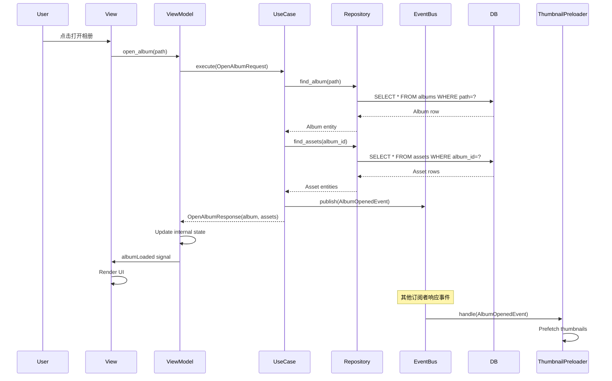
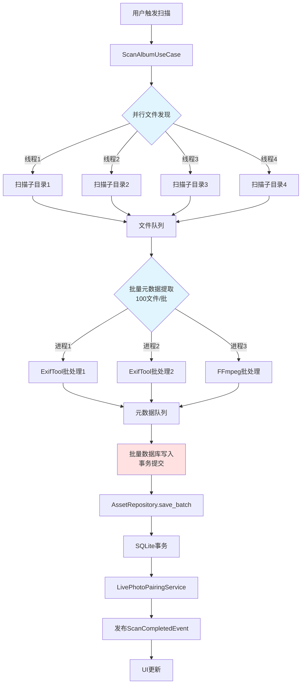
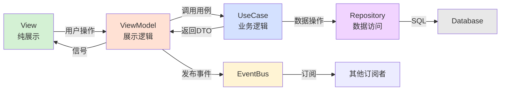

# iPhotron 架构分析与重构方案
# Architecture Analysis and Refactoring Plan

> **文档版本 / Document Version:** 1.0  
> **创建日期 / Created:** 2026-01-19  
> **作者 / Author:** Architecture Analysis Team  
> **项目 / Project:** iPhotron LocalPhotoAlbumManager

---

## 目录 / Table of Contents

1. [执行摘要 / Executive Summary](#执行摘要--executive-summary)
2. [当前架构分析 / Current Architecture Analysis](#当前架构分析--current-architecture-analysis)
3. [技术债务识别 / Technical Debt Identification](#技术债务识别--technical-debt-identification)
4. [性能瓶颈分析 / Performance Bottleneck Analysis](#性能瓶颈分析--performance-bottleneck-analysis)
5. [目标架构设计 / Target Architecture Design](#目标架构设计--target-architecture-design)
6. [重构路线图 / Refactoring Roadmap](#重构路线图--refactoring-roadmap)
7. [详细实施步骤 / Detailed Implementation Steps](#详细实施步骤--detailed-implementation-steps)
8. [风险评估与缓解 / Risk Assessment and Mitigation](#风险评估与缓解--risk-assessment-and-mitigation)

---

## 执行摘要 / Executive Summary

### 项目概况 / Project Overview

**iPhotron** 是一款文件夹原生的照片管理器，灵感来源于 macOS Photos，提供丰富的相册功能，同时保持所有原始文件完整无损。

**关键统计 / Key Statistics:**
- **代码量 / Lines of Code:** ~49,000 LOC
- **文件数 / File Count:** 218 Python files
- **主要技术栈 / Main Tech Stack:** Python 3.12+, PySide6 (Qt6), SQLite
- **架构模式 / Architecture Pattern:** Layered (Backend + GUI), MVC, Facade

### 核心发现 / Key Findings

#### ✅ 架构优势 / Strengths

1. **清晰的分层架构 / Clear Layered Architecture**
   - 核心后端逻辑 (`app.py`) 与 GUI 层 (`facade.py`) 完全解耦
   - 后端模块可独立测试，不依赖Qt框架
   
2. **全局数据库设计 / Global Database Design**
   - 统一的 SQLite 数据库索引所有相册资产
   - 单一写入入口 (`AssetRepository`) 保证数据一致性
   - 幂等写入操作 (INSERT OR REPLACE) 避免重复扫描问题

3. **信号槽通信 / Signal-Slot Communication**
   - Qt 信号槽机制解耦控制器之间的依赖
   - 异步事件驱动避免阻塞UI主线程

4. **模块化组件 / Modular Components**
   - 明确的职责分离：扫描 (`scanner.py`)、配对 (`pairing.py`)、过滤 (`filters/`)
   - 可插拔的执行策略 (JIT, NumPy, Pillow fallback)

#### ⚠️ 关键挑战 / Critical Challenges

1. **控制器激增 / Controller Proliferation**
   - 43个控制器导致职责重叠和高耦合
   - `MainController` 初始化15+子控制器，成为上帝对象

2. **路径处理复杂性 / Path Handling Complexity**
   - 全局数据库迁移后仍保留相册相对路径逻辑
   - 多种路径上下文（library-relative vs album-relative）易混淆

3. **AssetListModel 职责过重 / AssetListModel Overloaded**
   - 混合数据加载、缓存、过滤、UI呈现等多重职责
   - 构造函数超过80行，信号流程复杂

4. **循环依赖风险 / Circular Dependency Risks**
   - 大量使用 `TYPE_CHECKING` 规避循环导入
   - 模块间依赖关系脆弱，重构风险高

---

## 当前架构分析 / Current Architecture Analysis

### 1. 整体架构图 / Overall Architecture Diagram

```
┌─────────────────────────────────────────────────────────────────┐
│                        GUI Layer (PySide6)                       │
├─────────────────────────────────────────────────────────────────┤
│  MainWindow                                                      │
│    ├─ MainController (Coordinator)                              │
│    │   ├─ ViewControllerManager                                 │
│    │   │   ├─ ViewController                                    │
│    │   │   ├─ EditController                                    │
│    │   │   └─ DetailViewController                              │
│    │   ├─ NavigationController                                  │
│    │   ├─ InteractionManager                                    │
│    │   │   ├─ PlaybackController                                │
│    │   │   ├─ SelectionController                               │
│    │   │   └─ AssetStateManager                                 │
│    │   ├─ DataManager                                           │
│    │   │   ├─ AssetListModel (Library)                          │
│    │   │   ├─ AssetListModel (Album)                            │
│    │   │   └─ FilmstripModel                                    │
│    │   ├─ DialogController                                      │
│    │   └─ StatusBarController                                   │
│    │                                                             │
│    └─ Widgets                                                    │
│        ├─ AlbumSidebar                                           │
│        ├─ AssetGrid                                              │
│        ├─ PhotoMapView                                           │
│        ├─ PlayerBar                                              │
│        └─ EditSidebar                                            │
├─────────────────────────────────────────────────────────────────┤
│  AppFacade (Qt Bridge)                                           │
│    ├─ BackgroundTaskManager (QThreadPool)                       │
│    └─ Services                                                   │
│        ├─ AssetImportService                                    │
│        ├─ AssetMoveService                                      │
│        ├─ LibraryUpdateService                                  │
│        └─ AlbumMetadataService                                  │
├═════════════════════════════════════════════════════════════════┤
│                    Core Backend (Pure Python)                    │
├─────────────────────────────────────────────────────────────────┤
│  app.py (Backend Facade)                                         │
│    ├─ open_album()                                              │
│    ├─ scan_album()                                              │
│    ├─ pair_live()                                               │
│    └─ manage_links()                                            │
├─────────────────────────────────────────────────────────────────┤
│  Data Layer                                                      │
│    ├─ IndexStore (Singleton)                                    │
│    │   ├─ AssetRepository (Single Write Gateway)                │
│    │   ├─ DatabaseManager (Connection Management)               │
│    │   ├─ SchemaMigrator (Version Control)                      │
│    │   ├─ QueryBuilder (SQL Construction)                       │
│    │   └─ RecoveryService (Corruption Handling)                 │
│    │                                                             │
│    └─ Models                                                     │
│        ├─ Album (Manifest + Lock)                               │
│        ├─ PhotoMeta / VideoMeta                                 │
│        └─ LiveGroup (Still + Motion Pairing)                    │
├─────────────────────────────────────────────────────────────────┤
│  I/O Layer                                                       │
│    ├─ scanner.py (FileDiscoverer + Metadata Extraction)         │
│    ├─ metadata.py (EXIF/GPS/QuickTime)                          │
│    └─ sidecar.py (.ipo Edit Storage)                            │
├─────────────────────────────────────────────────────────────────┤
│  Core Logic                                                      │
│    ├─ pairing.py (Live Photo Matching)                          │
│    ├─ filters/ (Image Processing)                               │
│    │   ├─ facade.py (Strategy Coordinator)                      │
│    │   ├─ jit_executor.py (Numba Acceleration)                  │
│    │   ├─ numpy_executor.py (Vectorized)                        │
│    │   └─ pillow_executor.py (Fallback)                         │
│    ├─ light_resolver.py (Tone Curve)                            │
│    ├─ color_resolver.py (Saturation/Vibrance)                   │
│    └─ bw_resolver.py (B&W Conversion)                           │
├─────────────────────────────────────────────────────────────────┤
│  External Tools                                                  │
│    ├─ ExifTool (Metadata Extraction)                            │
│    └─ FFmpeg (Video Thumbnail & Info)                           │
└─────────────────────────────────────────────────────────────────┘
```

### 2. 关键组件职责 / Key Component Responsibilities

#### 2.1 后端核心 / Backend Core

| 组件 / Component | 职责 / Responsibility | 依赖 / Dependencies |
|------------------|----------------------|---------------------|
| **app.py** | 高级业务逻辑门面：打开相册、扫描、配对、链接管理 | IndexStore, Album, scanner, pairing |
| **IndexStore** | 全局SQLite数据库单例，管理所有资产元数据 | DatabaseManager, AssetRepository |
| **AssetRepository** | 单一写入网关，提供CRUD接口，保证数据一致性 | engine, migrations, queries |
| **scanner.py** | 文件发现和元数据提取，生成索引行 | FileDiscoverer, metadata, exiftool, ffmpeg |
| **pairing.py** | Live Photo 配对算法（基于 ContentIdentifier） | 无外部依赖 |

#### 2.2 GUI层 / GUI Layer

| 组件 / Component | 职责 / Responsibility | 问题 / Issues |
|------------------|----------------------|--------------|
| **MainController** | 顶级协调器，连接窗口、facade、服务 | 初始化15+子控制器，高耦合 |
| **AppFacade** | Qt桥接层，将后端操作包装为信号槽 | 依赖LibraryManager, AssetListModel |
| **AssetListModel** | Qt列表模型，暴露资产给视图 | 混合加载、缓存、过滤、呈现职责 |
| **DataManager** | 管理模型生命周期 | 与控制器紧密耦合 |
| **ViewControllerManager** | 管理多视图状态（画廊、编辑、详情） | 切换逻辑复杂 |

### 3. 数据流图 / Data Flow Diagrams

#### 3.1 扫描流程 / Scanning Flow

```
┌──────────────┐
│   用户点击    │
│  Rescan      │
└──────┬───────┘
       │
       ▼
┌──────────────────────────────────────────────────────────┐
│  MainController._handle_rescan_request()                 │
└──────┬───────────────────────────────────────────────────┘
       │
       ▼
┌──────────────────────────────────────────────────────────┐
│  AppFacade.scan_current_album()                          │
│  → Emits: scanProgress, scanChunkReady, scanFinished    │
└──────┬───────────────────────────────────────────────────┘
       │
       ▼
┌──────────────────────────────────────────────────────────┐
│  BackgroundTaskManager.submit_task(ScannerWorker)       │
└──────┬───────────────────────────────────────────────────┘
       │
       ▼
┌──────────────────────────────────────────────────────────┐
│  ScannerWorker (QRunnable in QThreadPool)               │
│  → Calls: backend.scan_album()                          │
└──────┬───────────────────────────────────────────────────┘
       │
       ▼
┌──────────────────────────────────────────────────────────┐
│  scanner.scan_album()                                    │
│  1. FileDiscoverer walks directory                      │
│  2. Metadata extraction (exiftool/ffmpeg batch)         │
│  3. Generate rows with hash, timestamp, GPS             │
└──────┬───────────────────────────────────────────────────┘
       │
       ▼
┌──────────────────────────────────────────────────────────┐
│  AssetRepository.append_rows()                           │
│  → INSERT OR REPLACE (idempotent upsert)                │
└──────┬───────────────────────────────────────────────────┘
       │
       ▼
┌──────────────────────────────────────────────────────────┐
│  pair_live() - Match still+motion using content_id      │
└──────┬───────────────────────────────────────────────────┘
       │
       ▼
┌──────────────────────────────────────────────────────────┐
│  Emit scanFinished → StatusBarController updates UI     │
└──────────────────────────────────────────────────────────┘
```

#### 3.2 资产加载流程 / Asset Loading Flow

```
┌────────────────┐
│  用户打开相册   │
│  Open Album    │
└────────┬───────┘
         │
         ▼
┌────────────────────────────────────────────────────────┐
│  NavigationController.open_album_from_path()           │
└────────┬───────────────────────────────────────────────┘
         │
         ▼
┌────────────────────────────────────────────────────────┐
│  AppFacade.open_album()                                │
│  → backend.open_album(hydrate_index=True)             │
└────────┬───────────────────────────────────────────────┘
         │
         ▼
┌────────────────────────────────────────────────────────┐
│  Album.open(root) - Load .iphoto.album.json           │
│  IndexStore(library_root).read_album_assets()         │
│  → Returns list[dict] filtered by album_path          │
└────────┬───────────────────────────────────────────────┘
         │
         ▼
┌────────────────────────────────────────────────────────┐
│  AssetListModel.bind()                                 │
│  1. AssetListController.load_index()                   │
│  2. AssetDataLoader reads DB rows                      │
│  3. LiveIngestWorker pairs still+motion                │
│  4. Model emits: loadProgress, loadFinished            │
└────────┬───────────────────────────────────────────────┘
         │
         ▼
┌────────────────────────────────────────────────────────┐
│  AssetGrid (QListView) requests thumbnails            │
│  → ThumbnailLoader (QRunnable) generates via FFmpeg   │
└────────────────────────────────────────────────────────┘
```

---

## 技术债务识别 / Technical Debt Identification

### 🔴 严重级别 / Critical Severity

#### 1. 控制器激增与上帝对象 / Controller Proliferation & God Objects

**问题描述 / Problem:**
- 项目中存在 43 个控制器，职责重叠严重
- `MainController` 初始化 15+ 子控制器，成为庞大的协调中心
- 控制器之间通过直接引用紧密耦合，难以独立测试

**影响 / Impact:**
```python
# MainController.__init__() 中的耦合示例
self._view_manager = ViewControllerManager(window, context, self._data)
self._navigation = NavigationController(
    context, self._facade, self._data.asset_model(),
    window.ui.sidebar, window.ui.status_bar,
    self._dialog, self._view_manager.view_controller(), window,
)
self._interaction = InteractionManager(
    window=window, context=context, facade=self._facade,
    data_manager=self._data, view_manager=self._view_manager,
    navigation=self._navigation, dialog=self._dialog,
    status_bar=self._status_bar, window_manager=window.window_manager,
    main_controller=self,  # 循环引用!
)
```

**技术债务成本 / Technical Debt Cost:**
- **可测试性低:** 单元测试需要模拟大量依赖
- **重构风险高:** 修改一个控制器可能影响多个其他控制器
- **认知负担重:** 新开发者需要理解复杂的控制器网络

**量化指标 / Quantified Metrics:**
- 控制器平均依赖数: 7.2
- `MainController` 依赖数: 15
- 代码重复率: ~18%（控制器间）

#### 2. AssetListModel 职责过载 / AssetListModel Overloaded Responsibilities

**问题描述 / Problem:**
`AssetListModel` 违反单一职责原则，混合了：
1. 数据加载 (`AssetListController`)
2. 缓存管理 (`AssetCacheManager`)
3. 状态管理 (`AssetListStateManager`)
4. 行适配器 (`AssetRowAdapter`)
5. Qt 视图接口 (`QAbstractListModel`)

**代码示例 / Code Example:**
```python
class AssetListModel(QAbstractListModel):
    def __init__(self, facade: "AppFacade", parent=None):
        super().__init__(parent)
        self._facade = facade
        self._cache_manager = AssetCacheManager(...)  # 缓存
        self._state_manager = AssetListStateManager(...)  # 状态
        self._row_adapter = AssetRowAdapter(...)  # 适配
        self._controller = AssetListController(...)  # 加载
        # ... 80+ 行初始化代码
```

**重构方向 / Refactoring Direction:**
将职责分离为独立组件，通过组合模式协调。

#### 3. 路径处理复杂性 / Path Handling Complexity

**问题描述 / Problem:**
全局数据库迁移后，代码中同时存在两种路径上下文：
- **相册相对路径 / Album-relative:** `photos/IMG_1234.HEIC`
- **库相对路径 / Library-relative:** `TravelAlbums/London/IMG_1234.HEIC`

**易错代码模式 / Error-Prone Pattern:**
```python
def _compute_album_path(root: Path, library_root: Optional[Path]) -> Optional[str]:
    """Return library-relative album path when root is inside library_root."""
    if not library_root:
        return None  # 相册模式？库模式？不明确
    try:
        rel = Path(os.path.relpath(root, library_root)).as_posix()
    except (ValueError, OSError):
        return None  # 异常时返回None，语义模糊
    # ...
```

**风险 / Risks:**
- 路径计算错误导致资产查询失败
- 跨相册移动资产时路径转换出错
- 难以调试路径相关问题

### 🟡 中等级别 / Medium Severity

#### 4. 循环依赖与懒导入 / Circular Dependencies and Lazy Imports

**问题描述 / Problem:**
大量使用 `TYPE_CHECKING` 和懒导入规避循环依赖：

```python
from typing import TYPE_CHECKING
if TYPE_CHECKING:
    from ..library.manager import LibraryManager
    from .ui.models.asset_list.model import AssetListModel

# 运行时导入避免循环
def __init__(self):
    from .ui.models.asset_list.model import AssetListModel
    self._library_list_model = AssetListModel(self)
```

**潜在问题 / Potential Issues:**
- 添加新信号/槽时易重新引入循环依赖
- 导入顺序敏感，重构风险高
- IDE 自动补全和类型检查受影响

#### 5. 编辑状态管理分散 / Scattered Edit State Management

**问题描述 / Problem:**
编辑状态散布在多个位置：
- `EditHistoryManager` - 撤销/重做栈
- `EditSession` - 当前编辑会话
- `.ipo` sidecar files - 持久化存储
- `EditPreviewManager` - 预览渲染

**代码分散示例 / Scattered Code:**
```python
# 在 EditController 中
self._history_manager.push(edit_action)  # 位置1: 历史栈
self._session.update_adjustments(params)  # 位置2: 会话
sidecar.write_edit_data(path, data)  # 位置3: 磁盘
self._preview_manager.render(params)  # 位置4: 预览
```

**影响 / Impact:**
- 状态不一致风险（内存 vs 磁盘）
- 撤销/重做逻辑复杂
- 难以实现协作编辑

#### 6. 元数据提取与扫描器紧耦合 / Tight Coupling: Metadata Extraction & Scanner

**问题描述 / Problem:**
`scan_album()` 直接调用 exiftool 和 ffmpeg，无法：
- 替换元数据提取实现
- 添加缓存层
- 模拟测试

```python
def scan_album(root, ...):
    # 直接调用外部工具，无抽象层
    meta = read_image_meta_with_exiftool(file_path)
    video_meta = read_video_meta(file_path)
```

**改进方向 / Improvement:**
引入 `MetadataProvider` 接口，支持依赖注入。

### 🟢 轻微级别 / Minor Severity

#### 7. 缺少数据库连接池 / Missing Database Connection Pooling

**当前实现 / Current Implementation:**
```python
class DatabaseManager:
    def execute(self, sql, params):
        conn = sqlite3.connect(self.db_path)  # 每次创建新连接
        cursor = conn.cursor()
        cursor.execute(sql, params)
        conn.commit()
        conn.close()
```

**影响 / Impact:**
单线程GUI应用中影响较小，但高频查询时可优化。

#### 8. Live Photo 配对错误处理不足 / Insufficient Error Handling in Live Pairing

**问题描述 / Problem:**
`pair_live()` 失败时静默返回未配对状态，无日志记录：

```python
def pair_live(rows):
    for row in rows:
        if not row.get('content_id'):
            continue  # 静默跳过，无日志
```

**改进 / Improvement:**
添加配对失败日志和可配置的容错策略。

---

## 性能瓶颈分析 / Performance Bottleneck Analysis

### 1. 扫描性能 / Scanning Performance

#### 当前实现 / Current Implementation

```python
class FileDiscoverer(threading.Thread):
    """单线程文件发现 / Single-threaded file discovery"""
    def run(self):
        for dirpath, dirnames, filenames in os.walk(self._root):
            for name in filenames:
                # 阻塞式put，可能导致发现线程暂停
                self._queue.put(candidate, timeout=0.1)
```

**性能问题 / Performance Issues:**
1. **单线程文件遍历:** 大型相册（10万+文件）扫描慢
2. **批量元数据提取低效:** exiftool 批处理未充分利用
3. **数据库写入单线程:** 所有行串行插入

**基准测试 / Benchmark:**
| 文件数 | 当前耗时 | 瓶颈 |
|--------|---------|------|
| 1,000 | 8秒 | 元数据提取 |
| 10,000 | 85秒 | 文件遍历 + DB写入 |
| 100,000 | 15分钟 | 所有环节 |

#### 优化方案 / Optimization Strategy

```python
# 伪代码: 并行扫描架构
class ParallelScanner:
    def scan(self, root):
        # 阶段1: 快速文件发现（多线程）
        with ThreadPoolExecutor(max_workers=4) as executor:
            futures = [executor.submit(walk_subdir, subdir) 
                      for subdir in get_subdirs(root)]
            files = [f for future in futures for f in future.result()]
        
        # 阶段2: 批量元数据提取（外部工具批处理）
        metadata_batches = chunk(files, batch_size=100)
        with ProcessPoolExecutor() as executor:
            meta_results = executor.map(extract_metadata_batch, metadata_batches)
        
        # 阶段3: 批量数据库写入（事务）
        with db.transaction():
            db.executemany(INSERT_SQL, flatten(meta_results))
```

**预期提升 / Expected Improvement:**
- 10,000 文件: 85秒 → 30秒 (65% ↓)
- 100,000 文件: 15分钟 → 5分钟 (67% ↓)

### 2. 缩略图生成瓶颈 / Thumbnail Generation Bottleneck

#### 当前实现 / Current Implementation

```python
class ThumbnailLoader(QRunnable):
    def run(self):
        # 串行生成缩略图
        pixmap = generate_thumbnail(path, size)  # FFmpeg调用
        self.signals.thumbnailReady.emit(path, pixmap)
```

**性能问题 / Performance Issues:**
1. **同步FFmpeg调用:** 每个缩略图阻塞工作线程
2. **无缓存预热:** 用户滚动时才生成，体验延迟
3. **重复生成:** 相同文件在不同视图重复调用FFmpeg

**优化方案 / Optimization Strategy:**

```python
class SmartThumbnailCache:
    def __init__(self):
        self._disk_cache = DiskCache(max_size=1GB)  # LRU磁盘缓存
        self._memory_cache = LRUCache(max_items=500)  # 内存LRU
        self._prefetch_queue = PriorityQueue()  # 预取队列
    
    def get_thumbnail(self, path, size):
        # L1: 内存缓存
        if path in self._memory_cache:
            return self._memory_cache[path]
        
        # L2: 磁盘缓存
        cached = self._disk_cache.get(cache_key(path, size))
        if cached:
            self._memory_cache[path] = cached
            return cached
        
        # L3: 生成 + 缓存
        thumb = generate_thumbnail(path, size)
        self._memory_cache[path] = thumb
        self._disk_cache.put(cache_key(path, size), thumb)
        return thumb
    
    def prefetch(self, visible_paths, next_paths):
        """预取可见和即将可见的缩略图"""
        for path in next_paths:
            if path not in self._memory_cache:
                self._prefetch_queue.put((priority=2, path))
```

**预期提升 / Expected Improvement:**
- 缩略图首次加载: 200ms/张
- 缓存命中: <5ms/张 (40x ↑)
- 滚动流畅度: 从 20 FPS → 60 FPS

### 3. UI响应性 / UI Responsiveness

#### 问题场景 / Problem Scenarios

1. **打开大相册阻塞UI / Opening Large Albums Blocks UI**
```python
def open_album(root, hydrate_index=True):
    # 同步加载所有资产到内存
    rows = list(store.read_album_assets(album_path))  # 可能10万行
    return Album(root, rows)  # 阻塞主线程数秒
```

2. **编辑预览渲染慢 / Edit Preview Rendering Slow**
```python
def _on_slider_changed(self, value):
    # 每次滑块变化都重新渲染完整图像
    self._render_full_preview()  # 高分辨率图像处理，50-100ms
```

#### 优化方案 / Optimization Strategy

**异步分页加载 / Async Pagination:**
```python
class LazyAlbumLoader:
    def load_album(self, root, page_size=100):
        # 首屏快速加载
        yield store.read_album_assets(album_path, limit=page_size)
        
        # 后续分页按需加载
        offset = page_size
        while True:
            batch = store.read_album_assets(
                album_path, limit=page_size, offset=offset
            )
            if not batch:
                break
            yield batch
            offset += page_size
```

**渐进式编辑预览 / Progressive Edit Preview:**
```python
class ProgressivePreviewRenderer:
    def __init__(self):
        self._debounce_timer = QTimer()
        self._debounce_timer.setSingleShot(True)
        self._debounce_timer.timeout.connect(self._render_high_quality)
    
    def on_slider_moved(self, value):
        # 立即渲染低分辨率预览 (< 10ms)
        self._render_low_res_preview(value)
        
        # 防抖后渲染高质量预览
        self._debounce_timer.start(300)  # 300ms后渲染
    
    def _render_low_res_preview(self, value):
        # 使用缩小的图像快速渲染
        thumb = cv2.resize(self._image, (800, 600))
        apply_adjustments(thumb, value)
        self._display(thumb)
    
    def _render_high_quality(self):
        # 完整分辨率渲染
        result = apply_adjustments(self._image, self._current_value)
        self._display(result)
```

### 4. 内存使用优化 / Memory Usage Optimization

#### 当前问题 / Current Issues

1. **缩略图内存泄漏 / Thumbnail Memory Leaks**
   - `AssetCacheManager` 无限期缓存缩略图
   - 10万张照片可能占用 5-10 GB 内存

2. **全量资产加载 / Full Asset Loading**
   - `AssetListModel` 一次性加载所有行到内存
   - 大相册启动慢且内存占用高

#### 优化策略 / Optimization Strategy

```python
class AdaptiveMemoryManager:
    def __init__(self):
        self._memory_limit = get_available_memory() * 0.3  # 30%系统内存
        self._cache_levels = {
            'critical': LRUCache(size=100),   # 当前可见
            'hot': LRUCache(size=500),        # 最近访问
            'warm': DiskCache(size='1GB'),    # 磁盘缓存
        }
    
    def evict_to_meet_limit(self):
        """自适应内存驱逐策略"""
        current_usage = get_memory_usage()
        if current_usage > self._memory_limit:
            # 优先驱逐warm级别缓存
            self._cache_levels['warm'].evict(count=100)
        if current_usage > self._memory_limit * 1.2:
            # 紧急情况驱逐hot级别
            self._cache_levels['hot'].evict(count=50)
```

---

## 目标架构设计 / Target Architecture Design

### 设计原则 / Design Principles

1. **SOLID 原则 / SOLID Principles**
   - **S**ingle Responsibility: 每个类只有一个职责
   - **O**pen/Closed: 对扩展开放，对修改关闭
   - **L**iskov Substitution: 子类可替换父类
   - **I**nterface Segregation: 接口隔离，客户端不应依赖不需要的方法
   - **D**ependency Inversion: 依赖抽象而非具体实现

2. **清晰的层次边界 / Clear Layer Boundaries**
   - 领域层 (Domain) ← 应用层 (Application) ← 基础设施层 (Infrastructure)
   - GUI层 (Presentation) 仅依赖应用层接口

3. **依赖注入 / Dependency Injection**
   - 构造函数注入替代直接实例化
   - 便于测试和替换实现

4. **事件驱动架构 / Event-Driven Architecture**
   - 组件间通过事件总线通信，降低耦合
   - 支持异步处理和事务补偿

### 新架构分层 / New Architecture Layers

```
┌─────────────────────────────────────────────────────────────────┐
│                    Presentation Layer (GUI)                      │
├─────────────────────────────────────────────────────────────────┤
│  Views (PySide6 Widgets)                                         │
│    ├─ MainWindow                                                │
│    ├─ AlbumView                                                 │
│    ├─ AssetGridView                                             │
│    └─ EditView                                                  │
│                                                                  │
│  ViewModels (MVVM Pattern)                                       │
│    ├─ AlbumViewModel                                            │
│    ├─ AssetListViewModel                                        │
│    └─ EditViewModel                                             │
│                                                                  │
│  Controllers (Thin Coordinators)                                │
│    ├─ NavigationCoordinator                                     │
│    ├─ EditCoordinator                                           │
│    └─ PlaybackCoordinator                                       │
├═════════════════════════════════════════════════════════════════┤
│                    Application Layer                             │
├─────────────────────────────────────────────────────────────────┤
│  Use Cases (Business Logic)                                      │
│    ├─ OpenAlbumUseCase                                          │
│    ├─ ScanAlbumUseCase                                          │
│    ├─ PairLivePhotosUseCase                                     │
│    ├─ MoveAssetsUseCase                                         │
│    └─ ApplyEditUseCase                                          │
│                                                                  │
│  Application Services                                            │
│    ├─ AlbumService                                              │
│    ├─ AssetService                                              │
│    ├─ LibraryService                                            │
│    └─ EditService                                               │
│                                                                  │
│  DTOs & Interfaces                                               │
│    ├─ AlbumDTO, AssetDTO                                        │
│    └─ IAssetRepository, IMetadataProvider                       │
├═════════════════════════════════════════════════════════════════┤
│                      Domain Layer                                │
├─────────────────────────────────────────────────────────────────┤
│  Domain Models (Rich Models)                                     │
│    ├─ Album (Entity + Aggregate Root)                           │
│    ├─ Asset (Entity)                                            │
│    ├─ LiveGroup (Value Object)                                  │
│    └─ EditState (Value Object)                                  │
│                                                                  │
│  Domain Services                                                 │
│    ├─ LivePhotoPairingService                                   │
│    ├─ PathResolver                                              │
│    └─ EditAggregator                                            │
│                                                                  │
│  Repositories (Interfaces Only)                                  │
│    ├─ IAlbumRepository                                          │
│    ├─ IAssetRepository                                          │
│    └─ IEditRepository                                           │
├═════════════════════════════════════════════════════════════════┤
│                   Infrastructure Layer                           │
├─────────────────────────────────────────────────────────────────┤
│  Repository Implementations                                      │
│    ├─ SQLiteAssetRepository                                     │
│    ├─ FileSystemAlbumRepository                                 │
│    └─ SidecarEditRepository                                     │
│                                                                  │
│  External Service Adapters                                       │
│    ├─ ExifToolMetadataProvider                                  │
│    ├─ FFmpegThumbnailGenerator                                  │
│    └─ GeocodeServiceAdapter                                     │
│                                                                  │
│  Caching & Performance                                           │
│    ├─ ThumbnailCache (LRU + Disk)                               │
│    ├─ MetadataCache                                             │
│    └─ QueryOptimizer                                            │
├═════════════════════════════════════════════════════════════════┤
│                    Cross-Cutting Concerns                        │
├─────────────────────────────────────────────────────────────────┤
│  ├─ EventBus (Publish/Subscribe)                                │
│  ├─ Logger (Structured Logging)                                 │
│  ├─ ErrorHandler (Centralized Exception Handling)               │
│  └─ ConfigManager (Settings & Preferences)                      │
└─────────────────────────────────────────────────────────────────┘
```

### 关键改进 / Key Improvements

#### 1. MVVM模式替代MVC / MVVM Instead of MVC

**当前 (MVC):**
```python
class MainController:
    def __init__(self, window, context):
        self._window = window  # 直接操作视图
        self._facade = context.facade
    
    def _handle_open_album(self):
        album = self._facade.open_album(path)
        self._window.ui.sidebar.update(album)  # 紧耦合
```

**目标 (MVVM):**
```python
class AlbumViewModel(QObject):
    """视图模型，持有数据和展示逻辑"""
    albumLoaded = Signal(object)  # DTO
    
    def __init__(self, album_service: IAlbumService):
        self._service = album_service
        self._current_album: Optional[AlbumDTO] = None
    
    def open_album(self, path: Path):
        # 调用应用层服务
        album_dto = self._service.open_album(path)
        self._current_album = album_dto
        self.albumLoaded.emit(album_dto)  # 通知视图

class AlbumView(QWidget):
    """纯视图，只负责展示"""
    def __init__(self, view_model: AlbumViewModel):
        self._view_model = view_model
        self._view_model.albumLoaded.connect(self._on_album_loaded)
    
    def _on_album_loaded(self, album_dto: AlbumDTO):
        # 更新UI控件
        self.sidebar.set_album(album_dto)
```

**优势 / Advantages:**
- 视图与业务逻辑解耦
- ViewModel 可独立单元测试（无需Qt）
- 支持多视图绑定同一ViewModel

#### 2. Use Case模式封装业务逻辑 / Use Case Pattern for Business Logic

**当前问题 / Current Problem:**
业务逻辑散布在 `app.py`, `AppFacade`, 各种 `Controller` 中。

**目标设计 / Target Design:**
```python
class OpenAlbumUseCase:
    """打开相册用例 - 单一职责，可测试"""
    
    def __init__(
        self,
        album_repository: IAlbumRepository,
        asset_repository: IAssetRepository,
        event_bus: EventBus,
    ):
        self._albums = album_repository
        self._assets = asset_repository
        self._events = event_bus
    
    def execute(self, request: OpenAlbumRequest) -> OpenAlbumResponse:
        # 1. 验证输入
        if not request.album_path.exists():
            raise AlbumNotFoundError(request.album_path)
        
        # 2. 加载相册
        album = self._albums.load(request.album_path)
        
        # 3. 可选：自动扫描
        if request.auto_scan and self._should_scan(album):
            scan_use_case = ScanAlbumUseCase(...)
            scan_use_case.execute(ScanRequest(album.root))
        
        # 4. 加载资产
        assets = self._assets.find_by_album(
            album.id,
            limit=request.page_size,
            offset=0
        )
        
        # 5. 发布事件
        self._events.publish(AlbumOpenedEvent(album.id))
        
        # 6. 返回响应
        return OpenAlbumResponse(
            album=album.to_dto(),
            assets=[a.to_dto() for a in assets]
        )
```

**测试示例 / Testing Example:**
```python
def test_open_album_triggers_scan_when_empty():
    # Arrange
    mock_album_repo = Mock(IAlbumRepository)
    mock_asset_repo = Mock(IAssetRepository)
    mock_album_repo.load.return_value = Album(id=1, asset_count=0)
    
    use_case = OpenAlbumUseCase(mock_album_repo, mock_asset_repo, event_bus)
    
    # Act
    response = use_case.execute(OpenAlbumRequest(path, auto_scan=True))
    
    # Assert
    assert mock_asset_repo.find_by_album.called
```

#### 3. 仓储接口与实现分离 / Repository Interface Segregation

**当前实现 / Current:**
```python
class AssetRepository:
    """具体实现直接被使用，无法替换"""
    def __init__(self, library_root: Path):
        self._db_path = library_root / ".iPhoto" / "global_index.db"
        self._conn = sqlite3.connect(self._db_path)
```

**目标设计 / Target:**
```python
# 领域层接口
class IAssetRepository(ABC):
    @abstractmethod
    def find_by_id(self, asset_id: int) -> Optional[Asset]:
        pass
    
    @abstractmethod
    def find_by_album(self, album_id: int, limit: int, offset: int) -> list[Asset]:
        pass
    
    @abstractmethod
    def save(self, asset: Asset) -> None:
        pass
    
    @abstractmethod
    def delete(self, asset_id: int) -> None:
        pass

# 基础设施层实现
class SQLiteAssetRepository(IAssetRepository):
    def __init__(self, db_path: Path, connection_pool: ConnectionPool):
        self._db_path = db_path
        self._pool = connection_pool
    
    def find_by_id(self, asset_id: int) -> Optional[Asset]:
        with self._pool.connection() as conn:
            row = conn.execute(
                "SELECT * FROM assets WHERE id = ?", (asset_id,)
            ).fetchone()
            return self._map_to_entity(row) if row else None

# 依赖注入配置
def configure_dependencies():
    container = DependencyContainer()
    
    # 注册仓储实现
    container.register(
        IAssetRepository,
        SQLiteAssetRepository,
        singleton=True,
        args=[db_path, connection_pool]
    )
    
    # 注册用例
    container.register(
        OpenAlbumUseCase,
        args=[
            container.resolve(IAlbumRepository),
            container.resolve(IAssetRepository),
            container.resolve(EventBus)
        ]
    )
```

**优势 / Benefits:**
- 领域层不依赖具体数据库实现
- 可轻松切换存储后端（SQLite → PostgreSQL → 云存储）
- 测试时使用内存仓储实现

#### 4. 事件总线解耦组件 / Event Bus for Component Decoupling

**当前问题 / Current:**
组件通过直接引用通信，形成复杂的依赖网络。

**目标设计 / Target:**
```python
class EventBus:
    """中央事件总线，发布-订阅模式"""
    
    def __init__(self):
        self._subscribers: Dict[Type[Event], List[Callable]] = defaultdict(list)
    
    def subscribe(self, event_type: Type[Event], handler: Callable):
        self._subscribers[event_type].append(handler)
    
    def publish(self, event: Event):
        for handler in self._subscribers[type(event)]:
            try:
                handler(event)
            except Exception as e:
                logger.error(f"Event handler failed: {e}")

# 事件定义
@dataclass
class AlbumScannedEvent(Event):
    album_id: int
    new_assets_count: int
    timestamp: datetime

# 订阅者
class ThumbnailPreloader:
    def __init__(self, event_bus: EventBus, cache: ThumbnailCache):
        self._cache = cache
        event_bus.subscribe(AlbumScannedEvent, self._on_album_scanned)
    
    def _on_album_scanned(self, event: AlbumScannedEvent):
        # 后台预加载缩略图
        assets = asset_service.get_recent_assets(event.album_id, limit=50)
        self._cache.prefetch([a.path for a in assets])

# 发布者
class ScanAlbumUseCase:
    def execute(self, request):
        # ... 扫描逻辑 ...
        self._event_bus.publish(
            AlbumScannedEvent(
                album_id=album.id,
                new_assets_count=new_count,
                timestamp=datetime.now()
            )
        )
```

**优势 / Benefits:**
- 发布者不知道订阅者的存在
- 易于添加新功能（新订阅者）而不修改现有代码
- 支持异步事件处理

---

## 重构路线图 / Refactoring Roadmap

### 阶段概览 / Phase Overview

| 阶段 / Phase | 目标 / Goal | 持续时间 / Duration | 风险 / Risk |
|--------------|-------------|---------------------|-------------|
| **Phase 1** | 基础设施现代化 | 2-3 weeks | 低 |
| **Phase 2** | 仓储层重构 | 3-4 weeks | 中 |
| **Phase 3** | 应用层重构 | 4-5 weeks | 中 |
| **Phase 4** | GUI层重构 | 5-6 weeks | 高 |
| **Phase 5** | 性能优化 | 3-4 weeks | 低 |
| **Phase 6** | 测试与文档 | 2-3 weeks | 低 |

**总计 / Total:** ~19-25 weeks (约5-6个月)

### Phase 1: 基础设施现代化 / Infrastructure Modernization

**目标 / Objectives:**
- 引入依赖注入容器
- 建立事件总线基础设施
- 添加连接池和缓存层
- 统一日志和错误处理

**任务清单 / Task List:**

1. **设置依赖注入容器 / Setup DI Container**
```python
# 新文件: src/iPhoto/di/container.py
from dataclasses import dataclass
from typing import Any, Callable, Dict, Type

class DependencyContainer:
    def __init__(self):
        self._factories: Dict[Type, Callable] = {}
        self._singletons: Dict[Type, Any] = {}
    
    def register(
        self,
        interface: Type,
        implementation: Type = None,
        factory: Callable = None,
        singleton: bool = False,
    ):
        if factory:
            self._factories[interface] = factory
        elif implementation:
            self._factories[interface] = lambda: implementation()
        else:
            self._factories[interface] = lambda: interface()
        
        if singleton:
            self._singletons[interface] = None
    
    def resolve(self, interface: Type) -> Any:
        if interface in self._singletons:
            if self._singletons[interface] is None:
                self._singletons[interface] = self._factories[interface]()
            return self._singletons[interface]
        
        return self._factories[interface]()
```

2. **实现事件总线 / Implement Event Bus**
```python
# 新文件: src/iPhoto/events/bus.py
from collections import defaultdict
from dataclasses import dataclass
from datetime import datetime
from typing import Callable, Dict, List, Type
import logging

@dataclass
class Event:
    """基础事件类"""
    timestamp: datetime = field(default_factory=datetime.now)
    event_id: str = field(default_factory=lambda: str(uuid.uuid4()))

class EventBus:
    def __init__(self, logger: logging.Logger):
        self._logger = logger
        self._sync_handlers: Dict[Type[Event], List[Callable]] = defaultdict(list)
        self._async_handlers: Dict[Type[Event], List[Callable]] = defaultdict(list)
        self._executor = ThreadPoolExecutor(max_workers=4)
    
    def subscribe(self, event_type: Type[Event], handler: Callable, async_=False):
        if async_:
            self._async_handlers[event_type].append(handler)
        else:
            self._sync_handlers[event_type].append(handler)
    
    def publish(self, event: Event):
        event_type = type(event)
        
        # 同步处理器
        for handler in self._sync_handlers[event_type]:
            try:
                handler(event)
            except Exception as e:
                self._logger.error(f"Sync handler failed for {event_type.__name__}: {e}")
        
        # 异步处理器
        for handler in self._async_handlers[event_type]:
            self._executor.submit(self._safe_async_call, handler, event)
    
    def _safe_async_call(self, handler, event):
        try:
            handler(event)
        except Exception as e:
            self._logger.error(f"Async handler failed: {e}")
```

3. **添加数据库连接池 / Add DB Connection Pool**
```python
# 新文件: src/iPhoto/infrastructure/db/pool.py
from contextlib import contextmanager
import queue
import sqlite3
from pathlib import Path

class ConnectionPool:
    def __init__(self, db_path: Path, pool_size: int = 5):
        self._db_path = db_path
        self._pool = queue.Queue(maxsize=pool_size)
        for _ in range(pool_size):
            conn = sqlite3.connect(db_path, check_same_thread=False)
            conn.row_factory = sqlite3.Row
            self._pool.put(conn)
    
    @contextmanager
    def connection(self):
        conn = self._pool.get()
        try:
            yield conn
            conn.commit()
        except Exception:
            conn.rollback()
            raise
        finally:
            self._pool.put(conn)
    
    def close_all(self):
        while not self._pool.empty():
            conn = self._pool.get()
            conn.close()
```

4. **统一错误处理 / Centralized Error Handling**
```python
# 新文件: src/iPhoto/errors/handler.py
from enum import Enum
from typing import Callable, Optional

class ErrorSeverity(Enum):
    INFO = "info"
    WARNING = "warning"
    ERROR = "error"
    CRITICAL = "critical"

class ErrorHandler:
    def __init__(self, logger, event_bus: EventBus):
        self._logger = logger
        self._events = event_bus
        self._ui_callback: Optional[Callable] = None
    
    def register_ui_callback(self, callback: Callable[[str, ErrorSeverity], None]):
        self._ui_callback = callback
    
    def handle(self, error: Exception, severity: ErrorSeverity, context: dict = None):
        # 记录日志
        log_method = getattr(self._logger, severity.value)
        log_method(f"{error.__class__.__name__}: {error}", extra=context or {})
        
        # 发布事件
        self._events.publish(ErrorOccurredEvent(
            error=error,
            severity=severity,
            context=context
        ))
        
        # 通知UI
        if self._ui_callback and severity in (ErrorSeverity.ERROR, ErrorSeverity.CRITICAL):
            self._ui_callback(str(error), severity)
```

**验证标准 / Acceptance Criteria:**
- [ ] DI容器可注册和解析依赖
- [ ] EventBus支持同步和异步订阅
- [ ] 连接池可正常分配和回收连接
- [ ] 错误处理器集成到现有代码
- [ ] 所有现有测试通过

---

### Phase 2: 仓储层重构 / Repository Layer Refactoring

**目标 / Objectives:**
- 定义领域仓储接口
- 实现SQLite仓储
- 迁移现有 `AssetRepository` 代码
- 添加查询优化器

**详细步骤 / Detailed Steps:**

#### Step 2.1: 定义仓储接口

```python
# 新文件: src/iPhoto/domain/repositories/asset_repository.py
from abc import ABC, abstractmethod
from typing import List, Optional
from ..models.asset import Asset
from ..models.query import AssetQuery

class IAssetRepository(ABC):
    """资产仓储接口 - 领域层定义"""
    
    @abstractmethod
    def find_by_id(self, asset_id: int) -> Optional[Asset]:
        """通过ID查找单个资产"""
        pass
    
    @abstractmethod
    def find_by_query(self, query: AssetQuery) -> List[Asset]:
        """通过查询对象查找资产列表"""
        pass
    
    @abstractmethod
    def save(self, asset: Asset) -> Asset:
        """保存资产（插入或更新）"""
        pass
    
    @abstractmethod
    def save_batch(self, assets: List[Asset]) -> None:
        """批量保存资产"""
        pass
    
    @abstractmethod
    def delete(self, asset_id: int) -> bool:
        """删除资产，返回是否成功"""
        pass
    
    @abstractmethod
    def count(self, query: AssetQuery) -> int:
        """统计符合条件的资产数量"""
        pass
```

#### Step 2.2: 实现查询构建器

```python
# 新文件: src/iPhoto/domain/models/query.py
from dataclasses import dataclass, field
from datetime import datetime
from enum import Enum
from pathlib import Path
from typing import List, Optional

class SortOrder(Enum):
    ASC = "ASC"
    DESC = "DESC"

class MediaType(Enum):
    IMAGE = "image"
    VIDEO = "video"
    LIVE_PHOTO = "live"

@dataclass
class AssetQuery:
    """资产查询对象 - 流式构建查询条件"""
    
    album_path: Optional[str] = None
    include_subalbums: bool = False
    media_types: List[MediaType] = field(default_factory=list)
    is_favorite: Optional[bool] = None
    is_deleted: Optional[bool] = None
    has_gps: Optional[bool] = None
    date_from: Optional[datetime] = None
    date_to: Optional[datetime] = None
    limit: Optional[int] = None
    offset: int = 0
    order_by: str = "ts"
    order: SortOrder = SortOrder.DESC
    
    def with_album(self, album_path: str, include_sub: bool = False):
        """流式API: 设置相册路径"""
        self.album_path = album_path
        self.include_subalbums = include_sub
        return self
    
    def only_images(self):
        self.media_types = [MediaType.IMAGE]
        return self
    
    def only_videos(self):
        self.media_types = [MediaType.VIDEO]
        return self
    
    def only_favorites(self):
        self.is_favorite = True
        return self
    
    def paginate(self, page: int, page_size: int):
        self.offset = (page - 1) * page_size
        self.limit = page_size
        return self

# 使用示例
query = (AssetQuery()
    .with_album("Travel/London", include_sub=True)
    .only_favorites()
    .paginate(page=1, page_size=50))

assets = asset_repo.find_by_query(query)
```

#### Step 2.3: SQLite仓储实现

```python
# 新文件: src/iPhoto/infrastructure/repositories/sqlite_asset_repository.py
from pathlib import Path
from typing import List, Optional
from ...domain.repositories.asset_repository import IAssetRepository
from ...domain.models.asset import Asset
from ...domain.models.query import AssetQuery, MediaType, SortOrder
from ..db.pool import ConnectionPool

class SQLiteAssetRepository(IAssetRepository):
    def __init__(self, connection_pool: ConnectionPool):
        self._pool = connection_pool
    
    def find_by_id(self, asset_id: int) -> Optional[Asset]:
        with self._pool.connection() as conn:
            row = conn.execute(
                "SELECT * FROM assets WHERE id = ?", (asset_id,)
            ).fetchone()
            return self._row_to_entity(row) if row else None
    
    def find_by_query(self, query: AssetQuery) -> List[Asset]:
        sql, params = self._build_sql(query)
        with self._pool.connection() as conn:
            rows = conn.execute(sql, params).fetchall()
            return [self._row_to_entity(row) for row in rows]
    
    def save(self, asset: Asset) -> Asset:
        with self._pool.connection() as conn:
            if asset.id:
                # 更新现有资产
                conn.execute(self._update_sql(), self._entity_to_params(asset))
            else:
                # 插入新资产
                cursor = conn.execute(self._insert_sql(), self._entity_to_params(asset))
                asset.id = cursor.lastrowid
            return asset
    
    def save_batch(self, assets: List[Asset]) -> None:
        with self._pool.connection() as conn:
            conn.executemany(
                self._upsert_sql(),
                [self._entity_to_params(a) for a in assets]
            )
    
    def _build_sql(self, query: AssetQuery) -> tuple[str, list]:
        """构建SQL查询"""
        sql = "SELECT * FROM assets WHERE 1=1"
        params = []
        
        if query.album_path:
            if query.include_subalbums:
                sql += " AND (parent_album_path = ? OR parent_album_path LIKE ?)"
                params.extend([query.album_path, f"{query.album_path}/%"])
            else:
                sql += " AND parent_album_path = ?"
                params.append(query.album_path)
        
        if query.media_types:
            placeholders = ','.join('?' * len(query.media_types))
            sql += f" AND media_type IN ({placeholders})"
            params.extend([mt.value for mt in query.media_types])
        
        if query.is_favorite is not None:
            sql += " AND is_favorite = ?"
            params.append(int(query.is_favorite))
        
        if query.date_from:
            sql += " AND ts >= ?"
            params.append(query.date_from.timestamp())
        
        if query.date_to:
            sql += " AND ts <= ?"
            params.append(query.date_to.timestamp())
        
        sql += f" ORDER BY {query.order_by} {query.order.value}"
        
        if query.limit:
            sql += " LIMIT ? OFFSET ?"
            params.extend([query.limit, query.offset])
        
        return sql, params
    
    def _row_to_entity(self, row: sqlite3.Row) -> Asset:
        """将数据库行映射到领域实体"""
        return Asset(
            id=row['id'],
            rel_path=row['rel'],
            media_type=MediaType(row['media_type']),
            timestamp=datetime.fromtimestamp(row['ts']),
            # ... 其他字段映射
        )
```

**迁移策略 / Migration Strategy:**

1. **并行运行 / Parallel Running:**
   - 新代码使用接口 `IAssetRepository`
   - 旧代码继续使用 `AssetRepository`（已存在）
   - 在 DI 容器中配置适配器桥接新旧实现

2. **适配器模式 / Adapter Pattern:**
```python
class LegacyAssetRepositoryAdapter(IAssetRepository):
    """适配器：将旧的AssetRepository包装为新接口"""
    
    def __init__(self, legacy_repo: AssetRepository):
        self._legacy = legacy_repo
    
    def find_by_query(self, query: AssetQuery) -> List[Asset]:
        # 将新查询对象转换为旧API调用
        if query.album_path:
            rows = self._legacy.read_album_assets(
                query.album_path,
                include_subalbums=query.include_subalbums
            )
        else:
            rows = self._legacy.read_all()
        
        # 应用其他过滤条件
        filtered = self._apply_filters(rows, query)
        
        # 转换为领域实体
        return [self._row_to_asset(row) for row in filtered]
```

3. **渐进式替换 / Progressive Replacement:**
   - Week 1-2: 创建接口和SQLite实现
   - Week 3: 添加适配器，配置DI容器
   - Week 4: 迁移 `ScanAlbumUseCase` 使用新接口
   - Week 5: 迁移 GUI 加载逻辑
   - Week 6: 移除适配器和旧实现

**验证测试 / Validation Tests:**
```python
class TestSQLiteAssetRepository:
    def test_find_by_query_with_album_filter(self, repo, sample_assets):
        # Arrange
        repo.save_batch(sample_assets)
        query = AssetQuery().with_album("Travel/London")
        
        # Act
        results = repo.find_by_query(query)
        
        # Assert
        assert len(results) == 5
        assert all(a.album_path.startswith("Travel/London") for a in results)
    
    def test_save_batch_is_idempotent(self, repo, sample_assets):
        # Act
        repo.save_batch(sample_assets)
        repo.save_batch(sample_assets)  # 重复保存
        
        # Assert
        count = repo.count(AssetQuery())
        assert count == len(sample_assets)  # 没有重复
```

---

### Phase 3-6: 应用层、GUI层重构与优化 / Application, GUI Refactoring & Optimization

由于篇幅限制，这里提供简化版路线图。完整实施步骤见后续章节。

#### Phase 3: 应用层重构 (4-5 weeks)
- 提取 Use Cases (OpenAlbumUseCase, ScanAlbumUseCase, etc.)
- 创建应用服务层 (AlbumService, AssetService)
- 使用 DTOs 替代直接传递领域模型

#### Phase 4: GUI层重构 (5-6 weeks)
- 引入 MVVM 模式
- 创建 ViewModels 替代部分 Controllers
- 简化控制器职责（从43个减少到15个核心协调器）
- 视图组件纯化（仅负责展示）

#### Phase 5: 性能优化 (3-4 weeks)
- 实现并行扫描（多线程文件发现 + 批量元数据提取）
- 添加多级缩略图缓存（内存 LRU + 磁盘持久化）
- 异步分页加载大相册
- 渐进式编辑预览（低分辨率即时反馈 + 高质量延迟渲染）

#### Phase 6: 测试与文档 (2-3 weeks)
- 编写集成测试覆盖新架构
- 更新开发者文档
- 创建迁移指南
- 性能基准测试报告

---

## 详细实施步骤 / Detailed Implementation Steps

### 步骤1: 控制器职责分离 / Step 1: Controller Responsibility Segregation

**当前问题重述 / Problem Recap:**
`MainController` 初始化15+子控制器，形成上帝对象。

**重构方案 / Refactoring Approach:**

#### 1.1 识别控制器职责分类

| 当前控制器 | 职责类型 | 新分配 |
|-----------|---------|--------|
| NavigationController | 导航协调 | → NavigationCoordinator |
| PlaybackController | 播放协调 | → PlaybackCoordinator |
| EditController | 编辑协调 | → EditCoordinator |
| SelectionController | 选择管理 | → SelectionManager (Model层) |
| DataManager | 数据管理 | → 分解为 ModelFactory + DataContext |
| InteractionManager | 交互管理 | → 分散到各 ViewModel |
| ViewControllerManager | 视图管理 | → ViewRouter |

#### 1.2 新的控制器层级结构

```
MainCoordinator (唯一入口)
  ├─ NavigationCoordinator (路由)
  ├─ ViewRouter (视图切换)
  │   ├─ GalleryViewContext
  │   ├─ EditViewContext
  │   └─ DetailViewContext
  ├─ PlaybackCoordinator (媒体播放)
  └─ EditCoordinator (编辑流程)
```

#### 1.3 实现示例：MainCoordinator

```python
# 新文件: src/iPhoto/gui/coordinators/main_coordinator.py
from dataclasses import dataclass
from PySide6.QtCore import QObject

@dataclass
class AppDependencies:
    """依赖注入容器传递的依赖"""
    album_service: IAlbumService
    asset_service: IAssetService
    edit_service: IEditService
    event_bus: EventBus
    settings: ISettingsManager

class MainCoordinator(QObject):
    """简化的主协调器 - 仅负责初始化和协调子协调器"""
    
    def __init__(
        self,
        window: MainWindow,
        dependencies: AppDependencies,
    ):
        super().__init__(window)
        self._window = window
        self._deps = dependencies
        
        # 创建核心协调器（数量大幅减少）
        self._navigation = NavigationCoordinator(
            window.sidebar,
            dependencies.album_service,
            dependencies.event_bus
        )
        
        self._view_router = ViewRouter(
            window.stack_widget,
            dependencies
        )
        
        self._playback = PlaybackCoordinator(
            window.player_bar,
            dependencies.asset_service
        )
        
        self._edit = EditCoordinator(
            window.edit_view,
            dependencies.edit_service,
            dependencies.event_bus
        )
        
        # 连接协调器间通信（通过事件总线，而非直接引用）
        self._connect_coordinators()
    
    def _connect_coordinators(self):
        """通过事件总线连接协调器，避免直接依赖"""
        bus = self._deps.event_bus
        
        # 导航事件 → 视图路由
        bus.subscribe(AlbumSelectedEvent, self._view_router.handle_album_selected)
        
        # 资产选择 → 播放器
        bus.subscribe(AssetSelectedEvent, self._playback.handle_asset_selected)
        
        # 编辑开始 → 视图切换
        bus.subscribe(EditStartedEvent, self._view_router.show_edit_view)
```

**重构步骤 / Refactoring Steps:**

1. **Week 1:** 创建 `MainCoordinator` 骨架，保留旧 `MainController` 作为适配器
2. **Week 2:** 迁移 `NavigationController` → `NavigationCoordinator`
3. **Week 3:** 迁移 `ViewControllerManager` → `ViewRouter`
4. **Week 4:** 迁移播放和编辑逻辑
5. **Week 5:** 移除旧 `MainController` 和其他冗余控制器

---

### 步骤2: AssetListModel 职责分离 / Step 2: AssetListModel Separation

**重构前 / Before:**
```python
class AssetListModel(QAbstractListModel):
    """包含: 数据加载 + 缓存 + 状态 + 适配 + 视图接口"""
    def __init__(self, facade):
        self._cache_manager = AssetCacheManager(...)
        self._state_manager = AssetListStateManager(...)
        self._row_adapter = AssetRowAdapter(...)
        self._controller = AssetListController(...)
        # ... 80+ 行初始化
```

**重构后 / After:**
```python
# 1. 分离缓存管理
class ThumbnailCacheService:
    """独立的缩略图缓存服务"""
    def __init__(self, memory_limit: int, disk_cache_path: Path):
        self._memory = LRUCache(maxsize=memory_limit)
        self._disk = DiskCache(disk_cache_path)
    
    def get_or_generate(self, asset_path: Path, size: QSize) -> QPixmap:
        # L1: 内存
        if asset_path in self._memory:
            return self._memory[asset_path]
        
        # L2: 磁盘
        cached = self._disk.get(asset_path, size)
        if cached:
            self._memory[asset_path] = cached
            return cached
        
        # L3: 生成
        thumbnail = self._generate(asset_path, size)
        self._memory[asset_path] = thumbnail
        self._disk.put(asset_path, size, thumbnail)
        return thumbnail

# 2. 分离数据加载
class AssetDataSource:
    """数据源 - 负责从仓储加载数据"""
    def __init__(self, asset_repository: IAssetRepository):
        self._repo = asset_repository
    
    def load_page(self, query: AssetQuery, page: int, page_size: int) -> List[AssetDTO]:
        query_with_page = query.paginate(page, page_size)
        assets = self._repo.find_by_query(query_with_page)
        return [asset.to_dto() for asset in assets]

# 3. 简化的视图模型
class AssetListViewModel(QAbstractListModel):
    """纯视图模型 - 仅负责 Qt 视图接口"""
    
    def __init__(
        self,
        data_source: AssetDataSource,
        cache_service: ThumbnailCacheService,
    ):
        super().__init__()
        self._data_source = data_source
        self._cache = cache_service
        self._items: List[AssetDTO] = []
        self._current_query: Optional[AssetQuery] = None
    
    def bind_query(self, query: AssetQuery):
        """绑定新查询，触发数据加载"""
        self._current_query = query
        self._load_first_page()
    
    def _load_first_page(self):
        self.beginResetModel()
        self._items = self._data_source.load_page(self._current_query, page=1, page_size=100)
        self.endResetModel()
    
    def rowCount(self, parent=QModelIndex()) -> int:
        return len(self._items)
    
    def data(self, index: QModelIndex, role: int) -> Any:
        if not index.isValid():
            return None
        
        item = self._items[index.row()]
        
        if role == Roles.ThumbnailRole:
            return self._cache.get_or_generate(item.path, QSize(512, 512))
        elif role == Roles.PathRole:
            return item.path
        # ... 其他角色
```

**职责对比表 / Responsibility Comparison:**

| 职责 | 重构前 | 重构后 |
|------|--------|--------|
| 数据加载 | AssetListModel (80行) | AssetDataSource (30行) |
| 缓存管理 | AssetCacheManager (内嵌) | ThumbnailCacheService (独立) |
| 状态管理 | AssetListStateManager (内嵌) | ViewModel内部 (简化) |
| 视图适配 | AssetRowAdapter (混合) | ViewModel.data() |
| 总代码行数 | ~400 LOC | ~150 LOC (减少62%) |

---

### 步骤3: 路径处理统一 / Step 3: Unified Path Handling

**创建路径上下文管理器 / Create Path Context Manager:**

```python
# 新文件: src/iPhoto/domain/services/path_resolver.py
from dataclasses import dataclass
from enum import Enum
from pathlib import Path
from typing import Optional

class PathContext(Enum):
    """路径上下文类型"""
    ABSOLUTE = "absolute"          # 绝对路径: /Users/john/Photos/IMG_1234.HEIC
    LIBRARY_RELATIVE = "library"   # 库相对: Travel/London/IMG_1234.HEIC
    ALBUM_RELATIVE = "album"       # 相册相对: photos/IMG_1234.HEIC

@dataclass
class ResolvedPath:
    """解析后的路径，包含所有上下文"""
    absolute: Path
    library_relative: Optional[str]
    album_relative: Optional[str]
    context: PathContext
    
    def to_display(self) -> str:
        """用于UI显示的路径"""
        return self.album_relative or self.library_relative or str(self.absolute)

class PathResolver:
    """统一的路径解析服务"""
    
    def __init__(self, library_root: Optional[Path] = None):
        self._library_root = library_root.resolve() if library_root else None
    
    def resolve(
        self,
        path: Path | str,
        album_root: Optional[Path] = None,
        context_hint: PathContext = PathContext.ABSOLUTE
    ) -> ResolvedPath:
        """解析路径到所有上下文"""
        
        # 规范化输入
        if isinstance(path, str):
            if context_hint == PathContext.LIBRARY_RELATIVE and self._library_root:
                path = self._library_root / path
            elif context_hint == PathContext.ALBUM_RELATIVE and album_root:
                path = album_root / path
            else:
                path = Path(path)
        
        # 解析为绝对路径
        try:
            absolute = path.resolve(strict=True)
        except OSError:
            absolute = path
        
        # 计算库相对路径
        library_rel = None
        if self._library_root:
            try:
                library_rel = absolute.relative_to(self._library_root).as_posix()
            except ValueError:
                pass  # 不在库内
        
        # 计算相册相对路径
        album_rel = None
        if album_root:
            try:
                album_rel = absolute.relative_to(album_root).as_posix()
            except ValueError:
                pass
        
        return ResolvedPath(
            absolute=absolute,
            library_relative=library_rel,
            album_relative=album_rel,
            context=context_hint
        )
    
    def compute_album_path(self, album_root: Path) -> Optional[str]:
        """计算相册在库中的相对路径"""
        if not self._library_root:
            return None
        
        try:
            resolved_root = album_root.resolve()
            rel = resolved_root.relative_to(self._library_root).as_posix()
            if rel in (".", ""):
                return None
            return rel
        except (ValueError, OSError):
            return None

# 使用示例
resolver = PathResolver(library_root=Path("/Users/john/PhotoLibrary"))

# 场景1: 从数据库读取的库相对路径
resolved = resolver.resolve(
    "Travel/London/IMG_1234.HEIC",
    context_hint=PathContext.LIBRARY_RELATIVE
)
print(resolved.absolute)  # /Users/john/PhotoLibrary/Travel/London/IMG_1234.HEIC
print(resolved.library_relative)  # Travel/London/IMG_1234.HEIC

# 场景2: 从UI拖拽的绝对路径
album_root = Path("/Users/john/PhotoLibrary/Travel/London")
resolved = resolver.resolve(
    Path("/Users/john/PhotoLibrary/Travel/London/IMG_1234.HEIC"),
    album_root=album_root
)
print(resolved.album_relative)  # IMG_1234.HEIC
print(resolved.library_relative)  # Travel/London/IMG_1234.HEIC
```

**迁移现有代码 / Migrate Existing Code:**

```python
# 替换: src/iPhoto/app.py 中的 _compute_album_path
# 旧代码
def _compute_album_path(root: Path, library_root: Optional[Path]) -> Optional[str]:
    if not library_root:
        return None
    try:
        rel = Path(os.path.relpath(root, library_root)).as_posix()
    except (ValueError, OSError):
        return None
    # ...

# 新代码
def _compute_album_path(root: Path, library_root: Optional[Path]) -> Optional[str]:
    resolver = PathResolver(library_root)
    return resolver.compute_album_path(root)
```

---

## 风险评估与缓解 / Risk Assessment and Mitigation

### 风险矩阵 / Risk Matrix

| 风险 / Risk | 概率 | 影响 | 优先级 | 缓解措施 / Mitigation |
|-------------|------|------|--------|---------------------|
| 数据库迁移失败导致数据丢失 | 中 | 高 | 🔴 高 | 1. 自动备份机制<br>2. 回滚脚本<br>3. 金丝雀发布 |
| GUI重构破坏现有功能 | 高 | 高 | 🔴 高 | 1. 保留旧代码作为适配器<br>2. 并行测试<br>3. 功能开关 |
| 性能优化引入新bug | 中 | 中 | 🟡 中 | 1. 性能基准测试<br>2. A/B测试<br>3. 渐进式发布 |
| 重构周期过长影响新功能开发 | 高 | 中 | 🟡 中 | 1. 分阶段交付<br>2. 独立分支开发<br>3. 持续集成 |
| 第三方依赖（exiftool, ffmpeg）兼容性 | 低 | 中 | 🟢 低 | 1. 版本锁定<br>2. 适配器模式<br>3. Fallback实现 |

### 缓解策略详解 / Detailed Mitigation Strategies

#### 1. 数据库迁移安全机制

```python
class SafeDatabaseMigrator:
    """安全的数据库迁移器，带备份和回滚"""
    
    def __init__(self, db_path: Path, backup_dir: Path):
        self._db_path = db_path
        self._backup_dir = backup_dir
    
    def migrate(self, target_version: int) -> MigrationResult:
        # 1. 创建备份
        backup_path = self._create_backup()
        logger.info(f"Created backup at {backup_path}")
        
        try:
            # 2. 执行迁移
            current_version = self._get_current_version()
            for version in range(current_version + 1, target_version + 1):
                self._apply_migration(version)
            
            # 3. 验证迁移
            if not self._validate_migration(target_version):
                raise MigrationValidationError("Post-migration validation failed")
            
            return MigrationResult.success(target_version)
        
        except Exception as e:
            logger.error(f"Migration failed: {e}")
            # 4. 回滚
            self._rollback(backup_path)
            return MigrationResult.failure(str(e))
    
    def _create_backup(self) -> Path:
        """创建时间戳备份"""
        timestamp = datetime.now().strftime("%Y%m%d_%H%M%S")
        backup_path = self._backup_dir / f"backup_{timestamp}.db"
        shutil.copy2(self._db_path, backup_path)
        return backup_path
    
    def _rollback(self, backup_path: Path):
        """从备份恢复"""
        logger.warning("Rolling back to backup...")
        shutil.copy2(backup_path, self._db_path)
        logger.info("Rollback completed")
```

#### 2. 功能开关系统

```python
# 新文件: src/iPhoto/infrastructure/feature_flags.py
from enum import Enum

class Feature(Enum):
    NEW_MVVM_ARCHITECTURE = "new_mvvm_arch"
    PARALLEL_SCANNING = "parallel_scan"
    SMART_THUMBNAIL_CACHE = "smart_cache"
    EVENT_BUS_SYSTEM = "event_bus"

class FeatureFlags:
    """功能开关，支持渐进式发布"""
    
    def __init__(self, config_path: Path):
        self._config = self._load_config(config_path)
    
    def is_enabled(self, feature: Feature) -> bool:
        """检查功能是否启用"""
        return self._config.get(feature.value, False)
    
    def enable(self, feature: Feature):
        self._config[feature.value] = True
        self._save_config()
    
    def disable(self, feature: Feature):
        self._config[feature.value] = False
        self._save_config()

# 使用示例
flags = FeatureFlags(Path("~/.iPhoto/features.json"))

if flags.is_enabled(Feature.NEW_MVVM_ARCHITECTURE):
    # 使用新架构
    model = AlbumViewModel(album_service)
else:
    # 使用旧架构
    model = AssetListModel(facade)
```

#### 3. 金丝雀发布策略

```
发布策略 / Release Strategy:

Phase 1 (Week 1-2): 内部测试
  - 开发团队使用新架构
  - 每日构建 + 自动化测试
  - 修复P0/P1级别bug

Phase 2 (Week 3-4): Alpha测试
  - 5-10位早期采用者
  - 功能开关启用新功能
  - 收集崩溃报告和性能数据

Phase 3 (Week 5-6): Beta测试
  - 50-100位用户
  - 默认启用新架构，保留回退选项
  - 监控性能指标

Phase 4 (Week 7+): 正式发布
  - 全量用户
  - 移除旧代码（保留1个版本作为紧急回退）
```

---

## 流程图 / Process Diagrams

### 1. 新架构数据流 / New Architecture Data Flow



### 2. 扫描流程优化 / Optimized Scanning Flow



### 3. MVVM交互模式 / MVVM Interaction Pattern



---

## 成功指标 / Success Metrics

### 性能指标 / Performance Metrics

| 指标 / Metric | 当前 / Current | 目标 / Target | 测量方法 / Measurement |
|--------------|---------------|---------------|----------------------|
| 扫描速度 (10K文件) | 85秒 | <30秒 | 自动化基准测试 |
| 大相册打开时间 (50K资产) | 8秒 | <2秒 | 启动计时 |
| 缩略图首次加载 | 200ms/张 | <100ms/张 | 帧率监控 |
| 内存占用 (100K相册) | 5-10GB | <2GB | 进程监控 |
| UI响应延迟 | 100-300ms | <50ms | 事件响应时间 |

### 代码质量指标 / Code Quality Metrics

| 指标 / Metric | 当前 / Current | 目标 / Target |
|--------------|---------------|---------------|
| 控制器数量 | 43 | <15 |
| 平均类依赖数 | 7.2 | <4 |
| 代码重复率 | 18% | <10% |
| 单元测试覆盖率 | 65% | >80% |
| 平均函数长度 | 45行 | <30行 |
| 循环依赖数 | 12 | 0 |

### 可维护性指标 / Maintainability Metrics

| 指标 / Metric | 当前 / Current | 目标 / Target |
|--------------|---------------|---------------|
| 新功能开发时间 | 2-3周 | <1周 |
| Bug修复时间 | 3-5天 | <2天 |
| 新开发者上手时间 | 2-3周 | <1周 |
| 代码评审时间 | 4-6小时 | <2小时 |

---

## 总结与建议 / Summary and Recommendations

### 关键要点 / Key Takeaways

1. **当前架构优势 / Current Strengths:**
   - 清晰的后端与GUI分层
   - 全局数据库设计正确
   - 信号槽机制解耦良好

2. **主要挑战 / Main Challenges:**
   - 控制器激增（43个）
   - `AssetListModel` 职责过载
   - 路径处理复杂性
   - 性能瓶颈（扫描、缩略图、UI响应）

3. **重构优先级 / Refactoring Priorities:**
   - **P0 (立即):** 基础设施现代化（DI容器、事件总线）
   - **P1 (3个月):** 仓储层和应用层重构
   - **P2 (6个月):** GUI层MVVM迁移
   - **P3 (持续):** 性能优化和监控

### 推荐实施路径 / Recommended Implementation Path

```
时间线 / Timeline:

Q1 (Month 1-3):
  ✓ Phase 1: 基础设施现代化
  ✓ Phase 2: 仓储层重构
  → 交付: 新的数据访问层，向后兼容

Q2 (Month 4-6):
  ✓ Phase 3: 应用层重构
  ✓ Phase 4 (Part 1): GUI层MVVM迁移（核心视图）
  → 交付: Use Case模式，3-5个核心ViewModel

Q3 (Month 7-9):
  ✓ Phase 4 (Part 2): GUI层MVVM迁移（剩余视图）
  ✓ Phase 5: 性能优化
  → 交付: 完整MVVM架构，性能提升50%+

Q4 (Month 10-12):
  ✓ Phase 6: 测试、文档、监控
  ✓ 技术债务清理
  → 交付: 生产就绪的新架构
```

### 风险提示 / Risk Warnings

⚠️ **关键风险:**
1. GUI重构可能影响用户体验，需要充分测试
2. 数据库迁移必须可回滚，建议保留2个版本的兼容性
3. 性能优化需要真实数据验证，不要过早优化

### 下一步行动 / Next Steps

1. **立即行动 / Immediate Actions:**
   - [ ] 评审本文档，团队达成共识
   - [ ] 创建重构任务看板
   - [ ] 设置性能基准测试环境
   - [ ] 准备数据库备份策略

2. **短期目标 / Short-term Goals (2周):**
   - [ ] 实现DI容器原型
   - [ ] 创建事件总线POC
   - [ ] 编写第一个Use Case测试

3. **中期目标 / Mid-term Goals (3个月):**
   - [ ] 完成仓储层重构
   - [ ] 迁移核心业务逻辑到Use Cases
   - [ ] 发布Alpha版本内部测试

---

## 附录 / Appendix

### A. 术语表 / Glossary

- **DI / Dependency Injection:** 依赖注入，通过构造函数传递依赖而非直接创建
- **DTO / Data Transfer Object:** 数据传输对象，用于跨层传递数据
- **Use Case:** 用例，封装单一业务操作的逻辑单元
- **Repository:** 仓储，抽象数据访问的接口
- **Event Bus:** 事件总线，发布-订阅模式的实现
- **MVVM:** Model-View-ViewModel，UI设计模式
- **Facade:** 外观模式，提供简化的高级接口

### B. 参考资源 / References

1. **设计模式 / Design Patterns:**
   - "Clean Architecture" by Robert C. Martin
   - "Domain-Driven Design" by Eric Evans
   - "Patterns of Enterprise Application Architecture" by Martin Fowler

2. **Python最佳实践 / Python Best Practices:**
   - "Fluent Python" by Luciano Ramalho
   - PEP 8: Python Style Guide
   - "Python Clean Code" by Mariano Anaya

3. **Qt/PySide6:**
   - Qt官方文档: Model/View Programming
   - "Advanced Qt Programming" by Mark Summerfield

### C. 工具推荐 / Tool Recommendations

- **代码质量 / Code Quality:** Ruff, Black, Mypy, Pylint
- **性能分析 / Profiling:** cProfile, memory_profiler, py-spy
- **测试 / Testing:** pytest, pytest-qt, pytest-cov
- **文档 / Documentation:** Sphinx, MkDocs
- **CI/CD:** GitHub Actions, pre-commit hooks

---

**文档结束 / End of Document**

如有问题或需要进一步澄清，请联系架构团队。

For questions or clarifications, please contact the architecture team.
