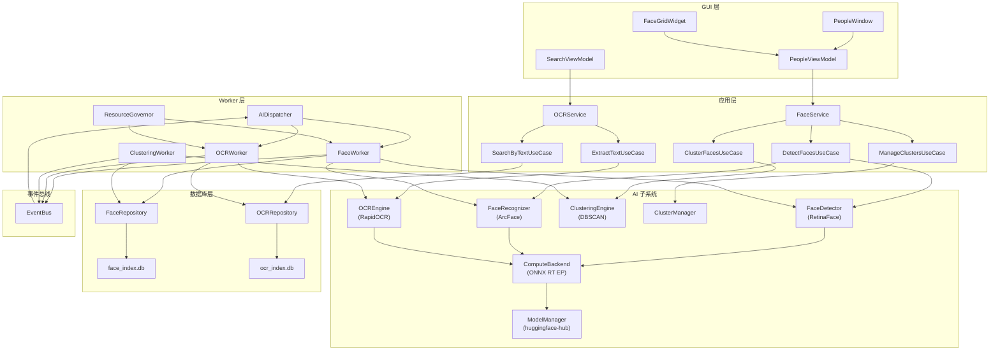
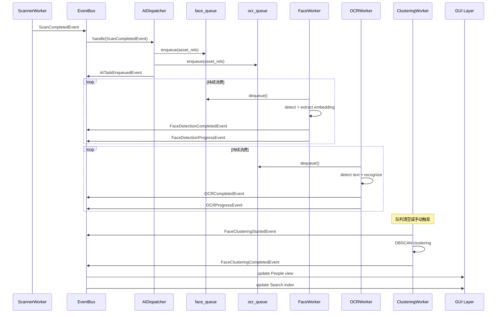
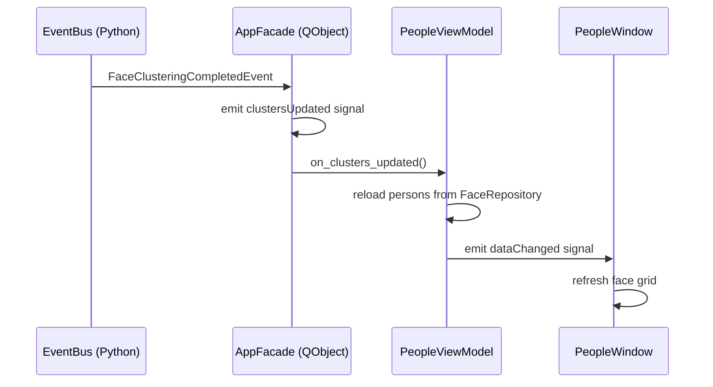
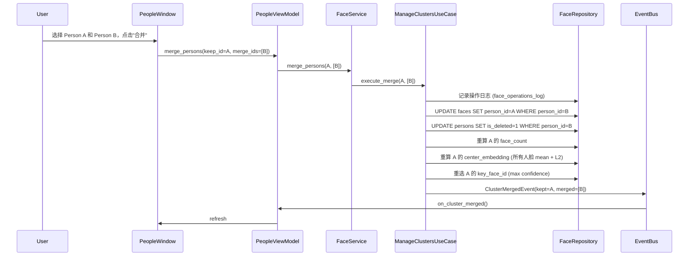
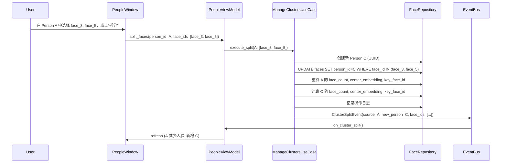
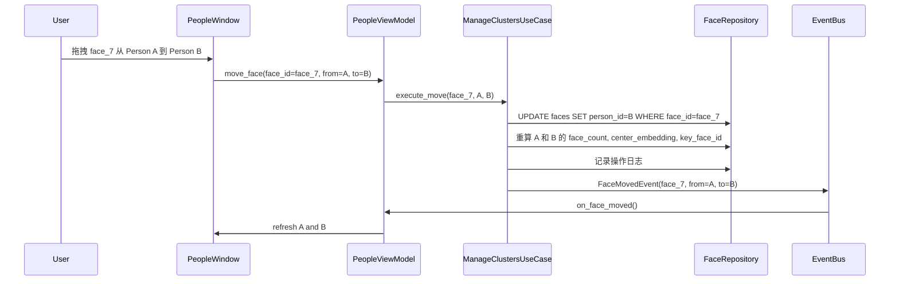
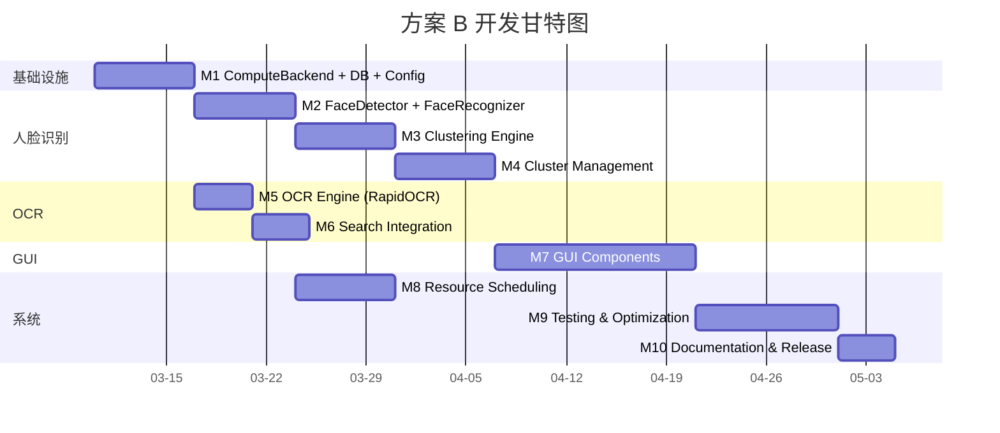

# 🛠️ 人脸识别 / OCR 文字识别 — 开发文档（方案 B）

> 版本 2.0 · 2026-03-09
>
> 本文档面向开发者，详细描述基于 **InsightFace + RapidOCR + ONNX Runtime** 的人脸识别（Face Recognition & Clustering）和 OCR 文字提取子系统的**实现方案、文件结构、信号流、数据流**，以及关键操作的开发指南。
>
> 本文档取代此前基于 OpenCV DNN 的旧方案（v1.0），采用 `immich_integration_feasibility.md` 中推荐的 **方案 B — 提取 Immich 核心依赖库独立集成**。

---

## 技术选型总览

| 模块 | 技术方案 | 许可证 |
|------|---------|--------|
| 人脸检测 | InsightFace RetinaFace (ONNX) | MIT |
| 人脸识别 | InsightFace ArcFace 512-D (ONNX) | MIT |
| 人脸对齐 | InsightFace `norm_crop` | MIT |
| OCR 检测+识别 | RapidOCR (PP-OCRv5) | Apache-2.0 |
| 推理引擎 | ONNX Runtime (CUDA / OpenVINO / CoreML / CPU) | MIT |
| 模型下载 | huggingface-hub | Apache-2.0 |
| 人脸聚类 | scikit-learn DBSCAN | BSD-3-Clause |
| 全文搜索 | SQLite FTS5 | Public Domain |

---

## 目录

1. [文件结构](#1-文件结构)
2. [模块依赖关系](#2-模块依赖关系)
3. [核心类设计](#3-核心类设计)
   - 3.1 [计算后端抽象（ONNX Runtime EP）](#31-计算后端抽象onnx-runtime-ep)
   - 3.2 [模型管理器](#32-模型管理器)
   - 3.3 [人脸检测器（RetinaFace）](#33-人脸检测器retinaface)
   - 3.4 [人脸特征提取器（ArcFace）](#34-人脸特征提取器arcface)
   - 3.5 [人脸聚类引擎](#35-人脸聚类引擎)
   - 3.6 [OCR 引擎（RapidOCR）](#36-ocr-引擎rapidocr)
   - 3.7 [数据库仓储层](#37-数据库仓储层)
   - 3.8 [任务队列与 Worker](#38-任务队列与-worker)
   - 3.9 [资源调度器](#39-资源调度器)
4. [信号流与事件体系](#4-信号流与事件体系)
5. [数据流](#5-数据流)
   - 5.1 [全量扫描流程](#51-全量扫描流程)
   - 5.2 [增量扫描流程](#52-增量扫描流程)
   - 5.3 [人脸聚类流程](#53-人脸聚类流程)
   - 5.4 [OCR 处理流程](#54-ocr-处理流程)
   - 5.5 [文字搜索流程](#55-文字搜索流程)
6. [聚类管理操作详解](#6-聚类管理操作详解)
   - 6.1 [合并聚类](#61-合并聚类)
   - 6.2 [拆分聚类](#62-拆分聚类)
   - 6.3 [移动单张人脸](#63-移动单张人脸)
   - 6.4 [命名人物](#64-命名人物)
7. [文字搜图实现](#7-文字搜图实现)
8. [ONNX Runtime 硬件后端选择](#8-onnx-runtime-硬件后端选择)
9. [多 Worker 资源公平分配](#9-多-worker-资源公平分配)
10. [配置项](#10-配置项)
11. [数据库迁移策略](#11-数据库迁移策略)
12. [依赖管理策略](#12-依赖管理策略)
13. [测试策略](#13-测试策略)
14. [开发里程碑](#14-开发里程碑)

---

## 1. 文件结构

以下为新增文件在现有项目结构中的位置，遵循 iPhotron 已有的分层架构（Domain → Application → Infrastructure → GUI）。

与旧方案相比，方案 B 简化了人脸与 OCR 子模块的内部结构——InsightFace 和 RapidOCR 已封装完整的检测→对齐→识别管线，无需手动实现对齐器和文字检测/识别的拆分模块。

```
src/iPhoto/
├── ai/                                    # 🆕 AI 子系统根目录
│   ├── __init__.py
│   ├── config.py                          # AI 子系统配置常量
│   ├── compute_backend.py                 # ONNX Runtime EP 后端检测与选择
│   │
│   ├── face/                              # 🆕 人脸识别子模块
│   │   ├── __init__.py
│   │   ├── detector.py                    # 人脸检测器 (InsightFace RetinaFace)
│   │   ├── recognizer.py                  # 人脸特征提取 (InsightFace ArcFace)
│   │   ├── clustering.py                  # 聚类引擎 (DBSCAN)
│   │   ├── cluster_manager.py             # 聚类管理操作 (合并/拆分/移动)
│   │   ├── quality.py                     # 人脸质量评估 (清晰度/角度)
│   │   └── models.py                      # 人脸领域数据类 (FaceRecord, Person)
│   │
│   ├── ocr/                               # 🆕 OCR 子模块
│   │   ├── __init__.py
│   │   ├── ocr_engine.py                  # OCR 引擎 (RapidOCR PP-OCRv5 一体化管线)
│   │   └── models.py                      # OCR 领域数据类 (OCRRegion)
│   │
│   ├── db/                                # 🆕 AI 数据库层
│   │   ├── __init__.py
│   │   ├── face_database.py               # face_index.db 连接管理与迁移
│   │   ├── ocr_database.py                # ocr_index.db 连接管理与迁移
│   │   ├── face_repository.py             # FaceRepository (faces, persons 表操作)
│   │   └── ocr_repository.py              # OCRRepository (ocr_regions, ocr_fts 表操作)
│   │
│   ├── workers/                           # 🆕 后台 Worker 线程
│   │   ├── __init__.py
│   │   ├── face_worker.py                 # 人脸检测 + 提取 Worker
│   │   ├── ocr_worker.py                  # OCR Worker
│   │   ├── clustering_worker.py           # 聚类 Worker（周期触发或手动触发）
│   │   └── ai_dispatcher.py              # AI 任务分发器（监听事件，分发至子队列）
│   │
│   ├── scheduler/                         # 🆕 资源调度
│   │   ├── __init__.py
│   │   ├── resource_governor.py           # 资源总管（CPU/GPU/内存分配）
│   │   ├── gpu_semaphore.py               # GPU 时间片信号量
│   │   └── fair_scheduler.py              # 加权公平调度器
│   │
│   └── model_manager.py                   # 🆕 模型文件管理（InsightFace 模型下载/缓存/版本）
│
├── domain/
│   └── models/
│       ├── face.py                        # 🆕 Face, Person 领域模型
│       └── ocr.py                         # 🆕 OCRRegion 领域模型
│
├── application/
│   ├── use_cases/
│   │   ├── detect_faces.py                # 🆕 检测人脸用例
│   │   ├── cluster_faces.py               # 🆕 聚类人脸用例
│   │   ├── manage_clusters.py             # 🆕 管理聚类用例 (合并/拆分/移动)
│   │   ├── extract_text.py                # 🆕 提取文字用例
│   │   └── search_by_text.py              # 🆕 文字搜图用例
│   └── services/
│       ├── face_service.py                # 🆕 人脸识别应用服务
│       └── ocr_service.py                 # 🆕 OCR 应用服务
│
├── events/
│   └── ai_events.py                       # 🆕 AI 相关领域事件
│
├── gui/
│   ├── viewmodels/
│   │   ├── people_viewmodel.py            # 🆕 "人物" 视图 ViewModel
│   │   └── search_viewmodel.py            # 修改：增加 OCR 搜索支持
│   ├── coordinators/
│   │   └── people_coordinator.py          # 🆕 人物视图协调器
│   └── ui/
│       ├── windows/
│       │   └── people_window.py           # 🆕 人物浏览窗口
│       ├── widgets/
│       │   ├── face_grid_widget.py        # 🆕 人脸网格组件
│       │   ├── person_card_widget.py      # 🆕 人物卡片组件
│       │   └── face_merge_dialog.py       # 🆕 合并确认对话框
│       └── controllers/
│           └── people_controller.py       # 🆕 人物视图控制器
│
└── di/
    └── bootstrap.py                       # 修改：注册 AI 子系统的依赖
```

### 与旧方案文件差异

| 旧方案（OpenCV DNN） | 方案 B（InsightFace + RapidOCR） | 变更说明 |
|---------------------|-------------------------------|---------|
| `face/aligner.py` | *(删除)* | InsightFace `norm_crop` 内置对齐，无需独立实现 |
| `ocr/text_detector.py` | *(删除)* | RapidOCR 一体化管线，检测+识别合并于 `ocr_engine.py` |
| `ocr/text_recognizer.py` | *(删除)* | 同上 |
| `compute_backend.py` (OpenCV DNN) | `compute_backend.py` (ONNX RT EP) | 从 `cv2.dnn.DNN_BACKEND_*` 切换为 ONNX Runtime ExecutionProvider |
| `model_manager.py` (手动 ONNX 下载) | `model_manager.py` (huggingface-hub) | 支持 InsightFace 模型包 + RapidOCR 内置模型 |

---

## 2. 模块依赖关系



### 关键依赖链

```
insightface.app.FaceAnalysis ──▶ onnxruntime.InferenceSession
                                         │
rapidocr.RapidOCR ─────────────▶ onnxruntime.InferenceSession
                                         │
                                    ComputeBackend
                                    (EP 选择: CUDA → OpenVINO → CoreML → CPU)
```

---

## 3. 核心类设计

### 3.1 计算后端抽象（ONNX Runtime EP）

**文件：** `src/iPhoto/ai/compute_backend.py`

与旧方案基于 `cv2.dnn.DNN_BACKEND_*` 不同，方案 B 使用 **ONNX Runtime Execution Provider (EP)** 机制，支持更广泛的硬件加速后端。

```python
from enum import Enum
from dataclasses import dataclass
import logging

logger = logging.getLogger(__name__)


class BackendType(Enum):
    CUDA = "cuda"
    OPENVINO = "openvino"
    COREML = "coreml"
    CPU = "cpu"


@dataclass(frozen=True)
class ComputeBackendInfo:
    backend_type: BackendType
    execution_providers: list[str]   # ONNX Runtime EP 列表
    device_name: str                 # "NVIDIA GeForce RTX 4090" / "CPU"


class ComputeBackend:
    """单例。应用启动时检测一次硬件能力，整个生命周期内复用。

    基于 ONNX Runtime 的 Execution Provider 机制，支持：
    - CUDAExecutionProvider (NVIDIA GPU)
    - OpenVINOExecutionProvider (Intel GPU / CPU)
    - CoreMLExecutionProvider (Apple Silicon)
    - CPUExecutionProvider (通用回退)
    """

    _instance: "ComputeBackend | None" = None
    _info: ComputeBackendInfo

    @classmethod
    def get(cls) -> "ComputeBackend":
        if cls._instance is None:
            cls._instance = cls()
        return cls._instance

    @classmethod
    def reset(cls) -> None:
        """用于测试：重置单例。"""
        cls._instance = None

    def __init__(self) -> None:
        self._info = self._detect()
        logger.info("ComputeBackend: using %s (%s)",
                     self._info.backend_type.value,
                     self._info.device_name)

    @property
    def info(self) -> ComputeBackendInfo:
        return self._info

    @property
    def execution_providers(self) -> list[str]:
        """返回 ONNX Runtime 的 EP 列表，供 InferenceSession 和 insightface 使用。"""
        return self._info.execution_providers

    @staticmethod
    def _detect() -> ComputeBackendInfo:
        import onnxruntime as ort
        available_eps = ort.get_available_providers()
        logger.debug("ONNX Runtime available EPs: %s", available_eps)

        # 1. CUDA
        if "CUDAExecutionProvider" in available_eps:
            device_name = _get_cuda_device_name()
            return ComputeBackendInfo(
                backend_type=BackendType.CUDA,
                execution_providers=[
                    "CUDAExecutionProvider",
                    "CPUExecutionProvider",
                ],
                device_name=device_name,
            )

        # 2. OpenVINO (Intel)
        if "OpenVINOExecutionProvider" in available_eps:
            return ComputeBackendInfo(
                backend_type=BackendType.OPENVINO,
                execution_providers=[
                    "OpenVINOExecutionProvider",
                    "CPUExecutionProvider",
                ],
                device_name="Intel OpenVINO Device",
            )

        # 3. CoreML (Apple Silicon)
        if "CoreMLExecutionProvider" in available_eps:
            return ComputeBackendInfo(
                backend_type=BackendType.COREML,
                execution_providers=[
                    "CoreMLExecutionProvider",
                    "CPUExecutionProvider",
                ],
                device_name="Apple CoreML",
            )

        # 4. CPU fallback
        return ComputeBackendInfo(
            backend_type=BackendType.CPU,
            execution_providers=["CPUExecutionProvider"],
            device_name="CPU",
        )


def _get_cuda_device_name() -> str:
    """尝试获取 CUDA 设备名称。"""
    try:
        import subprocess
        result = subprocess.run(
            ["nvidia-smi", "--query-gpu=name", "--format=csv,noheader,nounits"],
            capture_output=True, text=True, timeout=5,
        )
        if result.returncode == 0 and result.stdout.strip():
            return result.stdout.strip().split("\n")[0]
    except Exception:
        pass
    return "NVIDIA GPU"
```

---

### 3.2 模型管理器

**文件：** `src/iPhoto/ai/model_manager.py`

方案 B 需要管理两类模型：InsightFace 模型包和 RapidOCR 内置模型。

```python
import logging
from pathlib import Path

logger = logging.getLogger(__name__)


class ModelManager:
    """AI 模型文件管理器。

    职责：
    1. 管理 InsightFace 模型包（buffalo_l / buffalo_s）的下载与缓存
    2. 确认 RapidOCR 内置模型可用（PP-OCRv5 模型随 pip 安装自带）
    3. 提供统一的模型路径查询接口

    模型存储位置：
    - InsightFace: ~/.insightface/models/<model_pack>/  (InsightFace 默认)
    - RapidOCR:    随包安装 (site-packages/rapidocr_onnxruntime/models/)
    """

    def __init__(self, models_root: Path | None = None) -> None:
        self._models_root = models_root or Path.home() / ".insightface" / "models"

    @property
    def models_root(self) -> Path:
        return self._models_root

    def ensure_insightface_model(self, model_pack: str = "buffalo_l") -> Path:
        """确保 InsightFace 模型包已下载。

        InsightFace 在首次调用 FaceAnalysis(name=model_pack) 时会自动从
        官方服务器下载模型包到 ~/.insightface/models/ 目录。

        Args:
            model_pack: 模型包名称。可选值：
                - "buffalo_l" (大模型, 检测+识别精度最高, ~326 MB)
                - "buffalo_s" (小模型, 速度快, ~159 MB)
                - "buffalo_m" (中等模型, ~234 MB)

        Returns:
            模型包目录路径。
        """
        model_dir = self._models_root / model_pack
        if model_dir.exists() and any(model_dir.glob("*.onnx")):
            logger.info("InsightFace model pack '%s' found at %s",
                        model_pack, model_dir)
        else:
            logger.info("InsightFace model pack '%s' will be downloaded "
                        "on first use to %s", model_pack, model_dir)
        return model_dir

    def get_model_info(self) -> dict[str, str]:
        """返回当前使用的模型信息摘要。"""
        return {
            "face_detection": "RetinaFace (InsightFace buffalo_l)",
            "face_recognition": "ArcFace 512-D (InsightFace buffalo_l)",
            "ocr": "PP-OCRv5 (RapidOCR built-in)",
            "inference_engine": "ONNX Runtime",
        }
```

---

### 3.3 人脸检测器（RetinaFace）

**文件：** `src/iPhoto/ai/face/detector.py`

基于 InsightFace 的 `FaceAnalysis` API，封装人脸检测功能。RetinaFace 在 WIDER FACE hard 子集上达到 **~94% mAP**，显著优于 YuNet 的 ~86%。

```python
from __future__ import annotations

from dataclasses import dataclass
from pathlib import Path

import numpy as np
import logging

logger = logging.getLogger(__name__)


@dataclass
class DetectedFace:
    """单张检测到的人脸。"""
    box: tuple[int, int, int, int]        # (x, y, w, h) — 边界框
    confidence: float                      # 检测置信分数
    landmarks: np.ndarray | None           # shape (5, 2) — 5-point landmarks
    embedding: np.ndarray | None = None    # shape (512,) — ArcFace embedding (可选)


class FaceDetector:
    """基于 InsightFace FaceAnalysis (RetinaFace) 的人脸检测器。

    InsightFace 的 FaceAnalysis 封装了完整的检测→对齐→识别管线，
    但本类仅暴露检测功能，识别由 FaceRecognizer 独立管理。

    核心优势（相比旧方案 YuNet）：
    - 检测精度更高：RetinaFace ~94% mAP vs YuNet ~86% mAP
    - 对小脸、遮挡、大角度场景鲁棒性更强
    - 5-point landmark 精度更高，为后续对齐提供更好基础
    """

    def __init__(self, model_pack: str = "buffalo_l",
                 score_threshold: float = 0.7,
                 input_size: tuple[int, int] = (640, 640),
                 min_face_size: int = 40) -> None:
        self._model_pack = model_pack
        self._score_threshold = score_threshold
        self._input_size = input_size
        self._min_face_size = min_face_size
        self._app = None  # insightface.app.FaceAnalysis (lazy init)

    def _ensure_loaded(self):
        """延迟加载 InsightFace FaceAnalysis。

        首次调用时自动下载模型包（如尚未缓存）。
        """
        if self._app is None:
            from insightface.app import FaceAnalysis
            from iPhoto.ai.compute_backend import ComputeBackend

            backend = ComputeBackend.get()
            providers = backend.execution_providers

            self._app = FaceAnalysis(
                name=self._model_pack,
                providers=providers,
            )
            self._app.prepare(
                ctx_id=0,
                det_thresh=self._score_threshold,
                det_size=self._input_size,
            )
            logger.info("FaceDetector loaded: model=%s, providers=%s",
                        self._model_pack, providers)
        return self._app

    def detect(self, image: np.ndarray) -> list[DetectedFace]:
        """检测图片中所有人脸。

        Args:
            image: BGR 格式 numpy 数组。

        Returns:
            按 confidence 降序排列的 DetectedFace 列表。
        """
        app = self._ensure_loaded()

        # InsightFace get() 返回 Face 对象列表
        faces = app.get(image)

        results: list[DetectedFace] = []
        for face in faces:
            bbox = face.bbox.astype(int)  # [x1, y1, x2, y2]
            x1, y1, x2, y2 = bbox
            w, h = x2 - x1, y2 - y1

            # 过滤过小人脸
            if w < self._min_face_size or h < self._min_face_size:
                continue

            results.append(DetectedFace(
                box=(x1, y1, w, h),
                confidence=float(face.det_score),
                landmarks=face.kps if face.kps is not None else None,
                embedding=None,  # 由 FaceRecognizer 单独提取
            ))

        results.sort(key=lambda f: f.confidence, reverse=True)
        return results
```

---

### 3.4 人脸特征提取器（ArcFace）

**文件：** `src/iPhoto/ai/face/recognizer.py`

基于 InsightFace 的 ArcFace 模型，提取 **512-D L2-normalized** 特征向量。
在 LFW 基准上达到 **~99.8%** 准确率，显著优于 SFace 的 ~99.0%。

```python
from __future__ import annotations

from pathlib import Path

import numpy as np
import logging

from iPhoto.ai.face.detector import DetectedFace

logger = logging.getLogger(__name__)


class FaceRecognizer:
    """基于 InsightFace ArcFace 的人脸特征提取器。

    核心优势（相比旧方案 SFace）：
    - 特征维度统一 512-D，精度更高 (LFW 99.8% vs 99.0%)
    - InsightFace 内置 norm_crop 对齐，无需手动实现 5-point 仿射变换
    - ONNX Runtime 推理，GPU 加速范围更广
    """

    EMBEDDING_DIM = 512

    def __init__(self, model_pack: str = "buffalo_l") -> None:
        self._model_pack = model_pack
        self._app = None  # insightface.app.FaceAnalysis (lazy init)

    def _ensure_loaded(self):
        if self._app is None:
            from insightface.app import FaceAnalysis
            from iPhoto.ai.compute_backend import ComputeBackend

            backend = ComputeBackend.get()
            providers = backend.execution_providers

            self._app = FaceAnalysis(
                name=self._model_pack,
                providers=providers,
            )
            # det_size 较小即可，因为此时主要用于提取 embedding
            self._app.prepare(ctx_id=0, det_size=(640, 640))
            logger.info("FaceRecognizer loaded: model=%s", self._model_pack)
        return self._app

    def extract_embedding(self, image: np.ndarray,
                          face_box: tuple[int, int, int, int],
                          landmarks: np.ndarray | None = None
                          ) -> np.ndarray:
        """提取人脸的归一化特征向量。

        使用 InsightFace 的 norm_crop 进行人脸对齐后提取 ArcFace 特征。

        Args:
            image: BGR 原图。
            face_box: (x, y, w, h) 人脸检测框。
            landmarks: shape (5, 2) 的 5-point landmarks (必须提供)。

        Returns:
            L2-normalized float32 向量，shape (512,)。
        """
        app = self._ensure_loaded()

        if landmarks is None:
            raise ValueError("ArcFace requires 5-point landmarks for alignment")

        # 使用 insightface 的 norm_crop 进行标准化裁剪
        from insightface.utils.face_align import norm_crop
        aligned_face = norm_crop(image, landmarks)

        # 通过 recognition 模型提取 embedding
        # FaceAnalysis 内部的 recognition model 已在 prepare() 时加载
        rec_model = app.models.get("recognition", None)
        if rec_model is None:
            # 回退：通过 app.get() 获取完整 embedding
            return self._extract_via_full_pipeline(image, face_box)

        embedding = rec_model.get_feat(aligned_face)
        embedding = embedding.flatten()

        # L2 归一化
        norm = np.linalg.norm(embedding)
        if norm > 0:
            embedding = embedding / norm

        return embedding

    def extract_embedding_batch(self, image: np.ndarray,
                                detected_faces: list[DetectedFace]
                                ) -> list[np.ndarray]:
        """批量提取人脸特征向量。

        一次性提取一张图片中所有检测到的人脸的 embedding。

        Args:
            image: BGR 原图。
            detected_faces: 该图片中检测到的人脸列表。

        Returns:
            与 detected_faces 等长的 embedding 列表，shape 各为 (512,)。
        """
        return [
            self.extract_embedding(image, face.box, face.landmarks)
            for face in detected_faces
            if face.landmarks is not None
        ]

    def _extract_via_full_pipeline(self, image: np.ndarray,
                                   face_box: tuple[int, int, int, int]
                                   ) -> np.ndarray:
        """回退方案：使用 FaceAnalysis.get() 获取 embedding。"""
        app = self._ensure_loaded()
        faces = app.get(image)

        # 找到与 face_box 最匹配的人脸
        x, y, w, h = face_box
        best_face = None
        best_iou = 0.0
        for face in faces:
            bbox = face.bbox.astype(int)
            iou = _compute_iou((x, y, x + w, y + h),
                               (bbox[0], bbox[1], bbox[2], bbox[3]))
            if iou > best_iou:
                best_iou = iou
                best_face = face

        if best_face is not None and best_face.embedding is not None:
            emb = best_face.embedding.flatten()
            norm = np.linalg.norm(emb)
            return emb / norm if norm > 0 else emb

        # 无法匹配时返回零向量
        return np.zeros(self.EMBEDDING_DIM, dtype=np.float32)

    @staticmethod
    def cosine_distance(emb1: np.ndarray, emb2: np.ndarray) -> float:
        """计算两个 embedding 之间的余弦距离 [0, 2]。"""
        return 1.0 - float(np.dot(emb1.flatten(), emb2.flatten()))


def _compute_iou(box1: tuple, box2: tuple) -> float:
    """计算两个矩形框的 IoU (Intersection over Union)。"""
    x1 = max(box1[0], box2[0])
    y1 = max(box1[1], box2[1])
    x2 = min(box1[2], box2[2])
    y2 = min(box1[3], box2[3])

    inter = max(0, x2 - x1) * max(0, y2 - y1)
    area1 = (box1[2] - box1[0]) * (box1[3] - box1[1])
    area2 = (box2[2] - box2[0]) * (box2[3] - box2[1])
    union = area1 + area2 - inter
    return inter / union if union > 0 else 0.0
```

---

### 3.5 人脸聚类引擎

**文件：** `src/iPhoto/ai/face/clustering.py`

聚类引擎与旧方案完全一致——DBSCAN 算法与模型无关，直接操作 embedding 向量。ArcFace 512-D embedding 的质量更高，将直接提升聚类精度。

```python
from dataclasses import dataclass

import numpy as np
from sklearn.cluster import DBSCAN


@dataclass
class ClusterResult:
    """聚类结果。"""
    labels: np.ndarray          # shape (N,)  每张人脸的聚类标签, -1 = noise
    n_clusters: int             # 聚类数（不含 noise）
    core_sample_indices: list[int]


class FaceClusteringEngine:
    """基于 DBSCAN 的人脸聚类引擎。

    使用余弦距离度量，适合 L2-normalized embedding。
    ArcFace 512-D embedding 的判别力优于 SFace，在相同阈值下聚类纯度更高。
    """

    def __init__(self, distance_threshold: float = 0.6,
                 min_samples: int = 2) -> None:
        self._distance_threshold = distance_threshold
        self._min_samples = min_samples

    def cluster(self, embeddings: np.ndarray) -> ClusterResult:
        """对 N 个人脸 embedding 执行聚类。

        Args:
            embeddings: shape (N, D) 的 float32 矩阵，每行是一个 L2-normalized 向量。

        Returns:
            ClusterResult 包含聚类标签和聚类数。
        """
        if len(embeddings) == 0:
            return ClusterResult(labels=np.array([]), n_clusters=0,
                                 core_sample_indices=[])

        # 余弦距离矩阵
        similarity = np.dot(embeddings, embeddings.T)
        distance_matrix = 1.0 - similarity
        np.clip(distance_matrix, 0.0, 2.0, out=distance_matrix)

        db = DBSCAN(
            eps=self._distance_threshold,
            min_samples=self._min_samples,
            metric="precomputed",
        )
        db.fit(distance_matrix)

        labels = db.labels_
        n_clusters = len(set(labels)) - (1 if -1 in labels else 0)

        return ClusterResult(
            labels=labels,
            n_clusters=n_clusters,
            core_sample_indices=list(db.core_sample_indices_),
        )

    def assign_to_existing(self, new_embedding: np.ndarray,
                           cluster_centers: dict[str, np.ndarray]
                           ) -> str | None:
        """增量聚类：将新人脸分配到最近的已有聚类。

        Args:
            new_embedding: shape (1, D) 新人脸 embedding。
            cluster_centers: {person_id: center_embedding} 现有聚类中心。

        Returns:
            最近的 person_id，若距离超过阈值则返回 None（新建聚类）。
        """
        best_pid: str | None = None
        best_dist = float("inf")

        new_flat = new_embedding.flatten()
        for pid, center in cluster_centers.items():
            dist = 1.0 - float(np.dot(new_flat, center.flatten()))
            if dist < best_dist:
                best_dist = dist
                best_pid = pid

        if best_dist <= self._distance_threshold:
            return best_pid
        return None

    @staticmethod
    def compute_center(embeddings: np.ndarray) -> np.ndarray:
        """计算聚类中心（均值 + L2 归一化）。"""
        center = np.mean(embeddings, axis=0)
        norm = np.linalg.norm(center)
        if norm > 0:
            center = center / norm
        return center
```

---

### 3.6 OCR 引擎（RapidOCR）

**文件：** `src/iPhoto/ai/ocr/ocr_engine.py`

基于 RapidOCR（PP-OCRv5）的**一体化** OCR 管线。与旧方案需要分别实现 `text_detector.py` + `text_recognizer.py` + `ocr_engine.py` 三个文件不同，RapidOCR 将检测、方向分类、识别封装为单一 API 调用。

```python
from __future__ import annotations

from dataclasses import dataclass
import logging

import numpy as np

logger = logging.getLogger(__name__)


@dataclass
class OCRResult:
    """单个文字区域的识别结果。"""
    box: tuple[int, int, int, int]   # (x, y, w, h)
    text: str
    confidence: float
    language: str
    rotation_angle: float


class OCREngine:
    """基于 RapidOCR (PP-OCRv5) 的 OCR 引擎。

    RapidOCR 封装了百度 PaddleOCR 的 ONNX 模型，提供开箱即用的：
    - 文字区域检测 (DBNet++ / PP-OCRv5 Det)
    - 方向分类 (Text Angle Classification)
    - 文字识别 (CRNN++ / PP-OCRv5 Rec)

    核心优势（相比旧方案 EAST + CRNN）：
    - 中文 OCR 精度：95%+ vs 80-85% (+10-15%)
    - 弯曲文本、旋转文本支持更好
    - 多语言支持：中/英/日/韩/法/德等 80+ 种语言
    - 无需手动实现裁剪、旋转校正、CTC 解码等
    """

    def __init__(self,
                 confidence_threshold: float = 0.5,
                 use_angle_cls: bool = True,
                 languages: list[str] | None = None) -> None:
        self._conf_threshold = confidence_threshold
        self._use_angle_cls = use_angle_cls
        self._languages = languages or ["ch", "en"]
        self._engine = None  # rapidocr.RapidOCR (lazy init)

    def _ensure_loaded(self):
        """延迟加载 RapidOCR 引擎。

        RapidOCR 模型随 pip 安装自带（位于 site-packages），
        无需额外下载。
        """
        if self._engine is None:
            from rapidocr_onnxruntime import RapidOCR
            from iPhoto.ai.compute_backend import ComputeBackend

            backend = ComputeBackend.get()

            # RapidOCR 支持通过参数指定 ONNX Runtime providers
            self._engine = RapidOCR()
            logger.info("OCREngine loaded: PP-OCRv5, providers=%s",
                        backend.execution_providers)
        return self._engine

    def process(self, image: np.ndarray) -> list[OCRResult]:
        """对图片执行文字检测 + 识别。

        Args:
            image: BGR 格式 numpy 数组。

        Returns:
            按位置排序（上到下、左到右）的 OCRResult 列表。
        """
        engine = self._ensure_loaded()

        # RapidOCR 一次调用完成检测+方向分类+识别
        result, _ = engine(image)

        if result is None:
            return []

        ocr_results: list[OCRResult] = []
        for item in result:
            # RapidOCR 返回格式: [box_points, text, confidence]
            box_points, text, confidence = item

            if confidence < self._conf_threshold or not text.strip():
                continue

            # 将多边形坐标转换为 (x, y, w, h) 矩形框
            box = self._polygon_to_rect(box_points)

            # 计算旋转角度
            angle = self._estimate_rotation(box_points)

            ocr_results.append(OCRResult(
                box=box,
                text=text.strip(),
                confidence=float(confidence),
                language=self._detect_language(text),
                rotation_angle=angle,
            ))

        # 排序：上到下、左到右
        ocr_results.sort(key=lambda r: (r.box[1], r.box[0]))
        return ocr_results

    @staticmethod
    def _polygon_to_rect(box_points) -> tuple[int, int, int, int]:
        """将 4 点多边形坐标转为 (x, y, w, h) 矩形框。

        box_points: [[x1,y1], [x2,y2], [x3,y3], [x4,y4]] — 顺时针 4 点
        """
        pts = np.array(box_points, dtype=np.int32)
        x_min, y_min = pts.min(axis=0)
        x_max, y_max = pts.max(axis=0)
        return (int(x_min), int(y_min), int(x_max - x_min), int(y_max - y_min))

    @staticmethod
    def _estimate_rotation(box_points) -> float:
        """从多边形 4 点估算文字旋转角度。"""
        pts = np.array(box_points, dtype=np.float32)
        # 使用上边缘的倾斜角度
        dx = pts[1][0] - pts[0][0]
        dy = pts[1][1] - pts[0][1]
        angle = float(np.degrees(np.arctan2(dy, dx)))
        return angle

    @staticmethod
    def _detect_language(text: str) -> str:
        """简单语言检测：基于字符 Unicode 范围。"""
        cjk_count = sum(1 for c in text if '\u4e00' <= c <= '\u9fff')
        if cjk_count > len(text) * 0.3:
            return "chi_sim"
        return "eng"
```

---

### 3.7 数据库仓储层

**文件：** `src/iPhoto/ai/db/face_repository.py`

数据库仓储层与旧方案设计完全一致——数据库操作与模型无关。唯一区别是 `embedding_model` 和 `detector_model` 默认值变更为 `'ArcFace_buffalo_l'` 和 `'RetinaFace_buffalo_l'`。

```python
import sqlite3
import uuid
from datetime import datetime, timezone
from pathlib import Path

import numpy as np

from iPhoto.ai.face.models import FaceRecord, PersonRecord


class FaceRepository:
    """face_index.db 的数据访问层。"""

    def __init__(self, db_path: Path) -> None:
        self._db_path = db_path
        self._conn: sqlite3.Connection | None = None

    def _get_conn(self) -> sqlite3.Connection:
        if self._conn is None:
            self._conn = sqlite3.connect(str(self._db_path))
            self._conn.execute("PRAGMA journal_mode=WAL")
            self._conn.execute("PRAGMA synchronous=NORMAL")
            self._conn.execute("PRAGMA cache_size=-8192")  # 8 MiB
            self._conn.row_factory = sqlite3.Row
        return self._conn

    # ---------- faces 表 ----------

    def insert_face(self, face: FaceRecord) -> None:
        conn = self._get_conn()
        conn.execute(
            """INSERT OR REPLACE INTO faces
               (face_id, asset_rel, box_x, box_y, box_w, box_h,
                confidence, embedding, embedding_dim, embedding_model,
                thumbnail_path, quality_score, person_id, is_key_face,
                detected_at, detector_model, image_width, image_height)
               VALUES (?,?,?,?,?,?,?,?,?,?,?,?,?,?,?,?,?,?)""",
            (face.face_id, face.asset_rel,
             face.box_x, face.box_y, face.box_w, face.box_h,
             face.confidence,
             face.embedding.tobytes(), face.embedding_dim, face.embedding_model,
             face.thumbnail_path, face.quality_score,
             face.person_id, face.is_key_face,
             face.detected_at, face.detector_model,
             face.image_width, face.image_height),
        )
        conn.commit()

    def get_faces_by_person(self, person_id: str) -> list[FaceRecord]:
        """获取某 Person 下所有人脸。"""
        conn = self._get_conn()
        rows = conn.execute(
            "SELECT * FROM faces WHERE person_id = ?", (person_id,)
        ).fetchall()
        return [self._row_to_face(r) for r in rows]

    def get_faces_by_asset(self, asset_rel: str) -> list[FaceRecord]:
        """获取某张照片中的所有人脸。"""
        conn = self._get_conn()
        rows = conn.execute(
            "SELECT * FROM faces WHERE asset_rel = ?", (asset_rel,)
        ).fetchall()
        return [self._row_to_face(r) for r in rows]

    def update_person_id(self, face_id: str, person_id: str | None) -> None:
        """更新人脸所属 Person。"""
        conn = self._get_conn()
        conn.execute(
            "UPDATE faces SET person_id = ? WHERE face_id = ?",
            (person_id, face_id),
        )
        conn.commit()

    def get_all_embeddings(self) -> list[tuple[str, np.ndarray]]:
        """获取所有人脸 ID 与 embedding。用于全量聚类。"""
        conn = self._get_conn()
        rows = conn.execute(
            "SELECT face_id, embedding, embedding_dim FROM faces"
        ).fetchall()
        results = []
        for r in rows:
            emb = np.frombuffer(r["embedding"], dtype=np.float32)
            emb = emb.reshape(1, r["embedding_dim"])
            results.append((r["face_id"], emb))
        return results

    # ---------- persons 表 ----------

    def insert_person(self, person: PersonRecord) -> None:
        conn = self._get_conn()
        conn.execute(
            """INSERT OR REPLACE INTO persons
               (person_id, name, key_face_id, face_count,
                center_embedding, is_hidden, is_deleted,
                created_at, updated_at, merge_source_ids)
               VALUES (?,?,?,?,?,?,?,?,?,?)""",
            (person.person_id, person.name, person.key_face_id,
             person.face_count,
             person.center_embedding.tobytes() if person.center_embedding is not None else None,
             person.is_hidden, person.is_deleted,
             person.created_at, person.updated_at,
             person.merge_source_ids),
        )
        conn.commit()

    def get_all_persons(self, include_hidden: bool = False) -> list[PersonRecord]:
        """获取所有活跃 Person。"""
        conn = self._get_conn()
        sql = "SELECT * FROM persons WHERE is_deleted = 0"
        if not include_hidden:
            sql += " AND is_hidden = 0"
        sql += " ORDER BY face_count DESC"
        rows = conn.execute(sql).fetchall()
        return [self._row_to_person(r) for r in rows]

    def merge_persons(self, keep_id: str, merge_ids: list[str]) -> None:
        """合并多个 Person 到 keep_id。"""
        conn = self._get_conn()
        now = datetime.now(timezone.utc).isoformat()

        # 1. 将所有被合并 Person 的人脸转移到 keep_id
        for mid in merge_ids:
            conn.execute(
                "UPDATE faces SET person_id = ? WHERE person_id = ?",
                (keep_id, mid),
            )
            # 2. 逻辑删除被合并 Person
            conn.execute(
                "UPDATE persons SET is_deleted = 1, updated_at = ? WHERE person_id = ?",
                (now, mid),
            )

        # 3. 更新 keep_id 的人脸计数
        count = conn.execute(
            "SELECT COUNT(*) FROM faces WHERE person_id = ?", (keep_id,)
        ).fetchone()[0]
        conn.execute(
            "UPDATE persons SET face_count = ?, updated_at = ? WHERE person_id = ?",
            (count, now, keep_id),
        )
        conn.commit()

    # ---------- 内部方法 ----------

    @staticmethod
    def _row_to_face(row: sqlite3.Row) -> FaceRecord:
        emb = np.frombuffer(row["embedding"], dtype=np.float32)
        return FaceRecord(
            face_id=row["face_id"],
            asset_rel=row["asset_rel"],
            box_x=row["box_x"], box_y=row["box_y"],
            box_w=row["box_w"], box_h=row["box_h"],
            confidence=row["confidence"],
            embedding=emb.reshape(1, row["embedding_dim"]),
            embedding_dim=row["embedding_dim"],
            embedding_model=row["embedding_model"],
            thumbnail_path=row["thumbnail_path"],
            quality_score=row["quality_score"],
            person_id=row["person_id"],
            is_key_face=bool(row["is_key_face"]),
            detected_at=row["detected_at"],
            detector_model=row["detector_model"],
            image_width=row["image_width"],
            image_height=row["image_height"],
        )

    @staticmethod
    def _row_to_person(row: sqlite3.Row) -> PersonRecord:
        center = None
        if row["center_embedding"]:
            center = np.frombuffer(row["center_embedding"], dtype=np.float32)
        return PersonRecord(
            person_id=row["person_id"],
            name=row["name"],
            key_face_id=row["key_face_id"],
            face_count=row["face_count"],
            center_embedding=center,
            is_hidden=bool(row["is_hidden"]),
            is_deleted=bool(row["is_deleted"]),
            created_at=row["created_at"],
            updated_at=row["updated_at"],
            merge_source_ids=row["merge_source_ids"],
        )
```

---

### 3.8 任务队列与 Worker

**文件：** `src/iPhoto/ai/workers/face_worker.py`

Worker 架构与旧方案一致，但内部调用从 `cv2.FaceDetectorYN` / `cv2.FaceRecognizerSF` 替换为 InsightFace API。

```python
import logging
import threading
from pathlib import Path

import cv2
import numpy as np

from iPhoto.ai.face.detector import FaceDetector
from iPhoto.ai.face.recognizer import FaceRecognizer
from iPhoto.ai.db.face_repository import FaceRepository
from iPhoto.ai.scheduler.gpu_semaphore import GPUSemaphore
from iPhoto.events.bus import EventBus

logger = logging.getLogger(__name__)


class FaceWorker(threading.Thread):
    """人脸检测 + 特征提取 Worker 线程。

    从 face_queue 表取任务，处理后写入 faces 表。
    使用 InsightFace (RetinaFace + ArcFace) 完成检测和特征提取。
    """

    def __init__(self, worker_id: int,
                 face_repo: FaceRepository,
                 detector: FaceDetector,
                 recognizer: FaceRecognizer,
                 library_root: Path,
                 gpu_semaphore: GPUSemaphore,
                 event_bus: EventBus,
                 stop_event: threading.Event) -> None:
        super().__init__(name=f"FaceWorker-{worker_id}", daemon=True)
        self._worker_id = worker_id
        self._repo = face_repo
        self._detector = detector
        self._recognizer = recognizer
        self._library_root = library_root
        self._gpu_sem = gpu_semaphore
        self._event_bus = event_bus
        self._stop = stop_event

    def run(self) -> None:
        logger.info("FaceWorker-%d started", self._worker_id)
        while not self._stop.is_set():
            task = self._repo.dequeue_face_task()
            if task is None:
                # 队列为空，等待后重试
                self._stop.wait(timeout=2.0)
                continue

            asset_rel = task["asset_rel"]
            try:
                self._process(asset_rel)
                self._repo.complete_face_task(asset_rel)
            except Exception:
                logger.exception("FaceWorker-%d failed on %s",
                                 self._worker_id, asset_rel)
                self._repo.fail_face_task(asset_rel)

        logger.info("FaceWorker-%d stopped", self._worker_id)

    def _process(self, asset_rel: str) -> None:
        image_path = self._library_root / asset_rel
        image = cv2.imread(str(image_path))
        if image is None:
            raise FileNotFoundError(f"Cannot read image: {image_path}")

        # 获取 GPU 时间片
        with self._gpu_sem:
            # 检测人脸
            faces = self._detector.detect(image)

            # 批量提取 embedding
            for face in faces:
                if face.landmarks is not None:
                    embedding = self._recognizer.extract_embedding(
                        image, face.box, face.landmarks
                    )
                    self._save_face(asset_rel, face, embedding, image.shape)

    def _save_face(self, asset_rel: str, face, embedding: np.ndarray,
                   image_shape: tuple) -> None:
        """保存人脸检测结果到数据库。"""
        from iPhoto.ai.face.models import FaceRecord
        import uuid
        from datetime import datetime, timezone

        record = FaceRecord(
            face_id=str(uuid.uuid4()),
            asset_rel=asset_rel,
            box_x=face.box[0], box_y=face.box[1],
            box_w=face.box[2], box_h=face.box[3],
            confidence=face.confidence,
            embedding=embedding,
            embedding_dim=embedding.shape[-1],
            embedding_model="ArcFace_buffalo_l",
            thumbnail_path=None,
            quality_score=None,
            person_id=None,
            is_key_face=False,
            detected_at=datetime.now(timezone.utc).isoformat(),
            detector_model="RetinaFace_buffalo_l",
            image_width=image_shape[1],
            image_height=image_shape[0],
        )
        self._repo.insert_face(record)
```

---

### 3.9 资源调度器

**文件：** `src/iPhoto/ai/scheduler/resource_governor.py`

资源调度器与旧方案完全一致——与模型选型无关。

```python
import os
import threading
import logging

logger = logging.getLogger(__name__)


class ResourceGovernor:
    """管理 Face Workers 和 OCR Workers 的 CPU/GPU 资源分配。

    核心策略：
    - 预留 2 个 CPU 核心给 GUI + 主库操作
    - 剩余核心按 face_weight:ocr_weight 比例分配
    - GPU 通过信号量实现时间片轮转
    """

    def __init__(self,
                 face_weight: float = 0.6,
                 ocr_weight: float = 0.4,
                 reserved_cores: int = 2,
                 max_ai_memory_bytes: int = 3 * 1024 ** 3) -> None:
        total_cores = os.cpu_count() or 4
        available = max(total_cores - reserved_cores, 2)

        self.face_worker_count = max(int(available * face_weight), 1)
        self.ocr_worker_count = max(int(available * ocr_weight), 1)
        self.max_ai_memory = max_ai_memory_bytes

        logger.info(
            "ResourceGovernor: %d cores available, "
            "face_workers=%d, ocr_workers=%d",
            available, self.face_worker_count, self.ocr_worker_count,
        )
```

---

## 4. 信号流与事件体系

**文件：** `src/iPhoto/events/ai_events.py`

以下为 AI 子系统新增的领域事件，均继承自现有 `DomainEvent` 基类：

```python
from dataclasses import dataclass, field
from iPhoto.events.bus import DomainEvent


@dataclass(frozen=True)
class AITaskEnqueuedEvent(DomainEvent):
    """新资产入 AI 处理队列。"""
    asset_rels: list[str] = field(default_factory=list)
    queue_type: str = ""   # "face" | "ocr"


@dataclass(frozen=True)
class FaceDetectionProgressEvent(DomainEvent):
    """人脸检测进度更新。"""
    processed: int = 0
    total: int = 0
    faces_found: int = 0


@dataclass(frozen=True)
class FaceDetectionCompletedEvent(DomainEvent):
    """单张照片人脸检测完成。"""
    asset_rel: str = ""
    face_count: int = 0


@dataclass(frozen=True)
class FaceClusteringStartedEvent(DomainEvent):
    """人脸聚类开始。"""
    total_faces: int = 0


@dataclass(frozen=True)
class FaceClusteringCompletedEvent(DomainEvent):
    """人脸聚类完成。"""
    clusters_created: int = 0
    faces_assigned: int = 0
    noise_faces: int = 0


@dataclass(frozen=True)
class ClusterMergedEvent(DomainEvent):
    """聚类合并。"""
    kept_person_id: str = ""
    merged_person_ids: list[str] = field(default_factory=list)


@dataclass(frozen=True)
class FaceMovedEvent(DomainEvent):
    """单张人脸移动到其他聚类。"""
    face_id: str = ""
    from_person_id: str = ""
    to_person_id: str = ""


@dataclass(frozen=True)
class OCRProgressEvent(DomainEvent):
    """OCR 处理进度更新。"""
    processed: int = 0
    total: int = 0
    regions_found: int = 0


@dataclass(frozen=True)
class OCRCompletedEvent(DomainEvent):
    """单张照片 OCR 完成。"""
    asset_rel: str = ""
    region_count: int = 0
```

### 信号流总图



### GUI 层信号传递（Qt Signals/Slots）



---

## 5. 数据流

### 5.1 全量扫描流程

```
用户打开相册
    │
    ▼
ScannerWorker 扫描文件系统
    │
    ▼
资产写入 global_index.db (主队列)          ◄── 不受 AI 影响
    │
    ▼
ScanCompletedEvent 发布到 EventBus
    │
    ▼
AIDispatcher 收到事件
    ├── 批量写入 face_queue (face_index.db)
    └── 批量写入 ocr_queue  (ocr_index.db)
         │
    ┌────┴────┐
    ▼         ▼
FaceWorker  OCRWorker
    │         │
    ▼         ▼
逐张处理    逐张处理
    │         │
    ▼         ▼
faces 表    ocr_regions 表 + ocr_fts
    │
    ▼ (全部完成后)
ClusteringWorker 执行 DBSCAN
    │
    ▼
persons 表更新
    │
    ▼
FaceClusteringCompletedEvent → GUI 刷新
```

### 5.2 增量扫描流程

```
新照片拖入相册
    │
    ▼
AssetImportedEvent (含 asset_ids)
    │
    ▼
AIDispatcher 仅将新 asset_rel 加入队列
    │
    ▼
FaceWorker 处理新照片 → 新 faces 记录
    │
    ▼
增量聚类：对每张新人脸调用
    FaceClusteringEngine.assign_to_existing()
    ├── 命中现有 Person → 直接赋值 person_id
    └── 未命中 → 创建新 Person（未命名）
    │
    ▼
GUI 更新 People 视图
```

### 5.3 人脸聚类流程

```
┌───────────────────────────────────────────┐
│          FaceClusteringEngine             │
│                                           │
│  输入: N 个 embedding (N × D 矩阵)        │
│                                           │
│  步骤 1: 计算余弦距离矩阵 (N × N)          │
│          dist[i][j] = 1 - cos(e_i, e_j)   │
│                                           │
│  步骤 2: DBSCAN(eps=0.6, min_samples=2)   │
│          metric="precomputed"             │
│                                           │
│  步骤 3: 为每个聚类创建 Person             │
│          - person_id = UUID               │
│          - center = mean(embeddings) → L2  │
│          - key_face = argmax(confidence)  │
│          - face_count = len(faces)        │
│                                           │
│  步骤 4: noise 人脸 (label=-1)            │
│          → person_id = NULL               │
│                                           │
│  输出: M 个 Person + 人脸分配映射          │
└───────────────────────────────────────────┘
```

### 5.4 OCR 处理流程

```
OCRWorker 取任务(asset_rel)
    │
    ▼
cv2.imread(library_root / asset_rel)
    │
    ▼
RapidOCR 一体化管线 (PP-OCRv5):
    ├── 文字区域检测 (DBNet++)
    ├── 方向分类 (Angle Classifier)
    └── 文字识别 (CRNN++)
    │
    ▼
返回 [(box_points, text, confidence), ...]
    │
    ▼
过滤低置信度 (< threshold)
    │
    ▼
多边形坐标转矩形 (x, y, w, h) + 旋转角度
    │
    ▼
写入 ocr_regions 表
    │
    ▼
触发器同步更新 ocr_fts (FTS5 全文索引)
    │
    ▼
OCRCompletedEvent → GUI 搜索索引更新
```

### 5.5 文字搜索流程

```
用户在搜索栏输入 "发票"
    │
    ▼
SearchViewModel.search(query="发票")
    │
    ├── 查询 1: global_index.db
    │   SELECT rel FROM assets
    │   WHERE location LIKE '%发票%'
    │      OR parent_album_path LIKE '%发票%'
    │
    ├── 查询 2: ocr_index.db
    │   SELECT asset_rel, text, confidence
    │   FROM ocr_regions
    │   WHERE region_id IN (
    │       SELECT rowid FROM ocr_fts
    │       WHERE ocr_fts MATCH '发票'
    │   )
    │   ORDER BY rank
    │
    ▼
合并去重 → 按相关性排序
    │
    ▼
返回搜索结果 (AssetDTO + 匹配文字片段)
    │
    ▼
GUI 显示搜索结果 + 可选文字区域高亮
```

---

## 6. 聚类管理操作详解

### 6.1 合并聚类

**场景：** 同一人物被识别为两个或多个不同的 Person，用户需要合并。



**数据库操作（事务内）：**

```sql
BEGIN TRANSACTION;

-- 1. 记录操作日志
INSERT INTO face_operations_log (log_id, operation, payload, created_at)
VALUES (?, 'merge', '{"keep":"A","merge":["B"],"face_ids_moved":[...]}', ?);

-- 2. 转移人脸
UPDATE faces SET person_id = 'A' WHERE person_id = 'B';

-- 3. 逻辑删除被合并 Person
UPDATE persons SET is_deleted = 1, updated_at = ? WHERE person_id = 'B';

-- 4. 更新人脸计数
UPDATE persons SET face_count = (
    SELECT COUNT(*) FROM faces WHERE person_id = 'A'
), updated_at = ? WHERE person_id = 'A';

-- 5. 更新代表脸
UPDATE persons SET key_face_id = (
    SELECT face_id FROM faces
    WHERE person_id = 'A'
    ORDER BY confidence DESC LIMIT 1
) WHERE person_id = 'A';

COMMIT;
```

**中心向量重算（应用层）：**

```python
faces = repo.get_faces_by_person(keep_id)
embeddings = np.vstack([f.embedding for f in faces])
new_center = FaceClusteringEngine.compute_center(embeddings)
repo.update_person_center(keep_id, new_center)
```

---

### 6.2 拆分聚类

**场景：** 一个 Person 中混入了不同人的脸，用户选择部分人脸拆分出去。



---

### 6.3 移动单张人脸

**场景：** 用户发现 Person A 中某张脸实际是 Person B，需要移动。



**关键实现细节：**

```python
def execute_move(self, face_id: str, from_person_id: str,
                 to_person_id: str) -> None:
    # 1. 验证 face 存在且属于 from_person
    face = self._repo.get_face(face_id)
    assert face.person_id == from_person_id

    # 2. 记录操作日志（用于撤销）
    self._repo.log_operation("move", {
        "face_id": face_id,
        "from": from_person_id,
        "to": to_person_id,
    })

    # 3. 更新归属
    self._repo.update_person_id(face_id, to_person_id)

    # 4. 重算双方统计信息
    for pid in (from_person_id, to_person_id):
        self._recalculate_person(pid)

    # 5. 发布事件
    self._event_bus.publish(FaceMovedEvent(
        face_id=face_id,
        from_person_id=from_person_id,
        to_person_id=to_person_id,
    ))

def _recalculate_person(self, person_id: str) -> None:
    """重算 Person 的 face_count, center_embedding, key_face_id。"""
    faces = self._repo.get_faces_by_person(person_id)
    if not faces:
        # Person 已无人脸，逻辑删除
        self._repo.delete_person(person_id)
        return

    # 更新计数
    self._repo.update_person_face_count(person_id, len(faces))

    # 重算中心向量
    embeddings = np.vstack([f.embedding for f in faces])
    center = FaceClusteringEngine.compute_center(embeddings)
    self._repo.update_person_center(person_id, center)

    # 重选代表脸
    best_face = max(faces, key=lambda f: f.confidence)
    self._repo.update_person_key_face(person_id, best_face.face_id)
```

---

### 6.4 命名人物

```python
def rename_person(self, person_id: str, name: str) -> None:
    self._repo.log_operation("rename", {
        "person_id": person_id,
        "old_name": self._repo.get_person(person_id).name,
        "new_name": name,
    })
    self._repo.update_person_name(person_id, name)
    self._event_bus.publish(PersonRenamedEvent(
        person_id=person_id, name=name,
    ))
```

---

## 7. 文字搜图实现

### 整体架构

```
                    ┌─────────────────────┐
                    │   SearchBar (GUI)   │
                    └─────────┬───────────┘
                              │ query: str
                    ┌─────────▼───────────┐
                    │  SearchViewModel    │
                    │  search(query)      │
                    └────┬──────────┬─────┘
                         │          │
              ┌──────────▼──┐  ┌───▼──────────┐
              │ 主库搜索    │  │ OCR 搜索     │
              │ (metadata)  │  │ (ocr_fts)    │
              └──────┬──────┘  └──────┬───────┘
                     │                │
                     └───────┬────────┘
                             │ merge + rank
                    ┌────────▼────────┐
                    │  搜索结果列表    │
                    │  (AssetDTO +    │
                    │   matched_text) │
                    └─────────────────┘
```

### 搜索服务实现

```python
class SearchByTextUseCase:
    """跨库文字搜索。"""

    def __init__(self, asset_repo, ocr_repo) -> None:
        self._asset_repo = asset_repo
        self._ocr_repo = ocr_repo

    def execute(self, query: str, limit: int = 100) -> list[SearchResult]:
        results: dict[str, SearchResult] = {}

        # 1. OCR 全文搜索（FTS5）
        ocr_hits = self._ocr_repo.fts_search(query, limit=limit)
        for hit in ocr_hits:
            if hit.asset_rel not in results:
                results[hit.asset_rel] = SearchResult(
                    asset_rel=hit.asset_rel,
                    source="ocr",
                    matched_text=hit.text,
                    confidence=hit.confidence,
                    text_region=hit.box,
                )

        # 2. 主库元数据搜索（作为补充）
        meta_hits = self._asset_repo.search_metadata(query, limit=limit)
        for hit in meta_hits:
            if hit.rel not in results:
                results[hit.rel] = SearchResult(
                    asset_rel=hit.rel,
                    source="metadata",
                    matched_text=None,
                    confidence=1.0,
                    text_region=None,
                )

        # 3. 按相关性排序
        sorted_results = sorted(
            results.values(),
            key=lambda r: r.confidence,
            reverse=True,
        )
        return sorted_results[:limit]
```

### FTS5 查询细节

```python
class OCRRepository:
    def fts_search(self, query: str, limit: int = 100) -> list[OCRHit]:
        """使用 FTS5 全文搜索。"""
        conn = self._get_conn()
        # FTS5 MATCH 语法支持前缀匹配 (query*)
        rows = conn.execute(
            """
            SELECT r.asset_rel, r.text, r.confidence,
                   r.box_x, r.box_y, r.box_w, r.box_h,
                   rank
            FROM ocr_fts f
            JOIN ocr_regions r ON f.rowid = r.rowid
            WHERE ocr_fts MATCH ?
            ORDER BY rank
            LIMIT ?
            """,
            (query, limit),
        ).fetchall()
        return [OCRHit(
            asset_rel=r["asset_rel"],
            text=r["text"],
            confidence=r["confidence"],
            box=(r["box_x"], r["box_y"], r["box_w"], r["box_h"]),
        ) for r in rows]
```

---

## 8. ONNX Runtime 硬件后端选择

### 检测流程

与旧方案依赖 `cv2.dnn.DNN_BACKEND_*` 不同，方案 B 通过 ONNX Runtime 的 **Execution Provider (EP)** 机制统一管理多种硬件加速后端。

```
应用启动
    │
    ▼
ComputeBackend._detect()
    │
    ├── ort.get_available_providers()
    │   检查已安装的 ONNX Runtime EP
    │
    ├── "CUDAExecutionProvider" in available ?
    │   ├── YES → BackendType.CUDA
    │   │         providers=["CUDAExecutionProvider", "CPUExecutionProvider"]
    │   │         ✓ nvidia-smi 获取 GPU 名称
    │   └── NO ↓
    │
    ├── "OpenVINOExecutionProvider" in available ?
    │   ├── YES → BackendType.OPENVINO
    │   │         providers=["OpenVINOExecutionProvider", "CPUExecutionProvider"]
    │   └── NO ↓
    │
    ├── "CoreMLExecutionProvider" in available ?
    │   ├── YES → BackendType.COREML
    │   │         providers=["CoreMLExecutionProvider", "CPUExecutionProvider"]
    │   └── NO ↓
    │
    └── BackendType.CPU
        providers=["CPUExecutionProvider"]
```

### 支持的硬件后端

| 后端 | Python 包 | 适用平台 | 性能预期 |
|------|-----------|---------|---------|
| CUDA | `onnxruntime-gpu` | NVIDIA GPU (CUDA 11.8+) | ~15 ms/张 (人脸) |
| OpenVINO | `onnxruntime-openvino` | Intel GPU / CPU | ~30 ms/张 (人脸) |
| CoreML | `onnxruntime` (内置) | Apple Silicon (M1/M2/M3) | ~20 ms/张 (人脸) |
| CPU | `onnxruntime` | 通用回退 | ~100 ms/张 (人脸) |

### 安装指南

```bash
# CPU 版本（通用）
pip install onnxruntime

# CUDA GPU 加速（NVIDIA）
pip install onnxruntime-gpu

# OpenVINO 加速（Intel）
pip install onnxruntime-openvino

# Apple Silicon 自动使用 CoreML（内置于 onnxruntime macOS 版）
pip install onnxruntime  # macOS ARM64 构建自带 CoreML EP
```

### EP 传递方式

ONNX Runtime EP 通过 `ComputeBackend.execution_providers` 属性传递给 InsightFace 和 RapidOCR：

```python
# InsightFace 使用 providers 参数
from insightface.app import FaceAnalysis
backend = ComputeBackend.get()
app = FaceAnalysis(name="buffalo_l", providers=backend.execution_providers)

# RapidOCR 通过 onnxruntime 内部自动检测 EP
# （RapidOCR 使用 ort.InferenceSession，会自动选择最优 EP）
from rapidocr_onnxruntime import RapidOCR
engine = RapidOCR()
```

### 与旧方案对比

| 特性 | 旧方案 (OpenCV DNN) | 方案 B (ONNX RT EP) |
|------|---------------------|---------------------|
| GPU 后端数 | 2 (CUDA, OpenCL) | 6+ (CUDA, OpenVINO, CoreML, ARM NN, MIGraphX, RKNN) |
| NVIDIA 加速 | 需源码编译 OpenCV | `pip install onnxruntime-gpu` 即可 |
| Intel 加速 | 仅 OpenCL (有限) | OpenVINO EP (原生优化) |
| Apple Silicon | ❌ 不支持 | ✅ CoreML EP (原生支持) |
| ARM 设备 | ❌ 不支持 | ✅ ARM NN EP |
| 配置方式 | `cv2.dnn.setPreferableBackend()` | `ort.InferenceSession(providers=[...])` |

---

## 9. 多 Worker 资源公平分配

### 线程模型

```
┌─────────────────────────────────────────────────────┐
│                     主进程                           │
│                                                     │
│  ┌──────────────┐  ┌──────────────┐                 │
│  │ GUI Thread   │  │ Main DB      │ ← 预留核心     │
│  │ (Qt Event    │  │ Worker       │                 │
│  │  Loop)       │  │ (Scanner)    │                 │
│  └──────────────┘  └──────────────┘                 │
│                                                     │
│  ┌──────────────────────────────────────────────┐   │
│  │          ResourceGovernor                     │   │
│  │  ┌──────────┐ ┌──────────┐ ┌──────────────┐  │   │
│  │  │FaceW-0   │ │FaceW-1   │ │FaceW-N       │  │   │
│  │  │(Thread)  │ │(Thread)  │ │(Thread)      │  │   │
│  │  └────┬─────┘ └────┬─────┘ └─────┬────────┘  │   │
│  │       │             │             │           │   │
│  │       └─────────────┼─────────────┘           │   │
│  │                     │                         │   │
│  │              GPUSemaphore(1)                   │   │
│  │                     │                         │   │
│  │       ┌─────────────┼─────────────┐           │   │
│  │       │             │             │           │   │
│  │  ┌────┴─────┐ ┌────┴─────┐ ┌─────┴────────┐  │   │
│  │  │OCR-W-0   │ │OCR-W-1   │ │OCR-W-M       │  │   │
│  │  │(Thread)  │ │(Thread)  │ │(Thread)      │  │   │
│  │  └──────────┘ └──────────┘ └──────────────┘  │   │
│  └──────────────────────────────────────────────┘   │
└─────────────────────────────────────────────────────┘
```

### GPU 信号量实现

```python
# src/iPhoto/ai/scheduler/gpu_semaphore.py
import threading


class GPUSemaphore:
    """GPU 时间片信号量。

    确保同一时刻只有一个 Worker 占用 GPU，
    通过 context manager 自动获取和释放。
    """

    def __init__(self, max_concurrent: int = 1) -> None:
        self._semaphore = threading.Semaphore(max_concurrent)

    def __enter__(self) -> "GPUSemaphore":
        self._semaphore.acquire()
        return self

    def __exit__(self, *args) -> None:
        self._semaphore.release()
```

### 公平调度策略详解

| 机制 | 实现 | 说明 |
|------|------|------|
| **CPU 权重分配** | `ResourceGovernor` 计算 Worker 数量 | 6 核机器：face=2, ocr=2, 预留=2 |
| **GPU 互斥** | `GPUSemaphore(1)` | 单 GPU 场景下所有 Worker 竞争一个信号量 |
| **队列独立** | 各自数据库中的 `*_queue` 表 | 互不干扰，各自独立消费 |
| **内存监控** | 复用现有 `MemoryMonitor` | 超过阈值暂停新任务 |
| **优先级提升** | `priority` 字段动态更新 | 用户正在查看的照片优先处理 |
| **背压** | `AIDispatcher` 入队限速 | 队列超过 10000 时增加 sleep |

---

## 10. 配置项

**文件：** `src/iPhoto/ai/config.py`

```python
from dataclasses import dataclass, field


@dataclass
class AIConfig:
    """AI 子系统配置（方案 B — InsightFace + RapidOCR）。"""

    # ── 后端 ──
    preferred_backend: str = "auto"          # "auto" | "cuda" | "openvino" | "coreml" | "cpu"
    cuda_device_id: int = 0

    # ── 人脸检测 (InsightFace RetinaFace) ──
    face_model_pack: str = "buffalo_l"       # InsightFace 模型包名
                                             # "buffalo_l" (高精度, ~326 MB)
                                             # "buffalo_s" (轻量, ~159 MB)
                                             # "buffalo_m" (平衡, ~234 MB)
    face_score_threshold: float = 0.7        # 检测置信阈值
    face_det_input_size: tuple[int, int] = (640, 640)  # 检测输入尺寸
    min_face_size: int = 40                  # 最小人脸边长（像素）
    blur_threshold: float = 50.0             # Laplacian 方差阈值（低于此值视为模糊）
    face_thumbnail_size: tuple[int, int] = (160, 160)

    # ── 人脸识别 (InsightFace ArcFace) ──
    # 识别模型随 model_pack 指定，无需单独配置
    face_embedding_dim: int = 512            # ArcFace 输出维度

    # ── 聚类 ──
    clustering_algorithm: str = "dbscan"     # "dbscan"
    clustering_distance_threshold: float = 0.6
    clustering_min_samples: int = 2

    # ── OCR (RapidOCR PP-OCRv5) ──
    ocr_confidence_threshold: float = 0.5
    ocr_use_angle_cls: bool = True           # 启用方向分类
    ocr_languages: list[str] = field(default_factory=lambda: ["ch", "en"])

    # ── Worker ──
    face_worker_weight: float = 0.6          # CPU 分配权重
    ocr_worker_weight: float = 0.4
    reserved_cpu_cores: int = 2              # 预留给 GUI + 主库
    max_ai_memory_bytes: int = 3 * 1024 ** 3 # 3 GiB
    queue_backpressure_threshold: int = 10000
    max_retry_count: int = 3                 # 任务最大重试次数

    # ── 模型管理 ──
    models_dir_name: str = "models"          # 相对于 .iPhoto/ 的模型目录
    insightface_root: str = "~/.insightface/models"  # InsightFace 模型缓存根目录
```

### 与旧方案配置差异

| 配置项 | 旧方案值 | 方案 B 值 | 说明 |
|--------|---------|-----------|------|
| `face_detection_model` | `"face_detection_yunet_2023mar.onnx"` | *(删除)* 由 `face_model_pack` 替代 | InsightFace 自动管理模型文件 |
| `face_recognition_model` | `"face_recognition_sface_2021dec.onnx"` | *(删除)* 由 `face_model_pack` 替代 | 同上 |
| `text_detection_model` | `"frozen_east_text_detection.pb"` | *(删除)* RapidOCR 内置 | PP-OCRv5 模型随 pip 安装自带 |
| `text_recognition_model` | `"crnn_cs_CN.onnx"` | *(删除)* RapidOCR 内置 | 同上 |
| `preferred_backend` | `"auto" \| "cuda" \| "cpu"` | `"auto" \| "cuda" \| "openvino" \| "coreml" \| "cpu"` | 更多硬件后端 |
| *(新增)* `face_model_pack` | — | `"buffalo_l"` | InsightFace 模型包选择 |
| *(新增)* `face_det_input_size` | — | `(640, 640)` | RetinaFace 输入尺寸 |
| *(新增)* `ocr_use_angle_cls` | — | `True` | RapidOCR 方向分类 |
| *(新增)* `insightface_root` | — | `"~/.insightface/models"` | 模型缓存路径 |

---

## 11. 数据库迁移策略

遵循 iPhotron 现有的 `migrations.py` 模式，为每个 AI 数据库创建独立的迁移脚本。

与旧方案唯一区别：`embedding_model` 和 `detector_model` 的默认值更新为 InsightFace 模型名称。

```python
# src/iPhoto/ai/db/face_database.py

FACE_DB_MIGRATIONS = [
    # v1: 初始表结构
    """
    CREATE TABLE IF NOT EXISTS faces (
        face_id        TEXT PRIMARY KEY,
        asset_rel      TEXT NOT NULL,
        box_x          INTEGER NOT NULL,
        box_y          INTEGER NOT NULL,
        box_w          INTEGER NOT NULL,
        box_h          INTEGER NOT NULL,
        confidence     REAL NOT NULL,
        embedding      BLOB NOT NULL,
        embedding_dim  INTEGER NOT NULL DEFAULT 512,
        embedding_model TEXT NOT NULL DEFAULT 'ArcFace_buffalo_l',
        thumbnail_path TEXT,
        quality_score  REAL,
        person_id      TEXT REFERENCES persons(person_id),
        is_key_face    INTEGER NOT NULL DEFAULT 0,
        detected_at    TEXT NOT NULL,
        detector_model TEXT NOT NULL DEFAULT 'RetinaFace_buffalo_l',
        image_width    INTEGER,
        image_height   INTEGER
    );

    CREATE TABLE IF NOT EXISTS persons (
        person_id        TEXT PRIMARY KEY,
        name             TEXT,
        key_face_id      TEXT REFERENCES faces(face_id),
        face_count       INTEGER NOT NULL DEFAULT 0,
        center_embedding BLOB,
        is_hidden        INTEGER NOT NULL DEFAULT 0,
        is_deleted       INTEGER NOT NULL DEFAULT 0,
        created_at       TEXT NOT NULL,
        updated_at       TEXT NOT NULL,
        merge_source_ids TEXT
    );

    CREATE TABLE IF NOT EXISTS face_operations_log (
        log_id     TEXT PRIMARY KEY,
        operation  TEXT NOT NULL,
        payload    TEXT NOT NULL,
        created_at TEXT NOT NULL,
        is_undone  INTEGER NOT NULL DEFAULT 0
    );

    CREATE TABLE IF NOT EXISTS face_queue (
        queue_id      INTEGER PRIMARY KEY AUTOINCREMENT,
        asset_rel     TEXT NOT NULL UNIQUE,
        status        TEXT NOT NULL DEFAULT 'pending',
        priority      INTEGER NOT NULL DEFAULT 0,
        retry_count   INTEGER NOT NULL DEFAULT 0,
        error_message TEXT,
        enqueued_at   TEXT NOT NULL,
        started_at    TEXT,
        completed_at  TEXT
    );

    CREATE INDEX idx_faces_asset_rel  ON faces(asset_rel);
    CREATE INDEX idx_faces_person_id  ON faces(person_id);
    CREATE INDEX idx_faces_confidence ON faces(confidence DESC);
    CREATE INDEX idx_faces_key_face   ON faces(person_id, is_key_face);
    CREATE INDEX idx_faces_detected_at ON faces(detected_at);
    CREATE INDEX idx_persons_name     ON persons(name);
    CREATE INDEX idx_persons_face_count ON persons(face_count DESC);
    CREATE INDEX idx_persons_active   ON persons(is_deleted, is_hidden);
    CREATE INDEX idx_face_queue_status ON face_queue(status, priority DESC, queue_id ASC);
    """,
]
```

```python
# src/iPhoto/ai/db/ocr_database.py

OCR_DB_MIGRATIONS = [
    # v1: 初始表结构
    """
    CREATE TABLE IF NOT EXISTS ocr_regions (
        region_id      TEXT PRIMARY KEY,
        asset_rel      TEXT NOT NULL,
        box_x          INTEGER NOT NULL,
        box_y          INTEGER NOT NULL,
        box_w          INTEGER NOT NULL,
        box_h          INTEGER NOT NULL,
        text           TEXT NOT NULL,
        confidence     REAL NOT NULL,
        language       TEXT NOT NULL DEFAULT 'eng',
        rotation_angle REAL DEFAULT 0.0,
        ocr_model      TEXT NOT NULL DEFAULT 'PP-OCRv5',
        detected_at    TEXT NOT NULL,
        image_width    INTEGER,
        image_height   INTEGER
    );

    CREATE VIRTUAL TABLE IF NOT EXISTS ocr_fts USING fts5(
        text,
        content='ocr_regions',
        content_rowid='rowid',
        tokenize='unicode61 remove_diacritics 2'
    );

    -- FTS 同步触发器
    CREATE TRIGGER IF NOT EXISTS ocr_fts_insert AFTER INSERT ON ocr_regions BEGIN
        INSERT INTO ocr_fts(rowid, text) VALUES (new.rowid, new.text);
    END;

    CREATE TRIGGER IF NOT EXISTS ocr_fts_delete AFTER DELETE ON ocr_regions BEGIN
        INSERT INTO ocr_fts(ocr_fts, rowid, text)
        VALUES ('delete', old.rowid, old.text);
    END;

    CREATE TRIGGER IF NOT EXISTS ocr_fts_update AFTER UPDATE ON ocr_regions BEGIN
        INSERT INTO ocr_fts(ocr_fts, rowid, text)
        VALUES ('delete', old.rowid, old.text);
        INSERT INTO ocr_fts(rowid, text) VALUES (new.rowid, new.text);
    END;

    CREATE TABLE IF NOT EXISTS ocr_queue (
        queue_id      INTEGER PRIMARY KEY AUTOINCREMENT,
        asset_rel     TEXT NOT NULL UNIQUE,
        status        TEXT NOT NULL DEFAULT 'pending',
        priority      INTEGER NOT NULL DEFAULT 0,
        retry_count   INTEGER NOT NULL DEFAULT 0,
        error_message TEXT,
        enqueued_at   TEXT NOT NULL,
        started_at    TEXT,
        completed_at  TEXT
    );

    CREATE INDEX idx_ocr_regions_asset ON ocr_regions(asset_rel);
    CREATE INDEX idx_ocr_regions_lang  ON ocr_regions(language);
    CREATE INDEX idx_ocr_queue_status  ON ocr_queue(status, priority DESC, queue_id ASC);
    """,
]
```

### 与旧方案数据库差异

| 字段 | 旧方案默认值 | 方案 B 默认值 |
|------|-------------|-------------|
| `faces.embedding_model` | `'SFace_v2'` | `'ArcFace_buffalo_l'` |
| `faces.detector_model` | `'YuNet_v3'` | `'RetinaFace_buffalo_l'` |
| `ocr_regions.ocr_model` | `'CRNN_v1'` | `'PP-OCRv5'` |

> **注意**：表结构和索引设计与旧方案完全一致，仅模型名称默认值不同。

---

## 12. 依赖管理策略

### pyproject.toml 配置

方案 B 的新增依赖应加入 `[project.optional-dependencies]`，避免强制所有用户安装 AI 功能：

```toml
[project.optional-dependencies]
ai = [
    "insightface>=0.7.3,<1.0",
    "onnxruntime>=1.17.0,<2",
    "rapidocr-onnxruntime>=1.3.0,<2",
    "scikit-learn>=1.4,<2",
]
ai-gpu = [
    "insightface>=0.7.3,<1.0",
    "onnxruntime-gpu>=1.17.0,<2",
    "rapidocr-onnxruntime>=1.3.0,<2",
    "scikit-learn>=1.4,<2",
]
```

### 安装方式

```bash
# CPU 版本
pip install -e '.[ai]'

# NVIDIA GPU 加速版本
pip install -e '.[ai-gpu]'
```

### 包体积预估

| 组件 | CPU 安装 | GPU 安装 |
|------|---------|---------|
| `insightface` | ~50 MB | ~50 MB |
| `onnxruntime` / `onnxruntime-gpu` | ~50 MB | ~300 MB |
| `rapidocr-onnxruntime` | ~30 MB | ~30 MB |
| `scikit-learn` | ~30 MB | ~30 MB |
| **合计** | **~160 MB** | **~410 MB** |
| 模型文件 (首次下载) | ~326 MB (buffalo_l) | ~326 MB |
| **总计（含模型）** | **~486 MB** | **~736 MB** |

### 延迟加载策略

所有 AI 依赖采用延迟导入（在 `_ensure_loaded()` 方法内），确保：

1. **未安装 AI 依赖时**：iPhotron 主功能（相册管理、编辑等）正常运行，AI 功能灰显
2. **首次使用 AI 功能时**：检测依赖可用性，缺失时提示用户安装
3. **模型首次使用时**：自动下载并缓存（InsightFace 模型从官方服务器下载）

```python
# 延迟导入示例 — 不阻塞应用启动
def _ensure_loaded(self):
    if self._app is None:
        try:
            from insightface.app import FaceAnalysis
        except ImportError:
            raise RuntimeError(
                "AI dependencies not installed. "
                "Please run: pip install -e '.[ai]'"
            )
        # ...
```

---

## 13. 测试策略

### 单元测试

| 模块 | 测试重点 | 目录 |
|------|---------|------|
| `FaceDetector` | 检测已知图片中的人脸数量和位置；InsightFace API 调用正确性 | `tests/ai/face/test_detector.py` |
| `FaceRecognizer` | 同一人的 embedding 距离 < 阈值；不同人 > 阈值；norm_crop 对齐正确 | `tests/ai/face/test_recognizer.py` |
| `FaceClusteringEngine` | DBSCAN 输出正确聚类数和标签 | `tests/ai/face/test_clustering.py` |
| `ClusterManager` | 合并/拆分/移动操作后数据一致性 | `tests/ai/face/test_cluster_manager.py` |
| `OCREngine` | RapidOCR 已知文字图片的识别结果匹配；多语言测试 | `tests/ai/ocr/test_ocr_engine.py` |
| `FaceRepository` | CRUD 操作、事务回滚、去重 | `tests/ai/db/test_face_repository.py` |
| `OCRRepository` | CRUD + FTS5 搜索 | `tests/ai/db/test_ocr_repository.py` |
| `ResourceGovernor` | Worker 数量计算正确性 | `tests/ai/scheduler/test_resource_governor.py` |
| `ComputeBackend` | ONNX Runtime EP 检测逻辑；CPU 回退 | `tests/ai/test_compute_backend.py` |
| `ModelManager` | InsightFace 模型路径解析；缓存检测 | `tests/ai/test_model_manager.py` |

### 集成测试

| 测试项 | 验证内容 |
|--------|---------|
| 端到端人脸 Pipeline | 图片 → RetinaFace 检测 → ArcFace 提取 → 入库 → 聚类 → 查询 |
| 端到端 OCR Pipeline | 图片 → RapidOCR 识别 → 入库 → FTS 搜索 |
| 多 Worker 并发 | 多个 Worker 同时处理，无死锁、无数据竞争 |
| 主队列隔离 | AI Worker 满载时主库扫描速率无显著下降 |
| 应用重启恢复 | 杀掉进程后重启，未完成任务自动继续 |
| GPU/CPU 回退 | GPU 不可用时自动回退到 CPU，功能正常 |

### Mock 策略

由于 InsightFace 和 RapidOCR 模型文件较大（~326 MB），CI 环境中使用 Mock：

```python
# tests/ai/conftest.py
import pytest
from unittest.mock import MagicMock, patch
import numpy as np


@pytest.fixture
def mock_face_detector():
    """Mock InsightFace FaceAnalysis for unit tests."""
    with patch("insightface.app.FaceAnalysis") as mock_cls:
        mock_app = MagicMock()
        mock_cls.return_value = mock_app

        # 模拟检测结果
        mock_face = MagicMock()
        mock_face.bbox = np.array([100, 100, 200, 200])
        mock_face.det_score = 0.95
        mock_face.kps = np.array([
            [130, 130], [170, 130],  # 左眼、右眼
            [150, 160],              # 鼻尖
            [130, 180], [170, 180],  # 左嘴角、右嘴角
        ])
        mock_face.embedding = np.random.randn(512).astype(np.float32)
        mock_app.get.return_value = [mock_face]

        yield mock_app


@pytest.fixture
def mock_ocr_engine():
    """Mock RapidOCR for unit tests."""
    with patch("rapidocr_onnxruntime.RapidOCR") as mock_cls:
        mock_engine = MagicMock()
        mock_cls.return_value = mock_engine

        # 模拟 OCR 结果
        mock_engine.return_value = (
            [
                ([[10, 10], [100, 10], [100, 30], [10, 30]], "Hello World", 0.95),
                ([[10, 50], [100, 50], [100, 70], [10, 70]], "测试文字", 0.88),
            ],
            None,
        )
        yield mock_engine
```

---

## 14. 开发里程碑

方案 B 预计总开发周期 **~11 周**，相比旧方案 (~12.5 周) 缩短约 1.5 周，主要得益于：
- InsightFace 封装完整管线，省去对齐器开发 (~0.5 周)
- RapidOCR 一体化 API，省去 EAST+CRNN 分步集成 (~1 周)

| 阶段 | 内容 | 预计周期 |
|------|------|---------|
| **M1: 基础设施** | ComputeBackend (ONNX RT EP)、ModelManager (InsightFace 模型管理)、AI 数据库创建与迁移、AIConfig | 1 周 |
| **M2: 人脸检测+识别** | FaceDetector (RetinaFace)、FaceRecognizer (ArcFace)、FaceWorker、face_queue | 1 周 |
| **M3: 人脸聚类** | ClusteringEngine (DBSCAN)、ClusteringWorker、增量聚类 | 1 周 |
| **M4: 聚类管理** | ClusterManager (合并/拆分/移动/命名)、操作日志、撤销 | 1 周 |
| **M5: OCR** | OCREngine (RapidOCR PP-OCRv5)、OCRWorker、ocr_queue、FTS5 索引 | 0.5 周 |
| **M6: 搜索集成** | SearchByTextUseCase、SearchViewModel 改造、跨库查询 | 0.5 周 |
| **M7: GUI** | PeopleWindow、FaceGridWidget、PersonCard、合并/拆分对话框 | 2 周 |
| **M8: 资源调度** | ResourceGovernor、GPUSemaphore、FairScheduler、背压 | 1 周 |
| **M9: 测试与优化** | 单元/集成测试、性能调优、内存优化、多平台验证 | 1.5 周 |
| **M10: 文档与发布** | 用户文档、CHANGELOG、依赖安装指南、版本发布 | 0.5 周 |

### 与旧方案里程碑差异

| 阶段 | 旧方案 | 方案 B | 差异原因 |
|------|--------|--------|---------|
| M1 基础设施 | 1 周 | 1 周 | ONNX RT EP 替代 OpenCV DNN 后端，工作量相当 |
| M2 人脸检测+识别 | 1.5 周 | **1 周** | InsightFace API 更简洁，内置对齐，省 0.5 周 |
| M5 OCR | 1.5 周 | **0.5 周** | RapidOCR 一体化管线，省去 EAST+CRNN 分步实现 |
| 总计 | ~12.5 周 | **~11 周** | 节省 ~1.5 周 |

### 里程碑依赖关系



> **注意**：M5 (OCR) 与 M2-M4 (人脸) 可以**并行开发**，两条管线共享基础设施 (M1) 但互不依赖。
